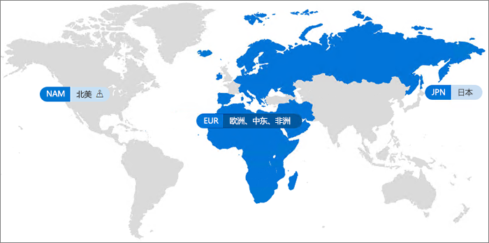

# Office 365 多地理位置Video: Introducing Office 365 Multi-Geo

利用 Office 365 多地理位置，你的组织可将其 Office 365 触及范围扩展到你的现有租户内的多个地理区域和/或国家或地区。With Multi-Geo capabilities in OneDrive Online, your organization can expand its Office 365 presence to multiple geographic regions and/or countries within your existing tenant. Reach out to your Microsoft Account Team to sign up your Multi-National Company for OneDrive for Business Multi-Geo. 请联系 Microsoft 帐户团队，为 Office 365 多地理位置注册你的跨国公司。Reach out to your Microsoft Account Team to sign up your Multi-National Company for Office 365 Multi-Geo.
  
通过 Office 365 多地理位置，你可以在选择的地理位置中预配和存储静态数据，以满足数据驻留要求，与此同时，开启面向员工的现代生产力体验的全球推广。With OneDrive Multi-Geo, you can provision and store data at rest in the geo locations that you've chosen to meet data residency requirements, and at the same time unlock your global roll out of modern productivity experiences to your workforce.

#### 视频：Office 365 多地理位置简介Video: Introducing Office 365 Multi-Geo

> [!VIDEO https://www.microsoft.com/en-us/videoplayer/embed/RE1Yk6B?autoplay=false]

在多地理位置环境中，Office 365 租户由（最初在其中设置了 Office 365 订阅）的中心位置以及一个或多个附属位置组成。In a Multi-Geo environment, your Office 365 tenant consists of a central location (where your Office 365 subscription was originally provisioned) and one or more satellite locations. 在多地理位置租户中，有关地理位置、 组和用户信息的信息在 Azure Active Directory (AAD) 中进行管理。In a multi-geo tenant, the information about geo locations, groups, and user information, is mastered in Azure Active Directory (AAD). 由于系统会集中管理你的租户信息并同步到每个地理位置中，因此共享操作以及涉及到公司中任何人的体验均包含全局意识。Because your tenant information is mastered centrally and synchronized into each geo location, sharing and experiences involving anyone from your company contain global awareness.

请注意，Office 365 多地理位置的主要设计目的不是为了优化性能，而是为了满足数据驻留要求。Note that Office 365 Multi-Geo is not designed for performance optimization cases, it is designed to meet data residency requirements. For information about performance optimization for Office 365, see Network planning and performance tuning for Office 365 or contact your support group. 有关 Office 365 性能优化的信息，请参阅 [Office 365 的网络规划和性能调整](https://support.office.com/article/e5f1228c-da3c-4654-bf16-d163daee8848)，或与支持团队联系。Note that Office 365 Multi-Geo is not designed for performance optimization cases, it is designed to meet data residency requirements. For information about performance optimization for Office 365, see [Network planning and performance tuning for Office 365](https://support.office.com/article/e5f1228c-da3c-4654-bf16-d163daee8848) or contact your support group.

## 术语Terminology

下面是用于描述 Office 365 多地理位置的关键术语：Here are the key terms used in describing Office 365 Multi-Geo:

- **中心位置** - 最初在其中设置你的租户的地理位置。**Central location** - the geo location where your tenant was originally provisioned.
- **地理位置管理员** - 可管理一个或多个指定附属位置的管理员。**Geo administrator** - An administrator who can administer one or more specified satellite locations.
- **地理位置代码** - 给定地理位置的三个字母的代码。**Geo code** - a three-letter code for a given geo location.
- **地理位置** - 可在多地理位置租户中用于托管数据的地理位置，包括 Exchange 邮箱以及 OneDrive 和 SharePoint 站点。**Geo location** – A geographic location that can be used in a multi-geo tenant to host data, including Exchange mailboxes and OneDrive and SharePoint sites.
- **首选数据位置 (PDL)** - 管理员设置的一个用户属性，指明应在其中设置 Exchange 邮箱和 OneDrive 的地理位置。**Preferred Data Location (PDL)** – A user property set by the administrator that indicates where the geo location where the users Exchange mailbox and OneDrive should be provisioned. PDL 还确定在何处设置用户创建的 SharePoint 站点。The PDL also determines where SharePoint sites that are created by the user are provisioned.
- **附属位置** – 多地理位置租户中在其中启用地理位置感知 Office 365 工作负载（SharePoint、OneDrive 和 Exchange）的地理位置。**Satellite location** – The geo locations where the geo-aware Office 365 workloads (SharePoint, OneDrive, and Exchange) are enabled in a multi-geo tenant.
- **租户** - Office 365 中组织的表示形式，其通常具有一个或多个与之关联的域（例如，contoso.com）。Tenant – An organization's representation in the Office 365 cloud which typically has one or more domains associated with it (for example, .

## Office 365 多地理位置可用性Office 365 Multi-Geo availability

Office 365 多地理位置当前在以下国家和地区提供：OneDrive Multi-Geo is currently offered in these regions and countries:

[!INCLUDE [Office 365 Multi-Geo locations](includes/office-365-multi-geo-locations.md)]

## 入门Getting started

请按照以下步骤开始使用多地理位置：Follow these steps to get started:

1. 与帐户团队协作，_在 Office 365 服务计划中添加多地理位置功能_。他们将指导你添加所需数量的许可证。Work with your account team to add the _Multi-Geo Capabilities in Office 365_ service plan. They will guide you to add the number of licenses needed.

   Microsoft 需要为多地理位置支持配置你的 Exchange Online 租户，然后你才能开始使用 Office 365 多地理位置。Before you can start using Office 365 Multi-Geo, Microsoft needs to configure your Exchange Online tenant for multi-geo support. 这个一次性配置流程在你订购“*Office 365 中的多地理位置功能*”服务计划之后触发，并且许可证将显示在你的租户中。This one-time configuration process is triggered after you order the *Multi-Geo Capabilities in Office 365* service plan and the licenses show up in your tenant. 应用了多地理位置许可证之后，你将在 [Office 365 消息中心](https://support.office.com/article/38FB3333-BFCC-4340-A37B-DEDA509C2093)中收到通知，你随后就可以开始配置和使用 Office 365 多地理位置功能。You'll receive notifications in the [Office 365 message center](https://support.office.com/article/38FB3333-BFCC-4340-A37B-DEDA509C2093) once your Multi-Geo licenses are applied and you then may begin configuring and using your Office 365 Multi-Geo capabilities.

2. 阅读[规划多地理位置环境](plan-for-multi-geo.md)。Read [Plan your multi-geo environment](plan-for-multi-geo.md).

3. 了解[管理多地理位置环境](administering-a-multi-geo-environment.md)和[你的用户将对环境有怎样的体验](multi-geo-user-experience.md)。Learn about [administering a multi-geo environment](administering-a-multi-geo-environment.md) and [how your users will experience the environment](multi-geo-user-experience.md).

4. 准备好设置 Office 365 多地理位置时，请[为多地理位置配置你的租户](multi-geo-tenant-configuration.md)。When you are ready to set up Office 365 Multi-Geo, [configure your tenant for multi-geo](multi-geo-tenant-configuration.md).

5. [设置搜索](configure-search-for-multi-geo.md)。Set up people search

## 另请参阅See also

[Aka.ms/GoMultiGeo Aka.ms/GoMultiGeo ](https://Aka.ms/GoMultiGeo)

[OneDrive 和 SharePoint Online 中的多地理位置功能Multi-Geo Capabilities in OneDrive and SharePoint Online in Office 365](multi-geo-capabilities-in-onedrive-and-sharepoint-online-in-office-365.md)

[Exchange Online 中的多地理位置功能NoteFor information on Multi-Geo Capabilities, see Multi-Geo Capabilities in Exchange Online.](multi-geo-capabilities-in-exchange-online.md)
