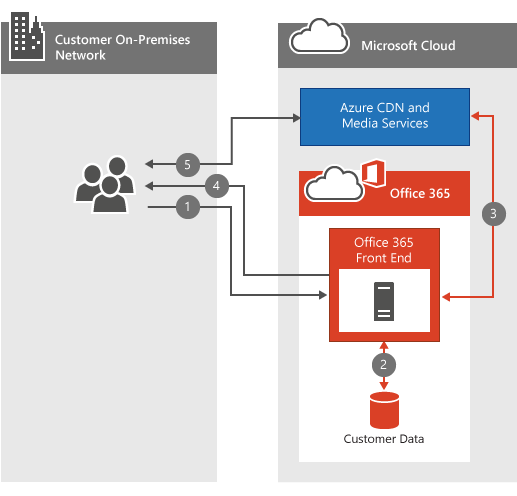

# Office 365 视频网络常见问题Office 365 Video networking Frequently Asked Questions

Office 365 视频存储库和流服务使您的组织内的存储和流式处理视频更加简单。The Office 365 Video repository and streaming services make storing and streaming videos within your organization simple. [有关 Office 365 视频](https://support.office.com/article/Find-help-about-Office-365-Video-b435f99a-f47e-4ebd-a946-f5c965844f50)的很多重要信息, 请参阅。此网络常见问题解答旨在回答有关带宽规划、加密和服务如何利用[内容传递网络](content-delivery-networks.md)(cdn) 的常见问题。There's a lot of great [information about Office 365 Video](https://support.office.com/article/Find-help-about-Office-365-Video-b435f99a-f47e-4ebd-a946-f5c965844f50); this networking FAQ is designed to answer the most common questions around bandwidth planning, encryption, and how the service leverages [Content Delivery Networks](content-delivery-networks.md) (CDNs).
  
如果你还没有透彻地了解在上载或播放视频时所发生的情况, 请查看我们将此视频放在一起的内容, 将[视频文件上载到 Office 365 视频时, 会发生什么情况](https://www.youtube.com/watch?v=HXSZ0jYBKlM)。If you don't already have a thorough understanding of what happens when a video is uploaded or played back, have a look at this video we put together, [What happens to a video file when uploaded to Office 365 Video](https://www.youtube.com/watch?v=HXSZ0jYBKlM).
  
## Office 365 的视频带宽要求是什么？What are the Office 365 Video bandwidth requirements?

有很多可上载到 Office 365 的[受支持的视频格式](https://support.office.com/article/dd1af01c-fd8e-4640-b17b-93ee02b9b817)。There are a numerous [supported video formats](https://support.office.com/article/dd1af01c-fd8e-4640-b17b-93ee02b9b817) that can be uploaded to Office 365. 然后, 将每个视频文件编码为具有几种不同的播放视频质量的标准格式。Each video file is then encoded to a standard format with several different video qualities for playback. Office 365 视频使用自适应比特率流式传输, 以根据视频播放器的可用网络带宽和大小选择最佳视频播放质量。Office 365 Video uses adaptive bitrate streaming to select the best video playback quality based on the available network bandwidth and size of the video player. 为此, 播放机会最初请求最低的播放质量。To do this, the player initially requests the lowest playback quality. 然后, 该服务开始向视频播放器发送2秒的视频分段。The service then begins sending 2-second video segments to the video player. 然后, 播放机可以根据每个段的交付速度请求更高或更低的播放质量。The player can then request higher or lower playback quality based on how quickly each segment is delivered.
  
自适应比特率数据流在后台执行所有这些工作, 同时播放视频的中断或缓冲量最少。The adaptive bitrate streaming does all this in the background while the video plays with the least amount of disruption or buffering. 在视频播放过程中, 视频播放器允许查看器手动覆盖自动播放质量, 以选择特定的视频播放质量。During video playback, the video player allows the viewer to manually override the automatic playback quality, to select a specific video playback quality.
  
下面是一个概述了每个视频播放质量的网络要求的快速表格。Here's a quick table that outlines the network requirements for each of the video playback qualities. 播放视频所需的每个用户的最小带宽为802Kbps。The minimum bandwidth per person needed to play a video is 802Kbps.
  
|||
|:-----|:-----|
|**播放质量****Playback Quality**   |**网络速度****Network Speed**   |
|288p288p    |802Kbps802Kbps    |
|360p360p    |1.2 Mbps1.2 Mbps    |
|576p576p    |2.5 Mbps2.5 Mbps    |
|720p720p    |3.8 Mbps3.8 Mbps    |

([返回到顶部](office-365-video-networking-faq.md))([Back to top](office-365-video-networking-faq.md))
  
## 内容传递网络 (Cdn) 如何帮助视频播放？How do Content Delivery Networks (CDNs) help video playback?

如果同一地理位置中的同一个组织中的多个用户使用同一视频流, 则 Cdn 会将这些视频的副本存储在距离该地理区域更近的位置。If several people from the same organization within the same geographic location are streaming the same video(s), CDNs will store a copy of these videos in a location closer to that geographic region. 将视频存储在最近的位置, 或将其缓存在最近的位置, 而不是将视频从距离最远的位置流式传输到其他位置。With the video stored, or cached at the closest location, each person streams the video from the location closest to them instead of a location further away. Office 365 视频使用 Azure 媒体服务管理在 Azure Cdn 中缓存的内容, 以及使用多长时间。Office 365 Video uses Azure Media Services to manage what is cached in the Azure CDNs, and for how long. Azure 媒体服务可以使用任何[AZURE CDN 位置](https://azure.microsoft.com/documentation/articles/cdn-pop-locations/)将视频片段和清单缓存几天。Azure Media Services can use any of the [Azure CDN locations](https://azure.microsoft.com/documentation/articles/cdn-pop-locations/) to cache video fragments and manifests for a few days. 如果你组织中的人员继续观看缓存中将保留的缓存视频。If people in your organization continue to watch the cached videos they'll stay in the cache. 如果没有人在几天内访问视频, 则视频最终将从缓存中删除。If no one accesses the video for several days, the video will eventually drop be dropped from the cache. 下次有人尝试观看视频时, 它会再次缓存在最近的 CDN 位置。The next time someone attempts to watch the video it's once again cached at the nearest CDN location.
  
在内容被缓存在邻近的 CDN 中时, 尝试观看视频的每个人都将从较近的热门 CDN 获益, 在大多数情况下, 远离跃点。Everyone who attempts to watch the video while the content is cached at a nearby CDN benefits from the video being closer, and in most cases less hops, away. 这将提高视频播放速度;但是, 不会更改网络要求以播放视频。This improves video playback speed; however, it doesn't change the network requirement to play the video.
  
> [!NOTE]
> 在某些情况下, 例如我们达到容量限制, 在三天内可能会删除视频。There are some circumstances, such as our capacity limit being reached, where the video may be removed before the three days has been reached.
  
([返回到顶部](office-365-video-networking-faq.md))([Back to top](office-365-video-networking-faq.md))
  
## 是否可以在本地缓存视频以加快播放速度？Can I cache the videos locally for faster playback?

是。Yes. Office 365 不会阻止你使用本地 CDN 或缓存代理将视频或其他 Office 365 内容导入到本地网络, 以加快访问速度。Office 365 won't prevent you from using a local CDN or a caching proxy to bring video or other Office 365 content into your local network for faster access. 在网络上实施本地缓存解决方案的方法有多种, 最常见的方法是使用代理解决方案在本地缓存内容。There are several ways to implement a local caching solution on your network, the most common method is to use a proxy solution that caches content locally. 代理或专用 CDN 缓存了视频片段和清单后, 通过代理或专用 CDN 路由的那些文件的未来请求将从本地缓存中提取, 而不是从 internet 位置提取。Once a proxy or private CDN has cached the video fragments and manifests, future requests for those files that route through the proxy or private CDN are pulled from the local cache and not pulled from an internet location. 在规划解决方案的过程中, 请考虑网络带宽、容量和视频播放并发性。Consider network bandwidth, capacity, and video playback concurrency during the planning of a solution like this.
  
([返回到顶部](office-365-video-networking-faq.md))([Back to top](office-365-video-networking-faq.md))
  
## 如何加密和保护视频？How videos are encrypted and secured?

Office 365 视频了解保护数据安全和保密的重要程度。Office 365 Video knows how important it is to keep your data secure and private. [Microsoft 信任中心](https://products.office.com/business/office-365-trust-center-welcome)介绍了我们对你的内容的隐私和安全承诺。[Microsoft Trust Center](https://products.office.com/business/office-365-trust-center-welcome) describes our commitment to the privacy and security of your content. 通过视频播放, 速度对你的体验非常重要;但是, 我们不会在 exchange 中降低您的安全或隐私速度。With video playback, speed is important for a good experience; however, we don't compromise your security or privacy in exchange for speed. 下面介绍了我们如何实现速度、安全性和隐私。Here's how we accommodate speed, security and privacy.
  
当您或您的组织中的某个人上载新视频时, 该视频将 transcoded, 使用 AES-128 加密进行加密, 并将其存储在 Azure 媒体服务中。When you or someone in your organization uploads a new video, that video is transcoded, encrypted with AES-128 encryption, and stored in Azure Media Services. 这意味着视频在传输和静止时都要加密。This means the videos are encrypted both in transit and at rest.
  
当组织中的某个人尝试观看新视频时, 请按照以下步骤操作:When someone in your organization attempts to watch a new video, they follow these steps:
  
1. 如果 SharePoint Online 具有查看视频的权限, 请询问它。Ask SharePoint Online if they have permission to view the video.

2. SharePoint Online 使用文件权限确定人员能否观看视频。SharePoint Online uses the file permissions to determine if the person can watch the video.

3. 如果允许, SharePoint Online 将从 Azure 检索令牌以提供给视频播放器。If they're allowed, SharePoint Online retrieves a token from Azure to give to the video player.

4. 然后, 视频播放器使用令牌从 Azure 请求解密密钥。The video player then uses the token to request the decryption key from Azure.

5. 使用解密密钥, 视频播放器能够流式传输视频。With the decryption key in hand, the video player is able to stream the video.

  
([返回到顶部](office-365-video-networking-faq.md))([Back to top](office-365-video-networking-faq.md))
  
## 播放 Office 365 视频的要求是什么？What are the requirements to playback Office 365 Video?

Office 365 视频支持的操作系统和 web 浏览器与[office 365 系统要求](https://support.office.com/article/Office-365-system-requirements-719254c0-2671-4648-9c84-c6a3d4f3be45)中的 SharePoint Online 要求相同。Office 365 Video supported operating systems and web browsers are the same as the SharePoint Online requirements in [Office 365 system requirements](https://support.office.com/article/Office-365-system-requirements-719254c0-2671-4648-9c84-c6a3d4f3be45). 根据您拥有的操作系统和 web 浏览器配置, 您将确定视频播放器的特定需求。Depending on which operating system and web browser configuration you have will determine the specific needs of the video player. 以下是有关[视频播放要求](https://support.office.com/article/ca1cc1a9-a615-46e1-b6a3-40dbd99939a6)的详细信息。Here's more information on [video playback requirements](https://support.office.com/article/ca1cc1a9-a615-46e1-b6a3-40dbd99939a6).
  
([返回到顶部](office-365-video-networking-faq.md))([Back to top](office-365-video-networking-faq.md))
  
## 我无法使 Office 365 视频正常工作, 我应该从哪里开始？I can't get Office 365 video to work, where should I start?

故障排除连接到 Office 365 视频涉及故障排除你的网络、你的 ISP 以及你的 Office 365 的配置。Troubleshooting connectivity to Office 365 Video involves troubleshooting your network, your ISP(s), and your configuration of Office 365. 启动的第一个位置是服务运行状况仪表板。The first place to start is the service health dashboard. 这将告知你的 Office 365 视频出现问题。This will tell you of Office 365 Video is having a problem or not. 如果一切看起来都非常棒, 下面提供了一些帮助您的其他资源。If everything looks great there, here's some additional resources to help you.
  
- 请确保您可以连接到[Office 365 视频所需的网络终结点](https://support.office.com/article/Office-365-URLs-and-IP-address-ranges-8548a211-3fe7-47cb-abb1-355ea5aa88a2)。Make sure you can connect to the [network endpoints required for Office 365 Video](https://support.office.com/article/Office-365-URLs-and-IP-address-ranges-8548a211-3fe7-47cb-abb1-355ea5aa88a2).

- 使用我们的[Office 365 网络故障排除指南](https://support.office.com/article/Office-365-performance-tuning-and-troubleshooting-Admin-and-IT-Pro-1492cb94-bd62-43e6-b8d0-2a61ed88ebae)检查网络连接。Check your network connectivity using our [Office 365 network troubleshooting guide](https://support.office.com/article/Office-365-performance-tuning-and-troubleshooting-Admin-and-IT-Pro-1492cb94-bd62-43e6-b8d0-2a61ed88ebae).

- 请参阅我们[在慢速网络上使用 Office 365 的最佳实践](https://support.office.com/article/Best-practices-for-using-Office-365-on-a-slow-network-fd16c8d2-4799-4c39-8fd7-045f06640166)。See our [best practices for using Office 365 on a slow network](https://support.office.com/article/Best-practices-for-using-Office-365-on-a-slow-network-fd16c8d2-4799-4c39-8fd7-045f06640166).

- [查找有关 Office 365 视频配置的帮助](https://support.office.com/article/Find-help-about-Office-365-Video-b435f99a-f47e-4ebd-a946-f5c965844f50)。[Find help about Office 365 Video configuration](https://support.office.com/article/Find-help-about-Office-365-Video-b435f99a-f47e-4ebd-a946-f5c965844f50).

([返回到顶部](office-365-video-networking-faq.md))([Back to top](office-365-video-networking-faq.md))
  
## Office 365 视频资源Office 365 Video resources

下面的一些其他资源可帮助您成功部署和使用 Office 365 视频:Here's a few other resources to help you successfully deploy and use Office 365 Video:
  
[查找有关 Office 365 视频配置的帮助Find help about Office 365 Video configuration](https://support.office.com/article/Find-help-about-Office-365-Video-b435f99a-f47e-4ebd-a946-f5c965844f50)
  
[“了解 Office 365”视频Meet Office 365 Video](https://support.office.com/article/Meet-Office-365-Video-ca1cc1a9-a615-46e1-b6a3-40dbd99939a6)
  
[在 Office 365 视频中创建和管理频道Create and manage a channel in Office 365 Video](https://support.office.com/article/Create-and-manage-a-channel-in-Office-365-Video-1fede4cc-13c0-435a-b585-e7fbf1c83bb2)
  

  [管理 Office 365 视频门户](https://support.office.com/article/Manage-your-Office-365-Video-portal-c059465b-eba9-44e1-b8c7-8ff7793ff5da)[Manage your Office 365 Video portal](https://support.office.com/article/Manage-your-Office-365-Video-portal-c059465b-eba9-44e1-b8c7-8ff7793ff5da)
  
[在 Office 365 视频中工作的视频格式Video formats that work in Office 365 Video](https://support.office.com/article/Video-formats-that-work-in-Office-365-Video-dd1af01c-fd8e-4640-b17b-93ee02b9b817)
  
([返回到顶部](office-365-video-networking-faq.md))([Back to top](office-365-video-networking-faq.md))
  
以下是可以用于返回的简短链接：[https://aka.ms/video365networkfaq](https://aka.ms/video365networkfaq)Here's a short link you can use to come back: [https://aka.ms/video365networkfaq](https://aka.ms/video365networkfaq)
