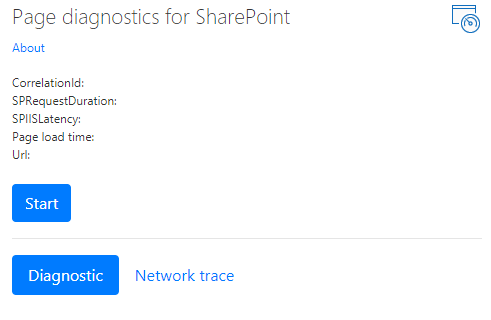

# 使用 SharePoint Online 的页面诊断工具

本文介绍如何使用页面诊断工具根据**SharePoint Online**中的建议做法的子集分析经典团队网站上的经典发布页面和页面。 
  
未启用发布的工作组网站无法使用 Cdn, 但其余所有规则均适用。 发布会增加额外的开销, 因此不会启用仅发布来获取 CDN 功能, 因为这样会对页面加载时间产生负面影响。

**请注意, 已发布 1.05, 如果你已安装, 请更新你的扩展**。 如果您不确定所使用的版本, 请单击 "关于" 链接进行验证。
  
> [!IMPORTANT]
> 页面诊断工具不会对文档库或系统页面运行, 因为此工具旨在审阅 SharePoint 网站页面。 *Allitems.aspx*页面是系统页面。 如果尝试在系统页面上运行该工具, 则会收到一条消息, 其中显示 "此应用程序应仅在 SharePoint 页面上运行"。    这不是工具中的错误, 因为评估库或系统页面时没有任何价值。 请导航到非系统 SharePoint 页面以使用该工具。 如果在 SharePoint 页面上发生这种情况, 请检查 MasterPage, 因为我们已看到客户删除了 SharePoint MetaTags, 然后该页面不再是 SharePoint 页面。 如果您希望提供有关该工具的反馈, 请单击 "关于" 选项卡, 然后按照 "[提供反馈" 链接](https://go.microsoft.com/fwlink/?linkid=874109)操作。 
  
## 安装页面诊断工具

> [!IMPORTANT]
> Microsoft 不会读取您访问的数据或网站, 我们不会使用此工具捕获任何个人信息、网站或下载信息。 该工具记录的唯一信息是租户名称、规则计数以及在运行该工具时是否使用了支持日志记录选项。 此信息适用于 Microsoft 分析客户遇到的难题, 并确保不会误用支持日志记录功能。

1. 使用 Chrome 浏览器, 直接打开该[工具的链接](https://chrome.google.com/webstore/detail/inahogkhlkbkjkkaleonemeijihmfagi)或在[Chrome 浏览器](https://chrome.google.com/webstore/search/page%20diagnostics%20for%20sharepoint)中打开搜索 WebStore 并安装浏览器扩展。 请查看 store 中的 "说明" 页上提供的用户隐私策略。 向浏览器添加工具时, 您将看到以下权限通知。     此通知已就绪, 因为页面可能包含来自 SharePoint 之外的位置的内容, 具体取决于页面上的 web 部件和自定义项。 这意味着, 在单击 "开始" 按钮时, 该工具将读取请求和响应, 并且仅针对运行该工具的活动 SharePoint 选项卡。 该信息由 web 浏览器在本地捕获, 并可通过工具中的 "导出到 JSON" 链接供您使用。 **此信息不会发送到 Microsoft 或由 Microsoft 捕获。** (此工具尊重[此处](https://go.microsoft.com/fwlink/p/?linkid=857875)可访问的 Microsoft 隐私策略。)  工具中的 "导出到 JSON" 功能也是为什么需要 "管理下载" 权限的原因。 在您的组织外部共享 JSON 文件之前, 请按照贵公司自己的隐私准则进行操作, 因为结果中包含 Url, 并且可以归类为 PII (个人身份信息)。
    
2. (这是可选的)如果要在 Chrome incognito 模式中使用该工具, 请导航到该分机号码并单击**incognito 中的 "允许"**。
    
3. 在 SharePoint Online 上导航到您要查看的 SharePoint 经典发布页面。 我们允许对页面上的项目进行 "延迟加载";因此, 该**工具不会自动停止**。 如果要停止收集, 可以单击 "**停止**"。 (这是针对所有页面加载场景的设计。)在单击 "**停止**" 之前, 请确保网络跟踪数据已完成。 否则, 将具有部分跟踪。 此外, 该工具是一个浏览器扩展, 打开多个选项卡或窗口将只允许一次运行该工具的一个活动实例。 这是浏览器中的扩展的限制。 
  
4. 单击扩展徽标  加载工具时, 将显示以下扩展名弹出窗口:   启动和停止操作遵循以下基本概念: 当您单击 "启动页面时, 将开始重新加载并收集"。

阅读以下各节, 了解有关该工具中提供的信息的详细信息。

## 您将在页面诊断工具中看到的内容
    
1. "**关于**" 链接将提供有关工具的一般指导和详细信息, 其中包括返回到本文的链接。 此外, 它还包括指向 SharePoint 性能建议的直接链接、第三方通知以及提供有关该工具的反馈的选项。 
    
2. **相关 ID、SPRequestDuration、SPIISLatency**、**页面加载时间**和**URL**详细信息都是信息, 可用于以下几个用途。 
    
  - **CorrelationID**是使用 Microsoft 支持团队时的一个重要元素, 因为它允许他们获取其他诊断数据。 
    
  - **SPRequestDuration**是处理页面所用的服务器时间。 如果此时间很长, 则不一定意味着服务器执行得不正常, 但还可以反映由页面推送到服务器的呼叫和负载的数量, 例如结构导航、大型图像、大量 API 调用可能会导致服务器时间更长. 
    
  - **SPIISLatency**是在 Web 前端服务器收到加载页面的请求时所采用的时间 (以毫秒为单位)。 这是开始处理页面的延迟的指示器, 不包括 web 应用程序响应所需的时间。 
    
  - **页面加载时间**是在请求收到并由浏览器读取响应时的页面记录的时间。 任何额外时间都会受到计算机性能和浏览器加载所需的时间的影响。 
    
  - **URL** (统一资源定位器) 是当前页面的 web 地址。 
    
3. " [**诊断**" 选项卡](#how-to-use-the-diagnostic-tab)将列出规则, 如果其中有任何标记为红色, 则会在页面上发现问题。 每个规则都有自己的 "详细信息" 链接, 您可以在项目为红色时单击它。 这将转到该规则背后的详细信息以及如何修正此问题。 

4. " [**网络跟踪**" 选项卡](#how-to-use-the-network-trace-tab)提供有关页面生成请求和响应的详细信息。

## 如何使用 "诊断" 选项卡

1. **检查作为标准用户运行** 如果以服务帐户、管理员或网站集管理员身份登录, 或使用提升权限的任何帐户登录, 则不应执行页面性能检查。 额外的脚本和功能专为这些帐户类型加载, 因此结果将不是页面性能的真正表现形式。
    
2. **将请求签入 SharePoint** 应限制对服务器进行的数据量和对服务器的请求量, 因为重载页面会遇到性能较差的情况。 此检查将验证对 SharePoint 发出的请求数, 并在请求超过6个请求时向您发出通知。 大多数请求应进行缓存, 因此不会对每个页面加载进行调用。 缓存应设置并使用至少15分钟, 以减少每个用户对一页的呼叫量。 这是一个常见问题, 在大多数情况下, 数据只每天进行一次更改, 而每个用户的每一页都会检查并提取数据 (通常是不必要的)。
    
3. **检查使用 cdn** 内容传递网络 (Cdn) 已由 Microsoft 提供, 此处提到的是 SharePoint Online 内容传递网络。 有多种类型可用, 也有不同的 CDN 服务 (如 SharePoint Cdn), 然后 Cdn 在 Azure 中。 [使用以下指南](https://go.microsoft.com/fwlink/?linkid=873250)。
    
4. **检查大图像大小** 应通过使用更好的 web 类型 (PNG) 来为 web 优化图像。 图像呈现形式也应使用, 并在 SharePoint 中直接使用。 大于100kb 的图像/图像呈现方式将突出显示为 "未针对 web 进行优化"。 [使用以下指南优化图像](https://go.microsoft.com/fwlink/?linkid=873251)。
    
5. **检查结构导航** 结构导航最初设计用于在可以使用对象缓存的 SharePoint 本地环境中使用。 不建议在 SharePoint Online 中使用结构导航, 也不应将其更改为托管导航或自定义提供程序。 [使用以下指南优化导航。](https://go.microsoft.com/fwlink/?linkid=873247)
    
6. **检查 CBQ Web 部件**(CBQ-内容查询 Web 部件) "内容查询 Web 部件" 在每个用户的每个页面加载的查询中遍历查询中的所有项目时, Web 部件将生成高 SQL 负载。 与本地安装不同, 没有缓存可用于限制填充此 Web 部件所需的查询数。 由于此类 CBQ 执行速度缓慢, 并影响整体页面性能, 因此这就是为什么不应使用它的原因。 请使用内容搜索 Web 部件 (CSWP) 作为内容查询 Web 部件的替换。 [使用以下与内容搜索 Web 部件相关的指南](https://go.microsoft.com/fwlink/?linkid=873245)。

## 如何使用网络跟踪选项卡
    
"**网络跟踪**" 选项卡提供了有关生成页面的请求以及收到的响应的详细信息。 

1. **查找标记为红色的项目加载时间**。 每个请求和响应的性能都根据其对总体页面性能的影响进行了颜色编码, 如下所示:
- 绿色: \< 500ms
- 黄色: 500-1000ms
- 红色: \> 1000ms
   在上面显示的图像中, 红色项目与默认页面相关。 除非在 1000ms (小于1秒) 内\<加载页面, 否则它将始终显示红色。

2. **测试项加载时间**。 在某些情况下, 由于浏览器已缓存这些项, 因此不会有任何时间或颜色指示器。 若要正确测试此设置, 请打开页面, 清除浏览器缓存, 然后单击 "**启动**", 这将强制 "冷" 页面加载, 并成为初始页面加载的真正反映。 此操作应与 "感兴趣" 页面加载进行比较, 这将有助于确定要在页面上缓存的项目。 
    
3. **与可帮助调查问题的其他人共享相关详细信息**。 若要与您的开发人员或技术支持人员共享工具中提供的详细信息或信息, 请单击 "**导出到 JSON** " (如上图所示)。 这将使您能够通过 JSON 文件查看器进行查看, 从而下载结果。

> [!IMPORTANT]
> 这些结果包含 Url 和可归类为 PII (个人身份信息) 的 Url。 在分发该信息之前, 请确保遵守组织的准则。 

## 与 Microsoft 支持人员接洽
   
我们已加入**Microsoft 支持级别功能**, 仅当直接在性能支持案例上工作时才可使用此功能。 如果使用此功能, 则在没有我们的支持团队的情况下使用时不会向你提供任何好处。 实际上, 这会使页面的执行速度大大降低, 并且继续使用该功能可能会被视为 "误用" 服务。 在工具中使用此功能时, 在将其他信息添加到服务中的日志记录中时, 不会提供任何其他信息。 

不显示任何更改, 只是通知您已启用该功能, 并且您的页面性能会显著降低2-3 倍于启用的性能速度。 它将仅与特定页面和活动会话相关。 出于此原因, 应谨慎使用, 仅当主动与我们的支持团队进行接洽时使用。

### 启用 Microsoft 支持级别功能

1. 打开 "页面诊断" 工具。
2. 在键盘上, 按 ALT + Shift-L。 这将显示 "**启用支持级别日志记录**"。 
3. 选中该复选框, 然后单击 "**开始**" 以重新加载页面并生成详细日志记录以支持进行分析。 
  
此内容的一个重要元素是 CorrelationID, 因为支持团队将利用该编号提取所需的信息。 请复制 CorrelationID (在页面诊断工具的顶部), 并提供支持, 因为它们无法在没有完整 ID 的情况下执行所需的操作。
    
## 相关主题

[优化 SharePoint Online 性能](tune-sharepoint-online-performance.md)

[优化 Office 365 性能](tune-office-365-performance.md)

[内容分发网络](content-delivery-networks.md)
