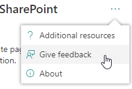
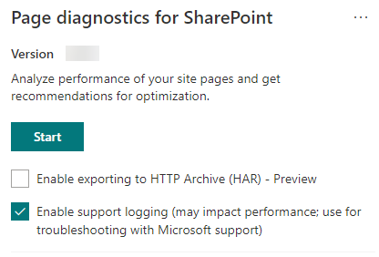

# 使用 "网页诊断程序" SharePoint 工具Use the Page Diagnostics for SharePoint tool

本文介绍如何使用**sharepoint 工具的页面诊断工具**根据预定义的一组性能条件分析 sharepoint Online 新式和经典网站页面。This article describes how to use the **Page Diagnostics for SharePoint tool** to analyze SharePoint Online modern and classic site pages against a pre-defined set of performance criteria.  

>[!TIP]
>**该工具的2.0.1 版已发布**。**Version 2.0.1 of the tool has been released**. 版本**2.0.0**和更高版本包括对新式页面以及经典网站页面的支持。Version **2.0.0** and later includes support for modern pages in addition to classic site pages. 如果您不确定使用的是哪个版本的工具，则可以选择 "**关于**" 链接或省略号（...）来验证您的版本。If you are unsure which version of the tool you are using, you can select the **About** link or the ellipses (...) to verify your version.

SharePoint 工具的页面诊断工具是用于 Chrome 和[Microsoft Edge 版本77及更高版本](https://www.microsoftedgeinsider.com/download?form=MI13E8&OCID=MI13E8)的浏览器扩展，用于分析 SharePoint Online 新式门户和经典发布网站页面。The Page Diagnostics for SharePoint tool is a browser extension for Chrome and [Microsoft Edge version 77 and later](https://www.microsoftedgeinsider.com/download?form=MI13E8&OCID=MI13E8) that analyzes both SharePoint Online modern portal and classic publishing site pages. 此工具仅适用于 SharePoint Online，如果在 SharePoint Server 网站页面上使用，将失败并出现错误。This tool only works for SharePoint Online, and will fail with an error if used on a SharePoint Server site page.

该工具为每个分析页面生成一个报告，该页面显示页面如何针对预定义的规则集执行，并在测试的结果超出比较基准值时显示详细信息。The tool generates a report for each analyzed page showing how the page performs against a pre-defined set of rules and displays detailed information when results for a test fall outside the baseline value. SharePoint Online 管理员和设计人员可以使用该工具解决性能问题，并确保新页面在发布之前进行了优化。SharePoint Online administrators and designers can use the tool to troubleshoot performance issues and to ensure that new pages are optimized prior to publishing.

页面诊断工具专门用于分析 SharePoint 网站页面，而不是系统页面，如*allitems.aspx*或*default.aspx*。The Page Diagnostics tool is designed to analyze SharePoint site pages only, not system pages such as *allitems.aspx* or *sharepoint.aspx*. 如果尝试在系统页面或任何其他非网站页面上运行该工具，则会收到一条错误消息，提示该工具不能针对该类型的页面运行。If you attempt to run the tool on a system page or any other non-site page, you will receive an error message advising that the tool cannot be run for that type of page.

这不是工具中的错误，因为评估库或系统页面时没有任何价值。This is not an error in the tool as there is no value in assessing libraries or system pages. 请导航到 SharePoint 网站页面以使用该工具。Please navigate to a SharePoint site page to use the tool. 如果此错误发生在 SharePoint 页面上，请检查母版页以确保尚未删除 SharePoint metatags。If this error occurs on a SharePoint page, please check the master page to ensure that the SharePoint metatags have not been removed.

若要提供有关该工具的反馈，请选择该工具右上角的省略号，然后选择 "[提供反馈](https://go.microsoft.com/fwlink/?linkid=874109)"。To provide feedback about the tool, select the ellipsis at the top right corner of the tool and then select [Give feedback](https://go.microsoft.com/fwlink/?linkid=874109).

  
## 安装用于 SharePoint 工具的页面诊断程序Install the Page Diagnostics for SharePoint tool

本节中的安装过程将适用于 Chrome 和 Microsoft Edge 浏览器。The installation procedure in this section will work for both the Chrome and Microsoft Edge browsers.

> [!IMPORTANT]
> Microsoft 不会读取由 SharePoint 工具的页面诊断功能分析的数据或页面内容，我们不会捕获任何个人信息、网站或下载信息。Microsoft does not read data or page content that is analyzed by the Page Diagnostics for SharePoint tool, and we do not capture any personal information, website or download information. 该工具记录的唯一信息是租户名称、规则计数以及在运行该工具时是否启用了支持日志记录选项。The only information logged by the tool is the tenant name, rule count and whether the support logging option has been enabled when the tool is run. Microsoft 使用此信息来了解新式门户和发布网站使用率趋势和常见的性能问题，以通知产品改进。This information is used by Microsoft to understand modern portal and publishing site usage trends and common performance issues to inform product improvements.

1. 使用_chrome_或_Microsoft Edge 版本77或更高版本_的浏览器，直接打开该[工具的链接](https://chrome.google.com/webstore/detail/inahogkhlkbkjkkaleonemeijihmfagi)或在[Chrome 浏览器](https://chrome.google.com/webstore/search/page%20diagnostics%20for%20sharepoint)中打开搜索 WebStore 并安装浏览器扩展。Using the _Chrome_ or _Microsoft Edge version 77 or later_ browser, open the [link to the tool](https://chrome.google.com/webstore/detail/inahogkhlkbkjkkaleonemeijihmfagi) directly or open the Search in the [Chrome Browser WebStore](https://chrome.google.com/webstore/search/page%20diagnostics%20for%20sharepoint) and install the browser extension. 请查看 store 中的 "说明" 页上提供的用户隐私策略。Please review the User Privacy Policy provided on the description page in the store. 向浏览器添加工具时，您将看到以下权限通知。When adding the tool to your browser, you will see the following permissions notice.

    

    由于页面上的 web 部件和自定义项可能包含来自 SharePoint 之外的位置的内容，因此此通知已生效。This notice is in place because a page may contain content from locations outside of SharePoint depending on the web parts and customizations on the page. 这意味着，在单击 "开始" 按钮时，该工具将读取请求和响应，并且仅针对运行该工具的活动 SharePoint 选项卡。This means that the tool will read the requests and responses when the start button is clicked and only for the active SharePoint tab where the tool is running. 此信息由 web 浏览器在本地捕获，可通过工具的 "_网络跟踪_" 选项卡中的 "**导出到 JSON** " 或 "**导出到 HAR** " 按钮供您使用。**这些信息不会发送给 Microsoft 或由 Microsoft 捕获**。This information is captured locally by the web browser and is available to you via the **Export to JSON** or **Export to HAR** button in the tool's _Network trace_ tab. **The information is not sent to or captured by Microsoft.** （此工具尊重[此处](https://go.microsoft.com/fwlink/p/?linkid=857875)可访问的 Microsoft 隐私策略。）(The tool respects the Microsoft privacy policy accessible [here](https://go.microsoft.com/fwlink/p/?linkid=857875).)

    "_管理您的下载_" 权限涵盖了该工具的**导出到 JSON**功能的使用。The _Manage your downloads_ permission covers use of the tool's **Export to JSON** functionality. 在您的组织外部共享 JSON 文件之前，请按照贵公司自己的隐私准则进行操作，因为结果中包含 Url，并且可以归类为 PII （个人身份信息）。Please follow your company's own privacy guidelines before sharing the JSON file outside of your organization, as the results contain URLs and that can be classified as PII (Personally Identifiable Information).
1. 如果要在 Incognito 或 InPrivate 模式中使用该工具，请按照浏览器的过程操作：If you want to use the tool in Incognito or InPrivate mode, follow the procedure for your browser:
    1. 在 Microsoft Edge 中，导航到 "**扩展**" 或在 URL 栏中键入 " _edge://extensions_ "，然后选择扩展的 "**详细信息**"。In Microsoft Edge, navigate to **Extensions** or type _edge://extensions_ in the URL bar and select **Details** for the extension. 在扩展设置中，选中 "**允许在 InPrivate 中**" 复选框。In the extension settings, select the checkbox for **allow in InPrivate**.
    1. 在 Chrome 中，导航到 "**扩展**" 或在 URL 栏中键入 " _chrome://extensions_ "，然后选择扩展的**详细信息**。In Chrome, navigate to **Extensions** or type _chrome://extensions_ in the URL bar and select **Details** for the extension. 在 "扩展设置" 中，选择 "**允许在 Incognito 中**" 滑块。In the extension settings, select the slider for **allow in Incognito**.
1. 导航到 SharePoint Online 上您要查看的 SharePoint 网站页面。Navigate to the SharePoint site page on SharePoint Online that you would like to review. 我们允许对页面上的项目进行 "延迟加载";因此，该工具不会自动停止（这是设计以适应所有页面加载方案）。We have allowed for "delay loading" of items on pages; therefore, the tool will not stop automatically (this is by design to accommodate all page load scenarios). 若要停止收集，请选择 "**停止**"。To stop collection, select **Stop**. 在停止数据收集之前，请确保页面加载已完成，否则将只捕获部分跟踪。Make sure that the page load has completed before you stop data collection or you will only capture a partial trace.
1. 单击扩展的工具栏按钮Click on the extension's toolbar button  加载工具时，将显示以下扩展名弹出窗口：to load the tool and you will be presented with the following extension popup window:

    

选择 "**开始**" 以开始收集数据以供分析。Select **Start** to begin collecting data for analysis.

## 您将在 SharePoint 的页面诊断工具中看到的内容What you'll see in the Page Diagnostics for SharePoint tool

1. "**关于**" 链接（类似于右上角的省略号（...）将提供有关该工具的一般指导和详细信息，其中包括返回到本文的链接。The **About** link, which resembles ellipses (...) in the top right corner will provide general guidance and details regarding the tool including a link back to this article. 此外，它还包括指向 SharePoint 性能建议的直接链接、第三方通知以及提供有关该工具的反馈的选项。It also includes a direct link to SharePoint performance recommendations, a third party notice and an option to provide feedback about the tool.  
1. **相关 ID、SPRequestDuration、SPIISLatency**、**页面加载时间**和**URL**详细信息都是信息，可用于以下几个用途。The **Correlation ID, SPRequestDuration, SPIISLatency**, **Page load time**, and **URL** details are informational and can be used for a few purposes.

    

   - **CorrelationID**是使用 Microsoft 支持时的重要元素，因为它允许他们收集特定页面的其他诊断数据。**CorrelationID** is an important element when working with Microsoft Support as it allows them to gather additional diagnostic data for the specific page.
   - **SPRequestDuration**是 SharePoint 处理页面所用的时间。**SPRequestDuration** is the time taken for SharePoint to process the page. 结构化导航、大型图像、大量 API 调用都可能会导致更长的持续时间。Structural navigation, large images, lots of API calls could all contribute to longer durations.
   - **SPIISLatency**是在 SharePoint Online 开始加载页面时所用的时间（以毫秒为单位）。**SPIISLatency** is the time in milliseconds taken for SharePoint Online begin loading the page. 此值不包括 web 应用程序响应所用的时间。This value does not include the time taken for the web application to respond.
   - **页面加载时间**是在请求收到并在浏览器中呈现响应时，页面记录的总时间。**Page load time** is the total time recorded by the page from the time of the request to the time the response was received and rendered in the browser. 此值受多种因素的影响，包括网络延迟、计算机的性能以及浏览器加载页面所需的时间。This value is affected by a variety of factors including network latency, the performance of the computer and the time it takes for the browser to load the page.
   - **页面 URL** （统一资源定位器）是当前页面的 web 地址。The **Page URL** (Uniform Resource Locator) is the web address of the current page.

1. "[**诊断测试**](#how-to-use-the-diagnostic-tests-tab)" 选项卡将分析结果显示为三个类别;**无需任何操作**、**改进机会**和**注意事项**。The [**Diagnostic tests**](#how-to-use-the-diagnostic-tests-tab) tab displays the analysis results in three categories; **No action required**, **Improvement opportunities** and **Attention required**. 每个测试结果由其中一个类别中的项表示，如下表中所述：Each test result is represented by an item in one of these categories as described in the following table:

    |类别Category  |颜色Color  |说明Description  |
    |---------|---------|---------|
    |**注意事项****Attention required** |红色Red |测试结果不在比较基准值的范围之内，因而会影响页面性能。Test result falls outside the baseline value and is affecting page performance. 遵循更正指南。Follow remediation guidance.|
    |**改进机会****Improvement opportunities** |黄色Yellow |测试结果不在比较基准值的范围之内，可能会引起性能问题。Test result falls outside the baseline value and could be contributing to performance issues. 可能应用特定于测试的条件。Test-specific criteria may apply.|
    |**不需要执行任何操作****No action required** |绿色Green |测试结果在测试的比较基准值范围内。Test result falls within the test's baseline value.|

    

1. "[**网络跟踪**](#how-to-use-the-network-trace-tab)" 选项卡提供有关页面生成请求和响应的详细信息。A [**Network trace**](#how-to-use-the-network-trace-tab) tab provides details about page build requests and responses.

## 如何使用 "诊断测试" 选项卡How to use the Diagnostic tests tab

在使用 SharePoint 工具的页面诊断工具分析 SharePoint 新式门户或经典发布网站页面时，将使用预定义的规则对结果进行分析，这些规则将比较比较基准值和 "**诊断测试**" 选项卡中显示的结果。某些测试的规则可能对新式门户和经典发布网站使用不同的比较基准值，具体取决于两者之间的特定性能特征不同。When you analyze a SharePoint modern portal page or classic publishing site page with the Page Diagnostics for SharePoint tool, results are analyzed using pre-defined rules that compare results against baseline values and displayed in the **Diagnostic tests** tab. Rules for certain tests may use different baseline values for modern portal and classic publishing sites depending on how specific performance characteristics differ between the two.

"**改善机会**" 或 "**注意事项**" 类别中显示的测试结果指明应针对建议的做法评审的区域，并且可以选择此选项以显示有关结果的其他信息。Test results that appear in the **Improvement opportunities** or **Attention required** categories indicate areas that should be reviewed against recommended practices, and can be selected to display additional information about the result. 每个项目的详细信息包括一个 "_了解更多_" 链接，它将直接转到与测试相关的相应指南。Details for each item include a _Learn more_ link which will take you directly to the appropriate guidance related to the test. "**无需任何操作**" 类别中显示的测试结果指示符合相关规则，并且在选中时不显示其他详细信息。Test results that appear in the **No action required** category indicate compliance with the relevant rule and do not display additional details when selected.

"诊断测试" 选项卡中的信息不会告诉您如何设计页面，但会突出显示可能影响页面性能的因素。The information in the Diagnostics tests tab will not tell you how to design pages, but will highlight factors that may impact page performance. 某些页面功能和自定义对页面性能的影响不可避免，应检查它们的可能修正或从页面中省略（如果它们的影响是重大的）。Some page functionality and customizations have an unavoidable impact on page performance, and should be reviewed for potential remediation or omission from the page if their impact is substantial.

红色或黄色结果也可能表示刷新数据过于频繁的 web 部件。Red or yellow results may also indicate web parts that refresh data too frequently. 例如，公司新闻不会每秒更新一次，但自定义 web 部件通常是为每秒提取最新新闻，而不是实施可以改善总体用户体验的缓存元素。For example, corporate news is not updated every second but custom web parts are often built to fetch the latest news every second instead of implementing caching elements that could improve the overall user experience. 在页面上添加 web 部件时，请注意，通过评估每个可用参数的值来降低它们的性能影响，以确保将其设置为适合其预期目的的简单方法。Keep in mind when including web parts on a page that there are often simple ways to reduce their performance impact by evaluating the value of each available parameter to ensure it is set appropriately for its intended purpose.

>[!NOTE]
>如果经典工作组网站未启用发布功能，则无法使用 Cdn。Classic team sites that don't have the publishing feature enabled cannot make use of CDNs. 当您在这些网站上运行此工具时，CDN 测试应会失败，并且可以忽略，但其余所有测试均适用。When you run the tool on these sites, the CDN test is expected to fail and can be ignored, but all of the remaining tests are applicable. SharePoint 发布功能的其他功能可能会增加页面加载时间，因此不应只为允许 CDN 功能而启用此功能。The additional functionality of the SharePoint publishing feature can increase page load times, so it should not be enabled just to allow CDN functionality.

>[!IMPORTANT]
>将定期添加和更新测试规则，请参阅最新版本的工具，了解有关当前规则和测试结果中包含的特定信息的详细信息。Test rules are added and updated regularly so please refer to the latest version of the tool for details about current rules and specific information included in test results. 您可以通过管理您的扩展来验证版本，扩展将告知是否有更新可用。You can verify the version by managing your extensions and the extension will advise whether an update is available.

## 如何使用网络跟踪选项卡How to use the Network Trace tab

"**网络跟踪**" 选项卡提供了用于生成页面的两个请求的详细信息以及从 SharePoint 收到的响应。The **Network Trace** tab provides detailed information about both requests to build the page and the responses received from SharePoint.

1. **查找标记为红色的项目加载时间**。**Look for item load times flagged as red**. 每个请求和响应的性能都根据其对总体页面性能的影响进行了颜色编码，如下所示：The performance of each request and response are color coded, based on their impact on the overall page performance as follows:
    - 绿色： \< 500msGreen: \< 500ms
    - 黄色： 500-1000msYellow: 500-1000ms
    - 红色： \> 1000msRed: \> 1000ms

    

    在上面显示的图像中，红色项目与默认页面相关。In the image shown above, the red item pertains to the default page. 除非在1000ms （小于1秒）内\<加载页面，否则它将始终显示红色。It will always show red unless the page loads in \< 1000ms (less than 1 second).

2. **测试项加载时间**。**Test item load times**. 在某些情况下，由于浏览器已缓存这些项，因此不会有任何时间或颜色指示器。In some cases there will be no time or color indicator because the items have already been cached by the browser. 若要正确测试此设置，请打开页面，清除浏览器缓存，然后单击 "**启动**"，这将强制 "冷" 页面加载，并成为初始页面加载的真正反映。To test this correctly, open the page, clear browser cache, and then click **Start** as that will force a "cold" page load and be a true reflection of the initial page load. 此操作应与 "感兴趣" 页面加载进行比较，这将有助于确定要在页面上缓存的项目。This should then be compared to the "warm" page load as that will also help determine what items are being cached on the page.

3. **与可帮助调查问题的其他人共享相关详细信息**。**Share relevant details with others who can help investigate issues**. 若要与您的开发人员或技术支持人员共享工具中提供的详细信息或信息，请单击 "**导出到 JSON** " （如上图所示）。To share the details or information provided in the tool with your developers or a technical support person, click **Export to JSON** (as shown in the image above). 这将使您能够通过 JSON 文件查看器进行查看，从而下载结果。That will enable you to download the results, viewable with a JSON file viewer.

    如果你已选择使用预览功能，请将*导出到 har* ，导出类型将显示为 "**导出到 har**"。If you have opted to use the preview feature *enable Export to HAR* then the export type will show as **Export to HAR**.

    

> [!IMPORTANT]
> 这些结果包含 Url 和可归类为 PII （个人身份信息）的 Url。These results contain URLs and that can be classified as PII (Personally Identifiable Information). 在分发该信息之前，请确保遵守组织的准则。Make sure to follow your organization's guidelines before distributing that information.

## 与 Microsoft 支持人员接洽Engaging with Microsoft Support

我们已加入**Microsoft 支持级别功能**，仅当直接在支持案例中工作时才能使用此功能。We have included a **Microsoft Support level feature** that should only be utilized when working directly on a support case. 如果使用此功能，则在不支持团队合作的情况下使用时不会对你带来任何好处，并且可以使页面的执行速度显著降低。Utilizing this feature will provide no benefit to you when used without support team engagement, and can make the page perform significantly slower. 在工具中使用此功能时，在将其他信息添加到服务中的日志记录中时，不会提供任何其他信息。There is no additional information when using this feature in the tool as the additional information is added to the logging in the service.

不显示任何更改，只是系统会通知您已启用该功能，并且您的页面性能会显著下降2-3 倍的性能，同时启用速度降低。No change is visible except that you will be notified that you have enabled it and your page performance will be significantly degraded by 2-3 times slower performance whilst enabled. 它将仅与特定页面和活动会话相关。It will only be relevant for the particular page and that active session. 出于此原因，应谨慎使用，仅在主动参与支持时使用。For this reason, this should be used sparingly and only when actively engaged with support.

### 启用 Microsoft 支持级别功能To enable the Microsoft Support level feature

1. 打开 "页面诊断" "SharePoint 工具"。Open the Page Diagnostics for SharePoint tool.
2. 在键盘上，按**ALT + Shift-L**。On your keyboard, press **ALT-Shift-L**. 这将显示 "**启用支持日志记录**" 复选框。This will display the **Enable support logging** check box.
3. 选中 "" 复选框，然后单击 "**开始**" 以重新加载页面并生成详细日志记录。Select the check box, and then click **Start** to reload the page and generate verbose logging.

    
  
    应注意 CorrelationID （显示在工具顶部），并将其提供给支持代表，以使其能够收集有关诊断会话的其他信息。You should note the CorrelationID (displayed at the top of the tool) and provide it to your support representative to enable them to gather additional information about the diagnostic session.

## 相关主题Related topics

[优化 SharePoint Online 性能Tune SharePoint Online performance](tune-sharepoint-online-performance.md)

[优化 Office 365 性能Tune Office 365 performance](tune-office-365-performance.md)

[内容分发网络Content delivery networks](content-delivery-networks.md)
