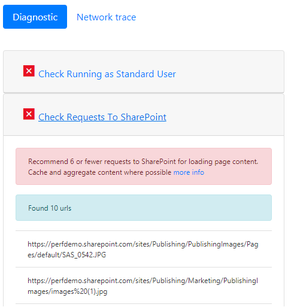

# SharePoint online 中使用页诊断工具

本文介绍如何使用页诊断工具分析您的经典发布网页和网页上经典工作组网站，针对**SharePoint Online**中的建议做法的子集。 
  
没有启用的发布的工作组网站无法使 Cdn 的使用，但所有剩余的规则都适用。发布添加额外开销，因此不要打开发布，只需以获取 CDN 的功能，如它会产生负面影响页面加载时间。
  
> [!IMPORTANT]
> 如工具在设计上可查看 SharePoint 网站页，将会对文档库或系统页面不运行页诊断工具。*Allitems.aspx*页是系统页。如果试图在系统上运行该工具，您将收到一条消息，表明，"此应用程序应仅运行在 SharePoint 页面上。"   这不是在工具错误，如评估库或 system 页中没有值。请导航到非系统 SharePoint 页面使用的工具。该工具应该想要提供反馈有关请单击关于选项卡并按照[提供反馈链接](https://go.microsoft.com/fwlink/?linkid=874109)。 
  
## 安装页诊断工具

> [!IMPORTANT]
> Microsoft 不会读取的数据或访问，网站和我们不会捕获任何个人信息、 网站或下载具有此工具的信息。工具记录的唯一信息是租户的名称，规则计数和是否支持日志记录选项利用过时运行该工具。此信息适用于 Microsoft 来分析通过我们的客户经验正在什么难题，以确保不被误用支持日志记录功能。

1. 使用 Chrome 浏览器，直接打开[链接到该工具](https://chrome.google.com/webstore/detail/inahogkhlkbkjkkaleonemeijihmfagi)或[Chrome 浏览器 web 存储](https://chrome.google.com/webstore/search/page%20diagnostics%20for%20sharepoint)中打开搜索和安装浏览器扩展。请查看用户隐私策略存储中的说明页上提供。时添加到您的浏览器的工具，您将看到以下权限注意。     此通知是就地中，因为页面可能包含从外部 SharePoint 具体取决于 web 部件和自定义项在页上的位置的内容。这意味着，该工具将读取的请求和响应时单击开始按钮和仅为活动的 SharePoint 选项卡运行该工具。该信息本地捕获按 web 浏览器，并且可供您通过导出到 JSON 工具中的链接。**不发送到或由 Microsoft 捕获的信息。**（此工具应包含 Microsoft 隐私策略可访问[此处](https://go.microsoft.com/fwlink/p/?linkid=857875)。）  为什么需要"管理您的下载"权限，也是在工具中的"导出到 JSON"功能。请结果包含 Url 和共享您的组织之外的 JSON 文件可归类为 PII （个人身份信息） 之前，按照您公司的隐私准则。
    
2. （这是可选的）如果您想要在部件版式 incognito 模式下使用此工具，导航到该扩展名，然后单击**允许 incognito 中**。
    
3. 向 SharePoint 经典发布页面在 SharePoint Online 您想要查看的导航。我们已允许"延迟加载"中的项目页面; 例如：因此，**不会自动停止工具**。您希望停止集合，您可以单击**停止**。（这是设计使然，以设法满足所有页面负载方案的值。）单击**停止**之前，请确保网络跟踪数据已完成。否则，您将具有部分跟踪。另外，该工具将浏览器扩展，并且打开多个选项卡或 windows 将只允许一次运行该工具的一个活动实例。这是在浏览器的扩展限制。 
  
4. 单击扩展徽标  加载该工具，并将显示与以下扩展弹出式窗口：   启动和停止操作 follow 当您单击页上将重新加载的开始和集合的基本概念将开始。

阅读以下各节中，若要了解有关该工具中提供的信息。

## 您将看到页诊断工具中
    
1. **有关**链接将提供的一般指导，有关包含链接的工具的详细信息回到本文。它还包括直接链接到 SharePoint 性能建议、 第三方通知和某个选项以提供有关该工具的反馈。 
    
2. **相关 ID、 SPRequestDuration、 SPIISLatency**、**页面加载时间**和**URL**详细信息仅供参考，并可用于几个目的。 
    
  - 使用 Microsoft 的支持团队，因为它允许他们提取其他诊断数据时， **CorrelationID**是一个重要的元素。 
    
  - **SPRequestDuration**是所需处理页上的服务器时间。如果此时间太长，它不一定意味着服务器已执行格式错误，但可以还反映的呼叫数，并加载推送由页面到服务器例如结构导航，大图像、 大量 API 调用无法所有参与到更长时间服务器时间. 
    
  - **SPIISLatency**是以毫秒为单位接收请求加载网页时，Web 前端服务器上所需的时间。这是延迟，若要开始处理页上的指示符，不包括响应的 web 应用程序所需的时间。 
    
  - **页面加载时间**是记录的时间响应已接收和阅读浏览器请求的时间从页面的时间。任何其他时间受计算机和浏览器加载花费的时间的性能影响。 
    
  - **URL** （统一资源定位器） 是当前页的 web 地址。 
    
3. [**诊断**选项卡](#how-to-use-the-diagnostic-tab)将列出规则和如果任何这些标有红色，则会出现在上发现的问题。 每个规则均具有自己单击如果项目为红色的"详细信息"链接。这样，就会为该规则和如何修正问题后面的详细信息。 

4. 一个[**网络跟踪**选项卡](#how-to-use-the-network-trace-tab)提供了详细信息页生成请求和响应。

## 如何使用诊断选项卡

1. **检查以标准用户身份运行** 作为服务帐户、 管理员或网站集管理员或任何使用提升的权限的帐户登录时应不执行检查页的性能。其他脚本功能加载和专门为这些类型的帐户，以便不会页面性能的则返回 true 表示结果。
    
2. **检查对 SharePoint 请求** 如的重载的页面不会感到性能不佳，应限制的数据和向服务器发出的请求量。此检查验证对 SharePoint 进行的请求数，并将建议时请求超过 6 请求。应缓存，因此不调用为每个页面负载大多数请求。缓存应设置并利用至少 15 分钟，以减少调用每个用户的页面的量。这是常见的问题，在大多数情况下数据仅更改每日但页上检查并提取数据的每个用户，这通常是不必要的每一页的每次。
    
3. **检查使用 Cdn** 内容交付网络 (Cdn) 提供了由 Microsoft 和引用的以下是 SharePoint Online 内容交付网络。有多种类型以及不同的 CDN 服务，如 SharePoint Cdn 和 Cdn Azure 中的可用。[使用以下指南](https://go.microsoft.com/fwlink/?linkid=873250)。
    
4. **检查大图像大小** 通过利用更好的 web 类型，如 PNG，应针对 web 优化图像。图像呈现形式还应利用，可在 SharePoint 中直接。图像 / 大于 100 kb 将突出显示的图像呈现形式，没有为 web 进行优化。[使用以下指南优化的图像](https://go.microsoft.com/fwlink/?linkid=873251)。
    
5. **检查结构导航** 用于 SharePoint 内部部署其中无法使用对象缓存最初设计结构的导航。结构导航不建议用于在 SharePoint Online 中使用，并应改为托管导航或自定义提供程序。[使用以下指南优化导航的。](https://go.microsoft.com/fwlink/?linkid=873247)
    
6. **检查 CBQ web 部件**(CBQ-内容查询 web 部件) 内容查询 web 部件生成高 SQL 负载为每个用户遍历在每个页面负载的查询中的所有项目。与不同的本地安装，没有可用于限制所需填充此 web 部件的查询数高速缓存。此类 CBQ 执行速度很慢，影响整个页面性能这正是应不使用它。请为内容查询 web 部件的替代工具，使用内容搜索 web 部件 (CSWP)。[使用以下指南与内容搜索 web 部件](https://go.microsoft.com/fwlink/?linkid=873245)。

## 如何使用网络跟踪选项卡
    
**网络跟踪**选项卡提供了有关构建页以及接收响应的请求的详细的信息。 

1. **查找项目标记为红色的加载时间**。每个请求和响应的性能的颜色编码，根据其对整个页面性能的影响，如下所示：
- 绿色： \< 500ms年
- 黄色： 500 毫秒
- 红色：\>毫秒
  在上面显示的图像，红色项目与相关的默认页面。它将始终显示红色除非页面加载\<毫秒 （小于 1 秒）。

2. **测试项目加载时间**。在某些情况下将有任何时间或颜色指示器由于项目已由浏览器缓存。若要正确测试这一点，打开的页面和清除浏览器缓存，然后单击**开始**，将强制"冷"页加载和的初始页面加载，则返回 true 反射。这应然后比较到"暖"页面加载，这还将有助于确定哪些项目缓存在页面上。 
    
3. **共享与其他人可以帮助调查问题的相关详细信息**。要共享的详细信息或在工具与您的开发人员或技术支持人员提供的信息，请单击**导出到 JSON** （如在上图中所示）。使您下载的结果，使用 JSON 文件查看器可以查看。

> [!IMPORTANT]
> 这些结果包含 Url 和，可将归类为 PII （个人身份信息）。请确保分发这些信息之前按照贵组织的准则。 

## 与 Microsoft 支持合作
   
我们已包括直接在性能支持案例上使用时仅应利用**Microsoft 支持级别功能**。利用此功能将向您使用时不带我们的支持团队提供任何好处。实际上会更加速度显著变慢执行页上，并可能的服务"误用"被视为继续的使用的功能。其他信息添加到服务中的日志记录工具中使用此功能时，没有其他信息。 

没有变化是可见之处在于您已启用，并通过，将会显著降低页性能将通知您 2 到 3 次同时启用的速度较慢的性能。只有将相关的特定页面和该活动会话。因此，应谨慎使用这和仅在积极参与我们的支持团队。

### 若要启用的 Microsoft 支持级别功能

1. 打开页面诊断工具。
2. 键盘上按下 ALT-Shift-l。这将显示**启用日志记录支持级别**。 
3. 选中的复选框，然后单击**启动**重新加载网页并生成详细日志记录支持分析。 
  
这一重要元素是 CorrelationID，如支持团队将然后，使用该号码提取所需的信息。请复制 CorrelationID （顶部的页诊断工具），并向支持提供的因为它们无法执行所需的工作，而不完整的 id。
    
## 相关主题

[调整 SharePoint Online 性能](tune-sharepoint-online-performance.md)

[优化 Office 365 性能](tune-office-365-performance.md)

[内容传递网络](content-delivery-networks.md)
