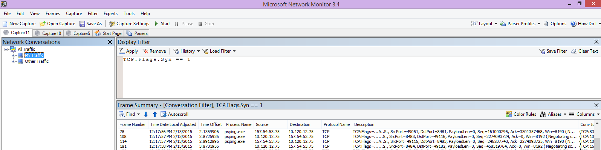
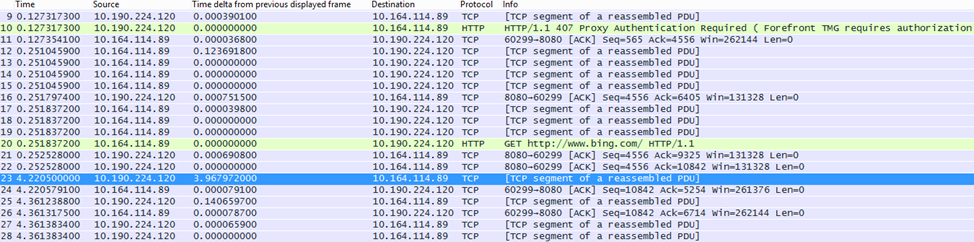

# Office 365 的性能疑难解答计划Performance troubleshooting plan for Office 365

您需要知道以找出并修复滞后、 挂起和 SharePoint Online、 OneDrive for Business、 Exchange Online 中，或 Skype online 业务和客户端计算机之间的性能太慢采取的步骤执行操作？在调用支持之前，这篇文章可帮助您解决 Office 365 的性能问题和甚至修复的一些最常见的问题。Do you need to know the steps to take to identify and fix lags, hangs, and slow performance between SharePoint Online, OneDrive for Business, Exchange Online, or Skype for Business Online, and your client computer? Before you call support, this article can help you troubleshoot Office 365 performance issues and even fix some of the most common issues.
  
本文是实际上可用于捕获有关性能问题的有价值的数据，因为它是一个示例操作计划最新动态。本文中还包含一些首要问题。This article is actually a sample action plan that you can use to capture valuable data about your performance issue as it's happening. Some top issues are also included in this article.
    
如果您的新网络性能，并且想要进行的长期计划监视您的客户端计算机和 Office 365 之间的性能，看看[Office 365 性能调整和疑难解答的管理员和 IT 专业人员](performance-tuning-using-baselines-and-history.md)。If you're new to network performance and want to make a long term plan to monitor performance between your client machines and Office 365, take a look at [Office 365 performance tuning and troubleshooting - Admin and IT Pro](performance-tuning-using-baselines-and-history.md).
  
## 示例性能疑难解答行动计划Sample performance troubleshooting action plan

此操作计划包含两部分;准备阶段和日志记录阶段。如果您立即，拥有性能问题，并且您需要执行数据集，您可以开始立即使用此计划。This action plan contains two parts; a preparation phase, and a logging phase. If you have a performance problem right now, and you need to do data collection, you can start using this plan right away.
  
 **准备客户端计算机****Prepare the client computer**
  
- 查找可重现性能问题的客户端计算机。此计算机将使用的故障排除过程。Find a client computer that can reproduce the performance problem. This computer will be used during the course of troubleshooting.
    
- 记下导致性能问题，以执行测试时已准备好的步骤。Write down the steps that cause the performance problem to happen so you're ready when it comes time to test.
    
- 安装用于收集和记录信息的工具：Install tools for gathering and recording information:
    
  - 安装[Netmon 3.4](https://www.microsoft.com/en-us/download/details.aspx?id=4865) （或使用等效的网络跟踪工具）。Install [Netmon 3.4](https://www.microsoft.com/en-us/download/details.aspx?id=4865) (or use an equivalent network tracing tool). 
    
  - 安装可用的基本版本的[HTTPWatch](https://www.httpwatch.com/download/) （或使用等效的网络跟踪工具）。Install the free Basic Edition of [HTTPWatch](https://www.httpwatch.com/download/) (or use an equivalent network Tracing tool). 
    
  - 使用屏幕录制或运行步骤记录器 (PSR.exe) 的 Windows Vista 和更高版本，以便记录的测试过程中执行的步骤。Use a screen recorder or run the Steps Recorder (PSR.exe) that comes with Windows Vista and later, in order to keep a record of the steps you take during testing.
    
 **日志性能问题****Log the performance issue**
  
- 关闭所有多余的 Internet 浏览器。Close all extraneous Internet browsers.
    
- 启动步骤录制或另一个屏幕录制。Start the Steps Recorder, or another screen recorder.
    
- 启动网络监视器捕获 （或网络跟踪工具）。Start your Netmon capture (or network tracing tool).
    
- 通过键入以下内容 ipconfig /flushdns 清除 DNS 缓存从命令行在客户端计算机。Clear your DNS cache on the client computer from the command line by typing ipconfig /flushdns.
    
- 启动新的浏览器会话并打开 HTTPWatch。Start a new browser session and turn on HTTPWatch.
    
- 可选： 如果您要测试 Exchange Online，运行 Exchange 客户端性能分析工具从 Office 365 管理控制台。Optional: If you are testing Exchange Online, run the Exchange Client Performance Analyzer tool from the Office 365 admin console.
    
- 重现导致性能问题的具体步骤。Reproduce the exact steps that cause the performance issue.
    
- 停止您 Netmon 或其他工具的跟踪。Stop your Netmon or other tool's trace.
    
- 在命令行中，通过键入以下命令并按 ENTER 运行 Office 365 订阅跟踪路由：At the command line, run a trace route to your Office 365 subscription by typing the following command and then pressing ENTER:
    
    `tracert \< *subscriptionname*  \>.onmicrosoft.com` 
    
- 停止步骤录制并保存视频。一定要包括的日期和时间捕获和它是否演示良好或错误的性能。Stop the Steps Recorder and save the video. Be sure to include the date and time of the capture and whether it demonstrates good or bad performance.
    
- 保存跟踪文件。同样，一定要包括的日期和时间捕获和它是否演示良好或错误的性能。Save the trace files. Again, be sure to include the date and time of the capture and whether it demonstrates good or bad performance.
    
如果您不熟悉运行本文中提到的工具，不要担心由于接下来，我们提供这些步骤。如果您是习惯执行这种网络捕获，则可以跳过[如何收集比较基准](performance-tuning-using-baselines-and-history.md#how-to-collect-baselines)，其中介绍了筛选和读取日志。If you're not familiar with running the tools mentioned in this article, don't worry because we provide those steps next. If you're accustomed to doing this kind of network capturing, you can skip to [How to collect baselines](performance-tuning-using-baselines-and-history.md#how-to-collect-baselines), which describes filtering and reading the logs. 
  
## 第一次刷新 DNS 缓存Flush the DNS Cache first

为什么？通过扩展 DNS 缓存刷新您刚与从头开始测试。通过清除缓存，您正在 DNS 解析程序内容的最新的项重置。请记住刷新不会删除主机文件项。如果使用了大量的主机文件项，您应将这些条目复制到另一个目录中的文件，然后清空主机文件。Why? By flushing out the DNS cache you're starting your tests with a clean slate. By clearing the cache, you're resetting the DNS resolver contents to the most up-to-date entries. Remember that a flush does not remove HOSTs file entries. If you use HOST file entries extensively, you should copy those entries out to a file in another directory and then empty the HOST file.
  
 **刷新 DNS 解析程序缓存****Flush your DNS resolver cache**
  
1. 打开命令提示符处 (**开始**任一\>**运行** \> **cmd**或**Windows 键** \> **cmd**)。Open the command prompt, (either **Start** \> **Run** \> **cmd** or **Windows key** \> **cmd**).
    
2. 键入以下命令并按 ENTER:`ipconfig /flushdns`Type the following command and press ENTER: `ipconfig /flushdns`
    
## NetmonNetmon

Microsoft 的网络监视工具 ([Netmon](https://www.microsoft.com/download/details.aspx?id=4865)) 分析数据包，即传递网络的计算机之间的通信。通过使用 Netmon 来跟踪流量与 Office 365 您可以捕获，视图和读取数据包头识别且设备、 检查网络硬件上的重要设置，寻找丢弃的数据包，并按照上您公司的计算机之间的流量网络和 Office 365。因为实际正文的通信进行加密，即，其 （通过 SSL/TLS 端口 443 上的传输，不能读取正在发送的文件。相反，您获取路径的数据包考虑这可以帮助您跟踪问题行为筛选的的跟踪。Microsoft's Network Monitoring tool ([Netmon](https://www.microsoft.com/download/details.aspx?id=4865)) analyzes packets, that is traffic, that passes between computers on networks. By using Netmon to trace traffic with Office 365 you can capture, view, and read packet headers, identify intervening devices, check important settings on network hardware, look for dropped packets, and follow the flow of traffic between computers on your corporate network and Office 365. Because the actual body of the traffic is encrypted, that is, it(travels on port 443 via SSL/TLS, you can't read the files being sent. Instead, you get an unfiltered trace of the path that the packet takes which can help you track down the problem behavior.
  
确保不在此时应用筛选器。相反，运行完成的步骤，并停止跟踪和保存之前演示该问题。Be sure you don't apply a filter at this time. Instead, run through the steps and demonstrate the problem before stopping the trace and saving.
  
安装 Netmon 3.4 后，打开工具，并执行这些步骤：After you install Netmon 3.4, open the tool and take these steps:
  
 **执行 Netmon 跟踪，并重现问题****Take a Netmon trace and reproduce the issue**
  
1. 启动 Netmon 3.4。Launch Netmon 3.4.
    
    在**开始**页上有三个窗格：**最近捕获**、**选择网络**和**启动与 Microsoft 网络监视器 3.4。请注意**。选择网络面板还将为您提供您可以捕获从其默认网络的列表。确保此处选择网卡。There are three panes on the **Start** page: **Recent Captures**, **Select Networks**, and the **Getting Started with Microsoft Network Monitor 3.4. Notice**. The Select Networks panel will also give you a list of the default networks from which you can capture. Be sure that network cards are selected here.
    
2. 请单击**开始**页顶部的**新捕获**。这样会将添加新选项卡旁边名为**捕获 1**的**开始**页选项卡。Click **New Capture** at the top of the **Start** page. This adds a new tab beside the **Start** page tab called **Capture 1**.
    
    
  
3. 要进行简单的捕获，请单击工具栏上的**启动**。To take a simple capture, click **Start** on the toolbar. 
    
4. 重现演示的性能问题的步骤。Reproduce the steps that present a performance issue.
    
5. 单击**停止** \> **文件** \> **另存为**。请记住要授予的日期和时间的时区，然后提及如果它演示错误或良好性能。Click **Stop** \> **File** \> **Save As**. Remember to give the date and time with the time zone and to mention if it demonstrates bad or good performance.
    
## HTTPWatchHTTPWatch

[HTTPWatch](https://www.httpwatch.com/download/)方面电的、 和免费版本。免费的基本 Edition 介绍此测试所需的全部内容。直接从浏览器窗口，HTTPWatch 监视器网络流量和页面加载时间。以图形方式介绍性能的 Internet Explorer 插件 HTTPWatch。可以保存并查看 HTTPWatch Studio 分析。[HTTPWatch](https://www.httpwatch.com/download/) comes in charged, and a free edition. The free Basic Edition covers everything you need for this test. HTTPWatch monitors network traffic and page load time right from your browser window. HTTPWatch is a plug-in to Internet Explorer that graphically describes performance. The analysis can be saved and viewed in HTTPWatch Studio. 
  
> [!NOTE]
> 如果您使用其他浏览器，例如 Firefox，Google Chrome 或不能安装 HTTPWatch 在 Internet Explorer 中，打开一个新的浏览器窗口，并按键盘上的 f12 键。在浏览器的底部，您应看到弹出开发人员工具。如果您使用 Opera，按 CTRL + SHIFT + I Web 检查器，然后单击**网络**选项卡并完成测试概括如下。信息将会稍有不同，但仍将以毫秒为单位显示加载时间。> HTTPWatch 也是非常有用问题的 SharePoint Online 的页面加载时间。If you use another browser, such as Firefox, Google Chrome, or if you can't install HTTPWatch in Internet Explorer, open a new browser window and press F12 on your keyboard. You should see the Developer Tool pop-up at the bottom of your browser. If you use Opera, press CTRL+SHIFT+I for Web Inspector, then click the **Network** tab and complete the testing outlined below. The information will be slightly different, but load times will still be displayed in milliseconds. > HTTPWatch is also very useful for issues with SharePoint Online page load times. 
  
 **运行 HTTPWatch 并重现问题****Run HTTPWatch and reproduce the issue**
  
1. HTTPWatch 是浏览器插件，因此公开浏览器中的工具是每个版本的 Internet Explorer 略有不同。通常情况下，您可以在 Internet Explorer 浏览器中，在命令栏下方中找到 HTTPWatch。HTTPWatch is a browser plug-in, so exposing the tool in the browser is slightly different for each version of Internet Explorer. Typically, you can find HTTPWatch under the Commands bar in the Internet Explorer browser.   如果您没有浏览器窗口中看到插件 HTTPWatch，检查您的浏览器版本通过单击帮助\>有关，或者，更高版本的 Internet Explorer 中，单击齿轮符号和有关 Internet Explorer。启动**命令**栏中，右键单击 Internet Explorer 中的菜单栏，单击**命令栏**。过去，HTTPWatch 已关联使用的命令和浏览器栏中，因此一次安装，如果您没有立即看到 （甚至之后重新启动） 检查**工具**和您的工具栏图标的图标。请记住，可以自定义工具栏，可以向它们添加选项。If you don't see the HTTPWatch plug-in in your browser window, check the version of your browser by click Help \> About, or, in later versions of Internet Explorer, click the gear symbol and About Internet Explorer. To launch the **Commands** bar, right-click the menu bar in Internet Explorer and click **Commands bar**. In the past, HTTPWatch has been associated with both the Commands and the Explorer bars, so once you install, if you don't immediately see the icon (even after reboot) check **Tools**, and your toolbars for the icon. Remember that toolbars can be customized and options can be added to them. 
    
  
2. 启动 Internet Explorer 浏览器窗口中的 HTTPWatch。将显示固定到浏览器在该窗口的底部。单击**记录**。Launch HTTPWatch in an Internet Explorer browser window. It will appear docked to the browser at the bottom of that window. Click **Record**.
    
3. 重现参与性能问题的的具体步骤。单击 HTTPWatch 中的**停止**按钮。Reproduce the exact steps involved in the performance issue. Click the **Stop** button in HTTPWatch. 
    
4. **保存**HTTPWatch 或**通过电子邮件发送**。请记住，使其包含日期和时间信息和相对值的指示您监视是否包含性能良好或错误的演示，作为文件名。**Save** the HTTPWatch or **Send by Email**. Remember to name the file so that it includes date and time information and an indication of whether your Watch contains a demonstration of good or bad performance.    
    此屏幕截图是从 HTTPWatch 的专业版。您可以打开与专业版的计算机上的基本版本中所做的跟踪，并那里读取。额外的信息可从该方法通过跟踪。This screen shot is from the Professional version of HTTPWatch. You can open traces taken in the Basic Version on a computer with a Professional version and read it there. Extra information may be available from the trace through that method.
    
## 问题步骤记录器Problem Steps Recorder

步骤记录器或 PSR.exe，可记录问题，这些情况。它是一个非常有用的工具和非常简单，若要运行。Steps Recorder, or PSR.exe, allows you to record issues as they are occurring. It's a very useful tool and very simple to run.
  
 **运行问题步骤记录器 (PSR.exe) 来记录您的工作****Run Problem Steps Recorder (PSR.exe) to record your work**
  
1. 请使用**启动** \> **运行**\>键入**PSR.exe** \> **确定**，或单击**Windows 密钥**\>键入**PSR.exe** \> ，然后按 ENTER。Either use **Start** \> **Run** \> type **PSR.exe** \> **OK**, or, click the **Windows Key** \> type **PSR.exe** \> and then press ENTER. 
    
2. 出现小型 PSR.exe 窗口时，单击**开始录制**，并重现重现性能问题的步骤。根据需要通过单击**添加注释**，您可以添加注释。When the small PSR.exe window appears, click **Start Record** and reproduce the steps that reproduce the performance issue. You can add comments as needed, by clicking **Add Comments**.
    
3. 在完成后的步骤，请单击**停止记录**。如果页面呈现性能问题，等待页面呈现之前停止录制。Click **Stop Record** when you have completed the steps. If the performance issue is a page render, wait for the page to render before you stop the recording. 
    
4. 单击“保存”****。Click **Save**.
    

  
为您记录中的日期和时间。这在时间中，向您 Netmon 跟踪和 HTTPWatch 链接您 PSR 并与精度疑难解答帮助。日期和时间的 PSR 记录可以显示一分钟传递登录和例如浏览 URL 和管理网站，部分呈现之间。The date and time is recorded for you. This links your PSR to your Netmon trace and HTTPWatch in time, and helps with precision troubleshooting. The date and time in the PSR record can show that a minute passed between the login and browsing of the URL and the partial render of the admin site, for example.
  
## 阅读您跟踪Read your traces

无法教某人需要知道通过文章的一切关于网络和性能疑难解答。获取在性能良好采用体验，而您的网络如何工作原理以及通常执行的知识。但它并可能要首要问题的列表向上舍入并显示如何工具会使您更轻松地消除最常见的问题。It isn't possible to teach everything about network and performance troubleshooting that someone would need to know via an article. Getting good at performance takes experience, and knowledge of how your network works and usually performs. But it is possible to round up a list of top issues and show how tools can make it easier for you to eliminate the most common problems.
  
如果您想要拿起读取 for Office 365 网站的网络跟踪的技能，比定期创建的页面加载的跟踪和获得经验读取其没有更好教师。例如，如果您有机会，加载 Office 365 服务并跟踪过程。筛选 DNS 流量跟踪或搜索 FrameData 您浏览该服务的名称。扫描跟踪以了解该服务加载时出现的步骤。这将帮助您了解哪些普通页面加载应如下所示，并对于疑难解答，尤其是在性能比较好到差跟踪可以教您很大。If you want to pick up skills reading network traces for your Office 365 sites, there is no better teacher than creating traces of page loads regularly and gaining experience reading them. For example, when you have a chance, load an Office 365 service and trace the process. Filter the trace for DNS traffic, or search the FrameData for the name of the service you browsed. Scan the trace to get an idea of the steps that occur when the service loads. This will help you learn what normal page load should look like, and in the case of troubleshooting, particularly around performance, comparing good to bad traces can teach you a lot.
  
Netmon 显示筛选器字段中使用 Microsoft Intellisense。智能感知或智能代码完成，其中在一段中键入，在下拉选择框中显示所有可用选项的技巧。如果，例如，您担心 TCP 窗口缩放，您可以找到您的方式对筛选器 (如`.protocol.tcp.window < 100`) 通过这种方法。Netmon uses Microsoft Intellisense in the Display filter field. Intellisense, or intelligent code completion, is that trick where you type in a period and all available options are displayed in a drop-down selection box. If, for example, you are worried about TCP window scaling, you can find your way to a filter (such as  `.protocol.tcp.window < 100`) by this means.
  

  
Netmon 跟踪可以有大量流量。如果您不具有读取其有经验，很可能将严重受损打开第一次的跟踪。首先要做是信号分开中跟踪背景噪音。针对 Office 365 测试，这是您想要查看的流量。如果您是用于跟踪导航，您可能不需要此列表。Netmon traces can have a lot of traffic in them. If you aren't experienced with reading them, it's likely you will be overwhelmed opening the trace the first time. The first thing to do is separate the signal from the background noise in the trace. You tested against Office 365, and that's the traffic you want to see. If you are used to navigating through traces, you may not need this list.
  
通过 TLS，这意味着加密和中泛型 Netmon 跟踪不可读，也会正文的通信将会传输客户端和 Office 365 之间的通信。性能分析不需要知道数据包中的信息的具体信息。是，但是，非常感兴趣数据包标头和它们包含的信息。Traffic between your client and Office 365 travels via TLS, which means that the body of the traffic will be encrypted and not readable in a generic Netmon trace. Your performance analysis doesn't need to know the specifics of the information in the packet. It is, however, very interested in packet headers and the information that they contain.
  
 **若要获取良好跟踪的提示****Tips to get a good trace**
  
- 了解客户端计算机的 IPv4 或 IPv6 地址的值。您可以从命令提示符处获取此键入**IPConfig**并然后按 ENTER。了解此地址会让您快速告知是否中跟踪的流量直接涉及客户端计算机。如果没有已知的代理，ping 它并获取其的 IP 地址。Know the value of the IPv4 or IPv6 address of your client computer. You can get this from the command prompt by typing **IPConfig** and then pressing ENTER. Knowing this address will let you tell at a glance whether the traffic in the trace directly involves your client computer. If there is a known proxy, ping it and get its IP address as well. 
    
- 刷新 DNS 解析程序缓存和，如果可能，请关闭在其中运行测试以外的所有浏览器。如果您不是能够执行此操作，例如，如果支持使用一些基于浏览器的工具查看客户端计算机的桌面，请准备筛选您跟踪。Flush your DNS resolver cache and, if possible, close all browsers except the one in which you are running your tests. If you are not able to do this, for instance, if support is using some browser-based tool to see your client computer's desktop, be prepared to filter your trace.
    
- 忙跟踪中, 找到您使用的 Office 365 服务。如果您已从不或很少看到您的通信之前，这是在从其他网络干扰分离性能问题的有用步骤。有几种方法来执行此操作。直接之前测试，您可以使用 ping 或 PsPing，向特定服务的 URL (`ping outlook.office365.com`和/或`psping -4 microsoft-my.sharepoint.com:443`，例如)。您可以方便地找到该 PsPing 中 Netmon 跟踪 （按其过程名称）。您将得到开始查找的位置。In a busy trace, locate the Office 365 service that you're using. If you've never or seldom seen your traffic before, this is a helpful step in separating the performance issue from other network noise. There are a few ways to do this. Directly before your test, you can use ping or, PsPing, to the URL of the specific service ( `ping outlook.office365.com` and/or  `psping -4 microsoft-my.sharepoint.com:443`, for examples) . You can also easily find that PsPing in a Netmon trace (by its process name). That will give you a place to start looking.
    
    如果问题时仅使用 Netmon 跟踪，没关系太。若要确定您自己的方向，使用类似的筛选器`ContainsBin(FrameData, ASCII, "office")`或`ContainsBin(FrameData, ASCII, "outlook")`。您可以记录跟踪文件从您框架的号码。您可能要滚动到最右边的帧摘要窗格，并查找对话 ID 列。没有指示有此特定的对话，您还可以记录和查看隔离更高版本中的 ID 号。请记住在应用任何其他筛选之前删除此筛选器。If you're only using Netmon tracing at the time of the problem, that's okay too. To orient yourself, use a filter like  `ContainsBin(FrameData, ASCII, "office")` or  `ContainsBin(FrameData, ASCII, "outlook")`. You can record your frame number from the trace file. You may also want to scroll the Frame Summary pane all the way to the right and look for the Conversation ID column. There is a number indicated there for the ID of this specific conversation that you can also record and look at in isolation later. Remember to remove this filter before applying any other filtering.
    
> [!TIP]
> Netmon 有许多有用的内置筛选器。尝试在**显示**筛选器窗格顶部的"加载筛选器"按钮。Netmon has a lot of helpful built-in filters. Try the "Load Filter" button at the top of the **Display** filter pane. 
  

  

  
获取熟悉与您通信，并了解如何找到所需的信息。例如，了解如何确定哪些数据包跟踪中的具有对您正在使用 （如"Outlook") 的 Office 365 服务的第一个引用。Get familiar with your traffic, and learn to locate the information you need. For example, learn to determine which packet in the trace has the first reference to the Office 365 service you're using (like "Outlook").
    
采用 Office 365 Outlook Online 作为示例，流量开始如下所示：Taking Office 365 Outlook Online as an example, the traffic begins something like this:
  
- 标准的 DNS 查询并具有匹配 QueryIDs outlook.office365.com 的 DNS 响应。请务必注意有关此周转，以及位置世界 Office 365 全局 DNS 时间偏移发送名称解析的请求。理想情况下，为可能的而不是在世界范围一半本地。(这可能跟一些 DNS 流量联机登录。)DNS Standard Query and DNS Response for outlook.office365.com with matching QueryIDs. It's important to note the Time Offset for this turn-around, as well as where in the world the Office 365 Global DNS sends the request for name resolution. Ideally, as locally as possible, rather than half-way across the world. (This may be followed by some DNS traffic the online login.)
    
- HTTP GET 请求其状态报告永久移动 (301)A HTTP GET Request whose status report Moved Permanently (301)
    
- 包括 RWS 连接请求和连接答复 RWS 流量。（这是为您进行连接的远程 Winsock）。RWS Traffic including RWS Connect requests and Connect replies. (This is Remote Winsock making a connection for you.)
    
- TCP SYN 和 TCP SYN-ACK 对话。大量的此对话中的设置影响性能。A TCP SYN and TCP SYN/ACK conversation. A lot of the settings in this conversation impact your performance.
    
- 然后 TLS:TLS 流量即其中的 TLS 握手和 TLS 证书对话执行一系列。（请记住通过 SSL/TLS 加密数据）。Then a series of TLS:TLS traffic which is where the TLS handshake and TLS certificate conversations take place. (Remember the data is encrypted via SSL/TLS.)
    
所有部件的通信重要和连接，但跟踪的小部分包含信息会严重影响性能疑难解答，尤其重要，因此我们专注于这些领域。此外，因为我们已完成足够的 Office 365 性能疑难解答 microsoft 编译常见问题的前 10 个列表，我们将专注于这些问题以及如何使用我们必须根这些下一步出的工具。All parts of the traffic are important and connected, but small portions of the trace contain information particularly important in terms of performance troubleshooting, so we'll focus on those areas. Also, since we've done enough Office 365 performance troubleshooting at Microsoft to compile a Top Ten list of common problems, we'll focus on those issues and how to use the tools we have to root them out next.
  
如果您尚未安装它们所有准备好，下面的 matrix 使其他几种工具使用。在可能的情况。链接到安装点提供。该列表包含常见的网络跟踪工具，如[Netmon](https://www.microsoft.com/en-us/download/details.aspx?id=4865)和[Wireshark](https://www.wireshark.org/)，但使用您习惯，和正在习惯于筛选网络流量的任何跟踪工具。当您测试时，请记住：If you haven't installed them all ready, the matrix below makes use of several tools. Where possible. Links are provided to the installation points. The list includes common network tracing tools like [Netmon](https://www.microsoft.com/en-us/download/details.aspx?id=4865) and [Wireshark](https://www.wireshark.org/), but use any tracing tool you are comfortable with, and in which you're accustomed to filtering network traffic. When you're testing, remember:
  
-  *关闭浏览器中，并测试与运行只有一个浏览器*-这会减少您捕获的总体流量。它是一个不太忙跟踪的。*Close your browsers, and test with only one browser running*  - This will reduce the overall traffic you capture. It makes for a less busy trace. 
    
-  *刷新客户端计算机上的您 DNS 解析程序缓存*-这将使您从头开始进行您捕获，更整洁跟踪的时。*Flush your DNS resolver cache on the client computer*  - This will give you a clean slate when you start to take your capture, for a cleaner trace. 
    
## 某些首要问题Some Top Issues

您可能会遇到的某些常见问题以及如何在您的网络跟踪中找到这些。Some common issues you may face and how to find them in your Network trace.

### TCP 窗口扩展TCP Windows Scaling

SYN-中找到 SYN/确认旧或时效硬件可能不会利用 TCP windows 缩放。 没有适当的 TCP windows 缩放设置，TCP 标头中的默认 16 位缓冲区填充以毫秒为单位。 流量无法继续发送直至客户端接收到的已收到的原始数据，确认导致延迟。Found in the SYN - SYN/ACK. Legacy or aging hardware may not take advantage of TCP windows scaling.  Without proper TCP windows scaling settings, the default 16-bit buffer in TCP headers fills in milliseconds.  Traffic cannot continue to send until the client receives an acknowledgment that the original data has been received, causing delays.

#### 工具：Tools:

- NetmonNetmon
- WiresharkWireshark 

#### 正在查找的内容：What you're looking for:

查找 SYN-SYN-ACK/流量在您的网络跟踪。 在 Netmon，使用筛选器，如`tcp.flags.syn == 1`。此筛选器中 Wireshark 相同。Look for the SYN - SYN/ACK traffic in your network trace.  In Netmon, use a filter like  `tcp.flags.syn == 1`. This filter is the same in Wireshark.  

         
请注意，对于每个 SYN 没有相关确认 (SYN/ACK) 的目标端口值为零 （意味着） 匹配源 (SrcPort) 端口号。Notice that for every SYN there is a source port (SrcPort) number that is matched in the destination port (DstPort) of the related Acknowledgment (SYN/ACK). 

若要查看您的网络连接使用的 Windows 扩展值，首先 SYN，展开，然后展开相关的 SYN 确认To see the Windows Scaling value that is used by your network connection, expand first the SYN, and then the related SYN/ACK.  

  

### TCP 空闲时间设置TCP Idle Time Settings

过去，大多数外围网络配置为临时连接，这意味着通常终止空闲的连接。可以通过代理和防火墙在大于 100 为 300 秒终止空闲 TCP 会话。这是 Outlook online 有问题因为它创建并使用长期连接，无论他们处于空闲状态。Historically, most perimeter networks are configured for transient connections, meaning idle connections are generally terminated. Idle TCP sessions can be terminated by proxies and firewalls at greater than 100 to 300 seconds. This is problematic for Outlook Online because it creates and uses long-term connections, whether they are idle or not.  

当连接将终止由代理服务器或防火墙设备，客户端不是明智，并尝试使用 Outlook 联机将意味着客户端计算机将尝试，重复，恢复之前进行一个新连接。在页面加载，可能会看到挂起中产品、 提示或性能太慢。When connections are terminated by proxy or firewall devices, the client is not informed, and an attempt to use Outlook Online will mean a client computer will try, repeatedly, to revive the connection before making a new one. You may see hangs in the product, prompts, or slow performance on page load.

#### 工具：Tools:

- NetmonNetmon
- WiresharkWireshark

#### 要查找的内容：What to look for:

在 Netmon，查看往返行程的时间偏移字段。往返行程是向服务器发送请求并接收响应后的客户端之间的时间。检查客户端之间出口点 (例如客户端--\>代理)，或到 Office 365 客户端 (客户端--\> Office 365)。您可以看到此许多类型的数据包中。In Netmon, look at the Time Offset field for a round-trip. A round-trip is the time between client sending a request to the server and receiving a response back. Check between the Client and the egress point (ex. Client --\> Proxy), or the Client to Office 365 (Client --\> Office 365). You can see this in many types of packets. 

例如，Netmon 中的筛选器可能类似于`.Protocol.IPv4.Address == 10.102.14.112 AND .Protocol.IPv4.Address == 10.201.114.12`，或在 Wireshark， `ip.addr == 10.102.14.112 &amp;&amp; ip.addr == 10.201.114.12`。As an example, the filter in Netmon may look like  `.Protocol.IPv4.Address == 10.102.14.112 AND .Protocol.IPv4.Address == 10.201.114.12`, or, in Wireshark,  `ip.addr == 10.102.14.112 &amp;&amp; ip.addr == 10.201.114.12`.  

> [!TIP]
> 不知道您跟踪中的 IP 地址是否属于您的 DNS 服务器？尝试在命令行进行查找。单击**开始** \> **运行**\>并键入**cmd**，或按**Windows 键** \> ，然后键入**cmd**。在提示符处，键入`nslookup <the IP address from the network trace>`。若要测试，请使用 nslookup 针对您自己的计算机的 IP 地址。> 到，请参阅 Microsoft 的 IP 范围的列表，请参阅[Office 365 Url 和 IP 地址范围](https://technet.microsoft.com/en-us/library/hh373144.aspx)。Don't know if the IP address in your trace belongs to your DNS server? Try looking it up at the command line. Click **Start** \> **Run** \> and type **cmd**, or press **Windows Key** \> and type **cmd**. At the prompt, type  `nslookup <the IP address from the network trace>`. To test, use nslookup against your own computer's IP address. > To see a list of Microsoft's IP ranges, see [Office 365 URLs and IP address ranges](https://technet.microsoft.com/en-us/library/hh373144.aspx). 

有问题时，预期长时间偏移显示在 (Outlook Online)，此情况下的特别是在显示的应用程序数据下方的 TLS:TLS 数据包 (例如，在 Netmon 中可以找到应用程序通过数据数据包`.Protocol.TLS AND Description == "TLS:TLS Rec Layer-1 SSL Application Data"`)。您应看到的时间的平滑过渡跨会话。如果您看到长时间延迟，刷新您 Outlook 联机时，这可能致重置正在发送很大程度。If there is a problem, expect long Time Offsets to appear, in this case (Outlook Online), particularly in TLS:TLS packets that show the passage of Application Data (for example, in Netmon you can find application data packets via  `.Protocol.TLS AND Description == "TLS:TLS Rec Layer-1 SSL Application Data"`). You should see a smooth progression in the time across the session. If you see long delays when refreshing your Outlook Online, this could be caused by a high degree of resets being sent. 

### 延迟/往返触发时间Latency/Round Trip Time 

延迟是度量可根据许多变量中，将此类升级时效设备，将大量用户添加到网络和总体带宽使用的网络连接上的其他任务所占大量更改。Latency is a measure that can change a lot depending on many variables, such upgrading aging devices, adding a large number of users to a network, and the percentage of overall bandwidth consumed by other tasks on a network connection. 

从[网络规划和性能优化 Office 365](network-planning-and-performance.md)该页有可用的 Office 365 带宽计算器。There are bandwidth calculators for Office 365 available from this [Network planning and performance tuning for Office 365](network-planning-and-performance.md) page.  

需要进行测量的速度您的连接或您的 ISP 连接带宽？尝试此站点 （或类似的网站）： [Speedtest 官方网站](https://www.speedtest.net/)和[Pingtest](http://www.pingtest.net/)。Need to measure the speed of your connection, or your ISP connection's bandwidth? Try this site (or sites like it): [Speedtest Official Site](https://www.speedtest.net/), and [Pingtest](http://www.pingtest.net/).

#### 工具：Tools:

- PingPing
- PsPingPsPing
- NetmonNetmon
- WiresharkWireshark

#### 要查找的内容：What to look for:

若要跟踪中跟踪的延迟，您将受益于 Office 365 中记录的客户端计算机 IP 地址和 DNS 服务器的 IP 地址。这是以便更轻松地跟踪筛选。如果连接通过代理时，需要您客户端计算机的 IP 地址、 代理中的外出 IP 地址和 Office 365 DNS IP 地址，以便更轻松地工作。To track latency in a trace, you will benefit from having recorded the client computer IP address and the IP address of the DNS server in Office 365. This is for the purpose of easier trace filtering. If you connect through a proxy, you will need your client computer IP address, the proxy/egress IP address, and the Office 365 DNS IP address, to make the work easier.  

发送到 outlook.office365.com 的 ping 请求您即使 ping*可能*无法进行连接以发送连续 ICMP 数据包的商标告诉您接收请求，数据中心的名称。如果您使用 PsPing （下载免费工具） 和特定端口 (443) 和回电使用 IPv4 (-4) 您将获取平均 round-trip 时发送的数据包。这将用于此其他 Url 中的 Office 365 服务，如`psping -4 yourSite.sharepoint.com:443`。实际上，您可以指定数 ping 类似的您平均，尝试获取更大的示例： `psping -4 -n 20 yourSite-my.sharepoint.com:443`。A ping request sent to outlook.office365.com will tell you the name of the datacenter receiving the request, even if ping  *may*  not be able to connect to send the trademark consecutive ICMP packets. If you use PsPing (a free tool for download), and specific the port (443) and perhaps to use IPv4 (-4) you will get an average round-trip-time for packets sent. This will work this for other URLs in the Office 365 services, like  `psping -4 yourSite.sharepoint.com:443`. In fact, you can specify a number of pings to get a larger sample for your average, try something like:  `psping -4 -n 20 yourSite-my.sharepoint.com:443`.  

> [!NOTE]
> PsPing 不发送 ICMP 数据包。它执行 ping 操作 TCP 数据包与通过特定端口，以便您可以使用任意一个您知道，才能开放。在 Office 365 中，使用 SSL/TLS，请尝试附加端口： 向您 PsPing 443。PsPing doesn't send ICMP packets. It pings with TCP packets over a specific port, so you can use any one you know to be open. In Office 365, which uses SSL/TLS, try attaching port :443 to your PsPing.

        

如果您执行网络跟踪的同时加载慢速性能更优的 Office 365 网页，应筛选 Netmon 或 Wireshark 跟踪`DNS`。这是我们查找 Ip 之一。If you loaded the slow performing Office 365 page while doing a network trace, you should filter a Netmon or Wireshark trace for  `DNS`. This is one of the IPs we're looking for.  

以下是要执行筛选您 Netmon 来获取 IP 地址 （和一下 DNS 延迟） 的步骤。此示例使用 outlook.office365.com，但还可以使用 SharePoint Online 租户 (例如 hithere.sharepoint.com) 的 URL。Here are the steps to take to filter your Netmon to get the IP address (and take a look at DNS Latency). This example uses outlook.office365.com, but may also use the URL of a SharePoint Online tenant (hithere.sharepoint.com for example).  

1. Ping URL `ping outlook.office365.com` ，在结果中，记录的名称和 IP 地址的 ping 请求发送到的 DNS 服务器。Ping the URL `ping outlook.office365.com` and, in the results, record the name and IP address of the DNS server the ping request was sent to. 
2. 网络跟踪打开页上，或执行的操作，为您提供了性能问题，或如果您 ping，本身上, 看到高延迟网络跟踪。Network trace opening the page, or doing the action that gives you the performance problem, or, if you see a high latency on the ping, itself, network trace it. 
3. 为了 DNS Netmon 和筛选器中打开跟踪 (此筛选器还 Wireshark 中, 正常工作，但写到事例`-- dns`)。由于您知道您 ping 从 DNS 服务器的名称可能还筛选类似的多个快速在 Netmon: `DNS AND ContainsBin(FrameData, ASCII, "namnorthwest")` 、 看上去像这样 Wireshark dns 中和框架中包含"namnorthwest"。Open the trace in Netmon and filter for DNS (this filter also works in Wireshark, but is sensitive to case `-- dns`). Since you know the name of the DNS server from your ping you may also filter more speedily in Netmon like this: `DNS AND ContainsBin(FrameData, ASCII, "namnorthwest")` , which looks like this in Wireshark dns and frame contains "namnorthwest". 打开响应数据包，然后在的 Netmon 帧详细信息窗口中，单击 DNS 以展开的详细信息。您会发现请求于 Office 365-开始到 DNS 服务器的 IP 地址的 DNS 信息中，您将需要此 IP 地址的下一步 （PsPing 工具）。删除筛选器，右键单击 Netmon 的帧摘要中的 DNS 响应\>查找对话\>DNS，请参阅 DNS 查询和响应-并行。Open the response packet and, in Frame Details window of Netmon, click DNS to expand for more information. In the DNS information you'll find the IP address of the DNS server the request went to in Office 365 -- you'll need this IP address for the next step (the PsPing tool). Remove the filter, right-click on the DNS Response in Netmon's Frame Summary \> Find Conversations \> DNS to see the DNS Query and Response side-by-side. 
4. 在 Netmon，还请注意之间的 DNS 请求和响应时间偏移列。在下一步中，轻松安装和使用[PsPing](https://technet.microsoft.com/en-us/sysinternals/jj729731.aspx)工具有非常方便，同时 ICMP 上防火墙，通常被阻止和 PsPing 自然地跟踪延迟 （毫秒）。PsPing 完成 TCP 连接到地址和端口 （在我们案例打开端口 443）。In Netmon, also note the Time Offset  column between the DNS Request and Response. In the next step, the easy-to-install and use [PsPing](https://technet.microsoft.com/en-us/sysinternals/jj729731.aspx) tool comes in very handy, both because ICMP is often blocked on Firewalls, and because PsPing elegantly tracks latency in milliseconds. PsPing completes a TCP connection to an address and port (in our case open port 443). 
5. 安装 PsPing。Install PsPing. 
6. 打开命令提示符 (开始\>运行\>键入 cmd 或 Windows 密钥\>键入 cmd) 并将目录更改为您安装 PsPing 运行 PsPing 命令的目录。在我的示例可以看到所做的 C.根目录上的性能文件夹您可以快速访问相同。Open a command prompt (Start \> Run \> type cmd, or Windows Key \> type cmd) and change directory to the directory where you installed PsPing to run the PsPing command. In my examples you can see I made a 'Perf' folder on the root of C. You can do the same for quick access. 
7. 键入命令，以便您要从早期 Netmon 跟踪发起针对 Office 365 DNS 服务器的 IP 地址您 PsPing--请记住要添加的端口号。Type the command so that you're making your PsPing against the IP address of the Office 365 DNS server from your earlier Netmon trace -- remember to add the port number.  换句话说， `psping -n 20 132.245.24.82:445`。这将为您提供的 20 ping 取样，并 PsPing 停止时的平均延迟。In other words, `psping -n 20 132.245.24.82:445`. This will give you a sampling of 20 pings and average the latency when PsPing stops. 

如果您正在通过代理服务器转到 Office 365，是稍有不同的步骤。向代理服务器以获取平均延迟值，以毫秒为单位代理中的外出和后，将第一个 PsPing，然后再运行 PsPing 在代理服务器上，或直接的 Internet 连接，以获取缺失值 （到 Office 365 并返回一个） 的计算机上。If you're going to Office 365 through a proxy server, the steps are a little different. You would first PsPing to your proxy server to get an average latency value in milliseconds to proxy/egress and back, and then either run PsPing on the proxy, or on a computer with a direct Internet connection to get the missing value (the one to Office 365 and back).  

如果您选择从代理运行 PsPing，您必须两个毫秒值： 到代理服务器或出口点和代理服务器到 Office 365 的客户端计算机。和完毕 ！嗯，仍然录制值。If you choose to run PsPing from the proxy, you'll have two millisecond values: Client computer to proxy server or egress point, and proxy server to Office 365. And you're done! Well, recording values, anyway.  

如果您具有直接连接到 Internet 的另一个客户端计算机上运行 PsPing，即，没有代理，您将有两个毫秒值： 到代理服务器或出口点和到 Office 365 的客户端计算机的客户端计算机。在这种情况下，客户端计算机的值减去到代理服务器或出口点到 Office 365 的客户端计算机的值，将可以 RTT 号码从客户端计算机的代理服务器或出口点，以及从代理服务器或外出指向 Office 365。If you run PsPing on another client computer that has a direct connection to the Internet, that is, without a proxy, you will have two millisecond values: Client computer to proxy server or egress point, and client computer to Office 365. In this case, subtract the value of client computer to proxy server or egress point from the value of client computer to Office 365, and you will have the RTT numbers from your client computer to the proxy server or egress point, and from proxy server or egress point to Office 365. 

但是，如果可以直接连接，或绕过代理服务器的受影响位置中找到的客户端计算机，您可能选择是否问题会产生那里开头的请参阅和测试使用它，此后。However, if you can find a client computer in the impacted location that is directly connected, or bypasses the proxy, you may choose to see if the issue reproduces there to begin with, and test using it, thereafter. 

延迟，如 Netmon 跟踪中, 所示这些额外的毫秒可以添加，如果有足够的任何给定会话中。Latency, as seen in a Netmon trace, those extra milliseconds can add up, if there are enough of them in any given session.  

> [!NOTE]
> 您的 IP 地址可能不同于 Ip 如下所示，例如，您 ping 可能会返回类似详细 157.56.0.0/16 或类似的范围。有关使用 Office 365 的范围的列表，请查看[Office 365 Url 和 IP 地址范围](https://technet.microsoft.com/en-us/library/hh373144.aspx)。Your IP address may be different than the IPs shown here, for example, your ping may return something more like 157.56.0.0/16 or a similar range. For a list of ranges used by Office 365, check out [Office 365 URLs and IP address ranges](https://technet.microsoft.com/en-us/library/hh373144.aspx). 

请记住展开 （在此顶部没有按钮） 的所有节点如果您想要搜索的例如，132.245。Remember to expand all the nodes (there's a button at the top for this) if you want to search for, for example, 132.245.

### 代理服务器身份验证Proxy Authentication

这仅适用于您如果您打算通过代理服务器。如果没有，则可以跳过这些步骤。时正常工作，代理身份验证应始终采取毫秒为单位的位置。您不应 （示例） 请参阅高峰使用时段的间歇性错误性能。This only applies to you if you're going through a proxy server. If not, you can skip these steps. When working properly, proxy authentication should take place in milliseconds, consistently. You shouldn't see intermittent bad performance during peak usage periods (for example).  

如果代理身份验证，为每次您对 Office 365 获取信息的新的 TCP 连接，您需要通过在后台进行身份验证过程。因此，例如，从日历切换到 Outlook Online 中的邮件，您将进行身份验证。并在 SharePoint Online 中，如果媒体或从多个网站或位置，数据将显示一个页面您将验证每个不同的 TCP 连接以呈现数据所需的。If Proxy authentication is on, each time you make a new TCP connection to Office 365 to get information, you need to pass through an authentication process behind the scenes. So, for example, when switching from Calendar to Mail in Outlook Online, you will authenticate. And in SharePoint Online, if a page displays media or data from multiple sites or locations, you will authenticate for each different TCP connection that is needed in order to render the data.  

在 Outlook 联机状态，您可能会遇到慢加载时间每当您日历和您的邮箱，之间切换或 SharePoint Online 中慢速网页加载时。但是，有此处未列出其他症状。In Outlook Online, you may experience slow load times whenever you switch between Calendar and your mailbox, or slow page loads in SharePoint Online. However, there are other symptoms not listed here. 

代理服务器身份验证是出口代理服务器上的设置。如果它导致性能问题与 Office 365，您必须咨询您的网络团队。Proxy authentication is a setting on your egress proxy server. If it is causing a performance issue with Office 365, you must consult your networking team.  

#### 工具：Tool: 

- NetmonNetmon
- WiresharkWireshark 

#### 要查找的内容：What to look for:

代理服务器身份验证都将进行每当新 TCP 会话必须旋转，通常文件或 info 请求从服务器中，或提供信息。例如，您可能会看到 HTTP GET 或 HTTP POST 请求周围的代理服务器身份验证。如果您想要查看您正在在其中进行请求您跟踪中身份验证框架，将 NTLMSSP 摘要列添加到 Netmon 和筛选的`.property.NTLMSSPSummary`。若要查看身份验证花费多长时间，请添加时间增量列。Proxy authentication takes place whenever a new TCP session must be spun up, commonly to request files or info from the server, or to supply info. For example, you may see proxy authentication around HTTP GET or HTTP POST requests. If you want to see the frames where you are authenticating requests in your trace, add the 'NTLMSSP Summary' column to Netmon and filter for  `.property.NTLMSSPSummary`. To see how long the authentication is taking, add the Time Delta column. 

将列添加到 Netmon:To add a column to Netmon: 
1. 右键单击如说明的列。Right-click on a column such as Description. 
2. 单击选择列。Click Choose Columns. 
3. 找到 NTLMSSP 摘要和时间增量列表中，单击添加。Locate NTLMSSP Summary and Time Delta in the list and click Add. 
4. 移动的新列到位之前或隐藏说明列使您可以阅读这些并排比较。Move the new columns into place before or behind the Description column so you can read them side-by-side.
5. 单击"确定"。Click OK. 

即使您没有添加列中，将工作 Netmon 筛选器。但故障排除将会容易得多如果您可以查看在您的身份验证所处的阶段。Even if you don't add the column, the Netmon filter will work. But your troubleshooting will be much easier if you can see what stage of authentication you're in. 

当要查找的实例代理身份验证，请务必研究中所有图文框，其中没有 NTLM 质询，或一个进行身份验证的消息时存在。如有必要，右键单击流量和查找对话特定的\>TCP。注意这些对话中的时间增量值。When looking for instances of Proxy Authentication, be sure to study all frames where there is an NTLM Challenge, or an Authenticate Message is present. If necessary, right-click the specific piece of traffic and Find Conversations \> TCP. Be aware of the Time Delta values in these Conversations. 

        

四个秒延迟代理身份验证 Wireshark 中所示。通过右键单击帧详细信息中具有相同名称的域并作为列选择添加已**从以前的显示框架的时间增量**列。A four second delay in proxy authentication as seen in Wireshark. The **Time delta from previous displayed frame** column was made via right-clicking the field of the same name in the frame details and selecting Add as Column.            

### DNS 性能DNS Performance

名称解析 works 最佳并且最快速时它会在尽可能接近尽可能的客户端的国家/地区。Name resolution works best and most quickly when it takes place as close to the client's country as possible. 

如果 DNS 名称解析正在海外进行，它可以将秒添加到页面加载。理想情况下，名称解析中发生的情况下为 100 毫秒。如果没有，应执行进一步调查。If DNS name resolution is taking place overseas, it can add seconds to page loads. Ideally, name resolution happens in under 100ms. If not, you should do further investigation. 

> [!TIP]
> 不确定客户端连接 Office 365 中的工作原理？一下的客户端连接参考文档[此处](https://technet.microsoft.com/en-us/library/dn741250.aspx)。Not sure how Client Connectivity works in Office 365? Take a look at the Client Connectivity Reference document [here](https://technet.microsoft.com/en-us/library/dn741250.aspx).           

#### 工具：Tools: 

- NetmonNetmon
- WiresharkWireshark
- PsPingPsPing

#### 要查找的内容：What to look for:
分析 DNS 性能是通常另一个工作网络跟踪。但是，PsPing 也是在规则，或注销，可能的原因非常有用的。Analyzing DNS performance is typically another job for a network trace. However, PsPing is also helpful in ruling in, or out, a possible cause. 

DNS 流量基于 TCP 和 UDP 请求和响应清楚地标记与有助于匹配特定请求使用其特定的响应的 ID。您将看到 DNS 流量时，例如，SharePoint Online 使用网络名称或 URL 网页上。当通过 UDP 运行经验法则，大部分除外转接区域时，此通信量。DNS traffic is based on TCP and UDP requests and responses are clearly marked with an ID that will help to match a specific request with its specific response. You'll see DNS traffic when, for example, SharePoint Online uses a network name or URL on a web page. As a rule of thumb, most of this traffic, excepting when transferring Zones, runs over UDP. 

在 Netmon 和 Wireshark 中，将允许您查看 DNS 流量的最基本筛选只是`dns`。请务必指定筛选器时使用大小写。请记住之前重现问题客户端计算机上的刷新 DNS 解析程序缓存。例如，如果您有主页慢的 SharePoint Online 页面加载，您应该关闭所有浏览器，打开新浏览器、 开始跟踪、 刷新 DNS 解析程序缓存，和浏览到 SharePoint Online 网站。一旦整个页面解析，您应停止并保存跟踪。In both Netmon and Wireshark, the most basic filter that will let you look at DNS traffic is simply  `dns`. Be sure to use lower case when specifying the filter. Remember to flush your DNS resolver cache before you begin to reproduce the issue on your client computer. For example, if you have a slow SharePoint Online page load for the Home page, you should close all browsers, open a new browser, start tracing, flush your DNS resolver cache, and browse to your SharePoint Online site. Once the entire page resolves, you should stop and save the trace.

您想要查看此处偏移的时间。它可能有助于将**时间增量**列添加到 Netmon 可通过完成下列步骤：You want to look at the time offset here. And it may be helpful to add the **Time Delta** column to Netmon which you can do by completing these steps: 
1. 右键单击如说明的列。Right-click on a column such as Description. 
2. 单击选择列。Click Choose Columns. 
3. 在列表中找到时间增量并单击添加。Locate Time Delta in the list and click Add. 
4. 移动新列到位之前或隐藏说明列使您可以阅读这些并排比较。Move the new column into place before or behind the Description column so you can read them side-by-side.
5. 单击"确定"。Click OK. 

如果您发现感兴趣的查询，考虑隔离通过右键单击该查询在框架的详细信息面板中，选择**查找对话** \> **DNS**。请注意网络对话面板跳转从右到其日志中的 UDP 通信特定的对话。If you find a query of interest, consider isolating it by right-clicking that query in the frame details panel, choosing **Find Conversations** \> **DNS**. Notice that the Network Conversations panel jumps right to the specific conversation in its log of UDP traffic. 

        

在 Wireshark 可以 DNS 次进行列。使您的跟踪 （或打开跟踪） Wireshark 和筛选器的`dns`，或更多还为您， `dns.time`。对任何 DNS 查询，单击，然后在显示详细信息面板，展开`Domain Name System (response)`详细信息。您将看到一个域的时间 (例如， ` [Time: 0.001111100 seconds] `。右键单击这次，然后选择**应用为列**。这将为您的跟踪的更快地排序使您的**时间**列。单击新列按降序值，以查看其 DNS 呼叫进行排序的时间最长看来解析。In Wireshark you can make a column for DNS time. Take your trace (or open a trace) in Wireshark and filter by  `dns`, or, more helpfully,  `dns.time`. Click on any DNS query, and, in the panel showing details, expand the  `Domain Name System (response)` details. You'll see a field for time (for example,  ` [Time: 0.001111100 seconds] `. Right-click this time and select **Apply as Column**. This will give you a **Time** column for quicker sorting of your trace. Click on the new column to sort by descending values to see which DNS call took the longest to resolve. 

[按照 dns.time（小写）在 Wireshark 中筛选的 SharePoint Online 的浏览，其中包含将详细信息插入到某个列以及按升序进行排序的时间。A browse of SharePoint Online filtered in Wireshark by (lowercase) dns.time, with the time from the details made into a column and sorted ascending.](media/1439dcc2-12ff-4ee2-9ef3-1484cf79c384.PNG)

如果您希望执行更多调查的 DNS 解析时间，请尝试使用 TCP 的 DNS 端口针对 PsPing (例如， `psping <IP address of DNS server>:53`)。仍能看到的性能出现问题？否则，问题是更可能需要比特定问题 DNS 应用程序正在点击执行解决方案更广泛的网络问题。值得还再次，提及的 ping outlook.office365.com 会告诉您 Outlook online 的 DNS 名称解析正在进行 (例如，outlook namnorthwest.office365.com)。If you would like to do more investigation of the DNS resolution time, try a PsPing against the DNS port used by TCP (for example,  `psping <IP address of DNS server>:53`) . Do you still see a performance issue? If you do, then the problem is more likely to be a broader network issue than an issue of specific the DNS application you're hitting to do resolution. It's also worth mentioning, again, that a ping to outlook.office365.com will tell you where DNS name resolution for Outlook Online is taking place (for example, outlook-namnorthwest.office365.com).    如果问题查找为特定的 DNS，它可能需要联系您的 IT 部门可以这样看待 DNS 配置和 DNS 转发器以进一步调查问题。If the issue looks to be DNS specific, it may be necessary to contact your IT department to look at DNS configurations and DNS Forwarders to further investigate this issue. 

### 代理可伸缩性Proxy Scalability

Office 365 中 Outlook 联机服务授予客户端多个长期连接。因此，每个用户可以使用需要更长寿命的更多连接。Services like Outlook Online in Office 365 grant clients multiple long-term connections. Therefore, each user may use more connections that require a longer life.  

> [!TIP]
> 需要规划带宽使用，因为您将要将大量用户添加到 Office 365？试用[Office 365 Internet 带宽使用计划](https://technet.microsoft.com/en-us/library/hh852542.aspx)。有可用带宽计算器存在。Need to plan for bandwidth use because you're about to add a lot users to Office 365? Try [Plan for Internet bandwidth usage for Office 365](https://technet.microsoft.com/en-us/library/hh852542.aspx). There are bandwidth calculators available there.

#### 工具：Tool:
 
数学Math  

#### 要查找的内容：What to look for: 

没有网络跟踪或故障排除工具特定于此。相反，它基于带宽计算给定限制和其他变量。There is no network trace or troubleshooting tool specific to this. Instead, it's based upon bandwidth calculations given limitations and other variables.  

### TCP 最大段大小TCP Max Segment Size

SYN-SYN/确认中找到 执行此签入已经以确保 TCP 数据包被配置为执行的最大可能的数据量任何性能网络跟踪。Found in the SYN - SYN/ACK.  Do this check in any performance network trace you've taken to ensure that TCP packets are configured to carry the maximum amount of data possible. 

目标是了解 1460 个字节用于数据传输的 MSS。如果您后面代理服务器，或使用 NAT，请记住从客户端到代理/出口/NAT 和代理/出口/NAT 到 Office 365 为了获得最佳结果，则运行此测试 ！这些是不同的 TCP 会话。The goal is to see a MSS of 1460 bytes for transmission of data. If you're behind a proxy, or you are using a NAT, remember to run this test from client to proxy/egress/NAT, and from proxy/egress/NAT to Office 365 for best results! These are different TCP sessions.

#### 工具：Tool: 

NetmonNetmon

#### 要查找的内容：What to look for:

TCP 片段最大大小 (MSS) 是在您的网络跟踪，意味着您将 SYN-SYN-ACK/数据包中找到所需的数据的三方握手的另一个参数。MSS 方法实际上以查看非常简单。TCP Max Segment Size (MSS) is another parameter of the three-way handshake in your network trace, that means you'll find the data you need in the SYN - SYN/ACK packet. MSS is actually pretty simple to see. 

打开任何性能网络跟踪您具有并查找您好奇，该连接或的演示性能问题。Open any performance network trace you have and find the connection you're curious about, or that demonstrates the performance problem. 

> [!NOTE]
> 如果您要查找的跟踪，要查找流量与您的对话相关的客户端，IP 或代理服务器和/或出口点的 IP 筛选。直接转，您将需要 ping 它您测试 Office 365 中的跟踪和筛选器的 IP 地址的 URL。If you are looking at a trace and need to find the traffic relevant to your conversation, filter by the IP of the Client, or the IP of the proxy server or egress point, or both. Going directly, you will need to ping the URL that you're testing for the IP address of Office 365 in the trace, and filter by it. 

查看跟踪 second-hand？尝试使用筛选器来确定您自己的方向。Netmon，运行搜索根据 URL，如`Containsbin(framedata, ascii, "sphybridExample")`，记下的帧数。Looking at the trace second-hand? Try using filters to orient yourself. In Netmon, run a search based on the URL, such as  `Containsbin(framedata, ascii, "sphybridExample")`, take note of the frame number. 

在 Wireshark 使用类似`frame contains "sphybridExample"`。如果您注意到找到远程 Winsock (RWS) 流量 （它可能显示为 [PSH，ACK] 在 Wireshark），请记住 RWS 连接可看到不久之前相关 SYN-Syn-ack/中，如前所述。In Wireshark use something like  `frame contains "sphybridExample"`. If you notice that you've found Remote Winsock (RWS) traffic (it may appear as a [PSH, ACK] in Wireshark), remember that RWS connects can be seen shortly before relevant SYN - SYN/ACKs, as discussed earlier. 

此时，记录框架号、 drop 筛选器、 单击 Netmon 来查看最接近 SYN.网络对话窗口中的所有通信At this point, you can record the frame number, drop the filter, click All Traffic in the Network Conversations window in Netmon to look at the nearest SYN. 

重要的，如果您未收到任何 IP 地址信息跟踪时，查找中跟踪的 URL (的一部分`sphybridExample-my.sharepoint.com`，例如)，将为您提供要筛选的 IP 地址。Importantly, if you didn't receive any of the IP address information at the time of the trace, finding your URL in the trace (part of `sphybridExample-my.sharepoint.com`, for example), will give you IP addresses to filter by. 

您感兴趣查看跟踪中定位的连接。可以通过筛选通过 IP 地址，或选择特定的对话 Id 使用网络对话窗口中 Netmon 任一扫描跟踪，来执行此操作。一旦找到 SYN 数据包，展开 （在 Netmon)，TCP 或 （在 Wireshark) 框架细节窗格中的传输控制协议。展开 TCP 选项和 MaxSegementSize。找到相关的 SYN-ACK 框架展开 TCP 选项和 MaxSegmentSize。较小的两个值将为您的最大段大小。在此图片中，发起调用 TCP 解决 Netmon 中的内置列的使用。Locate the connection in the trace that you're interested in seeing. You may do this by either scanning the trace, by filtering by IP addresses, or by selecting specific Conversation IDs using the Network Conversations window in Netmon. Once you've found the SYN packet, expand TCP (in Netmon), or Transmission Control Protocol (in Wireshark) in the Frame Details panel. Expand TCP Options and MaxSegementSize. Locate the related SYN-ACK frame and Expand TCP Options and MaxSegmentSize. The smaller of the two values will be your Maximum Segment Size. In this picture, I make use of the built-in Column in Netmon called TCP Troubleshoot.  

内置列是顶部的**框架的详细信息**面板。（要切换到普通视图，再次单击列，然后选择所在的时区。）The built-in column is at the top of the **Frame Details** panel. (To switch back to your normal view, click Columns again, and then choose Time Zone.) 

                    
下面是筛选的跟踪 Wireshark 中。特定于 MSS 值是一个筛选器 ( `tcp.options.mss`)。底部 Wireshark 等价于帧详细信息的链接的帧数的 SYN、 / SYN-ACK、 ACK 握手 （因此框 47 ACK 46 SYN-ACK 链接、 链接 43 SYN），这种工作更轻松。Here's a filtered trace in Wireshark. There is a filter specific to the MSS value ( `tcp.options.mss`). The frames of a SYN, SYN/ACK, ACK handshake are linked at the bottom of the Wireshark equivalent to Frame Details (so frame 47 ACK, links to 46 SYN/ACK, links to 43 SYN) to make this kind of work easier. 

         
如果您需要检查选择性确认 （此矩阵中的下一主题）： 不关闭您跟踪 ！If you need to check Selective Acknowledgment (next topic in this matrix), don't close your trace!

### 选择性确认Selective Acknowledgment

允许 SYN 和 SYN/确认选择性确认 (SACK) 中的允许的数据时数据包的平稳重新传输或数据包转缺少 SYN/确认必须报告 SYN-中找到。设备可以禁用此功能，这会导致性能问题。Found in the SYN - SYN/ACK. Must be reported as Permitted in both SYN and SYN/ACK. Selective Acknowledgment (SACK) allows for smoother retransmission of data when a packet or packets go missing. Devices can disable this feature, which can lead to performance problems. 

如果您后面代理服务器，或使用 NAT，请记住从客户端到代理/出口/NAT 和代理/出口/NAT 到 Office 365 为了获得最佳结果，则运行此测试 ！这些是不同的 TCP 会话。If you're behind a proxy, or you are using a NAT, remember to run this test from client to proxy/egress/NAT, and from proxy/egress/NAT to Office 365 for best results! These are different TCP sessions.

#### 工具：Tool: 

NetmonNetmon 

#### 要查找的内容：What to look for:

选择性确认 (SACK) 是在 SYN/SYN-ACK 握手的另一个参数。您可以为 SYN-SYN-ACK/多种方式筛选您的跟踪。Selective Acknowledgment (SACK) is another parameter in the SYN-SYN/ACK handshake. You can filter your trace for SYN - SYN/ACK many ways. 

您感兴趣看到通过扫描跟踪，筛选通过 IP 地址，或单击对话 ID 使用网络监视器中的网络对话窗口跟踪中定位的连接。一旦找到 SYN 数据包，展开中 Netmon，TCP 或中的帧详细信息部分的 Wireshark 传输控制协议。展开 TCP 选项，然后 SACK。找到相关的 SYN-ACK 框架和展开 TCP 选项以及其 SACK 字段。确保 SACK 允许 SYN 和 SYN/确认中以下是 SACK 值，如 Netmon 和 Wireshark 中所示。Locate the connection in the trace that you're interested in seeing either by scanning the trace, filtering by IP addresses, or by clicking a Conversation ID using the Network Conversations window in Netmon. Once you've found the SYN packet, expand TCP in Netmon, or Transmission Control Protocol in Wireshark in the Frame Details section. Expand TCP Options and then SACK. Locate the related SYN-ACK frame and Expand TCP Options and its SACK field. Make certain SACK is permitted in both SYN and SYN/ACK. Here are SACK values as seen in both Netmon and Wireshark.

                     

### DNS 地理位置DNS Geolocation 

其中世界尝试解决 Office 365 DNS 呼叫您的连接速度效果。Where in the world Office 365 tries to resolve your DNS call effects your connection speed. 

在 Outlook 联机状态，完成第一台 DNS 查找后，该 DNS 的位置将用于连接到最近的数据中心。您将连接到 Outlook 联机 CA 服务器，它将使用中枢网络连接到数据中心 (dC) 数据存储的位置。这是更快。In Outlook Online, after the first DNS lookup is completed, the location of that DNS will be used to connect to your nearest datacenter. You will be connected to an Outlook Online CAS server, which will use the backbone network to connect to the datacenter (dC) where your data is stored. This is faster.

时访问 SharePoint Online，国外旅行用户将被定向到其活动数据中心-的是其 SPO 租户基于其位置的 dC 的主页基本 (，，美国的 dC 如果基于 USA 的用户)。When accessing SharePoint Online, a user traveling abroad will be directed to their active datacenter -- that's the dC whose location is based on their SPO tenant's home-base (so, a dC in the USA if the user if USA-based).     Lync online 一次在多个 dC 中具有活动节点。请求时发送的 Lync online 实例，Microsoft 的 DNS 将确定世界请求来自何处，并返回 IP 地址从最接近的区域 dC 其中 Lync online 处于活动状态。Lync online has active nodes in more than one dC at a time. When requests are sent for Lync online instances, Microsoft's DNS will determine where in the world the request came from, and return IP addresses from the nearest regional dC where Lync online is active. 

> [!TIP]
> 需要了解有关客户端如何连接到 Office 365 的详细信息？看看[客户端连接](https://technet.microsoft.com/en-us/library/dn741250.aspx)参考文章 （和其有用的图形）。Need to know more about how clients connect to Office 365? Take a look at the [Client Connectivity](https://technet.microsoft.com/en-us/library/dn741250.aspx) reference article (and its helpful graphics).           
#### 工具：Tools:

- PingPing
- PsPingPsPing

#### 要查找的内容：What to look for:

大多数情况下结果中返回的 IP 地址的区域数据中心 (dC) 的 Microsoft DNS 中应请求 Microsoft DNS 服务器的名称解析来自客户端的 DNS 服务器。为您，这意味着什么？如果您总部位于印度班加罗尔，但旅行在美国，您的浏览器发出请求的 Outlook 联机时，Microsoft 的 DNS 服务器应交给您 IP 地址到美国-区域数据中心中的数据中心。如果需要从 Outlook 邮件，则该数据将在 Microsoft 的快速中枢网络出差之间的数据中心。Requests for name resolution from the client's DNS servers to Microsoft's DNS servers should in most cases result in Microsoft DNS returning the IP address of a regional datacenter (dC). What does this mean for you? If your headquarters are in Bangalore, India, but you are traveling in the United States, when your browser makes a request for Outlook Online, Microsoft's DNS servers should hand you IP addresses to datacenters in the United States -- a regional datacenter. If mail is needed from Outlook, that data will travel across Microsoft's quick backbone network between the datacenters.

名称解析完成如接近尽可能用户位置后，DNS 也适用于最快。如果您在欧洲，您想要转到 Microsoft DNS 在欧洲，并处理的数据中心中欧洲 （理想情况下）。从客户端在欧洲转到 DNS 和 America 中的数据中心的性能会变慢。DNS works fastest when name resolution is done as close to the user location as possible. If you're in Europe, you want to go to a Microsoft DNS in Europe, and (ideally) deal with a datacenter in Europe. Performance from a client in Europe going to DNS and a datacenter in America will be slower.

针对 outlook.office365.com 确定其中世界 DNS 请求将路由运行 Ping 工具。如果您是在欧洲，您应看到来自 outlook emeawest.office365.com 类似的答复。在美国，希望 outlook namnorthwest.office365.com 类似。Run the Ping tool against outlook.office365.com to determine where in the world your DNS request is being routed. If you are in Europe, you should see a reply from something like outlook-emeawest.office365.com. In the Americas, expect something like outlook-namnorthwest.office365.com. 

打开命令提示符，客户端计算机上 (通过开始\>运行\>cmd 或 Windows 键\>键入 cmd)。键入 ping outlook.office365.com 并按 ENTER。请记住，如果您想要指定 ping IPv4 通过指定-4。您可能无法回复获得 ICMP 数据包，但您应看到的 DNS 请求被路由到的名称。如果您想要查看此连接的延迟号码尝试 PsPing ping 返回服务器的 IP 地址。Open the command prompt on the client computer (via Start \> Run \> cmd or Windows key \> type cmd). Type ping outlook.office365.com and press ENTER. Remember, to specify -4 if you want to specify to ping via IPv4. You may fail to get a reply from the ICMP packets, but you should see the name of the DNS to which the request was routed. If you want to see the latency numbers for this connection try PsPing to the IP address of the server that is returned by ping.  

           
           
### Office 365 应用程序故障排除Office 365 Application Troubleshooting

#### 工具：Tools: 

- NetmonNetmon
- HTTPWatchHTTPWatch
- 在浏览器中的 F12 控制台F12 Console in the browser

我们不介绍特定于网络的本文中的特定于应用程序使用的工具。将查找资源，但您*可以*使用[此页上](https://support.office.com/en-us/article/Network-planning-and-performance-tuning-for-Office-365-e5f1228c-da3c-4654-bf16-d163daee8848)。We don't cover tools used in application-specific troubleshooting in this network-specific article. But you'll find resources you  *can*  use [on this page](https://support.office.com/en-us/article/Network-planning-and-performance-tuning-for-Office-365-e5f1228c-da3c-4654-bf16-d163daee8848).
   
## 相关主题Related Topics

[管理 Office 365 终结点Managing Office 365 endpoints](https://support.office.com/article/99cab9d4-ef59-4207-9f2b-3728eb46bf9a)
  
[Office 365 终结点常见问题Office 365 endpoints FAQ](https://support.office.com/article/d4088321-1c89-4b96-9c99-54c75cae2e6d)
  

