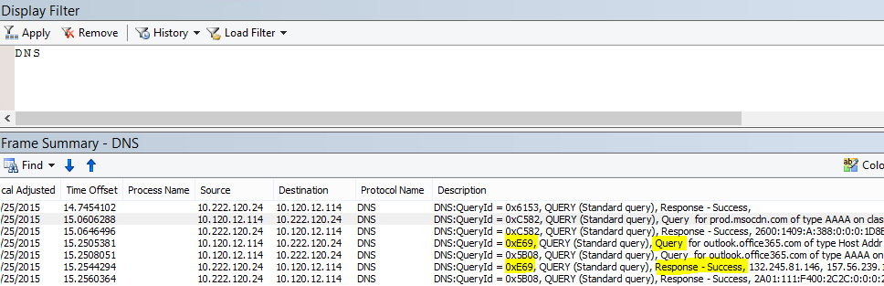
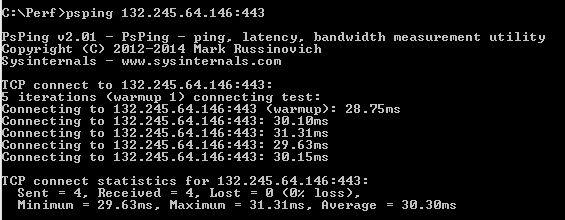

# Office 365 的性能疑难解答计划

您需要知道以找出并修复滞后、 挂起和 SharePoint Online、 OneDrive for Business、 Exchange Online 中，或 Skype online 业务和客户端计算机之间的性能太慢采取的步骤执行操作？在调用支持之前，这篇文章可帮助您解决 Office 365 的性能问题和甚至修复的一些最常见的问题。
  
本文是实际上可用于捕获有关性能问题的有价值的数据，因为它是一个示例操作计划最新动态。本文中还包含一些首要问题。
    
如果您的新网络性能，并且想要进行的长期计划监视您的客户端计算机和 Office 365 之间的性能，看看[Office 365 性能调整和疑难解答的管理员和 IT 专业人员](performance-tuning-using-baselines-and-history.md)。
  
## 示例性能疑难解答行动计划

此操作计划包含两部分;准备阶段和日志记录阶段。如果您立即，拥有性能问题，并且您需要执行数据集，您可以开始立即使用此计划。
  
 **准备客户端计算机**
  
- 查找可重现性能问题的客户端计算机。此计算机将使用的故障排除过程。
    
- 记下导致性能问题，以执行测试时已准备好的步骤。
    
- 安装用于收集和记录信息的工具：
    
  - 安装[Netmon 3.4](https://www.microsoft.com/en-us/download/details.aspx?id=4865) （或使用等效的网络跟踪工具）。 
    
  - 安装可用的基本版本的[HTTPWatch](https://www.httpwatch.com/download/) （或使用等效的网络跟踪工具）。 
    
  - 使用屏幕录制或运行步骤记录器 (PSR.exe) 的 Windows Vista 和更高版本，以便记录的测试过程中执行的步骤。
    
 **日志性能问题**
  
- 关闭所有多余的 Internet 浏览器。
    
- 启动步骤录制或另一个屏幕录制。
    
- 启动网络监视器捕获 （或网络跟踪工具）。
    
- 通过键入以下内容 ipconfig /flushdns 清除 DNS 缓存从命令行在客户端计算机。
    
- 启动新的浏览器会话并打开 HTTPWatch。
    
- 可选： 如果您要测试 Exchange Online，运行 Exchange 客户端性能分析工具从 Office 365 管理控制台。
    
- 重现导致性能问题的具体步骤。
    
- 停止您 Netmon 或其他工具的跟踪。
    
- 在命令行中，通过键入以下命令并按 ENTER 运行 Office 365 订阅跟踪路由：
    
    `tracert \< *subscriptionname*  \>.onmicrosoft.com` 
    
- 停止步骤录制并保存视频。一定要包括的日期和时间捕获和它是否演示良好或错误的性能。
    
- 保存跟踪文件。同样，一定要包括的日期和时间捕获和它是否演示良好或错误的性能。
    
如果您不熟悉运行本文中提到的工具，不要担心由于接下来，我们提供这些步骤。如果您是习惯执行这种网络捕获，则可以跳过[如何收集比较基准](performance-tuning-using-baselines-and-history.md#how-to-collect-baselines)，其中介绍了筛选和读取日志。 
  
## 第一次刷新 DNS 缓存

为什么？通过扩展 DNS 缓存刷新您刚与从头开始测试。通过清除缓存，您正在 DNS 解析程序内容的最新的项重置。请记住刷新不会删除主机文件项。如果使用了大量的主机文件项，您应将这些条目复制到另一个目录中的文件，然后清空主机文件。
  
 **刷新 DNS 解析程序缓存**
  
1. 打开命令提示符处 (**开始**任一\>**运行** \> **cmd**或**Windows 键** \> **cmd**)。
    
2. 键入以下命令并按 ENTER:`ipconfig /flushdns`
    
## Netmon

Microsoft 的网络监视工具 ([Netmon](https://www.microsoft.com/download/details.aspx?id=4865)) 分析数据包，即传递网络的计算机之间的通信。通过使用 Netmon 来跟踪流量与 Office 365 您可以捕获，视图和读取数据包头识别且设备、 检查网络硬件上的重要设置，寻找丢弃的数据包，并按照上您公司的计算机之间的流量网络和 Office 365。因为实际正文的通信进行加密，即，其 （通过 SSL/TLS 端口 443 上的传输，不能读取正在发送的文件。相反，您获取路径的数据包考虑这可以帮助您跟踪问题行为筛选的的跟踪。
  
确保不在此时应用筛选器。相反，运行完成的步骤，并停止跟踪和保存之前演示该问题。
  
安装 Netmon 3.4 后，打开工具，并执行这些步骤：
  
 **执行 Netmon 跟踪，并重现问题**
  
1. 启动 Netmon 3.4。
    
    在**开始**页上有三个窗格：**最近捕获**、**选择网络**和**启动与 Microsoft 网络监视器 3.4。请注意**。选择网络面板还将为您提供您可以捕获从其默认网络的列表。确保此处选择网卡。
    
2. 请单击**开始**页顶部的**新捕获**。这样会将添加新选项卡旁边名为**捕获 1**的**开始**页选项卡。
    
    
  
3. 要进行简单的捕获，请单击工具栏上的**启动**。 
    
4. 重现演示的性能问题的步骤。
    
5. 单击**停止** \> **文件** \> **另存为**。请记住要授予的日期和时间的时区，然后提及如果它演示错误或良好性能。
    
## HTTPWatch

[HTTPWatch](https://www.httpwatch.com/download/)方面电的、 和免费版本。免费的基本 Edition 介绍此测试所需的全部内容。直接从浏览器窗口，HTTPWatch 监视器网络流量和页面加载时间。以图形方式介绍性能的 Internet Explorer 插件 HTTPWatch。可以保存并查看 HTTPWatch Studio 分析。 
  
> [!NOTE]
> 如果您使用其他浏览器，例如 Firefox，Google Chrome 或不能安装 HTTPWatch 在 Internet Explorer 中，打开一个新的浏览器窗口，并按键盘上的 f12 键。在浏览器的底部，您应看到弹出开发人员工具。如果您使用 Opera，按 CTRL + SHIFT + I Web 检查器，然后单击**网络**选项卡并完成测试概括如下。信息将会稍有不同，但仍将以毫秒为单位显示加载时间。> HTTPWatch 也是非常有用问题的 SharePoint Online 的页面加载时间。 
  
 **运行 HTTPWatch 并重现问题**
  
1. HTTPWatch 是浏览器插件，因此公开浏览器中的工具是每个版本的 Internet Explorer 略有不同。通常情况下，您可以在 Internet Explorer 浏览器中，在命令栏下方中找到 HTTPWatch。 如果您没有浏览器窗口中看到插件 HTTPWatch，检查您的浏览器版本通过单击帮助\>有关，或者，更高版本的 Internet Explorer 中，单击齿轮符号和有关 Internet Explorer。启动**命令**栏中，右键单击 Internet Explorer 中的菜单栏，单击**命令栏**。过去，HTTPWatch 已关联使用的命令和浏览器栏中，因此一次安装，如果您没有立即看到 （甚至之后重新启动） 检查**工具**和您的工具栏图标的图标。请记住，可以自定义工具栏，可以向它们添加选项。 
    
  
2. 启动 Internet Explorer 浏览器窗口中的 HTTPWatch。将显示固定到浏览器在该窗口的底部。单击**记录**。
    
3. 重现参与性能问题的的具体步骤。单击 HTTPWatch 中的**停止**按钮。 
    
4. **保存**HTTPWatch 或**通过电子邮件发送**。请记住，使其包含日期和时间信息和相对值的指示您监视是否包含性能良好或错误的演示，作为文件名。  
    此屏幕截图是从 HTTPWatch 的专业版。您可以打开与专业版的计算机上的基本版本中所做的跟踪，并那里读取。额外的信息可从该方法通过跟踪。
    
## 问题步骤记录器

步骤记录器或 PSR.exe，可记录问题，这些情况。它是一个非常有用的工具和非常简单，若要运行。
  
 **运行问题步骤记录器 (PSR.exe) 来记录您的工作**
  
1. 请使用**启动** \> **运行**\>键入**PSR.exe** \> **确定**，或单击**Windows 密钥**\>键入**PSR.exe** \> ，然后按 ENTER。 
    
2. 出现小型 PSR.exe 窗口时，单击**开始录制**，并重现重现性能问题的步骤。根据需要通过单击**添加注释**，您可以添加注释。
    
3. 在完成后的步骤，请单击**停止记录**。如果页面呈现性能问题，等待页面呈现之前停止录制。 
    
4. 单击“保存”****。
    

  
为您记录中的日期和时间。这在时间中，向您 Netmon 跟踪和 HTTPWatch 链接您 PSR 并与精度疑难解答帮助。日期和时间的 PSR 记录可以显示一分钟传递登录和例如浏览 URL 和管理网站，部分呈现之间。
  
## 阅读您跟踪

无法教某人需要知道通过文章的一切关于网络和性能疑难解答。获取在性能良好采用体验，而您的网络如何工作原理以及通常执行的知识。但它并可能要首要问题的列表向上舍入并显示如何工具会使您更轻松地消除最常见的问题。
  
如果您想要拿起读取 for Office 365 网站的网络跟踪的技能，比定期创建的页面加载的跟踪和获得经验读取其没有更好教师。例如，如果您有机会，加载 Office 365 服务并跟踪过程。筛选 DNS 流量跟踪或搜索 FrameData 您浏览该服务的名称。扫描跟踪以了解该服务加载时出现的步骤。这将帮助您了解哪些普通页面加载应如下所示，并对于疑难解答，尤其是在性能比较好到差跟踪可以教您很大。
  
Netmon 显示筛选器字段中使用 Microsoft Intellisense。智能感知或智能代码完成，其中在一段中键入，在下拉选择框中显示所有可用选项的技巧。如果，例如，您担心 TCP 窗口缩放，您可以找到您的方式对筛选器 (如`.protocol.tcp.window < 100`) 通过这种方法。
  

  
Netmon 跟踪可以有大量流量。如果您不具有读取其有经验，很可能将严重受损打开第一次的跟踪。首先要做是信号分开中跟踪背景噪音。针对 Office 365 测试，这是您想要查看的流量。如果您是用于跟踪导航，您可能不需要此列表。
  
通过 TLS，这意味着加密和中泛型 Netmon 跟踪不可读，也会正文的通信将会传输客户端和 Office 365 之间的通信。性能分析不需要知道数据包中的信息的具体信息。是，但是，非常感兴趣数据包标头和它们包含的信息。
  
 **若要获取良好跟踪的提示**
  
- 了解客户端计算机的 IPv4 或 IPv6 地址的值。您可以从命令提示符处获取此键入**IPConfig**并然后按 ENTER。了解此地址会让您快速告知是否中跟踪的流量直接涉及客户端计算机。如果没有已知的代理，ping 它并获取其的 IP 地址。 
    
- 刷新 DNS 解析程序缓存和，如果可能，请关闭在其中运行测试以外的所有浏览器。如果您不是能够执行此操作，例如，如果支持使用一些基于浏览器的工具查看客户端计算机的桌面，请准备筛选您跟踪。
    
- 忙跟踪中, 找到您使用的 Office 365 服务。如果您已从不或很少看到您的通信之前，这是在从其他网络干扰分离性能问题的有用步骤。有几种方法来执行此操作。直接之前测试，您可以使用 ping 或 PsPing，向特定服务的 URL (`ping outlook.office365.com`和/或`psping -4 microsoft-my.sharepoint.com:443`，例如)。您可以方便地找到该 PsPing 中 Netmon 跟踪 （按其过程名称）。您将得到开始查找的位置。
    
    如果问题时仅使用 Netmon 跟踪，没关系太。若要确定您自己的方向，使用类似的筛选器`ContainsBin(FrameData, ASCII, "office")`或`ContainsBin(FrameData, ASCII, "outlook")`。您可以记录跟踪文件从您框架的号码。您可能要滚动到最右边的帧摘要窗格，并查找对话 ID 列。没有指示有此特定的对话，您还可以记录和查看隔离更高版本中的 ID 号。请记住在应用任何其他筛选之前删除此筛选器。
    
> [!TIP]
> Netmon 有许多有用的内置筛选器。尝试在**显示**筛选器窗格顶部的"加载筛选器"按钮。 
  

  

  
获取熟悉与您通信，并了解如何找到所需的信息。例如，了解如何确定哪些数据包跟踪中的具有对您正在使用 （如"Outlook") 的 Office 365 服务的第一个引用。
    
采用 Office 365 Outlook Online 作为示例，流量开始如下所示：
  
- 标准的 DNS 查询并具有匹配 QueryIDs outlook.office365.com 的 DNS 响应。请务必注意有关此周转，以及位置世界 Office 365 全局 DNS 时间偏移发送名称解析的请求。理想情况下，为可能的而不是在世界范围一半本地。(这可能跟一些 DNS 流量联机登录。)
    
- HTTP GET 请求其状态报告永久移动 (301)
    
- 包括 RWS 连接请求和连接答复 RWS 流量。（这是为您进行连接的远程 Winsock）。
    
- TCP SYN 和 TCP SYN-ACK 对话。大量的此对话中的设置影响性能。
    
- 然后 TLS:TLS 流量即其中的 TLS 握手和 TLS 证书对话执行一系列。（请记住通过 SSL/TLS 加密数据）。
    
所有部件的通信重要和连接，但跟踪的小部分包含信息会严重影响性能疑难解答，尤其重要，因此我们专注于这些领域。此外，因为我们已完成足够的 Office 365 性能疑难解答 microsoft 编译常见问题的前 10 个列表，我们将专注于这些问题以及如何使用我们必须根这些下一步出的工具。
  
如果您尚未安装它们所有准备好，下面的 matrix 使其他几种工具使用。在可能的情况。链接到安装点提供。该列表包含常见的网络跟踪工具，如[Netmon](https://www.microsoft.com/en-us/download/details.aspx?id=4865)和[Wireshark](https://www.wireshark.org/)，但使用您习惯，和正在习惯于筛选网络流量的任何跟踪工具。当您测试时，请记住：
  
-  *关闭浏览器中，并测试与运行只有一个浏览器*-这会减少您捕获的总体流量。它是一个不太忙跟踪的。 
    
-  *刷新客户端计算机上的您 DNS 解析程序缓存*-这将使您从头开始进行您捕获，更整洁跟踪的时。 
    
## 某些首要问题

您可能会遇到的某些常见问题以及如何在您的网络跟踪中找到这些。

### TCP 窗口扩展

SYN-中找到 SYN/确认旧或时效硬件可能不会利用 TCP windows 缩放。 没有适当的 TCP windows 缩放设置，TCP 标头中的默认 16 位缓冲区填充以毫秒为单位。 流量无法继续发送直至客户端接收到的已收到的原始数据，确认导致延迟。

#### 工具：

- Netmon
- Wireshark 

#### 正在查找的内容：

查找 SYN-SYN-ACK/流量在您的网络跟踪。 在 Netmon，使用筛选器，如`tcp.flags.syn == 1`。此筛选器中 Wireshark 相同。  

         
请注意，对于每个 SYN 没有相关确认 (SYN/ACK) 的目标端口值为零 （意味着） 匹配源 (SrcPort) 端口号。 

若要查看您的网络连接使用的 Windows 扩展值，首先 SYN，展开，然后展开相关的 SYN 确认  

  

### TCP 空闲时间设置

过去，大多数外围网络配置为临时连接，这意味着通常终止空闲的连接。可以通过代理和防火墙在大于 100 为 300 秒终止空闲 TCP 会话。这是 Outlook online 有问题因为它创建并使用长期连接，无论他们处于空闲状态。  

当连接将终止由代理服务器或防火墙设备，客户端不是明智，并尝试使用 Outlook 联机将意味着客户端计算机将尝试，重复，恢复之前进行一个新连接。在页面加载，可能会看到挂起中产品、 提示或性能太慢。

#### 工具：

- Netmon
- Wireshark

#### 要查找的内容：

在 Netmon，查看往返行程的时间偏移字段。往返行程是向服务器发送请求并接收响应后的客户端之间的时间。检查客户端之间出口点 (例如客户端--\>代理)，或到 Office 365 客户端 (客户端--\> Office 365)。您可以看到此许多类型的数据包中。 

例如，Netmon 中的筛选器可能类似于`.Protocol.IPv4.Address == 10.102.14.112 AND .Protocol.IPv4.Address == 10.201.114.12`，或在 Wireshark， `ip.addr == 10.102.14.112 &amp;&amp; ip.addr == 10.201.114.12`。  

> [!TIP]
> 不知道您跟踪中的 IP 地址是否属于您的 DNS 服务器？尝试在命令行进行查找。单击**开始** \> **运行**\>并键入**cmd**，或按**Windows 键** \> ，然后键入**cmd**。在提示符处，键入`nslookup <the IP address from the network trace>`。若要测试，请使用 nslookup 针对您自己的计算机的 IP 地址。> 到，请参阅 Microsoft 的 IP 范围的列表，请参阅[Office 365 Url 和 IP 地址范围](https://technet.microsoft.com/en-us/library/hh373144.aspx)。 

有问题时，预期长时间偏移显示在 (Outlook Online)，此情况下的特别是在显示的应用程序数据下方的 TLS:TLS 数据包 (例如，在 Netmon 中可以找到应用程序通过数据数据包`.Protocol.TLS AND Description == "TLS:TLS Rec Layer-1 SSL Application Data"`)。您应看到的时间的平滑过渡跨会话。如果您看到长时间延迟，刷新您 Outlook 联机时，这可能致重置正在发送很大程度。 

### 延迟/往返触发时间 

延迟是度量可根据许多变量中，将此类升级时效设备，将大量用户添加到网络和总体带宽使用的网络连接上的其他任务所占大量更改。 

从[网络规划和性能优化 Office 365](network-planning-and-performance.md)该页有可用的 Office 365 带宽计算器。  

需要进行测量的速度您的连接或您的 ISP 连接带宽？尝试此站点 （或类似的网站）： [Speedtest 官方网站](https://www.speedtest.net/)和[Pingtest](http://www.pingtest.net/)。

#### 工具：

- Ping
- PsPing
- Netmon
- Wireshark

#### 要查找的内容：

若要跟踪中跟踪的延迟，您将受益于 Office 365 中记录的客户端计算机 IP 地址和 DNS 服务器的 IP 地址。这是以便更轻松地跟踪筛选。如果连接通过代理时，需要您客户端计算机的 IP 地址、 代理中的外出 IP 地址和 Office 365 DNS IP 地址，以便更轻松地工作。  

发送到 outlook.office365.com 的 ping 请求您即使 ping*可能*无法进行连接以发送连续 ICMP 数据包的商标告诉您接收请求，数据中心的名称。如果您使用 PsPing （下载免费工具） 和特定端口 (443) 和回电使用 IPv4 (-4) 您将获取平均 round-trip 时发送的数据包。这将用于此其他 Url 中的 Office 365 服务，如`psping -4 yourSite.sharepoint.com:443`。实际上，您可以指定数 ping 类似的您平均，尝试获取更大的示例： `psping -4 -n 20 yourSite-my.sharepoint.com:443`。  

> [!NOTE]
> PsPing 不发送 ICMP 数据包。它执行 ping 操作 TCP 数据包与通过特定端口，以便您可以使用任意一个您知道，才能开放。在 Office 365 中，使用 SSL/TLS，请尝试附加端口： 向您 PsPing 443。

        

如果您执行网络跟踪的同时加载慢速性能更优的 Office 365 网页，应筛选 Netmon 或 Wireshark 跟踪`DNS`。这是我们查找 Ip 之一。  

以下是要执行筛选您 Netmon 来获取 IP 地址 （和一下 DNS 延迟） 的步骤。此示例使用 outlook.office365.com，但还可以使用 SharePoint Online 租户 (例如 hithere.sharepoint.com) 的 URL。  

1. Ping URL `ping outlook.office365.com` ，在结果中，记录的名称和 IP 地址的 ping 请求发送到的 DNS 服务器。 
2. 网络跟踪打开页上，或执行的操作，为您提供了性能问题，或如果您 ping，本身上, 看到高延迟网络跟踪。 
3. 为了 DNS Netmon 和筛选器中打开跟踪 (此筛选器还 Wireshark 中, 正常工作，但写到事例`-- dns`)。由于您知道您 ping 从 DNS 服务器的名称可能还筛选类似的多个快速在 Netmon: `DNS AND ContainsBin(FrameData, ASCII, "namnorthwest")` 、 看上去像这样 Wireshark dns 中和框架中包含"namnorthwest"。 打开响应数据包，然后在的 Netmon 帧详细信息窗口中，单击 DNS 以展开的详细信息。您会发现请求于 Office 365-开始到 DNS 服务器的 IP 地址的 DNS 信息中，您将需要此 IP 地址的下一步 （PsPing 工具）。删除筛选器，右键单击 Netmon 的帧摘要中的 DNS 响应\>查找对话\>DNS，请参阅 DNS 查询和响应-并行。 
4. 在 Netmon，还请注意之间的 DNS 请求和响应时间偏移列。在下一步中，轻松安装和使用[PsPing](https://technet.microsoft.com/en-us/sysinternals/jj729731.aspx)工具有非常方便，同时 ICMP 上防火墙，通常被阻止和 PsPing 自然地跟踪延迟 （毫秒）。PsPing 完成 TCP 连接到地址和端口 （在我们案例打开端口 443）。 
5. 安装 PsPing。 
6. 打开命令提示符 (开始\>运行\>键入 cmd 或 Windows 密钥\>键入 cmd) 并将目录更改为您安装 PsPing 运行 PsPing 命令的目录。在我的示例可以看到所做的 C.根目录上的性能文件夹您可以快速访问相同。 
7. 键入命令，以便您要从早期 Netmon 跟踪发起针对 Office 365 DNS 服务器的 IP 地址您 PsPing--请记住要添加的端口号。  换句话说， `psping -n 20 132.245.24.82:445`。这将为您提供的 20 ping 取样，并 PsPing 停止时的平均延迟。 

如果您正在通过代理服务器转到 Office 365，是稍有不同的步骤。向代理服务器以获取平均延迟值，以毫秒为单位代理中的外出和后，将第一个 PsPing，然后再运行 PsPing 在代理服务器上，或直接的 Internet 连接，以获取缺失值 （到 Office 365 并返回一个） 的计算机上。  

如果您选择从代理运行 PsPing，您必须两个毫秒值： 到代理服务器或出口点和代理服务器到 Office 365 的客户端计算机。和完毕 ！嗯，仍然录制值。  

如果您具有直接连接到 Internet 的另一个客户端计算机上运行 PsPing，即，没有代理，您将有两个毫秒值： 到代理服务器或出口点和到 Office 365 的客户端计算机的客户端计算机。在这种情况下，客户端计算机的值减去到代理服务器或出口点到 Office 365 的客户端计算机的值，将可以 RTT 号码从客户端计算机的代理服务器或出口点，以及从代理服务器或外出指向 Office 365。 

但是，如果可以直接连接，或绕过代理服务器的受影响位置中找到的客户端计算机，您可能选择是否问题会产生那里开头的请参阅和测试使用它，此后。 

延迟，如 Netmon 跟踪中, 所示这些额外的毫秒可以添加，如果有足够的任何给定会话中。  

> [!NOTE]
> 您的 IP 地址可能不同于 Ip 如下所示，例如，您 ping 可能会返回类似详细 157.56.0.0/16 或类似的范围。有关使用 Office 365 的范围的列表，请查看[Office 365 Url 和 IP 地址范围](https://technet.microsoft.com/en-us/library/hh373144.aspx)。 

请记住展开 （在此顶部没有按钮） 的所有节点如果您想要搜索的例如，132.245。

### 代理服务器身份验证

这仅适用于您如果您打算通过代理服务器。如果没有，则可以跳过这些步骤。时正常工作，代理身份验证应始终采取毫秒为单位的位置。您不应 （示例） 请参阅高峰使用时段的间歇性错误性能。  

如果代理身份验证，为每次您对 Office 365 获取信息的新的 TCP 连接，您需要通过在后台进行身份验证过程。因此，例如，从日历切换到 Outlook Online 中的邮件，您将进行身份验证。并在 SharePoint Online 中，如果媒体或从多个网站或位置，数据将显示一个页面您将验证每个不同的 TCP 连接以呈现数据所需的。  

在 Outlook 联机状态，您可能会遇到慢加载时间每当您日历和您的邮箱，之间切换或 SharePoint Online 中慢速网页加载时。但是，有此处未列出其他症状。 

代理服务器身份验证是出口代理服务器上的设置。如果它导致性能问题与 Office 365，您必须咨询您的网络团队。  

#### 工具： 

- Netmon
- Wireshark 

#### 要查找的内容：

代理服务器身份验证都将进行每当新 TCP 会话必须旋转，通常文件或 info 请求从服务器中，或提供信息。例如，您可能会看到 HTTP GET 或 HTTP POST 请求周围的代理服务器身份验证。如果您想要查看您正在在其中进行请求您跟踪中身份验证框架，将 NTLMSSP 摘要列添加到 Netmon 和筛选的`.property.NTLMSSPSummary`。若要查看身份验证花费多长时间，请添加时间增量列。 

将列添加到 Netmon: 
1. 右键单击如说明的列。 
2. 单击选择列。 
3. 找到 NTLMSSP 摘要和时间增量列表中，单击添加。 
4. 移动的新列到位之前或隐藏说明列使您可以阅读这些并排比较。
5. 单击"确定"。 

即使您没有添加列中，将工作 Netmon 筛选器。但故障排除将会容易得多如果您可以查看在您的身份验证所处的阶段。 

当要查找的实例代理身份验证，请务必研究中所有图文框，其中没有 NTLM 质询，或一个进行身份验证的消息时存在。如有必要，右键单击流量和查找对话特定的\>TCP。注意这些对话中的时间增量值。 

        

四个秒延迟代理身份验证 Wireshark 中所示。通过右键单击帧详细信息中具有相同名称的域并作为列选择添加已**从以前的显示框架的时间增量**列。          

### DNS 性能

名称解析 works 最佳并且最快速时它会在尽可能接近尽可能的客户端的国家/地区。 

如果 DNS 名称解析正在海外进行，它可以将秒添加到页面加载。理想情况下，名称解析中发生的情况下为 100 毫秒。如果没有，应执行进一步调查。 

> [!TIP]
> 不确定客户端连接 Office 365 中的工作原理？一下的客户端连接参考文档[此处](https://technet.microsoft.com/en-us/library/dn741250.aspx)。           

#### 工具： 

- Netmon
- Wireshark
- PsPing

#### 要查找的内容：
分析 DNS 性能是通常另一个工作网络跟踪。但是，PsPing 也是在规则，或注销，可能的原因非常有用的。 

DNS 流量基于 TCP 和 UDP 请求和响应清楚地标记与有助于匹配特定请求使用其特定的响应的 ID。您将看到 DNS 流量时，例如，SharePoint Online 使用网络名称或 URL 网页上。当通过 UDP 运行经验法则，大部分除外转接区域时，此通信量。 

在 Netmon 和 Wireshark 中，将允许您查看 DNS 流量的最基本筛选只是`dns`。请务必指定筛选器时使用大小写。请记住之前重现问题客户端计算机上的刷新 DNS 解析程序缓存。例如，如果您有主页慢的 SharePoint Online 页面加载，您应该关闭所有浏览器，打开新浏览器、 开始跟踪、 刷新 DNS 解析程序缓存，和浏览到 SharePoint Online 网站。一旦整个页面解析，您应停止并保存跟踪。

您想要查看此处偏移的时间。它可能有助于将**时间增量**列添加到 Netmon 可通过完成下列步骤： 
1. 右键单击如说明的列。 
2. 单击选择列。 
3. 在列表中找到时间增量并单击添加。 
4. 移动新列到位之前或隐藏说明列使您可以阅读这些并排比较。
5. 单击"确定"。 

如果您发现感兴趣的查询，考虑隔离通过右键单击该查询在框架的详细信息面板中，选择**查找对话** \> **DNS**。请注意网络对话面板跳转从右到其日志中的 UDP 通信特定的对话。 

        

在 Wireshark 可以 DNS 次进行列。使您的跟踪 （或打开跟踪） Wireshark 和筛选器的`dns`，或更多还为您， `dns.time`。对任何 DNS 查询，单击，然后在显示详细信息面板，展开`Domain Name System (response)`详细信息。您将看到一个域的时间 (例如， ` [Time: 0.001111100 seconds] `。右键单击这次，然后选择**应用为列**。这将为您的跟踪的更快地排序使您的**时间**列。单击新列按降序值，以查看其 DNS 呼叫进行排序的时间最长看来解析。 

[按照 dns.time（小写）在 Wireshark 中筛选的 SharePoint Online 的浏览，其中包含将详细信息插入到某个列以及按升序进行排序的时间。](media/1439dcc2-12ff-4ee2-9ef3-1484cf79c384.PNG)

如果您希望执行更多调查的 DNS 解析时间，请尝试使用 TCP 的 DNS 端口针对 PsPing (例如， `psping <IP address of DNS server>:53`)。仍能看到的性能出现问题？否则，问题是更可能需要比特定问题 DNS 应用程序正在点击执行解决方案更广泛的网络问题。值得还再次，提及的 ping outlook.office365.com 会告诉您 Outlook online 的 DNS 名称解析正在进行 (例如，outlook namnorthwest.office365.com)。  如果问题查找为特定的 DNS，它可能需要联系您的 IT 部门可以这样看待 DNS 配置和 DNS 转发器以进一步调查问题。 

### 代理可伸缩性

Office 365 中 Outlook 联机服务授予客户端多个长期连接。因此，每个用户可以使用需要更长寿命的更多连接。  

> [!TIP]
> 需要规划带宽使用，因为您将要将大量用户添加到 Office 365？试用[Office 365 Internet 带宽使用计划](https://technet.microsoft.com/en-us/library/hh852542.aspx)。有可用带宽计算器存在。

#### 工具：
 
数学  

#### 要查找的内容： 

没有网络跟踪或故障排除工具特定于此。相反，它基于带宽计算给定限制和其他变量。  

### TCP 最大段大小

SYN-SYN/确认中找到 执行此签入已经以确保 TCP 数据包被配置为执行的最大可能的数据量任何性能网络跟踪。 

目标是了解 1460 个字节用于数据传输的 MSS。如果您后面代理服务器，或使用 NAT，请记住从客户端到代理/出口/NAT 和代理/出口/NAT 到 Office 365 为了获得最佳结果，则运行此测试 ！这些是不同的 TCP 会话。

#### 工具： 

Netmon

#### 要查找的内容：

TCP 片段最大大小 (MSS) 是在您的网络跟踪，意味着您将 SYN-SYN-ACK/数据包中找到所需的数据的三方握手的另一个参数。MSS 方法实际上以查看非常简单。 

打开任何性能网络跟踪您具有并查找您好奇，该连接或的演示性能问题。 

> [!NOTE]
> 如果您要查找的跟踪，要查找流量与您的对话相关的客户端，IP 或代理服务器和/或出口点的 IP 筛选。直接转，您将需要 ping 它您测试 Office 365 中的跟踪和筛选器的 IP 地址的 URL。 

查看跟踪 second-hand？尝试使用筛选器来确定您自己的方向。Netmon，运行搜索根据 URL，如`Containsbin(framedata, ascii, "sphybridExample")`，记下的帧数。 

在 Wireshark 使用类似`frame contains "sphybridExample"`。如果您注意到找到远程 Winsock (RWS) 流量 （它可能显示为 [PSH，ACK] 在 Wireshark），请记住 RWS 连接可看到不久之前相关 SYN-Syn-ack/中，如前所述。 

此时，记录框架号、 drop 筛选器、 单击 Netmon 来查看最接近 SYN.网络对话窗口中的所有通信 

重要的，如果您未收到任何 IP 地址信息跟踪时，查找中跟踪的 URL (的一部分`sphybridExample-my.sharepoint.com`，例如)，将为您提供要筛选的 IP 地址。 

您感兴趣查看跟踪中定位的连接。可以通过筛选通过 IP 地址，或选择特定的对话 Id 使用网络对话窗口中 Netmon 任一扫描跟踪，来执行此操作。一旦找到 SYN 数据包，展开 （在 Netmon)，TCP 或 （在 Wireshark) 框架细节窗格中的传输控制协议。展开 TCP 选项和 MaxSegementSize。找到相关的 SYN-ACK 框架展开 TCP 选项和 MaxSegmentSize。较小的两个值将为您的最大段大小。在此图片中，发起调用 TCP 解决 Netmon 中的内置列的使用。  

内置列是顶部的**框架的详细信息**面板。（要切换到普通视图，再次单击列，然后选择所在的时区。） 

           
下面是筛选的跟踪 Wireshark 中。特定于 MSS 值是一个筛选器 ( `tcp.options.mss`)。底部 Wireshark 等价于帧详细信息的链接的帧数的 SYN、 / SYN-ACK、 ACK 握手 （因此框 47 ACK 46 SYN-ACK 链接、 链接 43 SYN），这种工作更轻松。 

         
如果您需要检查选择性确认 （此矩阵中的下一主题）： 不关闭您跟踪 ！

### 选择性确认

允许 SYN 和 SYN/确认选择性确认 (SACK) 中的允许的数据时数据包的平稳重新传输或数据包转缺少 SYN/确认必须报告 SYN-中找到。设备可以禁用此功能，这会导致性能问题。 

如果您后面代理服务器，或使用 NAT，请记住从客户端到代理/出口/NAT 和代理/出口/NAT 到 Office 365 为了获得最佳结果，则运行此测试 ！这些是不同的 TCP 会话。

#### 工具： 

Netmon 

#### 要查找的内容：

选择性确认 (SACK) 是在 SYN/SYN-ACK 握手的另一个参数。您可以为 SYN-SYN-ACK/多种方式筛选您的跟踪。 

您感兴趣看到通过扫描跟踪，筛选通过 IP 地址，或单击对话 ID 使用网络监视器中的网络对话窗口跟踪中定位的连接。一旦找到 SYN 数据包，展开中 Netmon，TCP 或中的帧详细信息部分的 Wireshark 传输控制协议。展开 TCP 选项，然后 SACK。找到相关的 SYN-ACK 框架和展开 TCP 选项以及其 SACK 字段。确保 SACK 允许 SYN 和 SYN/确认中以下是 SACK 值，如 Netmon 和 Wireshark 中所示。

                     

### DNS 地理位置 

其中世界尝试解决 Office 365 DNS 呼叫您的连接速度效果。 

在 Outlook 联机状态，完成第一台 DNS 查找后，该 DNS 的位置将用于连接到最近的数据中心。您将连接到 Outlook 联机 CA 服务器，它将使用中枢网络连接到数据中心 (dC) 数据存储的位置。这是更快。

时访问 SharePoint Online，国外旅行用户将被定向到其活动数据中心-的是其 SPO 租户基于其位置的 dC 的主页基本 (，，美国的 dC 如果基于 USA 的用户)。     Lync online 一次在多个 dC 中具有活动节点。请求时发送的 Lync online 实例，Microsoft 的 DNS 将确定世界请求来自何处，并返回 IP 地址从最接近的区域 dC 其中 Lync online 处于活动状态。 

> [!TIP]
> 需要了解有关客户端如何连接到 Office 365 的详细信息？看看[客户端连接](https://technet.microsoft.com/en-us/library/dn741250.aspx)参考文章 （和其有用的图形）。           
#### 工具：

- Ping
- PsPing

#### 要查找的内容：

大多数情况下结果中返回的 IP 地址的区域数据中心 (dC) 的 Microsoft DNS 中应请求 Microsoft DNS 服务器的名称解析来自客户端的 DNS 服务器。为您，这意味着什么？如果您总部位于印度班加罗尔，但旅行在美国，您的浏览器发出请求的 Outlook 联机时，Microsoft 的 DNS 服务器应交给您 IP 地址到美国-区域数据中心中的数据中心。如果需要从 Outlook 邮件，则该数据将在 Microsoft 的快速中枢网络出差之间的数据中心。

名称解析完成如接近尽可能用户位置后，DNS 也适用于最快。如果您在欧洲，您想要转到 Microsoft DNS 在欧洲，并处理的数据中心中欧洲 （理想情况下）。从客户端在欧洲转到 DNS 和 America 中的数据中心的性能会变慢。

针对 outlook.office365.com 确定其中世界 DNS 请求将路由运行 Ping 工具。如果您是在欧洲，您应看到来自 outlook emeawest.office365.com 类似的答复。在美国，希望 outlook namnorthwest.office365.com 类似。 

打开命令提示符，客户端计算机上 (通过开始\>运行\>cmd 或 Windows 键\>键入 cmd)。键入 ping outlook.office365.com 并按 ENTER。请记住，如果您想要指定 ping IPv4 通过指定-4。您可能无法回复获得 ICMP 数据包，但您应看到的 DNS 请求被路由到的名称。如果您想要查看此连接的延迟号码尝试 PsPing ping 返回服务器的 IP 地址。  

           
           
### Office 365 应用程序故障排除

#### 工具： 

- Netmon
- HTTPWatch
- 在浏览器中的 F12 控制台

我们不介绍特定于网络的本文中的特定于应用程序使用的工具。将查找资源，但您*可以*使用[此页上](https://support.office.com/en-us/article/Network-planning-and-performance-tuning-for-Office-365-e5f1228c-da3c-4654-bf16-d163daee8848)。
   
## 相关主题

[管理 Office 365 终结点](https://support.office.com/article/99cab9d4-ef59-4207-9f2b-3728eb46bf9a)
  
[Office 365 终结点 FAQ](https://support.office.com/article/d4088321-1c89-4b96-9c99-54c75cae2e6d)
  

