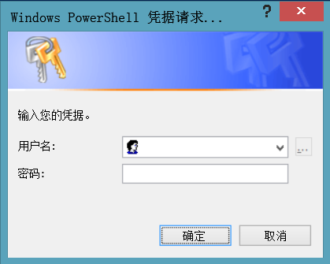
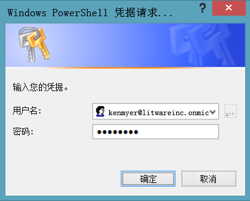
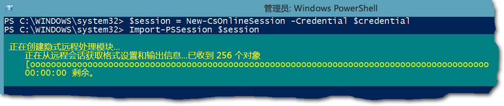
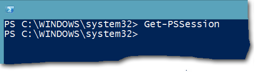

# <a name="connect-to-all-office-365-services-in-a-single-windows-powershell-window"></a>在单个 Windows PowerShell 窗口中连接所有 Office 365 服务

 **摘要：**而不是管理不同的 Office 365 服务单独 PowerShell 控制台窗口中，可以连接到所有的 Office 365 提供服务并从单个控制台窗口中对它们进行管理。
  
当使用 PowerShell Office 365 管理时，很可能有最多五个不同的 Windows PowerShell 会话打开对应于 Office 365 管理中心、 SharePoint Online、 Exchange Online，Skype 的在线业务和&amp;符合性中心。在单独的 Windows PowerShell 会话中的五种不同的连接方法，与您的桌面可以如下所示：
  

  
这不是最适合于管理 Office 365，因为不能交换跨服务管理这些五个窗口间的数据。本主题介绍如何使用与管理 Office 365、 为业务联机状态，Exchange Online，SharePoint Online，Skype 和安全的 Windows PowerShell 的单个实例&amp;法规遵从性中心。
  
## <a name="before-you-begin"></a>准备工作
<a name="BeforeYouBegin"> </a>

您可以从 Windows PowerShell 的单个实例中管理所有 Office 365 的之前，请考虑以下先决条件：
  
- Office 365 的工作或学校对使用这些过程需要 Office 365 管理角色的成员的帐户。有关详细信息，请参阅[有关 Office 365 管理角色](https://go.microsoft.com/fwlink/p/?LinkId=532367)。此 Office 365 PowerShell，不一定能为所有其他 Office 365 提供服务的要求。
    
- 您可以使用以下 64 位版本的 Windows：
    
  - Windows 10
    
  - Windows 8.1 或 Windows 8
    
  - Windows Server 2016
    
  - Windows Server 2012 R2 或 Windows Server 2012
    
  - Windows 7 Service Pack 1 (SP1)*
    
  - Windows Server 2008 R2 SP1*
    
    * 您需要安装 Microsoft.net 4.5。_x_ ，然后是 Windows 管理框架 3.0 或 Windows 管理框架 4.0。有关详细信息，请参阅[安装.NET Framework](https://go.microsoft.com/fwlink/p/?LinkId=257868)和[Windows 管理框架 3.0](https://go.microsoft.com/fwlink/p/?LinkId=272757)或[Windows 管理框架 4.0](https://go.microsoft.com/fwlink/p/?LinkId=391344)。
    
    您需要使用 64 位版本的 Windows 由于 Skype 的要求在线业务模块和 Office 365 模块之一。
    
- 您需要安装所需的 Office 365、 SharePoint Online 和 Skype 的在线业务的模块：
    
  - [Microsoft 在线服务登录助理为 IT 专业人士一项的](https://go.microsoft.com/fwlink/p/?LinkId=286152)
    
  - [Windows Azure 活动目录模块用于 Windows PowerShell （64-位版本）](https://go.microsoft.com/fwlink/p/?linkid=236297)
    
  - [SharePoint 在线管理外壳程序](https://go.microsoft.com/fwlink/p/?LinkId=255251)
    
  - [Skype 的在线业务 Windows PowerShell 模块](https://go.microsoft.com/fwlink/p/?LinkId=532439)
    
-  Windows PowerShell 需要配置运行 Skype 在线业务、 在线交换和安全签名的脚本&amp;法规遵从性中心。若要执行此操作，在提升的权限的 Windows PowerShell 会话中运行以下命令 （您选择**以管理员身份运行**，打开 Windows PowerShell 窗口）。
    
  ```
  Set-ExecutionPolicy RemoteSigned
  ```

## <a name="the-short-version-instructions-without-explanations"></a>简版（说明不含解释）
<a name="ShortVersion"> </a>

此部分介绍的连接步骤不作深入解释。如果你有疑问或想了解更多信息，你可以阅读本主题的其余部分。此处的步骤号匹配主题其余部分中按步骤编号的部分：
  
1. 以管理员身份 （使用**以管理员身份运行**） 打开 Windows PowerShell。
    
2. 运行此命令，并输入您的 Office 365 提供工作或学校帐户凭据。
    
  ```
  $credential = Get-Credential
  ```

3. 运行以下命令以连接到 Office 365。
    
  ```
  Import-Module MsOnline
  Connect-MsolService -Credential $credential
  ```

4. 运行以下命令以连接到 SharePoint Online。更换_\<domainhost >_与实际值为您的域。例如，对于`litwareinc.onmicrosoft.com`， _ \<domainhost >_值是`litwareinc`。
    
  ```
  Import-Module Microsoft.Online.SharePoint.PowerShell -DisableNameChecking
  Connect-SPOService -Url https://<domainhost>-admin.sharepoint.com -credential $credential
  ```

5. 运行以下命令以连接到 Skype 的在线业务。有关增加警告`WSMan NetworkDelayms`的值应在第一次连接，可以忽略。
    
  ```
  Import-Module SkypeOnlineConnector
  $sfboSession = New-CsOnlineSession -Credential $credential
  Import-PSSession $sfboSession
  ```

6. 运行以下命令以连接到 Exchange 联机。
    
  ```
  $exchangeSession = New-PSSession -ConfigurationName Microsoft.Exchange -ConnectionUri "https://outlook.office365.com/powershell-liveid/" -Credential $credential -Authentication "Basic" -AllowRedirection
  Import-PSSession $exchangeSession -DisableNameChecking
  ```

7. 运行以下命令以对安全连接&amp;法规遵从性中心。
    
  ```
  $ccSession = New-PSSession -ConfigurationName Microsoft.Exchange -ConnectionUri https://ps.compliance.protection.outlook.com/powershell-liveid/ -Credential $credential -Authentication Basic -AllowRedirection
  Import-PSSession $ccSession -Prefix cc
  ```
> [!NOTE]
> "抄送"中的文本前缀添加到*所有*安全&amp;法规遵从性中心 cmdlet 名称以便您可以运行的 cmdlet，存在于 Exchange 联机和安全&amp;同一 Windows PowerShell 会话中的法规遵从性中心。例如， **Get RoleGroup**将成为安全**获取 ccRoleGroup** &amp;法规遵从性中心。
  
下面是在一个块的所有命令。指定您的域主机的名称，然后一次运行所有这些。
  
```
$domainHost="<domain host name, such as litware for litwareinc.onmicrosoft.com>"
$credential = Get-Credential
Import-Module MsOnline
Connect-MsolService -Credential $credential
Import-Module Microsoft.Online.SharePoint.PowerShell -DisableNameChecking
Connect-SPOService -Url https://$domainHost-admin.sharepoint.com -credential $credential
Import-Module SkypeOnlineConnector
$sfboSession = New-CsOnlineSession -Credential $credential
Import-PSSession $sfboSession
$exchangeSession = New-PSSession -ConfigurationName Microsoft.Exchange -ConnectionUri "https://outlook.office365.com/powershell-liveid/" -Credential $credential -Authentication "Basic" -AllowRedirection
Import-PSSession $exchangeSession -DisableNameChecking
$ccSession = New-PSSession -ConfigurationName Microsoft.Exchange -ConnectionUri https://ps.compliance.protection.outlook.com/powershell-liveid/ -Credential $credential -Authentication Basic -AllowRedirection
Import-PSSession $ccSession -Prefix cc
```

准备就绪以关闭 Windows PowerShell 窗口后，运行以下命令来删除联机业务、 Exchange Online，SharePoint Online，和安全到 Skype 的活动会话&amp;法规遵从性中心：
  
```
Remove-PSSession $sfboSession ; Remove-PSSession $exchangeSession ; Remove-PSSession $ccSession ; Disconnect-SPOService
```

## <a name="the-long-version-instructions-with-detailed-explanations"></a>长版（说明附有详细解释）
<a name="LongVersion"> </a>

### <a name="step-1-open-windows-powershell-as-an-administrator"></a>步骤 1：以管理员身份打开 Windows PowerShell
<a name="Step1"> </a>

如果您运行的 Windows 10，Windows 8、 Windows 8.1、 Windows 服务器 2016年、 Windows Server 2012 R2 或 Windows Server 2012 R2，执行此操作：
  
1. 使用下列任一方法来查找**Windows PowerShell**的快捷方式：
    
  - 在启动屏幕上，单击空白区域，然后键入 Windows PowerShell。
    
  - 在桌面或开始屏幕上，按下 Windows 键 + Q。在搜索超级按钮，键入 Windows PowerShell。
    
  - 在桌面或开始屏幕上，将光标移动到右上角或刷从右向左，从屏幕来显示魅力的右边缘。选择搜索超级按钮，并输入 Windows PowerShell。
    
2. 在结果中，用鼠标右键单击**Windows PowerShell**，并选择**以管理员身份运行**。
    
3. 如果出现**用户帐户控制**对话框中，选择**是**以确认您想要在管理员凭据下运行 Windows PowerShell。
    
如果运行的 Windows 7 SP1 （或 Windows Server 2008 R2 SP1），请执行此操作：
  
1. 在**开始**菜单中，选择**所有程序** > **附件** > **Windows PowerShell**。**Windows PowerShell**，用鼠标右键单击，然后选择**以管理员身份运行**。
    
2. 如果出现**用户帐户控制**对话框中，选择**是**以确认您想要在管理员凭据下运行 Windows PowerShell。
    
您必须以管理员身份运行 Windows PowerShell。如果不这样做，您将收到错误消息与此类似，当您尝试导入所需的模块之一。
  
```
The specified module 'Microsoft.Online.SharePoint.Online.PowerShell' was not loaded because no valid module file was found in any directory.
```

要解决此问题的唯一方法是关闭 Windows PowerShell 并以管理员身份重新启动它。这里是告诉是否您以管理员身份运行 Windows PowerShell 的快速简便方法： 提示是`PS C:\Windows\System32>`， `PS C:\Users\YourUserName>`。

  
### <a name="step-2-create-a-windows-powershell-credentials-object"></a>步骤 2：创建 Windows PowerShell 凭据对象
<a name="Step2"> </a>

该凭据对象提供一种加密的方法将您的用户名和密码传递给 Windows PowerShell。若要创建一个凭据，请在 Windows PowerShell 运行下面的命令。
  
```
$credential = Get-Credential
```

> [!NOTE]
>  `$credential`是将存储的凭据的对象的变量。您无需命名该变量`$credential`，但这样做可以在容易记住哪个变量包含凭据的对象。（，这很重要，因为我们将多次重用此变量）。也方便为您跟随我们的示例中，因为这篇文章将会始终使用`$credential`来表示凭据对象。
  
Windows PowerShell 将显示一个对话框，如下所示。
  

  
键入您的工作或学校帐户的**用户名**框中，使用用户名格式_username@domainname_ (例如，kenmyer@litwareinc.onmicrosoft.com);键入您的密码，在**密码**框中;然后单击**确定**:
  

  
请注意，通常的情况一样，您不会看到确认已创建凭据对象的任何排序。（Windows PowerShell 通常告诉您当事情出错但不总是告诉您当事情转右。如果您想要验证已创建凭据的对象，在 Windows PowerShell 中键入以下内容，然后按 enter 键。
  
```
$credential
```

然后，您应该会在屏幕上看到以下内容。
  
```
UserName                               Password
--------                               --------
kenmyer@litwareinc.onmicrosoft.com     System.Security.SecureString
```

一件事需要记住这里是[获取凭据](https://go.microsoft.com/fwlink/p/?LinkId=389618)cmdlet 仅创建凭据对象; 对象。它不验证您的身份或否则验证用户名和密码正确。例如，假设您输入正确的用户名为 kenmyer@litwareinc.onmicrosoft.com。如果这样做，**获取凭据**将创建凭据对象使用该用户的名称，并不会检查以查看是否该实际上是有效的用户名称。您不会知道直到实际使用该对象来尝试连接到 Office 365 提供服务是否已创建一个真正有效的凭据。
  
### <a name="step-3-connect-to-office-365"></a>步骤 3：连接到 Office 365
<a name="Step3"> </a>

我们首先连接到 Office 365 本身。 
  
我们需要做的第一件事是导入 Office 365 模块 (Microsoft Azure 活动目录模块用于 Windows PowerShell)。为此，请在 Windows PowerShell 运行此命令。
  
```
Import-Module MsOnline
```

如果你想验证是否已导入该模块，请运行以下命令。
  
```
Get-Module
```

在您看到的内容应如下所示，此命令返回的模块列表中的某处： `Manifest 1.0 MSOnline {Add-MsolForeignGroupToRole, Add-MsolG...}`。
  
如果您看到`MSOnline`列出，这意味着一切按计划。
  
与创建凭据的对象 (请参阅[步骤 2： 创建一个 Windows PowerShell 凭据](connect-to-all-office-365-services-in-a-single-windows-powershell-window.md#Step2)) 与`MsOnline`加载的模块，我们现在可以连接到 Office 365 通过[连接 MsolService](https://go.microsoft.com/fwlink/p/?LinkId=532375) cmdlet 和下面的命令。
  
```
Connect-MsolService -Credential $credential
```

请注意，您必须提供将凭据对象 ( `$credential`)。根据这些凭据，Office 365 会自动将您连接到正确的域。您不需要运行**连接 MsolService**时指定的域名称。
  
若要验证您实际上*是*连接到 Office 365，运行此命令。
  
```
Get-MsolDomain
```

系统应该会返回以下内容。
  
```
Name                         Status          Authentication
----                         ------          --------------
litwareinc.onmicrosoft.com   Verified        Managed
```

### <a name="step-4-connect-to-sharepoint-online"></a>步骤 4：连接到 SharePoint Online
<a name="Step4"> </a>

导入 SharePoint Online 模块使用以下命令：
  
```
Import-Module Microsoft.Online.SharePoint.PowerShell -DisableNameChecking
```

_DisableNameChecking_开关禁止显示此警告。
  
```
WARNING: The names of some imported commands from the module 'Microsoft.Online.SharePoint.PowerShell' include unapproved verbs that might make them less discoverable. To find the commands with unapproved verbs, run the Import-Module command again with the Verbose parameter. For a list of approved verbs, type Get-Verb.
```

要连接到 SharePoint Online，您需要提供两条信息： 您的凭据和 SharePoint Online 管理员站点的 URL。凭据部件很容易： 我们已经已经在变量中存储的`$credential`(请参阅[步骤 2： 创建一个 Windows PowerShell 凭据](connect-to-all-office-365-services-in-a-single-windows-powershell-window.md#Step2))。与您的问题很容易确定，以及管理网站的 URL。假设您 Office 365 的域名是`litwareinc.onmicrosoft.com`。
  
若要确定管理网站 URL，请执行以下操作：
  
1. 开始使用前缀`https://`。
    
2. 添加您的域名的域主机部分。例如，对于`litwareinc.onmicrosoft.com`，主机域名是`litwareinc`。为`contoso.onmicrosoft.com`，主机域名是`contoso`。
    
3. 添加跟一个连字符 （-） `admin.sharepoint.com`。
    
也就是会返回以下内容：
  
 `https://` + `litwareinc` + `-admin.sharepoint.com` = `https://litwareinc-admin.sharepoint.com`
  
构造 URL 后，您可以使用该 URL 和您的凭据的对象连接到 SharePoint Online。只需调用[连接 SPOService](https://go.microsoft.com/fwlink/p/?LinkId=532436) cmdlet，使用类似于此的命令。
  
```
Connect-SPOService -Url https://litwareinc-admin.sharepoint.com -credential $credential
```

要验证已建立连接，请在 Windows PowerShell 运行下面的命令。
  
```
Get-SPOSite
```

您应该获得所有 SharePoint Online 网站的列表。下面是一个示例：
  
```
Url                                       Owner          Storage Quota
---                                       -----          -------------
http://litwareinc-public.sharepoint.com/                 1000
https://litwareinc.sharepoint.com/                       1000
https://litwareinc.sharepoint.com/search                 1000
```

Office 365 命令 (所述[第 3 步： 连接到 Office 365](connect-to-all-office-365-services-in-a-single-windows-powershell-window.md#Step3)) 将仍然工作。（试着运行**Get MsolUser**，并亲自查看）。这意味着，现在可以管理 Office 365 和 SharePoint Online 从 Windows PowerShell 的同一个实例。
  
### <a name="step-5-connect-to-skype-for-business-online"></a>步骤 5：连接到 Skype for Business Online
<a name="Step5"> </a>

连接到 Skype 的在线业务 (和 Exchange Online 或安全&amp;法规遵从性中心) 与连接到 Office 365 或 SharePoint Online 不同。这是因为像 Office 365 和 SharePoint Online cmdlet 在线业务和 Exchange Online cmdlet 的 Skype 不获取安装在计算机上。相反，每次登录的时，相应的 cmdlet 暂时复制到您的计算机。当您注销时，请这些 cmdlet 然后会从您的计算机。
  
为了连接到 Skype 的在线业务时，您需要导入 Skype 的在线业务模块。要做到这一点，请运行以下命令。
  
```
Import-Module SkypeOnlineConnector
```

第一次执行此操作时，你可能会看到以下警告消息，你可以安全地忽略它。
  
```
WARNING: WSMan NetworkDelayms has been set to 30000 milliseconds. The previous value was 5000 milliseconds.
WARNING: To improve the performance of the Lync Online Connector, it is recommended that the network delay be set to
30000 milliseconds (30 seconds). However, you can use Set-WinRMNetworkDelayMS to change the network delay to any
integer value.
```

导入该模块后，运行以下命令。
  
```
$sfboSession = New-CsOnlineSession -Credential $credential
```

我们已创建远程 PowerShell 会话。在这种情况下，这意味着我们已连接到实例的 Windows PowerShell 的某个 Office 365 提供服务器上运行。 
  
我们已经建立了连接到 Office 365，虽然我们还没有下载脚本、 cmdlet 和管理 Skype 的在线业务所需的其他项。要做到这一点，我们必须运行此命令。
  
```
Import-PSSession $sfboSession
```

导入 Windows PowerShell 会话时，您应该看到类似于以下内容，报告为正在导入到您的计算机的联机业务 cmdlet 的所有 Skype 的进度条进度条。
  

  
在进度栏消失后，您应该会看到类似下面的输出结果。
  
```
ModuleType Version    Name               ExportedCommands
---------- -------    ----               ----------------
Script     1.0        tmp_swc5mp4v.1ck  {Copy-CsVoicePolicy, Disabl...
```

### <a name="step-6-connect-to-exchange-online"></a>步骤 6：连接到 Exchange Online
<a name="Step6"> </a>

运行此命令，使用 Exchange 联机创建远程 Windows PowerShell 会话。
  
```
$exchangeSession = New-PSSession -ConfigurationName Microsoft.Exchange -ConnectionUri "https://outlook.office365.com/powershell-liveid/" -Credential $credential -Authentication "Basic" -AllowRedirection
```

> [!NOTE]
> 为什么是连接到 Exchange Online 比命令以连接到 Skype 的在线业务更复杂的命令？它从技术上讲，不是： 这两个命令执行完全相同的操作。但是，Skype 的在线业务团队创建其自己的 cmdlet —**新建 CsOnlineSession** — — 它会隐藏一些连接到 Exchange 联机时使用的参数 （如_身份验证_和_AllowRedirection_）。而无需您可以自己键入该信息的_身份验证_和_AllowRedirection_参数有效内置于**新建 CsOnlineSession** cmdlet。您必须连接到 Exchange Online，因为 Exchange 联机使用标准[新建 PSSession](https://go.microsoft.com/fwlink/p/?LinkId=389621) cmdlet 连接到 Office 365 时输入这些参数。缺点是您必须键入更多要做。优点是不需要下载并安装联机交换模块。
  
所有您需要做现在是导入此远程会话，只需像 Skype 的在线业务。
  
```
Import-PSSession $exchangeSession -DisableNameChecking
```

然后，你应该会在屏幕上看到类似下面的内容。
  
```
ModuleType Version  Name             ExportedCommands
---------- -------  ----             ----------------
Script     1.0      tmp_nweiqjvl.geu {Add-AvailabilityAddressSpace...
```

现在，尝试运行以下命令。
  
```
Get-AcceptedDomain
```

作为回报，您应该看到信息关于您 Office 365 配置域中的电子邮件地址在 Exchange 联机。
  
```
Name            DomainName          DomainType      Default
----            ----------          ----------      -------
litwareinc.com  litwareinc.com      Authoritative   True
```

### <a name="step-7-connect-to-the-security-amp-compliance-center"></a>第 7 步： 连接到安全&amp;法规遵从性中心
<a name="Step7"> </a>

安全&amp;法规遵从性中心是允许您从一个位置管理法规遵从性功能的 Office 365 中的服务。有关详细信息，请参阅[Office 365 提供法规遵从性中心](http://technet.microsoft.com/library/fde83656-f136-448d-b250-6fa17b503e4e.aspx)。
  
安全连接说明&amp;法规遵从性中心是非常类似于 Exchange 联机状态，但与附加花样，您会看到在一段时间。
  
运行以下命令，创建具有安全性的远程 PowerShell 会话&amp;法规遵从性中心。
  
```
$ccSession = New-PSSession -ConfigurationName Microsoft.Exchange -ConnectionUri https://ps.compliance.protection.outlook.com/powershell-liveid/ -Credential $credential -Authentication Basic -AllowRedirection
```

马上运行此命令：
  
```
Import-PSSession $ccSession -Prefix cc
```

同样，该命令是与 Exchange Online 的命令非常相似。因为安全性不有任何未经批准的谓词， _DisableNameChecking_交换机不需要&amp;法规遵从性中心。但是呢，它更多`-Prefix cc`参数和值吗？这就是我们告诉您有关附加的花样。
  
联机交换和安全&amp;法规遵从性中心共享某些 cmdlet 的具有相同的名称，并提供相同的功能。**获得 RoleGroup**是一个例子。
  
所以怎么样如果您尝试导入包含具有相同名称的 cmdlet 的两个会话？它们会相互冲突。您将获得大的黄色警告消息，指出：`WARNING: Proxy creation has been skipped for the following command:`跟冲突 cmdlet 无法导入的列表。最终结果如何？因为您连接第一次，那里，但不是能以安全运行**Get RoleGroup** ，您可以在 Exchange 联机运行**Get RoleGroup** &amp;法规遵从性中心，因为您连接上一次出现，而冲突的 cmdlet 拒绝导入。
  
处理这个问题的最简单方法是将任意文本前缀添加到导入的安全&amp;法规遵从性中心的 cmdlet。我们该使用_前缀_参数以及"抄送"上**导入 PSSession** cmdlet 的值。未，我们做什么？它通过 （稍微） 更改安全消除冲突&amp;为此会话的法规遵从性中心 cmdlet 名称。所有导入的安全&amp;法规遵从性中心的 cmdlet 现在开始使用"抄送"名词部分的 cmdlet 名称 (右边的"-")。例如，争议的**Get RoleGroup** cmdlet 安全成为**获取 ccRoleGroup** &amp;以便不冲突与**获取 RoleGroup**的 Exchange Online 的法规遵从性中心。
  
不足之处？ *所有* 安全&amp;法规遵从性中心 cmdlet 名称接收"cc"前缀 — — 甚至不需要它的唯一 cmdlet。例如， **Get ComplianceSearch**成为**获取 ccComplianceSearch**虽然有没有这种 cmdlet 在 Exchange 联机。当考虑一个 Windows PowerShell 会话中管理所有的 Office 365 提供服务的好处是有点痛，但不是算太坏。只需记住在所有过程中安全性的 cmdlet 名称添加"抄送"&amp;法规遵从性中心。
  
如果一切顺利，您将看到类似下面的信息：
  
```
ModuleType Version  Name             ExportedCommands
---------- -------  ----             ----------------
Script     1.0      tmp_xbbx5exr.ehm {Add-ccRoleGroupMember, Get-ccAdminAuditLogConfig, Get-ccA...
```

现在您可以自由地在一个 Windows PowerShell 会话中管理所有 Office 365 提供服务。
  
### <a name="step-8-gracefully-end-your-powershell-sessions"></a>步骤 8：顺利结束 PowerShell 会话
<a name="Step8"> </a>

如果只关闭 Windows PowerShell 窗口，您 Skype 业务在线远程连接将保持活动状态为接下来的 15 分钟左右。Skype 的在线业务限制的同时，任何人或任何一个域可以具有打开的连接数，因为它可能是一个问题。Skype 的在线业务，与单独的管理员可以有，顶多三个打开的连接一次，一个域中可以存在九个打开的连接的最大。如果您在登录 Skype 的在线业务，然后退出而没有正确地关闭会话，该会话会保持打开接下来的 15 分钟左右。因此，这就是一个较少的连接提供给您或您的域中的其他管理员。
  
相反，让我们关闭远程会话 Skype 的在线业务、 在线交换和安全&amp;正常中心的法规遵从性。我们这样做之前，请运行此命令。
  
```
Get-PSSession
```

[获得 PSSession](https://go.microsoft.com/fwlink/p/?LinkId=532437) cmdlet 应该显示您有至少三个远程会话打开，分别为 Skype 的在线业务、 在线交换和安全&amp;（可能会有超过三个遥控器的法规遵从性中心正在运行的会话，这取决于是否已使用 Windows PowerShell 的此实例连接到其他 Office 365 提供服务之外）。您应看到类似于以下内容。
  
```
Id Name     ComputerName     State   ConfigurationName    Availability
-- ----     ------------     -----   -----------------    ------------
 1 Session1 webdir0a.onl...  Opened  Microsoft.PowerShell    Available
 2 Session2 outlook.offi...  Opened  Microsoft.Exchange      Available
 3 Session3 ps.complianc...  Opened  Microsoft.Exchange      Available
```

若要关闭这些三个会话，请运行这些命令一次。第一个命令关闭 Skype 业务联机会话，Exchange 联机会话时，该第二个关闭，第三个关闭安全&amp;法规遵从性中心会话。
  
```
Remove-PSSession $sfboSession
Remove-PSSession $exchangeSession
Remove-PSSession $ccSession
```

如果您现在运行**Get PSSession** cmdlet，您应看到任何根本 （除非您必须启动并运行其他远程会话）。
  

  
> [!NOTE]
> 如果您希望关闭所有在同一时间的远程会话，则可以使用此命令： >`Get-PSSession | Remove-PSSession`
  
如果您现在尝试从任何这些关闭会话 (例如， **Get CsMeetingConfiguration**在 Skype 的在线业务) 运行 cmdlet 将类似于下面的错误消息。
  
```
Get-CsMeetingConfiguration : The term 'Get-CsMeetingConfiguration' is not recognized as the name of a cmdlet, function, script file, or operable program. Check the spelling of the name, or if a path was included, verify that the path is correct and try again.
```

我们收到该错误信息，因为 Skype 在线业务、 在线交换和安全的 cmdlet&amp;我们关闭远程会话时删除了法规遵从性中心。
  
若要关闭 SharePoint Online 的会话，请键入以下命令。
  
```
Disconnect-SPOService
```

如果您现在尝试运行**Get SPOSite** cmdlet，您将有类似下面的错误消息。
  
```
get-sposite : No connection available. Use Connect-SPOService before running this CmdLet.
```

无法检索网站信息，因为您不再连接到 SharePoint Online。
  
至于与 Office 365 的连接，尽管没有**连接 MsolService** cmdlet，没有相应的**断开连接 MsolService** cmdlet。因此对于 Office 365 只关闭 Windows PowerShell 窗口。尽管如此，它仍然是好办法，这最后一个，因此您可以正确地断开从 SharePoint 在线，Skype 在线业务、 在线交换和安全&amp;法规遵从性中心。
  
## <a name="new-to-office-365"></a>刚开始接触 Office 365？
<a name="LongVersion"> </a>

[!INCLUDE [LinkedIn Learning Info](../common/office/linkedin-learning-info.md)]

## <a name="see-also"></a>另请参阅

#### 

[使用 Office 365 PowerShell 管理 Office 365](manage-office-365-with-office-365-powershell.md)
  
[Office 365 PowerShell 入门](getting-started-with-office-365-powershell.md)
  
[使用 Office 365 PowerShell 管理 SharePoint Online](manage-sharepoint-online-with-office-365-powershell.md)
  
[使用 Office 365 PowerShell 管理用户帐户和许可证](manage-user-accounts-and-licenses-with-office-365-powershell.md)
  
[使用 Windows PowerShell 在 Office 365 中创建报告](use-windows-powershell-to-create-reports-in-office-365.md)

