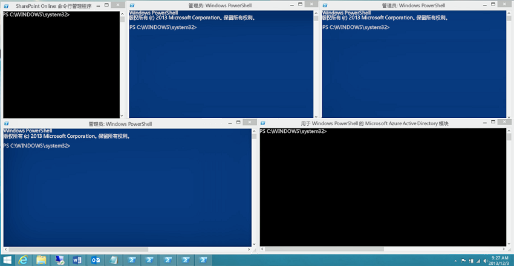

# <a name="connect-to-all-office-365-services-in-a-single-windows-powershell-window"></a><span data-ttu-id="f77db-103">在单个 Windows PowerShell 窗口中连接所有 Office 365 服务</span><span class="sxs-lookup"><span data-stu-id="f77db-103">Connect to all Office 365 services in a single Windows PowerShell window</span></span>

 <span data-ttu-id="f77db-104">**摘要：** 而不是管理在单独的 PowerShell 控制台窗口中的不同 Office 365 服务，您可以连接到所有 Office 365 服务，并从单个控制台窗口管理它们。</span><span class="sxs-lookup"><span data-stu-id="f77db-104">**Summary:** Instead of managing different Office 365 services in separate PowerShell console windows, you can connect to all Office 365 services and manage them from single console window.</span></span>
  
<span data-ttu-id="f77db-p101">使用 PowerShell 管理 Office 365，时，可能需要与 Office 365 管理中心、 SharePoint Online、 Exchange Online、 Skype online 业务和安全&amp;合规性中心。使用单独的 Windows PowerShell 会话中的五个不同的连接方法，您的桌面无法如下所示：</span><span class="sxs-lookup"><span data-stu-id="f77db-p101">When you use PowerShell to manage Office 365, it is possible to have up to five different Windows PowerShell sessions open at the same time corresponding to Office 365 admin center, SharePoint Online, Exchange Online, Skype for Business Online, and the Security &amp; Compliance Center. With five different connection methods in separate Windows PowerShell sessions, your desktop could look like this:</span></span>
  

  
<span data-ttu-id="f77db-p102">这不是最佳用于管理 Office 365，因为您不能跨服务管理这些五个窗口之间进行数据交换。本主题介绍如何使用 Windows PowerShell 从其管理 Office 365、 业务联机状态，Exchange Online 中，SharePoint online，Skype 和安全性的单个实例&amp;合规性中心。</span><span class="sxs-lookup"><span data-stu-id="f77db-p102">This is not optimal for managing Office 365 because you can't exchange data among those five windows for cross-service management. This topic describes how to use a single instance of Windows PowerShell from which you can manage Office 365, Skype for Business Online, Exchange Online, SharePoint Online, and the Security &amp; Compliance Center.</span></span>

## <a name="before-you-begin"></a><span data-ttu-id="f77db-110">准备工作</span><span class="sxs-lookup"><span data-stu-id="f77db-110">Before you begin</span></span>
<span data-ttu-id="f77db-111"><a name="BeforeYouBegin"> </a></span><span class="sxs-lookup"><span data-stu-id="f77db-111"></span></span>

<span data-ttu-id="f77db-112">您可以从 Windows PowerShell 的单个实例来管理所有 Office 365 之前，请考虑以下先决条件：</span><span class="sxs-lookup"><span data-stu-id="f77db-112">Before you can manage all of Office 365 from a single instance of Windows PowerShell, consider the following prerequisites:</span></span>
  
- <span data-ttu-id="f77db-p103">Office 365 工作或学校了用于这些过程需要为 Office 365 管理员角色的成员的帐户。有关详细信息，请参阅[有关 Office 365 管理员角色](https://go.microsoft.com/fwlink/p/?LinkId=532367)。此 Office 365 PowerShell 中，不一定是所有其他 Office 365 服务的要求。</span><span class="sxs-lookup"><span data-stu-id="f77db-p103">The Office 365 work or school account that you use for these procedures needs to be a member of an Office 365 admin role. For more information, see [About Office 365 admin roles](https://go.microsoft.com/fwlink/p/?LinkId=532367). This a requirement for Office 365 PowerShell, not necessarily for all other Office 365 services.</span></span>
    
- <span data-ttu-id="f77db-116">您可以使用以下 64 位版本的 Windows：</span><span class="sxs-lookup"><span data-stu-id="f77db-116">You can use the following 64-bit versions of Windows:</span></span>
    
  - <span data-ttu-id="f77db-117">Windows 10</span><span class="sxs-lookup"><span data-stu-id="f77db-117">Windows 10</span></span>
    
  - <span data-ttu-id="f77db-118">Windows 8.1 或 Windows 8</span><span class="sxs-lookup"><span data-stu-id="f77db-118">Windows 8.1 or Windows 8</span></span>
    
  - <span data-ttu-id="f77db-119">Windows Server 2016</span><span class="sxs-lookup"><span data-stu-id="f77db-119">Windows Server 2016</span></span>
    
  - <span data-ttu-id="f77db-120">Windows Server 2012 R2 或 Windows Server 2012</span><span class="sxs-lookup"><span data-stu-id="f77db-120">Windows Server 2012 R2 or Windows Server 2012</span></span>
    
  - <span data-ttu-id="f77db-121">Windows 7 Service Pack 1 (SP1)\*</span><span class="sxs-lookup"><span data-stu-id="f77db-121">Windows 7 Service Pack 1 (SP1)\*</span></span>
    
  - <span data-ttu-id="f77db-122">Windows Server 2008 R2 SP1\*</span><span class="sxs-lookup"><span data-stu-id="f77db-122">Windows Server 2008 R2 SP1\*</span></span>
    
    <span data-ttu-id="f77db-p104">\*您需要安装 Microsoft.NET Framework 4.5。*x* ，然后任一 Windows Management Framework 3.0 或 Windows Management Framework 4.0。有关详细信息，请参阅[安装.NET Framework](https://go.microsoft.com/fwlink/p/?LinkId=257868)和[Windows Management Framework 3.0](https://go.microsoft.com/fwlink/p/?LinkId=272757)或[Windows Management Framework 4.0](https://go.microsoft.com/fwlink/p/?LinkId=391344)。</span><span class="sxs-lookup"><span data-stu-id="f77db-p104">\* You need to install the Microsoft .NET Framework 4.5.*x* and then either the Windows Management Framework 3.0 or the Windows Management Framework 4.0. For more information, see [Installing the .NET Framework](https://go.microsoft.com/fwlink/p/?LinkId=257868) and [Windows Management Framework 3.0](https://go.microsoft.com/fwlink/p/?LinkId=272757) or [Windows Management Framework 4.0](https://go.microsoft.com/fwlink/p/?LinkId=391344).</span></span>
    
    <span data-ttu-id="f77db-125">您需要业务 Online 模块和 Office 365 模块之一由于 Skype 的要求使用 64 位版本的 Windows。</span><span class="sxs-lookup"><span data-stu-id="f77db-125">You need to use a 64-bit version of Windows because of the requirements for the Skype for Business Online module and one of the Office 365 modules.</span></span>
    
- <span data-ttu-id="f77db-126">您需要安装所需的 Azure AD 模块 SharePoint Online 和 Skype 业务 online:</span><span class="sxs-lookup"><span data-stu-id="f77db-126">You need to install the modules that are required for Azure AD, SharePoint Online, and Skype for Business Online:</span></span>
    
   - [<span data-ttu-id="f77db-127">Azure Active Directory V2</span><span class="sxs-lookup"><span data-stu-id="f77db-127">Azure Active Directory V2</span></span>](connect-to-office-365-powershell.md##connect-with-the-azure-active-directory-powershell-for-graph-module)
   - [<span data-ttu-id="f77db-128">SharePoint Online 命令行管理程序</span><span class="sxs-lookup"><span data-stu-id="f77db-128">SharePoint Online Management Shell</span></span>](https://go.microsoft.com/fwlink/p/?LinkId=255251)
   - [<span data-ttu-id="f77db-129">Skype for Business 联机 Windows PowerShell 模块</span><span class="sxs-lookup"><span data-stu-id="f77db-129">Skype for Business Online, Windows PowerShell Module</span></span>](https://go.microsoft.com/fwlink/p/?LinkId=532439)
    
-  <span data-ttu-id="f77db-p105">Windows PowerShell 需要配置的业务 Online、 Exchange Online 和安全的 Skype 运行签名的脚本&amp;合规性中心。若要执行此操作，在提升的 Windows PowerShell 会话中运行以下命令 （通过选择**运行以管理员身份**打开 Windows PowerShell 窗口）。</span><span class="sxs-lookup"><span data-stu-id="f77db-p105">Windows PowerShell needs to be configured to run signed scripts for Skype for Business Online, Exchange Online, and the Security &amp; Compliance Center. To do this, run the following command in an elevated Windows PowerShell session (a Windows PowerShell window you open by selecting **Run as administrator**).</span></span>
    
  ```
  Set-ExecutionPolicy RemoteSigned
  ```

## <a name="connection-steps-when-using-a-password"></a><span data-ttu-id="f77db-132">使用密码时的连接步骤</span><span class="sxs-lookup"><span data-stu-id="f77db-132">Connection steps when using a password</span></span>
<span data-ttu-id="f77db-133"><a name="ConnStepsPassword"> </a></span><span class="sxs-lookup"><span data-stu-id="f77db-133"></span></span>

<span data-ttu-id="f77db-134">下面是连接到单个 PowerShell 窗口中的所有服务的步骤。</span><span class="sxs-lookup"><span data-stu-id="f77db-134">Here are the steps to connect to all the services in a single PowerShell window.</span></span>
  
1. <span data-ttu-id="f77db-135">以管理员身份 （使用**以管理员身份运行**） 打开 Windows PowerShell。</span><span class="sxs-lookup"><span data-stu-id="f77db-135">Open Windows PowerShell as an administrator (use **Run as administrator**).</span></span>
    
2. <span data-ttu-id="f77db-136">运行此命令，并输入您的 Office 365 工作或学校帐户凭据。</span><span class="sxs-lookup"><span data-stu-id="f77db-136">Run this command, and enter your Office 365 work or school account credentials.</span></span>
    
  ```
  $credential = Get-Credential
  ```

3. <span data-ttu-id="f77db-137">运行此命令可连接到 Azure Active Directory (AD) 使用 Azure Active Directory PowerShell 图模块。</span><span class="sxs-lookup"><span data-stu-id="f77db-137">Run this command to connect to Azure Active Directory (AD) using the Azure Active Directory PowerShell for Graph module.</span></span>
    
  ```
   Connect-AzureAD -Credential $credential
  ```
  
  <span data-ttu-id="f77db-138">另外，如果您正在使用 Microsoft Azure Active Directory 模块用于 Windows PowerShell 模块，则运行此命令。</span><span class="sxs-lookup"><span data-stu-id="f77db-138">Alternately, if you are using the Microsoft Azure Active Directory Module for Windows PowerShell module, run this command.</span></span>
      
  ```
   Connect-MsolService -Credential $credential
 ```

4. <span data-ttu-id="f77db-p106">运行以下命令以连接到 SharePoint Online。替换_\<domainhost >_ 与您的域的实际值。例如，对于"litwareinc.onmicrosoft.com" _ \<domainhost >_ 值是"litwareinc"。</span><span class="sxs-lookup"><span data-stu-id="f77db-p106">Run these commands to connect to SharePoint Online. Replace  _\<domainhost>_ with the actual value for your domain. For example, for "litwareinc.onmicrosoft.com", the  _\<domainhost>_ value is "litwareinc".</span></span>
    
  ```
  Import-Module Microsoft.Online.SharePoint.PowerShell -DisableNameChecking
  Connect-SPOService -Url https://<domainhost>-admin.sharepoint.com -credential $credential
  ```

5. <span data-ttu-id="f77db-p107">运行以下命令以连接到 Skype 业务 online。有关增加一条警告`WSMan NetworkDelayms`值应首次连接，并应忽略。</span><span class="sxs-lookup"><span data-stu-id="f77db-p107">Run these commands to connect to Skype for Business Online. A warning about increasing the `WSMan NetworkDelayms` value is expected the first time you connect and should be ignored.</span></span>
    
  ```
  Import-Module SkypeOnlineConnector
  $sfboSession = New-CsOnlineSession -Credential $credential
  Import-PSSession $sfboSession
  ```

6. <span data-ttu-id="f77db-144">运行以下命令以连接到 Exchange Online。</span><span class="sxs-lookup"><span data-stu-id="f77db-144">Run these commands to connect to Exchange Online.</span></span>
    
  ```
  $exchangeSession = New-PSSession -ConfigurationName Microsoft.Exchange -ConnectionUri "https://outlook.office365.com/powershell-liveid/" -Credential $credential -Authentication "Basic" -AllowRedirection
  Import-PSSession $exchangeSession
  ```

7. <span data-ttu-id="f77db-145">运行以下命令以连接到安全性&amp;合规性中心。</span><span class="sxs-lookup"><span data-stu-id="f77db-145">Run these commands to connect to the Security &amp; Compliance Center.</span></span>
    
  ```
  $SccSession = New-PSSession -ConfigurationName Microsoft.Exchange -ConnectionUri https://ps.compliance.protection.outlook.com/powershell-liveid/ -Credential $credential -Authentication "Basic" -AllowRedirection
  Import-PSSession $SccSession -Prefix cc
  ```

<span data-ttu-id="f77db-p108">以下在一个块是所有命令时使用 Azure Active Directory PowerShell 图模块。指定您的域主机的名称，然后一次运行所有这些。</span><span class="sxs-lookup"><span data-stu-id="f77db-p108">Here are all the commands in a single block when using the Azure Active Directory PowerShell for Graph module. Specify the name of your domain host, and then run them all at one time.</span></span>
  
```
$domainHost="<domain host name, such as litware for litwareinc.onmicrosoft.com>"
$credential = Get-Credential
Connect-AzureAD -Credential $credential
Import-Module Microsoft.Online.SharePoint.PowerShell -DisableNameChecking
Connect-SPOService -Url https://$domainHost-admin.sharepoint.com -credential $credential
Import-Module SkypeOnlineConnector
$sfboSession = New-CsOnlineSession -Credential $credential
Import-PSSession $sfboSession
$exchangeSession = New-PSSession -ConfigurationName Microsoft.Exchange -ConnectionUri "https://outlook.office365.com/powershell-liveid/" -Credential $credential -Authentication "Basic" -AllowRedirection
Import-PSSession $exchangeSession
$SccSession = New-PSSession -ConfigurationName Microsoft.Exchange -ConnectionUri https://ps.compliance.protection.outlook.com/powershell-liveid/ -Credential $credential -Authentication "Basic" -AllowRedirection
Import-PSSession $SccSession -Prefix cc
```

<span data-ttu-id="f77db-p109">另外，以下是所有命令在一个块时使用的 Microsoft Azure Active Directory 模块用于 Windows PowerShell 模块。指定您的域主机的名称，然后一次运行所有这些。</span><span class="sxs-lookup"><span data-stu-id="f77db-p109">Alternately, here are all the commands in a single block when using the Microsoft Azure Active Directory Module for Windows PowerShell module. Specify the name of your domain host, and then run them all at one time.</span></span>
  
```
$domainHost="<domain host name, such as litware for litwareinc.onmicrosoft.com>"
$credential = Get-Credential
Connect-MsolService -Credential $credential
Import-Module Microsoft.Online.SharePoint.PowerShell -DisableNameChecking
Connect-SPOService -Url https://$domainHost-admin.sharepoint.com -credential $credential
Import-Module SkypeOnlineConnector
$sfboSession = New-CsOnlineSession -Credential $credential
Import-PSSession $sfboSession
$exchangeSession = New-PSSession -ConfigurationName Microsoft.Exchange -ConnectionUri "https://outlook.office365.com/powershell-liveid/" -Credential $credential -Authentication "Basic" -AllowRedirection
Import-PSSession $exchangeSession
$SccSession = New-PSSession -ConfigurationName Microsoft.Exchange -ConnectionUri https://ps.compliance.protection.outlook.com/powershell-liveid/ -Credential $credential -Authentication "Basic" -AllowRedirection
Import-PSSession $SccSession -Prefix cc
```

<span data-ttu-id="f77db-150">当您准备要关闭 Windows PowerShell 窗口时，运行此命令可删除到 Skype 活动会话业务 Online、 Exchange Online、 SharePoint Online 和安全性的&amp;合规性中心：</span><span class="sxs-lookup"><span data-stu-id="f77db-150">When you are ready to close down the Windows PowerShell window, run this command to remove the active sessions to Skype for Business Online, Exchange Online, SharePoint Online, and the Security &amp; Compliance Center:</span></span>
  
```
Remove-PSSession $sfboSession ; Remove-PSSession $exchangeSession ; Remove-PSSession $SccSession ; Disconnect-SPOService
```

## <a name="connection-steps-when-using-multi-factor-authentication"></a><span data-ttu-id="f77db-151">使用多因素身份验证时的连接步骤</span><span class="sxs-lookup"><span data-stu-id="f77db-151">Connection steps when using multi-factor authentication</span></span>
<span data-ttu-id="f77db-152"><a name="ConnStepsMFA"> </a></span><span class="sxs-lookup"><span data-stu-id="f77db-152"></span></span>

<span data-ttu-id="f77db-p110">下面是在一个块来连接到 Azure AD 的所有命令 SharePoint Online 和 Skype 的 Buiness 单个窗口中使用多因素身份验证。指定全局管理员帐户的用户主体名称 (UPN) 名称和域主机名，然后再一次运行所有这些。</span><span class="sxs-lookup"><span data-stu-id="f77db-p110">Here are all the commands in a single block to connect to Azure AD, SharePoint Online, and Skype for Buiness using multi-factor authentication in a single window. Specify the user principal name (UPN) name of a global administrator account and your domain host name, and then run them all at one time.</span></span>

````
$acctName="<UPN of a global administrator account>"
$domainHost="<domain host name, such as litware for litwareinc.onmicrosoft.com>"
#Azure Active Directory
Connect-AzureAD
#SharePoint Online
Connect-SPOService -Url https://$domainHost-admin.sharepoint.com
#Skype for Business Online
$sfboSession = New-CsOnlineSession -UserName $acctName
Import-PSSession $sfboSession
````

<span data-ttu-id="f77db-155">另外，以下是出现使用 Microsoft Azure Active Directory 模块用于 Windows PowerShell 模块的所有命令。</span><span class="sxs-lookup"><span data-stu-id="f77db-155">Alternately, here are all the commands when using the Microsoft Azure Active Directory Module for Windows PowerShell module.</span></span>

````
$acctName="<UPN of a global administrator account>"
$domainHost="<domain host name, such as litware for litwareinc.onmicrosoft.com>"
#Azure Active Directory
Connect-MsolService
#SharePoint Online
Connect-SPOService -Url https://$domainHost-admin.sharepoint.com
#Skype for Business Online
$sfboSession = New-CsOnlineSession -UserName $acctName
Import-PSSession $sfboSession
````

<span data-ttu-id="f77db-156">Exchange Online 和安全&amp;合规性中心，请参阅使用多因素身份验证进行连接的以下主题：</span><span class="sxs-lookup"><span data-stu-id="f77db-156">For Exchange Online and the Security &amp; Compliance Center, see the following topics to connect using multi-factor authentication:</span></span>

- [<span data-ttu-id="f77db-157">使用多重身份验证连接到 Exchange Online PowerShell</span><span class="sxs-lookup"><span data-stu-id="f77db-157">Connect to Exchange Online PowerShell using multi-factor authentication</span></span>](https://docs.microsoft.com/powershell/exchange/exchange-online/connect-to-exchange-online-powershell/mfa-connect-to-exchange-online-powershell)
- [<span data-ttu-id="f77db-158">连接到 Office 365 安全性和合规性中心 PowerShell 使用多因素身份验证</span><span class="sxs-lookup"><span data-stu-id="f77db-158">Connect to Office 365 Security & Compliance Center PowerShell using multi-factor authentication</span></span>](https://docs.microsoft.com/powershell/exchange/office-365-scc/connect-to-scc-powershell/mfa-connect-to-scc-powershell?view=exchange-ps)
 
<span data-ttu-id="f77db-159">请注意，在两种情况下，必须使用单独的 Exchange Online 远程 PowerShell 模块会话进行连接。</span><span class="sxs-lookup"><span data-stu-id="f77db-159">Note that in both cases, you must connect using separate sessions of the Exchange Online Remote PowerShell Module.</span></span>


## <a name="new-to-office-365"></a><span data-ttu-id="f77db-160">刚开始接触 Office 365？</span><span class="sxs-lookup"><span data-stu-id="f77db-160">New to Office 365?</span></span>

[!INCLUDE [LinkedIn Learning Info](../common/office/linkedin-learning-info.md)]

## <a name="see-also"></a><span data-ttu-id="f77db-161">另请参阅</span><span class="sxs-lookup"><span data-stu-id="f77db-161">See also</span></span>

- [<span data-ttu-id="f77db-162">连接到 Office 365 PowerShell</span><span class="sxs-lookup"><span data-stu-id="f77db-162">Connect to Office 365 PowerShell</span></span>](connect-to-office-365-powershell.md)
- [<span data-ttu-id="f77db-163">使用 Office 365 PowerShell 管理 SharePoint Online</span><span class="sxs-lookup"><span data-stu-id="f77db-163">Manage SharePoint Online with Office 365 PowerShell</span></span>](manage-sharepoint-online-with-office-365-powershell.md)
- [<span data-ttu-id="f77db-164">使用 Office 365 PowerShell 管理用户帐户和许可证</span><span class="sxs-lookup"><span data-stu-id="f77db-164">Manage user accounts and licenses with Office 365 PowerShell</span></span>](manage-user-accounts-and-licenses-with-office-365-powershell.md)
- [<span data-ttu-id="f77db-165">使用 Windows PowerShell 在 Office 365 中创建报告</span><span class="sxs-lookup"><span data-stu-id="f77db-165">Use Windows PowerShell to create reports in Office 365</span></span>](use-windows-powershell-to-create-reports-in-office-365.md)
