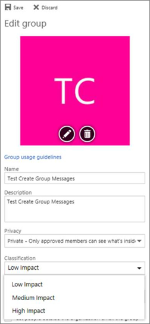

# <a name="manage-office-365-groups-with-powershell"></a>使用 PowerShell 管理 Office 365 组

 *上次更新 18 年 4 月，2018* 
  
本文提供的 Microsoft PowerShell 组执行常见管理任务的步骤。它还列出了组的 PowerShell cmdlet。有关管理 SharePoint 网站的信息，请参阅[管理工作组网站和使用 PowerShell 通信网站](https://support.office.com/article/52ecc2ab-88c3-486e-b8ff-ef6a968ccd87)。
  
## <a name="common-tasks-for-managing-office-365-groups"></a>管理 Office 365 组的常见任务

- [将通讯组列表升级到 Outlook 中的 Office 365 组](https://support.office.com/article/787d7a75-e201-46f3-a242-f698162ff09f)
    
- [管理可创建 Office 365 组的人员](https://support.office.com/article/4c46c8cb-17d0-44b5-9776-005fced8e618)
    
- [管理对 Office 365 组的来宾访问](https://support.office.com/article/7c713d74-a144-4eab-92e7-d50df526ff96)
    
- [动态在 Azure Active Directory 中管理组](https://go.microsoft.com/fwlink/?linkid=847632)
    
- 将数百或数千个用户添加到 Office 365 组，请使用[添加 UnifiedGroupLinks cmdlet](https://go.microsoft.com/fwlink/p/?LinkId=616191)。
    
### <a name="link-to-your-office-365-groups-usage-guidelines"></a>链接到您的 Office 365 组使用指南
<a name="BK_LinkToGuideLines"> </a>

当用户[创建 Outlook 中的组](https://support.office.com/article/04d0c9cf-6864-423c-a380-4fa858f27102)，您可以显示其指向您的组织使用指南的链接。例如，如果您需要一个特定的前缀，或要添加到组名称后缀。
  
使用 Azure PowerShell Active Directory 用户指向 Office 365 组的组织使用指南。签出[Azure Active Directory cmdlet 配置组设置](https://go.microsoft.com/fwlink/?LinkID=827484)，并按照**创建目录级别的设置**以定义用法准则超链接中的步骤。一次运行 AAD cmdlet 时，用户将看到指南链接时不创建或编辑组在 Outlook 中。 
  

  

  
### <a name="allow-users-to-send-as-the-office-365-group"></a>为 Office 365 组允许用户发送
<a name="BK_LinkToGuideLines"> </a>

您也可以在 Exchange 管理中心中执行此操作。请参阅[允许成员作为发送或代表组发送邮件](https://support.office.com/article/0ad41414-0cc6-4b97-90fb-06bec7bcf590)。
  
如果您想要启用"发送为"在 Office 365 组，使用[Add-recipientpermission](https://go.microsoft.com/fwlink/p/?LinkId=723960)和[Get RecipientPermission](https://go.microsoft.com/fwlink/p/?LinkId=733239) cmdlet 可将其配置。一旦您启用此设置，Office 365 组用户可以使用 Outlook 或 Outlook web 上发送并答复电子邮件与 Office 365 组中。用户可以转到组中，创建新的电子邮件，并将"发送为"字段更改为组的电子邮件地址。 
  
> [!NOTE]
> 您需要将组电子邮件地址添加到**抄送**字段中，在您撰写"发送作为"电子邮件，以便邮件发送到组，并显示在组对话中。 
  
此时，更新邮箱策略的唯一方法是通过[PowerShell](https://technet.microsoft.com/en-us/library/cc482986.aspx)。
  
- 使用此命令将设置组的别名。
    
  ```
  $groupAlias = "TestSendAs"
  ```

- 使用此命令将设置的用户别名。
    
  ```
  $userAlias = "User"
  ```

- 使用此命令将 groupalias 传递给 Get-recipient cmdlet，以获取收件人的详细信息。
    
  ```
  $groupsRecipientDetails = Get-Recipient -RecipientTypeDetails groupmailbox -Identity $groupAlias
  ```

- 然后目标收件人姓名 （组名称） 需要传递给 Add-recipientpermission cmdlet。会为其授予 sendas 权限 useralias 将分配给-受信任项参数。
    
  ```
  Add-RecipientPermission -Identity $groupsRecipientDetails.Name -Trustee $userAlias -AccessRights SendAs
  ```

- 后执行 cmdlet 时，用户可以转到 Outlook 或 Outlook web 上的为组中，通过**从**字段中添加组电子邮件地址发送。 
    
### <a name="create-classifications-for-office-groups-in-your-organization"></a>在您的组织中创建 Office 组分类
<a name="BKMK_CreateClassification"> </a>

您可以创建您的组织中的用户创建 Office 365 组时可以设置的分类。例如，您可以允许用户为他们创建的组设置"标准"、"Secret"和"顶部机密"。组分类未设置默认情况下，您需要创建用户将其设置的顺序。使用 Azure Active Directory PowerShell 用户指向 Office 365 组的组织使用指南。
  
签出[Azure Active Directory cmdlet 配置组设置](https://go.microsoft.com/fwlink/?LinkID=827484)，并按照**创建设置目录级别**定义的分类的 Office 365 组中的步骤操作。 
  
```
$setting["ClassificationList"] = "Low Impact, Medium Impact, High Impact"
```

若要关联到您可以使用每个分类的说明设置属性*ClassificationDescriptions*定义。 
  
```
$setting["ClassificationDescriptions"] ="Classification:Description,Classification:Description", where Classification matches the strings in the ClassificationList.
```

例如：
  
```
$setting["ClassificationDescriptions"] = "Low Impact: General communication, Medium Impact: Company internal data , High Impact: Data that has regulatory requirements"
```

运行上述的 Azure Active Directory cmdlet，设置您的分类之后，运行[设置 UnifiedGroup](https://go.microsoft.com/fwlink/?LinkID=616189) cmdlet，如果您想要设置一组特定的分类。 
  
```
Set-UnifiedGroup <LowImpactGroup@constoso.com> -Classification <LowImpact> 
```

或创建具有一个分类的新组。
  
```
New-UnifiedGroup <HighImpactGroup@constoso.com> -Classification <HighImpact> -AccessType <Public> 
```

检查出[与 Exchange Online Using PowerShell](https://go.microsoft.com/fwlink/?LinkID=402831)和[连接到 Exchange Online PowerShell 中](https://go.microsoft.com/fwlink/?LinkID=722415)使用 Exchange Online PowerShell 中的更多详细信息。 
  
一旦启用这些设置，则组的所有者将能够从在 Outlook 中的 Web 和 Outlook 中，在下拉菜单中选择一个分类并将其保存从**编辑**组页。 
  

  
### <a name="hide-office-365-groups-from-gal"></a>隐藏 GAL 中的 Office 365 组
<a name="BKMK_CreateClassification"> </a>

您可以指定是否在全局地址列表 (GAL) 和您的组织中的其他列表中会出现一个 Office 365 组。例如，如果您不想要的地址列表中显示的法律部门组，可以停止在 GAL 中显示的组。运行 Set-Unified 组 commandlet 隐藏类似的地址列表的组：
  
```
  Set-UnifiedGroup -Identity "Legal Department" -HiddenFromAddressListsEnabled $true
```

### <a name="allow-only-internal-users-to-send-message-to-office-365-group"></a>只允许内部用户向 Office 365 组发送消息
<a name="BKMK_CreateClassification"> </a>

如果您不希望用户从其他组织到 Office 365 组发送电子邮件，您可以更改组的设置。它将只允许内部用户向组发送电子邮件。如果外部用户尝试向该组发送消息，它们将被拒绝。
  
运行设置 UnifiedGroup commandlet 更新此设置，如下所示：
  
```
Set-UnifiedGroup -Identity "Internal senders only" - RequireSenderAuthenticationEnabled $true
```

### <a name="add-mailtips-to-the-office-365-groups"></a>向 Office 365 的组添加邮件提示
<a name="BKMK_CreateClassification"> </a>

只要尝试向 Office 365 组发送电子邮件发件人，可向他显示邮件提示。
  
运行 Set-Unified 组 commandlet 向组添加邮件提示：
  
```
Set-UnifiedGroup -Identity "MailTip Group" -MailTip "This group has a MailTip"
```

邮件提示，以及您还可以设置 MailTipTranslations，从指定的其他语言邮件提示。假设您想要有西班牙语翻译，然后运行以下命令：
  
```
Set-UnifiedGroup -Identity "MailaTip Group" -MailTip "This group has a MailTip" -MailTipTranslations "@{Add="ES:Esta caja no se supervisa."
```

### <a name="change-display-name-of-the-office-365-group"></a>更改 Office 365 组的显示名称
<a name="BKMK_CreateClassification"> </a>

显示名称指定 Office 365 组的名称。Exchange 管理员中心或 o365 管理门户中，您可以看到此名称。您可以编辑组的显示名称，或通过运行设置 UnifiedGroup 命令分配现有 Office 365 组的显示名称：
  
```
Set-UnifiedGroup -Identity "mygroup@contoso.com" -DisplayName "My new group"
```

### <a name="manage-user-photos-in-office-365-groups"></a>管理 Office 365 组中的用户照片
<a name="BKMK_CreateClassification"> </a>

| |
|**Cmdlet 名称**|**说明**|
|:-----|:-----|
|[Get UserPhoto](https://go.microsoft.com/fwlink/p/?LinkId=536510) <br/> |用于查看有关帐户相关联的用户照片的信息。用户照片存储在 Active Directory  <br/> |
|[设置 UserPhoto](https://go.microsoft.com/fwlink/p/?LinkId=536511) <br/> |用于将用户照片关联的帐户。用户照片存储在 Active Directory  <br/> |
|[删除 UserPhoto](https://go.microsoft.com/fwlink/p/?LinkId=536512) <br/> |删除 Office 365 组中的照片  <br/> |
   
### <a name="change-the-default-setting-of-office-365-groups-for-outlook-to-public-or-private"></a>更改用于 Outlook 的 Office 365 组的默认设置为 Public 或 Private
<a name="BKMK_CreateClassification"> </a>

Office 365 在 Outlook 中创建组为私有默认情况下。如果您的组织的 Outlook 默认情况下 （或回专用） 创建公共为 Office 365 组，请使用以下 PowerShell cmdlet 的语法：
  
 `Set-OrganizationConfig -DefaultGroupAccessType Public`
  
若要设置为 Private:
  
 `Set-OrganizationConfig -DefaultGroupAccessType Private`
  
若要验证设置： 
  
 `Get-OrganizationConfig | ft DefaultGroupAccessType`
  
若要了解详细信息，请参阅[Set-organizationconfig](https://go.microsoft.com/fwlink/?linkid=871816)和[Get-organizationconfig](https://go.microsoft.com/fwlink/?linkid=871817)。
  
## <a name="office-365-groups-cmdlets"></a>Office 365 组 cmdlet

以下 cmdlet 最近做可用到 Office 365 组。如果您不能使用这些，您的 Office 365 订阅尚未更新利用此功能您尚未。检查邮件中心和[Office 365 路线图](http://roadmap.office.com/en-us)。
  
| |
|**Cmdlet 名称**|**说明**|
|:-----|:-----|
|[Get-UnifiedGroup](https://go.microsoft.com/fwlink/p/?LinkId=616182) <br/> |使用此 cmdlet，以查找现有 Office 365 组，并查看组对象的属性  <br/> |
|[Set-UnifiedGroup](https://go.microsoft.com/fwlink/p/?LinkId=616189) <br/> |更新特定的 Office 365 组的属性  <br/> |
|[New-UnifiedGroup](https://go.microsoft.com/fwlink/p/?LinkId=616183) <br/> |创建新的 Office 365 组。此 cmdlet 提供了一组最少的参数，设置扩展属性的值使用集 UnifiedGroup 创建新组后  <br/> |
|[Remove-UnifiedGroup](https://go.microsoft.com/fwlink/p/?LinkId=616186) <br/> |删除现有的 Office 365 组  <br/> |
|[Get UnifiedGroupLinks](https://go.microsoft.com/fwlink/p/?LinkId=616194) <br/> |检索为 Office 365 组的成员资格和所有者信息  <br/> |
|[Add-UnifiedGroupLinks](https://go.microsoft.com/fwlink/p/?LinkId=616191) <br/> |添加十万或数千个用户或新的所有者，到现有 Office 365 组  <br/> |
|[Remove-UnifiedGroupLinks](https://go.microsoft.com/fwlink/p/?LinkId=616195) <br/> |删除现有的 Office 365 组的所有者和成员  <br/> |
   
## <a name="for-more-information"></a>更多信息

- [使用 PowerShell](https://technet.microsoft.com/en-us/library/cc482986.aspx)
    
- [向邮箱应用或删除 Outlook Web App 邮箱策略](https://technet.microsoft.com/en-us/library/dd876884%28v=exchg.150%29.aspx)
    
- [Office 365 组命名策略](https://support.office.com/article/6ceca4d3-cad1-4532-9f0f-d469dfbbb552)
    

