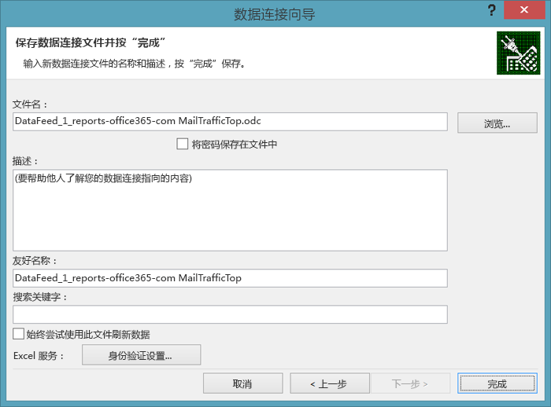
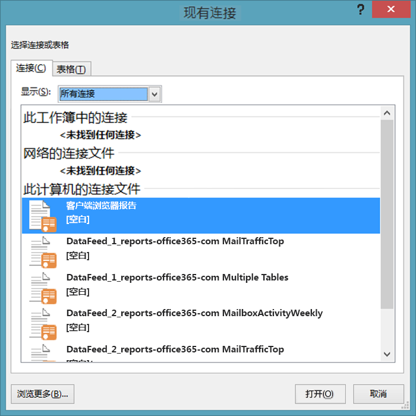

# <a name="using-excel-to-retrieve-office-365-reporting-data"></a><span data-ttu-id="9a302-103">使用 Excel 检索 Office 365 报告数据</span><span class="sxs-lookup"><span data-stu-id="9a302-103">Using Excel to Retrieve Office 365 Reporting Data</span></span>

 <span data-ttu-id="9a302-104">**摘要：**使用 Microsoft Excel 中的 oData 功能检索 Office 365 部署的详细报表信息。</span><span class="sxs-lookup"><span data-stu-id="9a302-104">Summary: Use the oData feature in Microsoft Excel to retrieve detailed reporting information for your deployment of Office 365</span></span>
  
<span data-ttu-id="9a302-p101">报告功能是系统管理的一个关键部分。Office 365 管理中心包含大量预定义的报告，你可以通过左侧导航的" **报告**"部分访问它们。有使用情况报告以及安全性和合规性报告。</span><span class="sxs-lookup"><span data-stu-id="9a302-p101">Reporting is a key part of system administration. The Office 365 Admin center includes a number of predefined reports, which you can access from the **Reports** section of the left navigation. There are usage reports and security and compliance reports.</span></span>
  
<span data-ttu-id="9a302-p102">您可用的报告取决于您使用的 Office 365 版本以及您启用的 Office 365 服务。有关详细信息，请参阅[报告]((https://technet.microsoft.com/zh-CN/library/office-365-reports.aspx))页。</span><span class="sxs-lookup"><span data-stu-id="9a302-p102">The reports available to you depend on the version of Office 365 you are using and which Office 365 services you have enabled. For more information, see the [Reports page]((https://technet.microsoft.com/zh-CN/library/office-365-reports.aspx)).</span></span>
  
<span data-ttu-id="9a302-p103">预定义的管理中心报告是非常不错的资源。它们便于查看邮箱使用情况或用户在在线会议上花费的分钟数等事项。但是，在 Office 365 域的详细分析方面，报告确实有其局限性。</span><span class="sxs-lookup"><span data-stu-id="9a302-p103">The pre-defined Admin center reports are an excellent resource. They make it easy to check on such things as mailbox usage or the number of minutes that your users have been spending in online conferences. However, when it comes to detailed analysis of your Office 365 domain, the reports do have their limitations.</span></span>
  
<span data-ttu-id="9a302-p104">解决此局限性的一种方法是使用 Windows PowerShell 或其他开发语言访问 Office 365 报告服务并创建自定义报告；您可以通过自定义报告指定从 Office 365 报告服务返回的数据（及数据量）。通过编写自定义报告，您还可以指定数据排序和分组的方式，以及保存数据的方式（如果适用）；例如，您可以将数据保存为 XML 格式或在 Excel 中可轻松导入的逗号分隔值格式。</span><span class="sxs-lookup"><span data-stu-id="9a302-p104">One way to work around these limitations is to use Windows PowerShell or another development language to access the Office 365 reporting service and create custom reports; custom reports give you the ability to dictate which data (and how much data) is returned from the Office 365 reporting service. By writing custom reports you can also specify how the data should be sorted and grouped, and, if applicable, how that data should be saved; for example, you can save data in XML format or in a comma-separated values format that can easily be imported in Excel.</span></span> 
  
<span data-ttu-id="9a302-p105">此外，通过自定义脚本/应用程序，你可以访问 Office 365 管理中心内不提供的报告。例如，管理中心可以向你说明你拥有多少个过时（非活动）邮箱，但不会告诉你在过去 30 天内哪些邮箱没人访问。自定义的 PowerShell 脚本可以告诉你这些信息。总体来说，虽然必须编写简短而且相对简单的 Windows PowerShell 小脚本，但作为回报，灵活性却得到显著提高。</span><span class="sxs-lookup"><span data-stu-id="9a302-p105">In addition, custom scripts/applications enable you to access reports that are not available in the Office 365 Admin center. For example, the Admin center can tell you how many stale mailboxes you have, but it can't tell which mailboxes haven't been accessed in the past 30 days. That is something that a custom PowerShell script can tell you. Taken together, this represents an enormous amount of flexibility in return for having to write a short and relatively-simple Windows PowerShell script.</span></span>
  
> [!VISUAL BASIC NOTE]<span data-ttu-id="9a302-119"> 有关详细信息，请参阅 Office 365 报告服务的[主页](https://msdn.microsoft.com/en-us/library/office/jj984325%28v=office.15%29.aspx)。</span><span class="sxs-lookup"><span data-stu-id="9a302-119"> For more information, see the [home page](https://msdn.microsoft.com/en-us/library/office/jj984325%28v=office.15%29.aspx) for the Office 365 reporting service.</span></span>
  
<span data-ttu-id="9a302-p106">为检索此数据，不必编写某种类型的代码。如果你的组织规模较大，并且需要限制返回的信息量和类型，那么这样做是值得的。但是，如果你的组织规模较小，且无需限制返回的信息量和类型，你可以考虑从 Excel 中打开 Office 365 报告。</span><span class="sxs-lookup"><span data-stu-id="9a302-p106">In order to retrieve this data, you do have to write code of some kind. That's worth it if you are a larger organization that needs to limit the amount and the type of information that gets returned. But if you're a smaller organization, and you don't need to limit the amount and type of information that gets returned, you might consider opening the Office 365 reports from within Excel itself.</span></span>
  
<span data-ttu-id="9a302-p107">但是，此处存在一些限制，主要限制是：你不能在数据返回之前筛选、分类、选择或以其他方式处理数据。你只能获取报告返回的默认数据集。在一些数据可能不够的情况下：例如，报告可能仅返回上月的数据，而不返回全年的数据。反之，在数据可能太多的一些情况下：你仅需要上月的数据，但可能返回全年的数据。</span><span class="sxs-lookup"><span data-stu-id="9a302-p107">However, there are a few limitations here, the primary one being this: you cannot filter, sort, select, or otherwise manipulate the data that before it gets returned. Instead, you simply get back the default set of data returned by the report. In some cases that might not be enough data. For example, the report might return data for, say, only the previous month and not for the entire year. Conversely, in other cases that might be too much data: you might get back data for the entire year even though you only want data for the previous month.</span></span>
  
<span data-ttu-id="9a302-128">要直接从 Excel 中打开 Office 365 报告，请完成以下过程：</span><span class="sxs-lookup"><span data-stu-id="9a302-128">To open an Office 365 report directly from within Excel, complete the following procedure:</span></span>
  
1. <span data-ttu-id="9a302-p108">首先在 Excel 中打开一个新工作表。在工作表中，依次单击" **数据** "、" **来自其他来源** "和" **来自 OData 数据馈送** "。将弹出" **数据连接向导** "对话框：</span><span class="sxs-lookup"><span data-stu-id="9a302-p108">Start by opening a new worksheet in Excel. On that worksheet, click **Data**, click **From Other Sources**, and then click **From OData Data Feed**. That brings up the **Data Connection Wizard** dialog box:</span></span>
    
     
  
2. <span data-ttu-id="9a302-p109">在" **连接到数据馈送** "页上，输入 **https://reports.office365.com/ecp/reportingwebservice/reporting.svc/** 作为数据馈送位置。请注意，你只能输入所示的基本 URL；不能添加任何 Select、Filter 或 Format 语句。如果你输入的是除基 URL 之外的其他信息，将不会返回任何数据；而只会看到下面的错误消息：</span><span class="sxs-lookup"><span data-stu-id="9a302-p109">On the **Connect to a Data Feed** page, enter **https://reports.office365.com/ecp/reportingwebservice/reporting.svc/** as the data feed location. Note that you can only enter the base URL as shown; you cannot add any Select, Filter, or Format statements. If you enter anything but the base URL you won't get back any data; instead, you'll simply see the following error message:</span></span>
    
     
  
3. <span data-ttu-id="9a302-p110">输入报告服务 URL 后，选择"登录凭据"下的"使用此用户名和密码"。在"用户名"框中，输入您的 Office 365 登录名（例如，admin@litwareinc.onmicrosoft.com）。在"密码"框中，输入您的 Office 365 登录密码，然后单击"下一步"。然后，Excel 将尝试使用提供的凭据连接到报告服务。</span><span class="sxs-lookup"><span data-stu-id="9a302-p110">After entering the reporting service URL, select **Use this name and password** under **Log on credentials**. In the **User Name** box, enter your Office 365 logon name (for example, admin@litwareinc.onmicrosoft.com). In the **Password** box, enter your Office 365 logon password and then click **Next**. Excel will then attempt to connect to the reporting service using the supplied credentials.</span></span>
    
4. <span data-ttu-id="9a302-p111">经过身份验证后，将看到“选择表”****页。选择要查看的报表（例如，“MailTrafficTop”****），再单击“下一步”****：</span><span class="sxs-lookup"><span data-stu-id="9a302-p111">After you have been authenticated, you’ll see the **Select Tables** page. Select the report that you’d like to view (for example, **MailTrafficTop**) and then click **Next**:</span></span>
    
     
  
    > [!NOTE]
    > <span data-ttu-id="9a302-p112">可以选择多个报告；这会将多个表格/图表添加到你的 Excel 电子表格中。你甚至可以创建一个组合多个报告中的数据的表格/图表；但我们在本篇介绍性文章中不进行讨论。</span><span class="sxs-lookup"><span data-stu-id="9a302-p112">It's possible to select multiple reports; that results in multiple tables/charts being added to your Excel spreadsheet. It's even possible to create a single table/chart that combines data from multiple reports. However, we won't discuss that in this introductory article.</span></span> 
  
5. <span data-ttu-id="9a302-147">单击"下一步"之后，将显示"保存数据连接文件并完成"页：</span><span class="sxs-lookup"><span data-stu-id="9a302-147">After clicking **Next** you'll be presented with the **Save Data Connection File and Finish** page:</span></span>
    
     
  
    <span data-ttu-id="9a302-p113">你无需输入任何信息。要检索数据，只需单击" **完成** "。但是，值得注意的是，默认情况下，Excel 会保存有关你所进行的每个数据连接的信息，此数据存储在" **我的数据源** "文件夹中：</span><span class="sxs-lookup"><span data-stu-id="9a302-p113">You don't have to enter any information here. All you need to do to retrieve your data is to click **Finish**. However, it's worth noting that, by default, Excel saves information about each data connection you make; this data is stored in your **My Data Sources** folder:</span></span>
    
     
  
    <span data-ttu-id="9a302-p114">这就是对话框为何包含具有"友好名称"和"搜索关键字"之类标签的文本框的原因；这些选项使您可以自定义这些数据连接。通过这种方式，您最终不会获取如下所示的全部数据源：</span><span class="sxs-lookup"><span data-stu-id="9a302-p114">That's why the dialog box includes text boxes with labels like **Friendly Name** and **Search Keywords**; these options give you the chance to customize these data connections. That way you do not end up with a whole bunch of data sources that look like these:</span></span>
    
  ```
  DataFeed_1_reports-office365-com ClientSoftwareBrowserDetail.odc
DataFeed_1_reports-office365-com MailTrafficTop.odc
DataFeed_1_reports-office365-com Multiple Tables.odc
DataFeed_2_reports-office365-com MailboxActivityWeekly.odc
DataFeed_2_reports-office365-com MailTrafficTop.odc
DataFeed_3_reports-office365-com ClientSoftwareBrowserDetail.odc
  ```

<span data-ttu-id="9a302-p115">如果你选中" **在文件中保存密码** "复选框，你将能够重新使用这些数据源。例如，假设你将数据连接保存为" **客户端浏览器报告** "。下次你需要有关用于访问 Office 365 域的 Web 浏览器的信息时，无需完成数据连接向导的所有操作。而只需打开 Excel，单击" **数据** "，然后单击" **现有源** "。在" **现有连接** "对话框中，选择所需的数据连接，然后单击" **确定** "：</span><span class="sxs-lookup"><span data-stu-id="9a302-p115">If you select the checkbox **Save password in file**, you'll be able to reuse these data feeds. For example, suppose you save a data connection as **Client Browser Report**. The next time you want information about the web browsers being used to access your Office 365 domain you don't have to walk through the data connection wizard. Instead, all you need to do is open Excel, click **Data**, and then click **Existing Sources**. Select the desired data connection in the **Existing Connections** dialog box and then click **OK**:</span></span>
    

  
<span data-ttu-id="9a302-161">在这种情况下，Excel 将为您进行连接并检索数据。</span><span class="sxs-lookup"><span data-stu-id="9a302-161">At that point, Excel will make the connection for you and retrieve the data.</span></span>
    
<span data-ttu-id="9a302-p116">请注意，这些 .ODC 文件是纯文本 XML 文件。这些纯文本 XML 文件中包含了你的 Office 365 用户名和密码：</span><span class="sxs-lookup"><span data-stu-id="9a302-p116">Note that these .ODC files are plain-text XML files. Included in these plain-text XML files are your Office 365 user name and password:</span></span>
    
<span data-ttu-id="9a302-164">\<odc:ConnectionString>Data Source=https://reports.office365.com/ecp/reportingwebservice/reporting.svc/;Namespaces to Include=*;Max Received Message Size=4398046511104;Integrated Security=Basic; **User ID=admin@litwareinc.onmicrosoft.com;Password=MYpassw0rd!**;Persist Security Info=false;Service Document Url=https://reports.office365.com/ecp/reportingwebservice/reporting.svc/\</odc:ConnectionString></span><span class="sxs-lookup"><span data-stu-id="9a302-164"><odc:ConnectionString>Data Source=https://reports.office365.com/ecp/reportingwebservice/reporting.svc/;Namespaces to Include=*;Max Received Message Size=4398046511104;Integrated Security=Basic; User ID=admin@litwareinc.onmicrosoft.com;Password=MYpassw0rd!;Persist Security Info=false;Service Document Url=https://reports.office365.com/ecp/reportingwebservice/reporting.svc/</odc:ConnectionString></span></span>
    
<span data-ttu-id="9a302-p117">如果你不希望将用户名和密码保存在纯文本文件中，则取消勾选标记为" **在文件中保存密码** "的框。但是，请注意，如果执行此操作，将无法重新使用这些数据连接。这是因为，如果没有用户名和密码，Office 365 将无法对你尝试登录服务进行身份验证。</span><span class="sxs-lookup"><span data-stu-id="9a302-p117">If you don't like the idea of saving your user name and password in a plain-text file, then don't check the box labeled **Save password in file**. If you do that, however, keep in mind that you won't be able to reuse these data connections. That's because, without the user name and password, Office 365 will not be able to authenticate your attempt to log on to the service.</span></span>
    
6. <span data-ttu-id="9a302-168">单击"保存数据连接文件并完成"页上的"完成"，将显示"导入数据"对话框：</span><span class="sxs-lookup"><span data-stu-id="9a302-168">Click **Finish** on the **Save Data Connection File and Finish** page you'll be presented with the **Import Data** dialog box:</span></span>
    
     
  
7. <span data-ttu-id="9a302-p118">选择视图选项（例如，“数据透视表”****），再单击“确定”****。如果一切顺利，数据将会导入，并显示在任意选定视图选项中：</span><span class="sxs-lookup"><span data-stu-id="9a302-p118">Select your view options (for example, **PivotTable Report**) and then click **OK**. If all goes well, your data will be imported and be presented in whichever view option you happened to choose:</span></span>
    
     
  
<span data-ttu-id="9a302-p119">如何处理这些数据完全由你决定。作为建议，你可以看一看[使用 OData 数据源创建 Excel Services 仪表板](https://technet.microsoft.com/en-us/library/jj873965%28v=office.15%29.aspx)。尽管该文章未使用 Office 365 报告服务，但提供了向新的仪表板添加筛选器和切片器等操作的一些有用技巧。</span><span class="sxs-lookup"><span data-stu-id="9a302-p119">What you do with that data is then entirely up to you. For some suggestions. take a look at [Create an Excel Services dashboard using an oData data feed](https://technet.microsoft.com/en-us/library/jj873965%28v=office.15%29.aspx). Although that article doesn't use the Office 365 reporting service, it does provide some handy hints for doing things like adding filters and slicers to your new dashboard.</span></span>
  
## <a name="see-also"></a><span data-ttu-id="9a302-177">另请参阅</span><span class="sxs-lookup"><span data-stu-id="9a302-177">See also</span></span>

#### 

[<span data-ttu-id="9a302-178">使用 Office 365 PowerShell 管理 Office 365</span><span class="sxs-lookup"><span data-stu-id="9a302-178">Manage Office 365 with Office 365 PowerShell</span></span>](manage-office-365-with-office-365-powershell.md)
  
[<span data-ttu-id="9a302-179">Office 365 PowerShell 入门</span><span class="sxs-lookup"><span data-stu-id="9a302-179">Getting started with Office 365 PowerShell</span></span>](getting-started-with-office-365-powershell.md)
  
[<span data-ttu-id="9a302-180">使用 Windows PowerShell 在 Office 365 中创建报告</span><span class="sxs-lookup"><span data-stu-id="9a302-180">Use Windows PowerShell to create reports in Office 365</span></span>](use-windows-powershell-to-create-reports-in-office-365.md)

