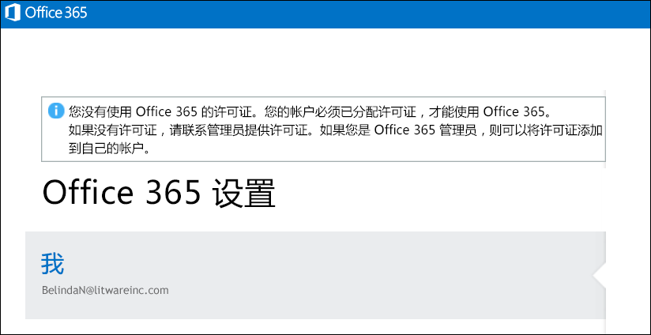

# <a name="view-licensed-and-unlicensed-users-with-office-365-powershell"></a>使用 Office 365 PowerShell 查看授权和未授权的用户

**摘要：**解释如何使用 Office 365 PowerShell 查看授权和未授权的用户帐户。
  
您的 Office 365 组织中的用户帐户可能已从组织提供的许可计划中分配到部分或全部可用的许可证，或者未分配到任何许可证。您可以使用 Office 365 PowerShell 快速查找您组织中的授权和未授权的用户。
  
## <a name="before-you-begin"></a>开始之前

- 若要执行此主题中的过程，必须连接到 Office 365 PowerShell。有关说明，请参阅[连接到 Office 365 PowerShell](connect-to-office-365-powershell.md)。
    
- 如果使用**Get MsolUser** cmdlet 而不使用_的所有_参数，返回前 500 个客户。
    
## <a name="the-short-version-instructions-without-explanations"></a>简版（说明不含解释）

此部分介绍的步骤未经任何渲染或过多解释。如果您有任何疑问或想了解更多信息，可以阅读本主题的其余部分。
  
若要查看组织中所有用户帐户及其授权状态的列表，请在 Office 365 PowerShell 中运行以下命令：
  
```
Get-MsolUser -All
```

若要查看组织中所有未授权用户帐户的列表，请运行以下命令：
  
```
Get-MsolUser -All -UnlicensedUsersOnly
```

若要查看组织中所有授权用户帐户的列表，请运行以下命令：
  
```
Get-MsolUser -All | where {$_.isLicensed -eq $true}
```

## <a name="the-long-version-instructions-with-detailed-explanations"></a>长版（说明附有详细解释）

Office 365 的用户帐户和 Office 365 许可证不需要有一对一的对应关系： 很可能有 Office 365 的用户不具有 Office 365 的许可证，而且很可能有未分配给用户的 Office 365 提供许可证。（事实上，单个用户帐户甚至可以将*多个*Office 365 份许可证。）当您创建新 Office 365 的用户帐户 （请参阅详细信息的文章[许可证 Office 365 提供用户与 Windows PowerShell](http://technet.microsoft.com/library/0ab9fcac-e5ea-4b5b-b72c-8c92c55565ac.aspx) ） 您无需将该用户指派一个许可证： 新用户将拥有有效帐户，但他 / 她将无法登录到 Office 365。如果用户尝试登录，他们将看到类似于这样：
  

  
同样，您可能有一个用户需要休假或者休产假/陪产假，因此将要延长时间。在这种情况下，您可以删除用户的许可证，但使用户帐户保持不变（即地址、电话号码等所有属性值保持不变）。这样，您可以将其许可证分配给其他人（例如，接替休假人员的临时工作人员）。用户回到工作岗位后，您可以向其签发新的许可证，他们将可以继续工作，就像从来没有离开过一样。
  
这就意味着，您确实可以使用户具有帐户但不具有许可证。反之亦然。
  
文章 [使用 Office 365 PowerShell 查看许可证和服务](view-licenses-and-services-with-office-365-powershell.md)介绍了如何确定您的组织购买的 Office 365 许可证数量，以及为用户分配的这些许可证数量。这是很重要的信息。但了解已向哪些用户分配了这些许可证，哪些用户没有分配许可证同样重要。本文将告诉您如何做到这一点。
  
您可能已经知道， **Get-MsolUser** cmdlet 将返回有关所有 Office 365 用户帐户的信息。需要有关所有 Office 365 用户的快速参考信息？请在 Office 365 PowerShell 中运行以下命令：
  
```
Get-MsolUser
```

反之，Get-MsolUser 将返回与以下类似的数据：
  
```
UserPrincipalName           DisplayName                     isLicensed
-----------------           -----------                     ----------
ZrinkaM@litwareinc.com      Zrinka Makovac                  True
BelindaN@litwareinc.com     Belinda Newman                  False
BonnieK@litwareinc.com      Bonnie Kearney                  True
FabriceC@litwareinc.com     Fabrice Canel                   True
AnneW@litwareinc.com        Anne Wallace                    True
AlexD@litwareinc.com        Alex Darrow                     True
```

正如您所见，返回的其中一个属性值是 **isLicensed** 属性的值。如果 **isLicensed** 为 `False`，则意味着用户没有 Office 365 的许可证。换句话说，如果您愿意，您可以滚动用户列表，并挑选出将 **isLicensed** 属性设置为 `False` 的用户。
  
无论如何，只要您的用户数量相对较少，即可滚动用户列表、尝试挑选出未许可用户。但是，如果您具有大量用户，滚动列表将会非常缓慢。（此外，根据 Windows PowerShell 的配置方式，可能完全无法这样做。这是由于对在 Windows PowerShell 控制台中一次可显示的输出行数存在限制。）
  
牢记这一点，列出未许可用户的更好方式是转为运行此命令：
  
```
Get-MsolUser -UnlicensedUsersOnly
```

该命令仅返回没有 Office 365 许可证的用户。即：
  
```
UserPrincipalName           DisplayName                     isLicensed
-----------------           -----------                     ----------
BelindaN@litwareinc.com     Belinda Newman                  False
```

可以看到，我们有一个未许可用户。如果我们仅需要 *已许可*  用户列表，应该怎么做？这略显复杂，但仅一点点复杂而已：
  
```
Get-MsolUser | Where-Object {$_.isLicensed -eq $true}
```

查找 **isLicensed** 属性为 `True` 的所有用户帐户的命令将返回与以下类似的信息：
  
```
UserPrincipalName           DisplayName                     isLicensed
-----------------           -----------                     ----------
ZrinkaM@litwareinc.com      Zrinka Makovac                  True
BonnieK@litwareinc.com      Bonnie Kearney                  True
FabriceC@litwareinc.com     Fabrice Canel                   True
AnneW@litwareinc.com        Anne Wallace                    True
AlexD@litwareinc.com        Alex Darrow                     True
```

可以看到，未返回 Belinda Newman 的信息。为什么没有返回？是的，原因是：Belinda 的帐户的 **isLicensed** 属性未设置为 `True`。
  
## <a name="see-also"></a>另请参阅
<a name="SeeAlso"> </a>

有关在这些步骤中使用的 cmdlet 的详细信息，请参阅下列主题：
  
- [Get-MsolUser](https://go.microsoft.com/fwlink/p/?LinkId=691547)
    
- [Where-Object](https://go.microsoft.com/fwlink/p/?LinkId=113423)
    

