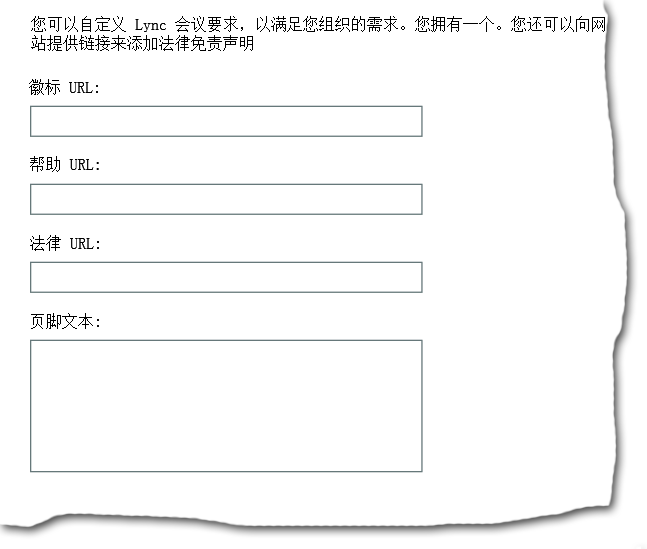
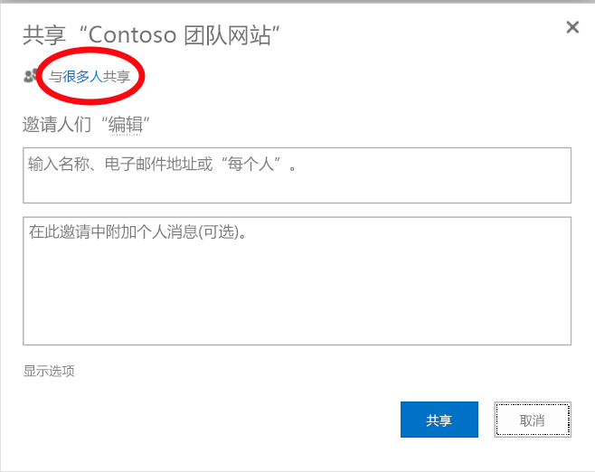
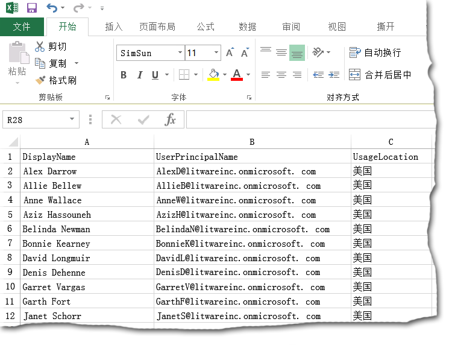
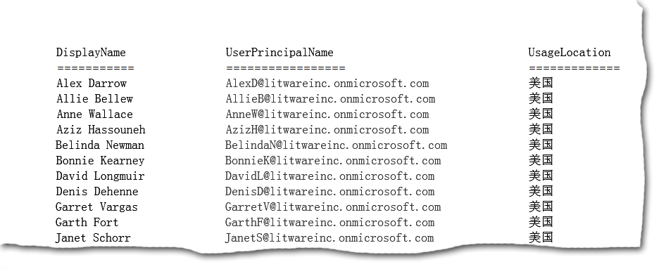

# <a name="why-you-need-to-use-office-365-powershell"></a><span data-ttu-id="aca2d-103">为什么您需要使用 Office 365 PowerShell</span><span class="sxs-lookup"><span data-stu-id="aca2d-103">Why you need to use Office 365 PowerShell</span></span>

 <span data-ttu-id="aca2d-104">**摘要：**了解为什么您必须使用 Office 365 PowerShell Office 365 在某些情况下更有效地管理在其他情况下必然。</span><span class="sxs-lookup"><span data-stu-id="aca2d-104">**Summary:** Understand why you must use Office 365 PowerShell to manage Office 365, in some cases more efficiently and in other cases by necessity.</span></span>
  
<span data-ttu-id="aca2d-p101">借助 Office 365 管理中心不仅可以管理你的 Office 365 用户帐户和许可证，还可以管理你的 Office 365 服务器产品：Exchange、Skype for Business Online 和 SharePoint Online。但是，也可以使用 Office 365 PowerShell 命令来管理这些元素，充分利用针对速度、自动化和其他功能的命令行和脚本语言环境。</span><span class="sxs-lookup"><span data-stu-id="aca2d-p101">With the Office 365 admin center, you can not only manage your Office 365 user accounts and licenses, but you can also manage your Office 365 server products: Exchange, Skype for Business Online, and SharePoint Online. However, you can also manage these elements with Office 365 PowerShell commands, taking advantage of a command-line and scripting language environment for speed, automation, and additional capability.</span></span>
  
<span data-ttu-id="aca2d-107">在本文中，我们将向您展示使用 Office 365 PowerShell 管理 Office 365 的各种方式。</span><span class="sxs-lookup"><span data-stu-id="aca2d-107">In this article, we'll show you these ways in which you can use Office 365 PowerShell to manage Office 365.</span></span>
  
- <span data-ttu-id="aca2d-108">Office 365 PowerShell 可能会显示通过 Office 365 管理中心无法看到的其他信息。</span><span class="sxs-lookup"><span data-stu-id="aca2d-108">Office 365 PowerShell can reveal additional information that you cannot see with the Office 365 admin center</span></span>
    
- <span data-ttu-id="aca2d-109">Office 365 拥有仅可使用以下工具配置的功能：Office 365 PowerShell</span><span class="sxs-lookup"><span data-stu-id="aca2d-109">Office 365 has features that you can only configure by using Office 365 PowerShell</span></span>
    
- <span data-ttu-id="aca2d-110">Office 365 PowerShell 善于执行批量操作</span><span class="sxs-lookup"><span data-stu-id="aca2d-110">Office 365 PowerShell is great at performing bulk operations</span></span>
    
- <span data-ttu-id="aca2d-111">Office 365 PowerShell 善于筛选数据</span><span class="sxs-lookup"><span data-stu-id="aca2d-111">Office 365 PowerShell is great at filtering data</span></span>
    
- <span data-ttu-id="aca2d-112">Office 365 PowerShell 方便打印或保存数据</span><span class="sxs-lookup"><span data-stu-id="aca2d-112">Office 365 PowerShell makes it easy to print or save data</span></span>
    
- <span data-ttu-id="aca2d-113">Office 365 PowerShell 允许您管理各种服务器产品</span><span class="sxs-lookup"><span data-stu-id="aca2d-113">Office 365 PowerShell lets you manage across server products</span></span>
    
<span data-ttu-id="aca2d-p102">开始之前，您需要知道 Office 365 PowerShell 是一组用于 Windows PowerShell（用于 Windows 服务和平台的命令行环境）的模块。此环境创建了一个可用其他模块扩展的命令行界面语言并提供了执行简单或复杂命令或脚本的方法。例如，在您安装 Office 365 PowerShell 模块并连接至您的 Office 365 订阅后，您可以运行此命令以列出 Microsoft Exchange Online 的所有用户邮箱：</span><span class="sxs-lookup"><span data-stu-id="aca2d-p102">Before you begin, understand that Office 365 PowerShell is a set of modules for Windows PowerShell, a command-line environment for Windows-based services and platforms. This environment creates a command shell language that can be extended with additional modules and provides a way to execute simple or complex commands or scripts For example, after you install the Office 365 PowerShell modules and connect to your Office 365 subscription, you can run this command to list all of the user mailboxes for Microsoft Exchange Online:</span></span>
  
```
Get-Mailbox
```

<span data-ttu-id="aca2d-116">您也可以运行此命令以计算 SharePoint Online 中您的所有 Web 应用的所有网站的所有列表中的项目数量：</span><span class="sxs-lookup"><span data-stu-id="aca2d-116">You can also run this command to calculate the number of items in all of the lists for all of the sites for all of your web apps in SharePoint Online:</span></span>
  
```
Get-SPOSite -Limit All | Get-SPWeb -Limit All | % {$_.Lists} | ? {$_ -is [Microsoft.SharePoint.SPDocumentLibrary]} | % {$total+= $_.ItemCount}; $total
```

<span data-ttu-id="aca2d-117">使用 Office 365 管理中心可以轻松获取邮箱列表，但无法轻松计算所有 Web 应用的所有网站的所有列表中的项目数量。</span><span class="sxs-lookup"><span data-stu-id="aca2d-117">Getting the list of mailboxes can also be easily done using the Office 365 admin center, but counting the number of items in all of the lists for all of the sites for all of your web apps cannot be easily done.</span></span>
  
<span data-ttu-id="aca2d-p103">请注意，Office 365 PowerShell 旨在补充和增强管理 Office 365 的能力，而非取代 Office 365 管理中心。作为 Office 365 管理员，必须至少习惯使用 Office 365 PowerShell，因为有些配置程序只能通过 Office 365 PowerShell 命令完成。在这些情况下，需要了解如何：</span><span class="sxs-lookup"><span data-stu-id="aca2d-p103">Please note that Office 365 PowerShell is designed to augment and enhance your ability to manage Office 365, not to replace the Office 365 admin center. As an Office 365 administrator, you must become at least comfortable with using Office 365 PowerShell because there are some configuration procedures that can only be done with Office 365 PowerShell commands. In these cases, you will be required to understand how to:</span></span>
  
- <span data-ttu-id="aca2d-121">安装 Office 365 PowerShell 模块（每台管理员计算机只能安装一次）。</span><span class="sxs-lookup"><span data-stu-id="aca2d-121">Install the Office 365 PowerShell modules (done only once for each administrator computer).</span></span>
    
- <span data-ttu-id="aca2d-122">连接至您的 Office 365 订阅（为每个 PowerShell 会话连接一次）。</span><span class="sxs-lookup"><span data-stu-id="aca2d-122">Connect to your Office 365 subscription (done once for each PowerShell session).</span></span>
    
- <span data-ttu-id="aca2d-123">收集运行所需 Office 365 PowerShell 命令所需的信息。</span><span class="sxs-lookup"><span data-stu-id="aca2d-123">Gather the information needed to run the required Office 365 PowerShell commands.</span></span>
    
- <span data-ttu-id="aca2d-124">成功运行 Office 365 PowerShell 命令。</span><span class="sxs-lookup"><span data-stu-id="aca2d-124">Run the Office 365 PowerShell commands successfully.</span></span>
    
<span data-ttu-id="aca2d-p104">在学过这些基本技巧之后，您不需要使用 **Get-Mailbox** 命令列出您的邮箱用户，也不需要明白如何创建像前一个命令那样的新命令来计算您的所有 Web 应用的所有网站的所有列表中的项目数量。如果需要，Microsoft 和 Office 365 管理员社区可以帮到您。</span><span class="sxs-lookup"><span data-stu-id="aca2d-p104">After learning these basic skills, you are not required to list your mailbox users with **Get-Mailbox** command, nor are you required to understand how to create a new command like the previous one to count all the items in all the lists for all of the sites for all of your web apps. Microsoft and the community of Office 365 administrators can help you with that as needed.</span></span>
  
## <a name="office-365-powershell-can-reveal-additional-information-that-you-cannot-see-with-the-office-365-admin-center"></a><span data-ttu-id="aca2d-127">Office 365 PowerShell 可能会显示通过 Office 365 管理中心无法看到的其他信息。</span><span class="sxs-lookup"><span data-stu-id="aca2d-127">Office 365 PowerShell can reveal additional information that you cannot see with the Office 365 admin center</span></span>
<span data-ttu-id="aca2d-128"><a name="reveal"> </a></span><span class="sxs-lookup"><span data-stu-id="aca2d-128"></span></span>

<span data-ttu-id="aca2d-p105">Office 365 管理中心显示大量有用的信息，但这并不意味着它会显示 Office 365 存储在用户、许可证、邮箱和网站上的所有可能信息。下面是 Office 365 管理中心中 **用户和组** 的一个示例：</span><span class="sxs-lookup"><span data-stu-id="aca2d-p105">The Office 365 admin center displays a lot of useful information, but that doesn't mean that it displays all the possible information that Office 365 stores on users, licenses, mailboxes, and sites. Here is an example for **users and groups** in the Office 365 admin center:</span></span>
  

  
<span data-ttu-id="aca2d-p106">出于多种目的，这显示了你需要知道的信息。但是，有时你需要了解更多。例如，Office 365 授权（以及用户可用的 Office 365 功能）在一定程度上取决于用户的地理位置。向居住在美国的用户扩展的策略和功能可能与向居住在印度或比利时的用户扩展的策略和功能不同。可以通过以下步骤使用 Office 365 管理中心确定用户的地理位置：</span><span class="sxs-lookup"><span data-stu-id="aca2d-p106">For many purposes, this displays the information you need to know. However, there are times when you need more. For example, Office 365 licensing (as well as the Office 365 features available to a user) depend in part on that user's geographic location. The policies and features you can extend to a user who lives in the United States might not be the same as the policies and features you can extend to a user who lives in India or in Belgium. You can use the Office 365 admin center to determine a user's geographic location with these steps:</span></span>
  
1. <span data-ttu-id="aca2d-137">双击用户的"显示名称"。</span><span class="sxs-lookup"><span data-stu-id="aca2d-137">Double-click the user's **Display Name**.</span></span>
    
2. <span data-ttu-id="aca2d-138">在用户属性显示窗格中，单击"详细信息"。</span><span class="sxs-lookup"><span data-stu-id="aca2d-138">In the user properties display pane, click **details**.</span></span>
    
3. <span data-ttu-id="aca2d-139">在显示的详细信息中，单击"其他详细信息"。</span><span class="sxs-lookup"><span data-stu-id="aca2d-139">In the details display, click **additional details**.</span></span>
    
4. <span data-ttu-id="aca2d-140">向下滚动，直到看见"国家或地区"标题：</span><span class="sxs-lookup"><span data-stu-id="aca2d-140">Scroll down until you see the heading **Country or region**:</span></span>
    
     
  
5. <span data-ttu-id="aca2d-142">在一张纸上记下用户的显示名称和位置，或将其复制并粘贴至记事本中。</span><span class="sxs-lookup"><span data-stu-id="aca2d-142">Write the user's display name and location on a piece of paper, or copy and paste it into Notepad.</span></span> 
    
<span data-ttu-id="aca2d-p107">您必须为每个用户重复此过程。对于许多用户来说，这可能是一项繁琐的任务。通过 Office 365 PowerShell，您可以使用以下命令为您的所有用户显示此信息：</span><span class="sxs-lookup"><span data-stu-id="aca2d-p107">You must repeat this procedure for each user. For many users, this can be a tedious task. With Office 365 PowerShell, you can display this information for all of your users with the following command:</span></span>
  
```
Get-MsolUser | Select DisplayName, UsageLocation
```

> [!NOTE]
> <span data-ttu-id="aca2d-146">此命令将要求您安装 [Microsoft Azure Active Directory 模块](https://technet.microsoft.com/en-us/library/jj151815.aspx)。</span><span class="sxs-lookup"><span data-stu-id="aca2d-146">This command requires you to install the [Windows Azure Active Directory module](https://technet.microsoft.com/en-us/library/jj151815.aspx).</span></span> 
  
<span data-ttu-id="aca2d-147">下面是显示的一个示例：</span><span class="sxs-lookup"><span data-stu-id="aca2d-147">Here is an example of the display:</span></span>
  
```
DisplayName                               UsageLocation
-----------                               -------------
Zrinka Makovac                            US
Bonnie Kearney                            GB
Fabrice Canel                             BR
Brian Johnson (TAILSPIN)                  US
Anne Wallace                              US
Alex Darrow                               US
David Longmuir                            BR
```

> [!TIP]
>  <span data-ttu-id="aca2d-148">该 Office 365 PowerShell 命令的解释是： 获取当前 Office 365 订阅 ( **Get MsolUser** ) 中的所有用户，但仅显示名称和每个用户 （**选择显示名称、 UsageLocation** ） 的位置。</span><span class="sxs-lookup"><span data-stu-id="aca2d-148">The interpretation of this Office 365 PowerShell command is: Get all of the users in the current Office 365 subscription ( **Get-MsolUser** ), but only display the name and location for each user ( **Select DisplayName, UsageLocation** ).</span></span>
  
<span data-ttu-id="aca2d-p108">因为 Office 365 PowerShell 支持命令行界面语言，您可以进一步操作从 **Get-MSolUser** 命令获取的信息。例如，或许您想要按用户位置对用户进行排序，将所有巴西用户、所有美国用户等进行分组。下面是命令：</span><span class="sxs-lookup"><span data-stu-id="aca2d-p108">Because Office 365 PowerShell supports a command shell language, you can further manipulate the information obtained from the **Get-MSolUser** command. For example, maybe you'd like to sort these users by their location, grouping all the Brazilian users together, all the United States users together, etc. Here is the command:</span></span>
  
```
Get-MsolUser | Select DisplayName, UsageLocation | Sort UsageLocation, DisplayName
```

<span data-ttu-id="aca2d-151">下面是显示的一个示例：</span><span class="sxs-lookup"><span data-stu-id="aca2d-151">Here is an example of the display:</span></span>
  
```
DisplayName                                 UsageLocation
-----------                                 -------------
David Longmuir                              BR
Fabrice Canel                               BR
Bonnie Kearney                              GB
Alex Darrow                                 US
Anne Wallace                                US
Brian Johnson (TAILSPIN)                    US
Zrinka Makovac                              US
```

> [!TIP]
>  <span data-ttu-id="aca2d-152">该 Office 365 PowerShell 命令的解释是： 获取所有用户当前的 Office 365 订阅，但只有显示名称和每个用户的位置和它们的位置，然后它们的名称 (**排序 UsageLocation，第一次排序显示名称**)。</span><span class="sxs-lookup"><span data-stu-id="aca2d-152">The interpretation of this Office 365 PowerShell command is: Get all of the users in the current Office 365 subscription, but only display the name and location for each user and sort them first by their location, and then their names ( **Sort UsageLocation, DisplayName** ).</span></span>
  
<span data-ttu-id="aca2d-p109">您还可以使用其他筛选条件。例如，如果您只想查看有关巴西用户的信息，请使用此命令：</span><span class="sxs-lookup"><span data-stu-id="aca2d-p109">You can also employ additional filtering. For example, if you only want to see information about users based in Brazil, use this command:</span></span>
  
```
Get-MsolUser | Where {$_.UsageLocation -eq "BR"} | Select DisplayName, UsageLocation 
```

<span data-ttu-id="aca2d-155">下面是显示的一个示例：</span><span class="sxs-lookup"><span data-stu-id="aca2d-155">Here is an example of the display:</span></span>
  
```
DisplayName                                           UsageLocation
-----------                                           -------------
David Longmuir                                        BR
Fabrice Canel                                         BR
```

> [!TIP]
>  <span data-ttu-id="aca2d-156">该 Office 365 PowerShell 命令的解释是： 位于巴西当前 Office 365 订阅中获取的所有用户 (**其中 {$\_。UsageLocation-eq"室"}** )，然后显示名称和每个用户的位置。</span><span class="sxs-lookup"><span data-stu-id="aca2d-156">The interpretation of this Office 365 PowerShell command is: Get all of the users in the current Office 365 subscription whose location is Brazil ( **Where {$\_.UsageLocation -eq "BR"}** ), then display the name and location for each user.</span></span>
  
 <span data-ttu-id="aca2d-157">**有关较大的域的快速说明**</span><span class="sxs-lookup"><span data-stu-id="aca2d-157">**A Quick Note Regarding Larger Domains**</span></span>
  
<span data-ttu-id="aca2d-p110">如果您的域非常大，有数万个用户，那么尝试此文章中介绍的某些示例可能会带来"限制"。这说明，基于计算能力和可用网络带宽等因素，您每次尝试的操作有点多。正因为如此，较大型的组织可能要将某些 Office 365 PowerShell 命令拆分为两个命令。例如，这一个命令将返回所有用户帐户，并显示每个用户的名称和位置。</span><span class="sxs-lookup"><span data-stu-id="aca2d-p110">If you have a very large domain with tens of thousands of users, trying some of the examples we show in this article could lead to "throttling." That means that, based on things like computing power and available network bandwidth, you're trying to do a little too much at one time. Because of that, larger organizations might want to split some of these Office 365 PowerShell commands into two commands. For example, this one command returns all the user accounts and shows the name and location for each:</span></span>
  
```
Get-MsolUser | Select DisplayName, UsageLocation
```

<span data-ttu-id="aca2d-p111">这对于较小的域非常有用。但在大型组织中，您可能需要将此命令拆分为两个命令：一个命令用于将用户帐户信息存储在一个变量中，另一个命令用于显示所需信息。如以下示例所示：</span><span class="sxs-lookup"><span data-stu-id="aca2d-p111">That works great for smaller domains. In a large organization, however, you might need to split that into two commands: one command to store the user account information in a variable and another command to display the needed information. Here is an example:</span></span>
  
```
$x = Get-MsolUser
$x | Select DisplayName, UsageLocation
```


<span data-ttu-id="aca2d-165">这套 Office 365 PowerShell 命令的解释是：</span><span class="sxs-lookup"><span data-stu-id="aca2d-165">The interpretation of this set of Office 365 PowerShell commands is:</span></span>
- <span data-ttu-id="aca2d-166">获取当前 Office 365 订阅中的所有用户，并将信息存储在名为 $x 的变量 ( **$x = Get MsolUser** )。</span><span class="sxs-lookup"><span data-stu-id="aca2d-166">Get all of the users in the current Office 365 subscription and store the information in a variable named $x ( **$x = Get-MsolUser** ).</span></span>
- <span data-ttu-id="aca2d-167">显示变量 $x 的内容，但仅包含名称和每个用户的位置 ( **$x |选择显示名称，UsageLocation** )。</span><span class="sxs-lookup"><span data-stu-id="aca2d-167">Display the contents of the variable $x, but only include the name and location for each user ( **$x | Select DisplayName, UsageLocation** ).</span></span>
  
## <a name="office-365-has-features-that-you-can-only-configure-with-office-365-powershell"></a><span data-ttu-id="aca2d-168">Office 365 拥有仅可使用以下工具配置的功能：Office 365 PowerShell</span><span class="sxs-lookup"><span data-stu-id="aca2d-168">Office 365 has features that you can only configure with Office 365 PowerShell</span></span>
<span data-ttu-id="aca2d-169"><a name="only"> </a></span><span class="sxs-lookup"><span data-stu-id="aca2d-169"></span></span>

<span data-ttu-id="aca2d-p112">Office 365 管理中心旨在为大多数人提供对最常见或最有意义的适用管理任务的访问权限。换句话说，Office 365 管理中心的设计目标是让典型的管理员能够使用工具来执行最常见的管理任务。根据定义，这意味着某些任务无法通过 Office 365 管理中心完成。</span><span class="sxs-lookup"><span data-stu-id="aca2d-p112">The Office 365 admin center is intended to provide access to the most common or meaningful administrative tasks that apply to most people. In other words, the Office 365 admin center was designed so that the typical administrator could use the tool to carry out the most common management tasks. By this definition, that means that there are some tasks that can't be completed by using the Office 365 admin center.</span></span>
  
<span data-ttu-id="aca2d-173">例如，Skype for Business Online 管理中心提供用于创建自定义会议邀请的几个选项：</span><span class="sxs-lookup"><span data-stu-id="aca2d-173">For example, the Skype for Business Online Admin center provides a few options for creating custom meeting invitations:</span></span>
  

  
<span data-ttu-id="aca2d-p113">借助这些设置，您可以为会议邀请添加少许个性化和专业化。但是，与仅创建自定义会议邀请相比，它对会议配置设置的帮助更多。例如，默认情况下，会议允许：</span><span class="sxs-lookup"><span data-stu-id="aca2d-p113">With these settings, you can add a touch of personalization and professionalism to meeting invitations. However, there's more to meeting configuration settings than simply creating custom meeting invitations. For example, by default, meetings allow:</span></span>
  
- <span data-ttu-id="aca2d-178">匿名用户获取自动参与每个会议的权限。</span><span class="sxs-lookup"><span data-stu-id="aca2d-178">Anonymous users to gain automatic entrance to each meeting.</span></span>
    
- <span data-ttu-id="aca2d-179">与会者记录会议。</span><span class="sxs-lookup"><span data-stu-id="aca2d-179">Attendees to record the meeting.</span></span>
    
- <span data-ttu-id="aca2d-180">您组织中的所有用户在加入会议时被指定为演示者。</span><span class="sxs-lookup"><span data-stu-id="aca2d-180">All users from your organization to be designated as presenters when they join the meeting.</span></span>
    
<span data-ttu-id="aca2d-p114">这些设置不是从 Skype for Business Online 管理中心提供。但是，您可以从 Office 365 PowerShell 控制它们。下面是一个禁用这三项设置的命令：</span><span class="sxs-lookup"><span data-stu-id="aca2d-p114">These settings are not available from the Skype for Business Online Admin center. However, you can control them from Office 365 PowerShell. Here is a command that disables these three settings:</span></span>
  
```
Set-CsMeetingConfiguration -AdmitAnonymousUsersByDefault $False -AllowConferenceRecording $False -DesignateAsPresenter "None"
```

> [!NOTE]
> <span data-ttu-id="aca2d-184">此命令会要求您安装 [Skype for Business Online PowerShell 模块](https://www.microsoft.com/download/details.aspx?id=39366)。</span><span class="sxs-lookup"><span data-stu-id="aca2d-184">This command requires that you install the [Skype for Business Online PowerShell Module ](https://www.microsoft.com/download/details.aspx?id=39366).</span></span> 
  
> [!TIP]
>  <span data-ttu-id="aca2d-185">该 Office 365 PowerShell 命令的解释是： 为新 Skype 业务联机会议 (**集 CsMeetingConfiguration** ) 的设置，禁用允许匿名用户获得自动进入会议 ( **-AdmitAnonymousUsersByDefault $False** )、 与会者于记录会议 ( **-AllowConferenceRecording $False** )，禁止和不从您的组织的所有用户都指定作为演示者 ( **-DesignateAsPresenter"None"** )。</span><span class="sxs-lookup"><span data-stu-id="aca2d-185">The interpretation of this Office 365 PowerShell command is: For the settings for new Skype for Business Online meetings ( **Set-CsMeetingConfiguration** ), disable allowing anonymous users to gain automatic entrance to meetings ( **-AdmitAnonymousUsersByDefault $False** ), disable the ability for attendees to record meetings ( **-AllowConferenceRecording $False** ), and do not designate all users from your organization as presenters ( **-DesignateAsPresenter "None"** ).</span></span>
  
<span data-ttu-id="aca2d-186">如果您改变了主意，想要还原这些默认设置（所有这些已启用），请运行此命令：</span><span class="sxs-lookup"><span data-stu-id="aca2d-186">If you change your mind and want to restore these default settings (all of them enabled), run this command:</span></span>
  
```
Set-CsMeetingConfiguration -AdmitAnonymousUsersByDefault $True -AllowConferenceRecording $True -DesignateAsPresenter "Company"
```

<span data-ttu-id="aca2d-p115">这仅是一个示例。当然还有其他示例，这就是为什么您作为 Office 365 管理员，需要习惯运行 Office 365 PowerShell 命令。</span><span class="sxs-lookup"><span data-stu-id="aca2d-p115">This is just one example. There are others, which is why you, as an Office 365 administrator, need to be comfortable with running Office 365 PowerShell commands.</span></span>
  
## <a name="office-365-powershell-is-great-at-carrying-out-bulk-operations"></a><span data-ttu-id="aca2d-189">Office 365 PowerShell 善于执行批量操作</span><span class="sxs-lookup"><span data-stu-id="aca2d-189">Office 365 PowerShell is great at carrying out bulk operations</span></span>
<span data-ttu-id="aca2d-190"><a name="bulk"> </a></span><span class="sxs-lookup"><span data-stu-id="aca2d-190"></span></span>

<span data-ttu-id="aca2d-p116">一直以来，当要执行单个操作时，诸如 Office 365 管理中心这样的可视化界面最有价值。例如，如果需要禁用一个用户帐户，可以使用 Office 365 管理中心快速查找并清除复选框。这可能比在 Office 365 PowerShell中执行类似操作更简单。</span><span class="sxs-lookup"><span data-stu-id="aca2d-p116">Historically, visual interfaces like the Office 365 admin center are most valuable when you have a single operation to perform. For example, if you need to disable one user account, you can use the Office 365 admin center to quickly locate and clear a checkbox. This can be simpler than performing a similar operation in Office 365 PowerShell.</span></span>
  
<span data-ttu-id="aca2d-p117">但是，如果必须更改一大组其他事项中的许多事项或某些所选事项，Office 365 管理中心也许未必是最佳选择。例如，如果不得不更改数千个电话号码的前缀或需要从所有 SharePoint Online 网站删除特定用户 Ken Myer，那么如何在 Office 365 管理中心 进行该操作呢？</span><span class="sxs-lookup"><span data-stu-id="aca2d-p117">But if you have to change many things or some selected things within a large set of other things, the Office 365 admin center might not be the best use of your time. For example, if you had to change the prefix on thousands of phone numbers or you needed to remove a specific user, Ken Myer, from all of your SharePoint Online sites, how would you do that in the Office 365 admin center?</span></span>
  
<span data-ttu-id="aca2d-p118">关于后一个示例，你拥有数百个 SharePoint Online 网站，但甚至不知道 Ken Meyer 是哪个群组的成员。这意味着你需要从 Office 365 管理中心开始，然后再为每个网站执行此过程：</span><span class="sxs-lookup"><span data-stu-id="aca2d-p118">For the latter example, you have several hundred SharePoint Online sites and you don't know even know which ones of which Ken Meyer is a member. That means you'll have to start at the Office 365 admin center and then perform this procedure for each site:</span></span>
  
1. <span data-ttu-id="aca2d-198">单击网站的"URL"。</span><span class="sxs-lookup"><span data-stu-id="aca2d-198">Click the **URL** of the site.</span></span>
    
2. <span data-ttu-id="aca2d-199">在"网站集属性"框中，单击"网站地址"链接以打开该网站。</span><span class="sxs-lookup"><span data-stu-id="aca2d-199">In the **site collection properties** box, click the **Web Site Address** link to open the site.</span></span>
    
3. <span data-ttu-id="aca2d-200">在网站上，单击"共享"。</span><span class="sxs-lookup"><span data-stu-id="aca2d-200">On the site, click **Share**.</span></span>
    
4. <span data-ttu-id="aca2d-201">在"共享"对话框中，单击显示有权访问该网站的所有用户的链接：</span><span class="sxs-lookup"><span data-stu-id="aca2d-201">In the **Share** dialog box click the link that shows you all the users who have permissions to the site:</span></span>
    
     
  
5. <span data-ttu-id="aca2d-203">在"共享对象"对话框中，单击"高级"。</span><span class="sxs-lookup"><span data-stu-id="aca2d-203">In the **Shared With** dialog box, click **Advanced**.</span></span>
    
6. <span data-ttu-id="aca2d-204">向下滚动用户列表，找到并选择 Ken Myer（假设他有权访问该网站），然后单击"删除用户权限"。</span><span class="sxs-lookup"><span data-stu-id="aca2d-204">Scroll down the list of users, find and select Ken Myer (assuming he has permissions to the site), and then click **Remove User Permissions**.</span></span>
    
<span data-ttu-id="aca2d-205">对于数百个网站来说，这可能需要很长时间。</span><span class="sxs-lookup"><span data-stu-id="aca2d-205">This can take a long time for several hundred sites.</span></span>
  
<span data-ttu-id="aca2d-206">另一个方法是使用 Office 365 PowerShell 和以下命令从您的所有网站删除 Ken Myer：</span><span class="sxs-lookup"><span data-stu-id="aca2d-206">The alternative is to use Office 365 PowerShell and the following command to remove Ken Myer from all of your sites:</span></span>
  
```
Get-SPOSite | ForEach {Remove-SPOUser -Site $_.Url -LoginName "kenmyer@litwareinc.com"}
```

> [!NOTE]
> <span data-ttu-id="aca2d-207">此命令需要安装[连接到 SharePoint Online PowerShell](https://technet.microsoft.com/library/fp161372.aspx)。</span><span class="sxs-lookup"><span data-stu-id="aca2d-207">This command requires that you install the [Connect to SharePoint Online PowerShell](https://technet.microsoft.com/library/fp161372.aspx).</span></span> 
  
> [!TIP]
>  <span data-ttu-id="aca2d-208">该 Office 365 PowerShell 命令的解释是： 获取所有当前 Office 365 订阅 ( **Get SPOSite** ) 中的 SharePoint 站点和每个站点，Ken 迪娜从列表中删除的用户可以访问它 ( **ForEach {删除 SPOUser-网站 $\_。Url-名"kenmyer@litwareinc.com"}** )。</span><span class="sxs-lookup"><span data-stu-id="aca2d-208">The interpretation of this Office 365 PowerShell command is:  Get all of the SharePoint sites in the current Office 365 subscription ( **Get-SPOSite** ) and for each site, remove Ken Meyer from the list of users who can access it ( **ForEach {Remove-SPOUser -Site $\_.Url -LoginName "kenmyer@litwareinc.com"}** ).</span></span>
  
<span data-ttu-id="aca2d-p119">因为我们让 Office 365 从每个网站删除 Ken Meyer，包括那些他无权访问的网站，此命令的显示将对他当前无权访问的那些网站显示错误。我们可以对此命令使用一个附加条件，使其仅从其登录列表中有 Key Meyer 的网站中删除他，但所列错误对网站本身没有任何坏处。此命令运行数百个网站可能需要几分钟的时间，而通过 Office 365 管理中心运行则需要数小时。</span><span class="sxs-lookup"><span data-stu-id="aca2d-p119">Because we are telling Office 365 to remove Ken Meyer from every site, including those in which he does not have access, the display of this command will show errors for those sites in which he does not currently have access. We can use an additional condition on this command to remove Key Meyer only from the sites that have him in their login list, but the listed errors cause no harm to the sites themselves. This command might take a few minutes to run against hundreds of sites, rather than hours of working through the Office 365 admin center.</span></span>
  
<span data-ttu-id="aca2d-p120">下面是另一个批量操作示例。使用此命令将新 SharePoint 管理员 Bonnie Kearney 添加到组织中的所有网站：</span><span class="sxs-lookup"><span data-stu-id="aca2d-p120">Here is another bulk operation example. Use this command to add Bonnie Kearney, a new SharePoint administrator, to all of the sites in the organization:</span></span>
  
```
Get-SPOSite | ForEach {Add-SPOUser -Site $_.Url -LoginName "bkearney@litwareinc.com" -Group "Members"}
```

> [!TIP]
>  <span data-ttu-id="aca2d-214">此 Office 365 PowerShell 命令的解释是： 在当前的 Office 365 订阅以及每个站点获得所有 SharePoint 网站的通过将她登录名添加到网站中的 Members 组允许赵莉莉访问 ( **ForEach {添加 SPOUser 的网站$\_.名为"bkearney@litwareinc.com"的 Url-组"的成员"}** )。</span><span class="sxs-lookup"><span data-stu-id="aca2d-214">The interpretation of this Office 365 PowerShell command is:  Get all of the SharePoint sites in the current Office 365 subscription and for each site, allow Bonnie Kearney access by adding her login name to the Members group of the site ( **ForEach {Add-SPOUser -Site $\_.Url -LoginName "bkearney@litwareinc.com" -Group "Members"}** ).</span></span>
  
## <a name="office-365-powershell-is-great-at-filtering-data"></a><span data-ttu-id="aca2d-215">Office 365 PowerShell 善于筛选数据</span><span class="sxs-lookup"><span data-stu-id="aca2d-215">Office 365 PowerShell is great at filtering data</span></span>
<span data-ttu-id="aca2d-216"><a name="filter"> </a></span><span class="sxs-lookup"><span data-stu-id="aca2d-216"></span></span>

<span data-ttu-id="aca2d-p121">Office 365 管理中心提供几种不同的方法来筛选数据，以快速而轻松地查找信息的目标子集。例如，可以通过 Exchange 轻松筛选用户邮箱的几乎所有属性。例如，下面是居住在布卢明顿市的所有用户的邮箱列表：</span><span class="sxs-lookup"><span data-stu-id="aca2d-p121">The Office 365 admin center provides several different ways to filter your data to quickly and easily locate a targeted subset of information. For example, Exchange makes it easy to filter on practically any property of a user mailbox. For example, here is the list of mailboxes for all the users who live in the city of Bloomington:</span></span>
  

  
<span data-ttu-id="aca2d-p122">Exchange 管理中心还允许您组合筛选条件。例如，您可以查找居住在布卢明顿和在财务部门工作的所有用户的邮箱。</span><span class="sxs-lookup"><span data-stu-id="aca2d-p122">The Exchange Admin center also lets you combine filter criteria. For example, you can find the mailboxes for all the people who live in Bloomington and who work in the Finance department.</span></span> 
  
<span data-ttu-id="aca2d-p123">但是，在 Exchange 管理中心有一些操作限制。例如，也许您想要查找居住在布卢明顿或圣地亚哥的用户的邮箱或所有不居住在布卢明顿的用户的邮箱。</span><span class="sxs-lookup"><span data-stu-id="aca2d-p123">However, there are limitations to what you can do in the Exchange Admin center. For example, maybe you'd like to find the mailboxes of people who live in Bloomington or San Diego, or the mailboxes for all the people who don't live in Bloomington.</span></span> 
  
<span data-ttu-id="aca2d-225">通过 Office 365 PowerShell，使用此命令您可以获取居住在布卢明顿市或圣地亚哥市的所有用户的邮箱列表：</span><span class="sxs-lookup"><span data-stu-id="aca2d-225">With Office 365 PowerShell, you can get a list of mailboxes for all the people who live in the cities of Bloomington or San Diego with this command:</span></span>
  
```
Get-User | Where {$_.RecipientTypeDetails -eq "UserMailbox" -and ($_.City -eq "San Diego" -or $_.City -eq "Bloomington")} | Select DisplayName, City
```

<span data-ttu-id="aca2d-226">下面是显示的一个示例：</span><span class="sxs-lookup"><span data-stu-id="aca2d-226">Here is an example of the display:</span></span>
  
```
DisplayName                              City
-----------                              ----
Alex Darrow                              San Diego
Bonnie Kearney                           San Diego
Julian Isla                              Bloomington
Rob Young                                Bloomington
Zrinka Makovac                           San Diego
```

> [!TIP]
>  <span data-ttu-id="aca2d-227">该 Office 365 PowerShell 命令的解释是： 使所有当前 Office 365 订阅圣地亚哥或想查看柏明顿城市中拥有邮箱的用户 (**其中 {$\_。RecipientTypeDetails-eq"UserMailbox"-和 ($\_。城市 eq"圣地亚哥"-或 $\_。城市的 eq"想查看柏明顿")}** )，然后为每个 （**选择显示名称、 城市**） 中显示的名称和城市。</span><span class="sxs-lookup"><span data-stu-id="aca2d-227">The interpretation of this Office 365 PowerShell command is: Get all of the users in the current Office 365 subscription who have a mailbox in the cities of either San Diego or Bloomington ( **Where {$\_.RecipientTypeDetails -eq "UserMailbox" -and ($\_.City -eq "San Diego" -or $\_.City -eq "Bloomington")}** ), then display the name and city for each ( **Select DisplayName, City** ).</span></span>
  
<span data-ttu-id="aca2d-228">若要列出居住在布卢明顿之外的用户的所有邮箱，命令如下：</span><span class="sxs-lookup"><span data-stu-id="aca2d-228">To list all the mailboxes for people who live anywhere except Bloomington, here is the command:</span></span>
  
```
Get-User | Where {$_.RecipientTypeDetails -eq "UserMailbox" -and $_.City -ne "Bloomington"} | Select DisplayName, City
```

<span data-ttu-id="aca2d-229">下面是显示的一个示例：</span><span class="sxs-lookup"><span data-stu-id="aca2d-229">Here is an example of the display:</span></span>
  
```
DisplayName                               City
-----------                               ----
MOD Administrator                         Redmond
Alex Darrow                               San Diego
Allie Bellew                              Bellevue
Anne Wallace                              Louisville
Aziz Hassouneh                            Cairo
Belinda Newman                            Charlotte
Bonnie Kearney                            San Diego
David Longmuir                            Waukesha
Denis Dehenne                             Birmingham
Garret Vargas                             Seattle
Garth Fort                                Tulsa
Janet Schorr                              Bellevue
```

> [!TIP]
>  <span data-ttu-id="aca2d-230">该 Office 365 PowerShell 命令的解释是： 使所有有乐的想查看城市柏明顿在邮箱当前 Office 365 订阅的用户 (**其中 {$\_。RecipientTypeDetails-eq"UserMailbox"-和 $\_。城市-ne"想查看柏明顿"}** )，然后为每个显示的名称和城市。</span><span class="sxs-lookup"><span data-stu-id="aca2d-230">The interpretation of this Office 365 PowerShell command is: Get all of the users in the current Office 365 subscription who have a mailbox not located in the city of Bloomington ( **Where {$\_.RecipientTypeDetails -eq "UserMailbox" -and $\_.City -ne "Bloomington"}** ), then display the name and city for each.</span></span>
  
<span data-ttu-id="aca2d-p124">您也可以在 Office 365 PowerShell 筛选器中使用通配符匹配部分名称。例如，假设您正在查找某个用户帐户，但是只记得其姓氏是 Anderson，或也许是 Henderson 或 Jorgenson。</span><span class="sxs-lookup"><span data-stu-id="aca2d-p124">You can also use wildcard characters in your Office 365 PowerShell filters to match part of a name. For example, suppose you're looking for a user account, and all you can remember is that their last name was Anderson, or maybe Henderson, or maybe it was Jorgenson.</span></span>
  
<span data-ttu-id="aca2d-233">可以使用搜索工具并执行三种不同的搜索在 Office 365 管理中心中找到该用户：</span><span class="sxs-lookup"><span data-stu-id="aca2d-233">You could track down that user in the Office 365 admin center by using the search tool and carrying out three different searches:</span></span>
  
- <span data-ttu-id="aca2d-234">一次是搜索  *Anderson*</span><span class="sxs-lookup"><span data-stu-id="aca2d-234">One for  *Anderson*</span></span> 
    
- <span data-ttu-id="aca2d-235">一次是搜索  *Henderson*</span><span class="sxs-lookup"><span data-stu-id="aca2d-235">One for  *Henderson*</span></span> 
    
- <span data-ttu-id="aca2d-236">一次是搜索  *Jorgenson*</span><span class="sxs-lookup"><span data-stu-id="aca2d-236">One for  *Jorgenson*</span></span> 
    
<span data-ttu-id="aca2d-p125">因为所有这三个名称以"son"结尾，所以您可以让 Office 365 PowerShell 显示其名称以"son"结尾的所有用户。命令如下：</span><span class="sxs-lookup"><span data-stu-id="aca2d-p125">Because all three of these names end in "son", you can tell Office 365 PowerShell to display all the users whose name ends in "son". Here is the command:</span></span>
  
```
Get-User -Filter '{LastName -like "*son"}'
```

> [!TIP]
>  <span data-ttu-id="aca2d-p126">该 Office 365 PowerShell 命令的解释是： 获取所有用户在当前 Office 365 订阅中，但使用的筛选器只列出以"son"结尾的姓氏和名字的用户 ( **-筛选器 {姓氏-像"\*儿子"}** )。\*代表任何一组是在用户的姓氏字母的字符。</span><span class="sxs-lookup"><span data-stu-id="aca2d-p126">The interpretation of this Office 365 PowerShell command is: Get all of the users in the current Office 365 subscription, but use a filter that only lists the users whose last names end in "son" ( **-Filter '{LastName -like "\*son"}'** ). The \* stands for any set of characters, which are letters in the case of the user's last name.</span></span>
  
## <a name="office-365-powershell-makes-it-easy-to-print-or-save-data"></a><span data-ttu-id="aca2d-241">Office 365 PowerShell 方便打印或保存数据</span><span class="sxs-lookup"><span data-stu-id="aca2d-241">Office 365 PowerShell makes it easy to print or save data</span></span>
<span data-ttu-id="aca2d-242"><a name="printsave"> </a></span><span class="sxs-lookup"><span data-stu-id="aca2d-242"></span></span>

<span data-ttu-id="aca2d-p127">Office 365 管理中心允许你查看数据列表。下面是显示已启用 Skype for Business Online 的用户列表的 Skype for Business Online 管理中心的一个示例：</span><span class="sxs-lookup"><span data-stu-id="aca2d-p127">The Office 365 admin center allows you to view lists of data. Here is an example of the Skype for Business Online Admin center displaying a list of users who have been enabled for Skype for Business Online:</span></span>
  

  
<span data-ttu-id="aca2d-p128">若要将该信息保存到一个文件，必须复制并将其粘贴到一个文档或 Excel。在任一种情况下，该副本可能需要附加的格式设置。此外，Office 365 管理中心不提供直接打印所显示的列表的方法。</span><span class="sxs-lookup"><span data-stu-id="aca2d-p128">To save that information to a file, you must copy and paste it into a document or Excel. In either case, the copy might require additional formatting. Additionally, the Office 365 admin center does not provide a way to directly print the displayed list.</span></span>
  
<span data-ttu-id="aca2d-p129">幸运的是，您不仅可以使用 Office 365 PowerShell 显示列表，而且还可以将其保存到可轻松导入 Excel 的文件。下面是一个将 Skype for Business Online 用户数据保存为逗号分隔值 (CSV) 文件（一个可轻松导入为 Excel 工作表中的表的文件）的示例命令：</span><span class="sxs-lookup"><span data-stu-id="aca2d-p129">Fortunately, you can use Office 365 PowerShell to not only display the list, but save it to a file that can be easily imported into Excel. Here is an example command to save Skype for Business Online user data to a comma-separated values (CSV) file, a file that can be easily imported as a table in an Excel worksheet:</span></span>
  
```
Get-CsOnlineUser | Select DisplayName, UserPrincipalName, UsageLocation | Export-Csv -Path "C:\\Logs\\SfBUsers.csv" -NoTypeInformation
```

<span data-ttu-id="aca2d-251">下面是显示的一个示例：</span><span class="sxs-lookup"><span data-stu-id="aca2d-251">Here is an example of the display:</span></span>
  

  
> [!TIP]
>  <span data-ttu-id="aca2d-253">该 Office 365 PowerShell 命令的解释是： 获得 Skype 的所有当前 Office 365 订阅 ( **Get CsOnlineUser** ) 中的业务在线用户，获取用户名、 UPN 以及位置 (**选择显示名称范围内，UsageLocation** )，然后将保存的 CSV 文件中的信息命名为 c:\\日志\\SfBUsers.csv (**导出 Csv-路径"c:\\日志\\SfBUsers.csv"-NoTypeInformation** )。</span><span class="sxs-lookup"><span data-stu-id="aca2d-253">The interpretation of this Office 365 PowerShell command is: Get all of the Skype for Business Online users in the current Office 365 subscription ( **Get-CsOnlineUser** ), obtain only the user name, UPN, and location ( **Select DisplayName, UserPrincipalName, UsageLocation** ), and then save that information in CSV file named C:\\Logs\\SfBUsers.csv ( **Export-Csv -Path "C:\\Logs\\SfBUsers.csv" -NoTypeInformation** ).</span></span>
  
<span data-ttu-id="aca2d-p130">您可以使用选项将此列表另存为 XML 文件或 HTML 页。事实上，通过其他 PowerShell 命令，您可以将其直接保存为 Excel 文件，该文件具有所需的所有自定义格式。</span><span class="sxs-lookup"><span data-stu-id="aca2d-p130">You can also use options to save this list as an XML file or as an HTML page. In fact, with additional PowerShell commands, you could save it directly as an Excel file, with any custom formatting you desire.</span></span> 
  
<span data-ttu-id="aca2d-p131">您也可以将显示列表的 Office 365 PowerShell 命令输出直接发送到 Windows 中的默认打印机。下面是一个示例命令：</span><span class="sxs-lookup"><span data-stu-id="aca2d-p131">You can also send the output of an Office 365 PowerShell command that displays a list directly to the default printer in Windows. Here is an example command:</span></span>
  
```
Get-CsOnlineUser | Select DisplayName, UserPrincipalName, UsageLocation | Out-Printer
```

<span data-ttu-id="aca2d-258">打印的文档如下所示：</span><span class="sxs-lookup"><span data-stu-id="aca2d-258">Here's what your printed document will look like:</span></span>
  

  
> [!TIP]
>  <span data-ttu-id="aca2d-260">该 Office 365 PowerShell 命令的解释是： 使所有 Skype 的在线业务用户在当前 Office 365 订阅中，获取用户名、 UPN 和地点，并再将该信息发送到默认的 Windows 打印机 ( **Out-Printer** )。</span><span class="sxs-lookup"><span data-stu-id="aca2d-260">The interpretation of this Office 365 PowerShell command is:  Get all of the Skype for Business Online users in the current Office 365 subscription, obtain only the user name, UPN, and location, and then send that information to the default Windows printer ( **Out-Printer** ).</span></span>
  
<span data-ttu-id="aca2d-261">打印的文档具有相同简单的格式显示在 Office 365 PowerShell 命令窗口中，但一旦创建 Office 365 PowerShell 命令列出您的需要您只需添加**|Out-打印机**命令以获取一份硬拷贝从工作的结束。</span><span class="sxs-lookup"><span data-stu-id="aca2d-261">The printed document has the same simple formatting as the display within the Office 365 PowerShell command window, but once you have created an Office 365 PowerShell command to list what you need, you just add **| Out-Printer** to the end of the command to get a hard copy to work from.</span></span>
  
## <a name="office-365-powershell-lets-you-manage-across-server-products"></a><span data-ttu-id="aca2d-262">Office 365 PowerShell 允许您管理各种服务器产品</span><span class="sxs-lookup"><span data-stu-id="aca2d-262">Office 365 PowerShell lets you manage across server products</span></span>
<span data-ttu-id="aca2d-263"><a name="printsave"> </a></span><span class="sxs-lookup"><span data-stu-id="aca2d-263"></span></span>

<span data-ttu-id="aca2d-p132">组成 Office 365 的不同组件旨在协同工作。例如，假设您向 Office 365 中添加新用户，并指定诸如用户所属的部门和电话号码之类的信息。您可以通过以下任意一款 Office 365 服务器产品访问此类用户信息：Skype for Business Online、Exchange 或 SharePoint Online。</span><span class="sxs-lookup"><span data-stu-id="aca2d-p132">The different components that make up Office 365 are designed to work together. For example, suppose you add a new user to Office 365 and, when you do, you specify such information as the user's department and phone number. That information will then be available if you access the user's information using any of the Office 365 server products: Skype for Business Online, Exchange, or SharePoint Online.</span></span>
  
<span data-ttu-id="aca2d-p133">不过，此规则适用于跨产品套件的一般信息。特定于产品的信息 - 例如，用户的 Exchange 邮箱的有关信息 - 通常无法跨套件提供。例如，如果您想要知道用户邮箱是否启用，该信息将仅可在 Exchange 管理中心获得。</span><span class="sxs-lookup"><span data-stu-id="aca2d-p133">But that's for common information that spans the suite of products. Product-specific information-for example, information about a user's Exchange mailbox-is typically not available across the suite. For example, if you want to know if a user's mailbox is enabled or not, that information is available only in the Exchange Admin center.</span></span> 
  
<span data-ttu-id="aca2d-270">假设您要为您的所有用户生成显示以下信息的报告：</span><span class="sxs-lookup"><span data-stu-id="aca2d-270">Suppose you'd like to make a report that shows the following information for all your users:</span></span>
  
- <span data-ttu-id="aca2d-271">用户的显示名称</span><span class="sxs-lookup"><span data-stu-id="aca2d-271">The user's display name</span></span>
    
- <span data-ttu-id="aca2d-272">用户是否获得 Office 365 许可</span><span class="sxs-lookup"><span data-stu-id="aca2d-272">Whether the user is licensed for Office 365</span></span>
    
- <span data-ttu-id="aca2d-273">用户的 Exchange 邮箱是否已启用</span><span class="sxs-lookup"><span data-stu-id="aca2d-273">Whether the user's Exchange mailbox has been enabled</span></span>
    
- <span data-ttu-id="aca2d-274">用户是否已启用 Skype for Business Online</span><span class="sxs-lookup"><span data-stu-id="aca2d-274">Whether the user is enabled for Skype for Business Online</span></span>
    
<span data-ttu-id="aca2d-p134">当前无法使用 Office 365 管理中心轻松地生成报告。相反，必须创建一个单独的文档来存储信息（如 Excel 工作表），并从 Office 365 管理中心获取所有用户名称和许可信息，从 Exchange 管理中心获取邮箱信息，从 Skype for Business Online 管理中心获取 Skype for Business Online 信息，然后整理和组合该信息。</span><span class="sxs-lookup"><span data-stu-id="aca2d-p134">You currently cannot use the Office 365 admin center to easily produce such a report. Instead, you'll have to create a separate document to store the information, like an Excel worksheet, and get all the user names and licensing information from the Office 365 admin center, get mailbox information from the Exchange Admin center, get Skype for Business Online information from the Skype for Business Online Admin center, and then collate and combine that information.</span></span>
  
<span data-ttu-id="aca2d-277">另一种方法是使用 Office 365 PowerShell 脚本编译该报告。</span><span class="sxs-lookup"><span data-stu-id="aca2d-277">The alternative is to use an Office 365 PowerShell script to compile that report for you.</span></span>
  
<span data-ttu-id="aca2d-p135">以下示例脚本会比到目前为止在本文中看到的命令更复杂。但它显示了使用 Office 365 PowerShell 来创建很难用其他方式创建的信息视图的可能性。下面是可以编译并显示所需列表的脚本：</span><span class="sxs-lookup"><span data-stu-id="aca2d-p135">The following example script is more complicated than the commands you have seen so far in this article. But, it shows the potential of using Office 365 PowerShell to create views of information that are very difficult to do otherwise. Here is the script that can compile and display the needed list:</span></span>
  
```
$x = Get-MsolUser

foreach ($i in $x)
    {
      $y = Get-Mailbox -Identity $i.UserPrincipalName
      $i | Add-Member -MemberType NoteProperty -Name IsMailboxEnabled -Value $y.IsMailboxEnabled

      $y = Get-CsOnlineUser -Identity $i.UserPrincipalName
      $i | Add-Member -MemberType NoteProperty -Name EnabledForSfB -Value $y.Enabled
    }

$x | Select DisplayName, IsLicensed, IsMailboxEnabled, EnabledforSfB
```

<span data-ttu-id="aca2d-281">下面是显示的一个示例：</span><span class="sxs-lookup"><span data-stu-id="aca2d-281">Here is an example of the display:</span></span>
  
```
DisplayName             IsLicensed   IsMailboxEnabled   EnabledForSfB
-----------             ----------   ----------------   --------------
Zrinka Makovac          True         True               True
Bonnie Kearney          True         True               True
Fabrice Canel           True         True               True
Brian Johnson           False        True               False
Anne Wallace            True         True               True
Alex Darrow             True         True               True
David Longmuir          True         True               True
Katy Jordan             False        True               False
Molly Dempsey           False        True               False
```

<span data-ttu-id="aca2d-282">此 Office 365 PowerShell 脚本的解释是：</span><span class="sxs-lookup"><span data-stu-id="aca2d-282">The interpretation of this Office 365 PowerShell script is:</span></span>  
- <span data-ttu-id="aca2d-283">获取当前 Office 365 订阅中的所有用户，并将信息存储在名为 $x 的变量 ( **$x = Get MsolUser** )。</span><span class="sxs-lookup"><span data-stu-id="aca2d-283">Get all of the users in the current Office 365 subscription and store the information in a variable named $x ( **$x = Get-MsolUser** ).</span></span>
- <span data-ttu-id="aca2d-284">首先通过在变量名为 $x ( **foreach (在 $x $i)** ) 中的所有用户运行的循环。</span><span class="sxs-lookup"><span data-stu-id="aca2d-284">Start a loop that runs over all the users in the variable named $x ( **foreach ($i in $x)** ).</span></span>  
- <span data-ttu-id="aca2d-285">定义名为 $y 的变量，并在其中存储用户的邮箱信息 ( **$y = 获取邮箱-标识 $i.UserPrincipalName** )。</span><span class="sxs-lookup"><span data-stu-id="aca2d-285">Define a variable named $y and store the user's mailbox information in it ( **$y = Get-Mailbox -Identity $i.UserPrincipalName** ).</span></span>
- <span data-ttu-id="aca2d-286">将新属性添加到名为 IsMailBoxEnabled 的用户信息，并将其设置为用户的邮箱的 IsMailBoxEnabled 属性的值 ( **$i |Add-Member-MemberType NoteProperty-IsMailboxEnabled 的名称-值 $y.IsMailboxEnabled** )。</span><span class="sxs-lookup"><span data-stu-id="aca2d-286">Add a new property to the user information named IsMailBoxEnabled and set it to the value of the IsMailBoxEnabled property of the user's mailbox ( **$i | Add-Member -MemberType NoteProperty -Name IsMailboxEnabled -Value $y.IsMailboxEnabled** ).</span></span>
- <span data-ttu-id="aca2d-287">定义名为 $y 的变量，并在其中存储用户的 Skype 的在线业务信息 ( **$y = Get CsOnlineUser-标识 $i.UserPrincipalName** )。</span><span class="sxs-lookup"><span data-stu-id="aca2d-287">Define a variable named $y and store the user's Skype for Business Online information in it ( **$y = Get-CsOnlineUser -Identity $i.UserPrincipalName** ).</span></span>
- <span data-ttu-id="aca2d-288">将新属性添加到名为 EnabledForSfB 的用户信息，并将其设置为用户的 Skype 的在线业务信息的可用属性的值 ( **$i |Add-Member-MemberType NoteProperty-EnabledForSfB 的名称-值 $y.Enabled** )。</span><span class="sxs-lookup"><span data-stu-id="aca2d-288">Add a new property to the user information named EnabledForSfB and set it to the value of the Enabled property of the user's Skype for Business Online information ( **$i | Add-Member -MemberType NoteProperty -Name EnabledForSfB -Value $y.Enabled** ).</span></span>
- <span data-ttu-id="aca2d-289">显示列表中的用户，但包括他们的姓名、 授权是否和两个新属性用来指示他们的邮箱是否已启用以及是否启用它们的 Skype 的在线业务 ( **$x |选择显示名称、 IsLicensed、 IsMailboxEnabled、 EnabledforSfB** )。</span><span class="sxs-lookup"><span data-stu-id="aca2d-289">Display the list of users, but include only their name, whether they are licensed, and the two new properties that indicate whether their mailbox is enabled and whether they are enabled for Skype for Business Online ( **$x | Select DisplayName, IsLicensed, IsMailboxEnabled, EnabledforSfB** ).</span></span>
  
## <a name="see-also"></a><span data-ttu-id="aca2d-290">See also</span><span class="sxs-lookup"><span data-stu-id="aca2d-290">See also</span></span>


#### 

[<span data-ttu-id="aca2d-291">Office 365 PowerShell 入门</span><span class="sxs-lookup"><span data-stu-id="aca2d-291">Getting started with Office 365 PowerShell</span></span>](getting-started-with-office-365-powershell.md)
  
[<span data-ttu-id="aca2d-292">使用 Office 365 PowerShell 管理用户帐户和许可证</span><span class="sxs-lookup"><span data-stu-id="aca2d-292">Manage user accounts and licenses with Office 365 PowerShell</span></span>](manage-user-accounts-and-licenses-with-office-365-powershell.md)
  
[<span data-ttu-id="aca2d-293">使用 Windows PowerShell 在 Office 365 中创建报告</span><span class="sxs-lookup"><span data-stu-id="aca2d-293">Use Windows PowerShell to create reports in Office 365</span></span>](use-windows-powershell-to-create-reports-in-office-365.md)

