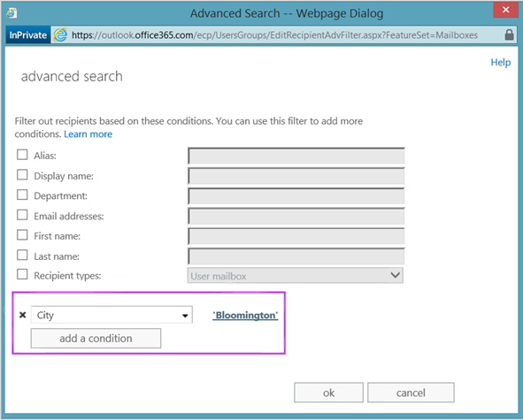

# <a name="why-you-need-to-use-office-365-powershell"></a>为什么您需要使用 Office 365 PowerShell

 **摘要：** 了解为什么必须使用 Office 365 PowerShell 管理 Office 365：在一些情况下是因为它更为高效，在另外一些情况下是因为必须这样做。
  
使用 Microsoft 365 管理中心, 不仅可以管理 office 365 用户帐户和许可证, 还可以管理 office 365 服务器产品: Exchange、Skype for business online 和 SharePoint online。 但是，也可以使用 Office 365 PowerShell 命令来管理这些元素，充分利用针对速度、自动化和其他功能的命令行和脚本语言环境。
  
在本文中，我们将向您展示使用 Office 365 PowerShell 管理 Office 365 的各种方式。
  
- Office 365 PowerShell 可能会显示你无法通过 Microsoft 365 管理中心看到的其他信息
    
- Office 365 拥有仅可使用 Office 365 PowerShell 配置的功能
    
- Office 365 PowerShell 善于执行批量操作
    
- Office 365 PowerShell 善于筛选数据
    
- Office 365 PowerShell 方便打印或保存数据
    
- Office 365 PowerShell 支持跨服务器产品管理
    
开始前，需要知道 Office 365 PowerShell 是一组 Windows PowerShell 模块，即可用于 Windows 服务和平台的命令行环境。此环境创建了可使用其他模块扩展的命令行界面语言，并提供了执行简单或复杂命令或脚本的方法。例如，安装 Office 365 PowerShell 模块并连接到 Office 365 订阅后，便可以运行下面的命令来列出 Microsoft Exchange Online 的所有用户邮箱：
  
```
Get-Mailbox
```

使用 Microsoft 365 管理中心也可以轻松地获取邮箱的列表, 但计算所有 web 应用程序的所有网站的所有列表中的项目数无法轻松完成。
  
请注意, office 365 PowerShell 旨在增强和增强管理 office 365 的能力, 而不是替换 Microsoft 365 管理中心。 作为 Office 365 管理员，必须至少习惯使用 Office 365 PowerShell，因为有些配置程序只能通过 Office 365 PowerShell 命令完成。 在这些情况下，需要了解如何：
  
- 安装 Office 365 PowerShell 模块（每台管理员计算机只能安装一次）。
    
- 连接至您的 Office 365 订阅（为每个 PowerShell 会话连接一次）。
    
- 收集运行所需 Office 365 PowerShell 命令所需的信息。
    
- 成功运行 Office 365 PowerShell 命令。
    
在学过这些基本技巧之后，您不需要使用 **Get-Mailbox** 命令列出您的邮箱用户，也不需要明白如何创建像前一个命令那样的新命令来计算您的所有 Web 应用的所有网站的所有列表中的项目数量。如果需要，Microsoft 和 Office 365 管理员社区可以帮到您。
  
## <a name="office-365-powershell-can-reveal-additional-information-that-you-cannot-see-with-the-microsoft-365-admin-center"></a>Office 365 PowerShell 可能会显示你无法通过 Microsoft 365 管理中心看到的其他信息

Microsoft 365 管理中心显示了大量有用的信息, 但这并不意味着它会显示 Office 365 存储在用户、许可证、邮箱和网站上的所有可能的信息。 下面的示例展示了 Microsoft 365 管理中心中的**用户和组**:
  

  
出于多种目的，这显示了你需要知道的信息。 但是，有时你需要了解更多。 例如, office 365 许可 (和用户可使用的 office 365 功能) 取决于该用户的地理位置。 向居住在美国的用户扩展的策略和功能可能与向居住在印度或比利时的用户扩展的策略和功能不同。 您可以使用 Microsoft 365 管理中心来确定用户的地理位置, 步骤如下:
  
1. 双击用户的"显示名称"。
    
2. 在用户属性显示窗格中，单击"详细信息"。
    
3. 在显示的详细信息中，单击"其他详细信息"。
    
4. 向下滚动，直到看见"国家或地区"标题：
    
     
  
5. 在一张纸上记下用户的显示名称和位置，或将其复制并粘贴至记事本中。 
    
您必须为每个用户重复此过程。对于许多用户来说，这可能是一项繁琐的任务。通过 Office 365 PowerShell，您可以使用以下命令为您的所有用户显示此信息：
  
```
Get-MsolUser | Select DisplayName, UsageLocation
```

> [!NOTE]
> 此命令将要求您安装 [Microsoft Azure Active Directory 模块](https://docs.microsoft.com/powershell/module/Azuread/?view=azureadps-2.0)。 
  
下面展示了显示内容示例：
  
```
DisplayName                               UsageLocation
-----------                               -------------
Bonnie Kearney                            GB
Fabrice Canel                             BR
Brian Johnson (TAILSPIN)                  US
Anne Wallace                              US
Alex Darrow                               US
David Longmuir                            BR
```

> [!TIP]
>  此 Office 365 PowerShell 命令的解释如下：在当前 Office 365 订阅中获取所有用户 (**Get-MsolUser**)，但仅显示每个用户的用户名和地理位置 (**Select DisplayName, UsageLocation**)。
  
因为 Office 365 PowerShell 支持命令行界面语言，您可以进一步操作从 **Get-MSolUser** 命令获取的信息。例如，或许您想要按用户位置对用户进行排序，将所有巴西用户、所有美国用户等进行分组。下面是命令：
  
```
Get-MsolUser | Select DisplayName, UsageLocation | Sort UsageLocation, DisplayName
```

下面展示了显示内容示例：
  
```
DisplayName                                 UsageLocation
-----------                                 -------------
David Longmuir                              BR
Fabrice Canel                               BR
Bonnie Kearney                              GB
Alex Darrow                                 US
Anne Wallace                                US
Brian Johnson (TAILSPIN)                    US
```

> [!TIP]
>  此 Office 365 PowerShell 命令的解释如下：在当前 Office 365 订阅中获取所有用户，但仅显示每个用户的用户名和地理位置，并先按地理位置排序，再按用户名排序 (**Sort UsageLocation, DisplayName**)。
  
还可以使用其他筛选条件。例如，如果只想查看巴西用户的信息，请使用下面的命令：
  
```
Get-MsolUser | Where {$_.UsageLocation -eq "BR"} | Select DisplayName, UsageLocation 
```

下面展示了显示内容示例：
  
```
DisplayName                                           UsageLocation
-----------                                           -------------
David Longmuir                                        BR
Fabrice Canel                                         BR
```

> [!TIP]
>  此 Office 365 PowerShell 命令的解释如下：获取当前 Office 365 订阅中地理位置是巴西的所有用户 (**Where {$\_.UsageLocation -eq "BR"}**)，再显示每个用户的用户名和地理位置。
  
 **有关较大域的快速说明**
  
如果您的域非常大，有数万个用户，那么尝试此文章中介绍的某些示例可能会带来"限制"。这说明，基于计算能力和可用网络带宽等因素，您每次尝试的操作有点多。正因为如此，较大型的组织可能要将某些 Office 365 PowerShell 命令拆分为两个命令。例如，这一个命令将返回所有用户帐户，并显示每个用户的名称和位置。
  
```
Get-MsolUser | Select DisplayName, UsageLocation
```

这对于较小的域非常有用。但在大型组织中，您可能需要将此命令拆分为两个命令：一个命令用于将用户帐户信息存储在一个变量中，另一个命令用于显示所需信息。如以下示例所示：
  
```
$x = Get-MsolUser
$x | Select DisplayName, UsageLocation
```


此组 Office 365 PowerShell 命令的解释如下：
- 获取当前 Office 365 订阅中的所有用户，并将信息存储在 $x 变量中 (**$x = Get-MsolUser**)。
- 显示变量 $x 的内容，但只包含每个用户的用户名和地理位置 (**$x | Select DisplayName, UsageLocation**)。
  
## <a name="office-365-has-features-that-you-can-only-configure-with-office-365-powershell"></a>Office 365 具有只能使用 Office 365 PowerShell 配置的功能

Microsoft 365 管理中心旨在提供对大多数用户适用的最常见或有意义的管理任务的访问权限。 换句话说, Microsoft 365 管理中心的设计是为了使典型管理员可以使用该工具执行最常见的管理任务。 通过此定义, 意味着有一些任务无法使用 Microsoft 365 管理中心完成。
  
例如，Skype for Business Online 管理中心提供用于创建自定义会议邀请的几个选项：
  

  
借助这些设置，您可以为会议邀请添加少许个性化和专业化。但是，与仅创建自定义会议邀请相比，它对会议配置设置的帮助更多。例如，默认情况下，会议允许：
  
- 匿名用户获取自动参与每个会议的权限。
    
- 与会者记录会议。
    
- 您组织中的所有用户在加入会议时被指定为演示者。
    
这些设置不是从 Skype for Business Online 管理中心提供。但是，您可以从 Office 365 PowerShell 控制它们。下面是一个禁用这三项设置的命令：
  
```
Set-CsMeetingConfiguration -AdmitAnonymousUsersByDefault $False -AllowConferenceRecording $False -DesignateAsPresenter "None"
```

> [!NOTE]
> 此命令要求必须安装 [Skype for Business Online PowerShell 模块](https://www.microsoft.com/download/details.aspx?id=39366)。 
  
> [!TIP]
>  此 Office 365 PowerShell 命令的解释如下：对于新 Skype for Business Online 会议的设置 (**Set-CsMeetingConfiguration**)，禁止匿名用户自动进入会议 (**-AdmitAnonymousUsersByDefault $False**)，禁止与会者录制会议 (**-AllowConferenceRecording $False**)，并且不将组织中的所有用户指定为演示者 (**-DesignateAsPresenter "None"**)。
  
如果改变了主意且希望还原这些默认设置（即启用所有设置），请运行下面的命令：
  
```
Set-CsMeetingConfiguration -AdmitAnonymousUsersByDefault $True -AllowConferenceRecording $True -DesignateAsPresenter "Company"
```

这仅是一个示例。当然还有其他示例，这就是为什么您作为 Office 365 管理员，需要习惯运行 Office 365 PowerShell 命令。
  
## <a name="office-365-powershell-is-great-at-carrying-out-bulk-operations"></a>Office 365 PowerShell 善于执行批量操作

以往, 当你执行一个操作时, 像 Microsoft 365 管理中心这样的可视界面非常有用。 例如, 如果您需要禁用一个用户帐户, 则可以使用 Microsoft 365 管理中心快速查找并清除复选框。 这可能比在 Office 365 PowerShell中执行类似操作更简单。
  
但是, 如果您必须在一大范围的其他内容中更改许多内容或所选的内容, Microsoft 365 管理中心可能无法充分利用你的时间。 例如, 如果您必须更改数以千计的电话号码前缀, 或者您需要从所有 SharePoint Online 网站中删除特定用户 (Ken Myer), 那么如何在 Microsoft 365 管理中心中执行此操作？
  
关于后一个示例，你拥有数百个 SharePoint Online 网站，但甚至不知道 Ken Meyer 是哪个群组的成员。 这意味着您必须从 Microsoft 365 管理中心开始, 然后对每个网站执行此过程:
  
1. 单击网站的"URL"。
    
2. 在"网站集属性"框中，单击"网站地址"链接以打开该网站。
    
3. 在网站上，单击"共享"。
    
4. 在"共享"对话框中，单击显示有权访问该网站的所有用户的链接：
    
     
  
5. 在"共享对象"对话框中，单击"高级"。
    
6. 向下滚动用户列表，找到并选择 Ken Myer（假设他有权访问该网站），然后单击"删除用户权限"。
    
对于数百个网站来说，这可能需要很长时间。
  
另一个方法是使用 Office 365 PowerShell 和以下命令从您的所有网站删除 Ken Myer：
  
```
Get-SPOSite | ForEach {Remove-SPOUser -Site $_.Url -LoginName "kenmyer@litwareinc.com"}
```

> [!NOTE]
> 此命令要求必须安装[连接到 SharePoint Online PowerShell](https://docs.microsoft.com/powershell/sharepoint/sharepoint-online/connect-sharepoint-online?view=sharepoint-ps)。 
  
> [!TIP]
>  此 Office 365 PowerShell 命令的解释如下：在当前 Office 365 订阅中获取所有 SharePoint 网站 (**Get-SPOSite**)，并对每个网站从可以访问它的用户列表中删除 Ken Meyer (**ForEach {Remove-SPOUser -Site $\_.Url -LoginName "kenmyer@litwareinc.com"}**)。
  
因为我们让 Office 365 从每个网站删除 Ken Meyer，包括那些他无权访问的网站，此命令的显示将对他当前无权访问的那些网站显示错误。 我们可以对此命令使用一个附加条件，使其仅从其登录列表中有 Key Meyer 的网站中删除他，但所列错误对网站本身没有任何坏处。 此命令可能需要几分钟的时间才能运行数百个网站, 而不是通过 Microsoft 365 管理中心工作数小时。
  
下面是另一个批量操作示例。使用此命令将新 SharePoint 管理员 Bonnie Kearney 添加到组织中的所有网站：
  
```
Get-SPOSite | ForEach {Add-SPOUser -Site $_.Url -LoginName "bkearney@litwareinc.com" -Group "Members"}
```

> [!TIP]
>  此 Office 365 PowerShell 命令的解释如下：在当前 Office 365 订阅中获取所有 SharePoint 网站，并对每个网站将 Bonnie Kearney 的登录名添加到网站成员组以允许她访问 (**ForEach {Add-SPOUser -Site $\_.Url -LoginName "bkearney@litwareinc.com" -Group "Members"}**)。
  
## <a name="office-365-powershell-is-great-at-filtering-data"></a>Office 365 PowerShell 善于筛选数据

Microsoft 365 管理中心提供了几种不同的筛选数据的方法, 以便快速轻松地找到目标信息子集。 例如，可以通过 Exchange 轻松筛选用户邮箱的几乎所有属性。 例如，下面是居住在布卢明顿市的所有用户的邮箱列表：
  

  
Exchange 管理中心还允许您组合筛选条件。例如，您可以查找居住在布卢明顿和在财务部门工作的所有用户的邮箱。 
  
但是，在 Exchange 管理中心有一些操作限制。例如，也许您想要查找居住在布卢明顿或圣地亚哥的用户的邮箱或所有不居住在布卢明顿的用户的邮箱。 
  
通过 Office 365 PowerShell，使用此命令您可以获取居住在布卢明顿市或圣地亚哥市的所有用户的邮箱列表：
  
```
Get-User | Where {$_.RecipientTypeDetails -eq "UserMailbox" -and ($_.City -eq "San Diego" -or $_.City -eq "Bloomington")} | Select DisplayName, City
```

下面是显示的一个示例：
  
```
DisplayName                              City
-----------                              ----
Alex Darrow                              San Diego
Bonnie Kearney                           San Diego
Julian Isla                              Bloomington
Rob Young                                Bloomington
```

> [!TIP]
>  此 Office 365 PowerShell 命令的解释如下：在当前 Office 365 订阅中获取所有在圣地亚哥市或布卢明顿市有邮箱的用户 (**Where {$\_.RecipientTypeDetails -eq "UserMailbox" -and ($\_.City -eq "San Diego" -or $\_.City -eq "Bloomington")}**)，再显示每个用户的用户名和城市 (**Select DisplayName, City**)。
  
若要列出居住在布卢明顿之外的用户的所有邮箱，可以运行下面的命令：
  
```
Get-User | Where {$_.RecipientTypeDetails -eq "UserMailbox" -and $_.City -ne "Bloomington"} | Select DisplayName, City
```

下面展示了显示内容示例：
  
```
DisplayName                               City
-----------                               ----
MOD Administrator                         Redmond
Alex Darrow                               San Diego
Allie Bellew                              Bellevue
Anne Wallace                              Louisville
Aziz Hassouneh                            Cairo
Belinda Newman                            Charlotte
Bonnie Kearney                            San Diego
David Longmuir                            Waukesha
Denis Dehenne                             Birmingham
Garret Vargas                             Seattle
Garth Fort                                Tulsa
Janet Schorr                              Bellevue
```

> [!TIP]
>  此 Office 365 PowerShell 命令的解释如下：在当前 Office 365 订阅中获取所有拥有的邮箱不在布卢明顿市的用户 (**Where {$\_.RecipientTypeDetails -eq "UserMailbox" -and $\_.City -ne "Bloomington"}**)，再显示每个用户的用户名和城市。
  
您也可以在 Office 365 PowerShell 筛选器中使用通配符匹配部分名称。例如，假设您正在查找某个用户帐户，但是只记得其姓氏是 Anderson，或也许是 Henderson 或 Jorgenson。
  
您可以使用搜索工具在 Microsoft 365 管理中心内跟踪该用户并执行三种不同的搜索:
  
- 一次是搜索  *Anderson* 
    
- 一次是搜索  *Henderson* 
    
- 一次是搜索  *Jorgenson* 
    
因为所有这三个名称以"son"结尾，所以您可以让 Office 365 PowerShell 显示其名称以"son"结尾的所有用户。命令如下：
  
```
Get-User -Filter '{LastName -like "*son"}'
```

> [!TIP]
>  此 Office 365 PowerShell 命令的解释如下：在当前 Office 365 订阅中获取所有用户，但使用仅列出姓以“son”结尾的用户的筛选器 (**-Filter '{LastName -like "\*son"}'**)。\* 代表任何一组字符；如果是用户的姓，则为字母。
  
## <a name="office-365-powershell-makes-it-easy-to-print-or-save-data"></a>Office 365 PowerShell 方便打印或保存数据

Microsoft 365 管理中心允许你查看数据列表。 下面是显示已启用 Skype for Business Online 的用户列表的 Skype for Business Online 管理中心的一个示例：
  

  
若要将该信息保存到一个文件，必须复制并将其粘贴到一个文档或 Excel。 在任一种情况下，该副本可能需要附加的格式设置。 此外, Microsoft 365 管理中心不提供直接打印显示列表的方法。
  
幸运的是，您不仅可以使用 Office 365 PowerShell 显示列表，而且还可以将其保存到可轻松导入 Excel 的文件。下面是一个将 Skype for Business Online 用户数据保存为逗号分隔值 (CSV) 文件（一个可轻松导入为 Excel 工作表中的表的文件）的示例命令：
  
```
Get-CsOnlineUser | Select DisplayName, UserPrincipalName, UsageLocation | Export-Csv -Path "C:\Logs\SfBUsers.csv" -NoTypeInformation
```

下面是显示的一个示例：
  

  
> [!TIP]
>  此 Office 365 PowerShell 命令的解释如下：在当前 Office 365 订阅中获取所有 Skype for Business Online 用户 (**Get-CsOnlineUser**)，仅获取用户名、UPN 和地理位置 (**Select DisplayName, UserPrincipalName, UsageLocation**)，再将信息保存到 CSV 文件 C:\\Logs\\SfBUsers.csv (**Export-Csv -Path "C:\\Logs\\SfBUsers.csv" -NoTypeInformation**)。
  
您可以使用选项将此列表另存为 XML 文件或 HTML 页。事实上，通过其他 PowerShell 命令，您可以将其直接保存为 Excel 文件，该文件具有所需的所有自定义格式。 
  
您也可以将显示列表的 Office 365 PowerShell 命令输出直接发送到 Windows 中的默认打印机。下面是一个示例命令：
  
```
Get-CsOnlineUser | Select DisplayName, UserPrincipalName, UsageLocation | Out-Printer
```

打印的文档如下所示：
  

  
> [!TIP]
>  此 Office 365 PowerShell 命令的解释如下：在当前 Office 365 订阅中获取所有 Skype for Business Online 用户，仅获取用户名、UPN 和地理位置，再将信息发送到默认 Windows 打印机 (**Out-Printer**)。
  
打印文档与 Office 365 PowerShell 命令窗口内的显示内容采用相同的简易格式。不过，创建 Office 365 PowerShell 命令列出所需内容后，只需将 **| Out-Printer** 添加到命令末尾，即可获得要操作的打印件。
  
## <a name="office-365-powershell-lets-you-manage-across-server-products"></a>Office 365 PowerShell 支持跨服务器产品管理

组成 Office 365 的不同组件旨在协同工作。例如，假设您向 Office 365 中添加新用户，并指定诸如用户所属的部门和电话号码之类的信息。您可以通过以下任意一款 Office 365 服务器产品访问此类用户信息：Skype for Business Online、Exchange 或 SharePoint Online。
  
不过，此规则适用于跨产品套件的一般信息。特定于产品的信息 - 例如，用户的 Exchange 邮箱的有关信息 - 通常无法跨套件提供。例如，如果您想要知道用户邮箱是否启用，该信息将仅可在 Exchange 管理中心获得。 
  
假设您要为您的所有用户生成显示以下信息的报告：
  
- 用户的显示名称
    
- 用户是否获得 Office 365 许可
    
- 用户的 Exchange 邮箱是否已启用
    
- 用户是否已启用 Skype for Business Online
    
您当前无法使用 Microsoft 365 管理中心来轻松生成此类报告。 相反, 您必须创建单独的文档来存储信息 (如 Excel 工作表), 并从 Microsoft 365 管理中心获取所有用户名和许可信息, 从 Exchange 管理中心获取邮箱信息, 获取 Skype for来自 Skype for business online 管理中心的商业在线信息, 然后整理和组合这些信息。
  
另一种方法是使用 Office 365 PowerShell 脚本编译该报告。
  
以下示例脚本会比到目前为止在本文中看到的命令更复杂。但它显示了使用 Office 365 PowerShell 来创建很难用其他方式创建的信息视图的可能性。下面是可以编译并显示所需列表的脚本：
  
```
$x = Get-MsolUser

foreach ($i in $x)
    {
      $y = Get-Mailbox -Identity $i.UserPrincipalName
      $i | Add-Member -MemberType NoteProperty -Name IsMailboxEnabled -Value $y.IsMailboxEnabled

      $y = Get-CsOnlineUser -Identity $i.UserPrincipalName
      $i | Add-Member -MemberType NoteProperty -Name EnabledForSfB -Value $y.Enabled
    }

$x | Select DisplayName, IsLicensed, IsMailboxEnabled, EnabledforSfB
```

下面展示了显示内容示例：
  
```
DisplayName             IsLicensed   IsMailboxEnabled   EnabledForSfB
-----------             ----------   ----------------   --------------
Bonnie Kearney          True         True               True
Fabrice Canel           True         True               True
Brian Johnson           False        True               False
Anne Wallace            True         True               True
Alex Darrow             True         True               True
David Longmuir          True         True               True
Katy Jordan             False        True               False
Molly Dempsey           False        True               False
```

此 Office 365 PowerShell 脚本的解释如下：  
- 获取当前 Office 365 订阅中的所有用户，并将信息存储在 $x 变量中 (**$x = Get-MsolUser**)。
- 启动对 $x 变量中的所有用户运行的循环 (**foreach ($i in $x)**)。  
- 定义 $y 变量，并将用户的邮箱信息存储在其中 (**$y = Get-Mailbox -Identity $i.UserPrincipalName**)。
- 将新属性添加到 IsMailBoxEnabled 用户信息，并将它设置为用户邮箱的 IsMailBoxEnabled 属性值(**$i | Add-Member -MemberType NoteProperty -Name IsMailboxEnabled -Value $y.IsMailboxEnabled**)。
- 定义 $y 变量，并将用户的 Skype for Business Online 信息存储在其中 (**$y = Get-CsOnlineUser -Identity $i.UserPrincipalName**)。
- 将新属性添加到 EnabledForSfB 用户信息，并将它设置为用户的 Skype for Business Online 信息的 Enabled 属性值 (**$i | Add-Member -MemberType NoteProperty -Name EnabledForSfB -Value $y.Enabled**)。
- 显示用户列表，但仅包括用户名、是否获得许可，以及两个指示是否已启用邮箱和是否已启用 Skype for Business Online 的新属性 (**$x | Select DisplayName, IsLicensed, IsMailboxEnabled, EnabledforSfB**)。
  
## <a name="see-also"></a>另请参阅

[Office 365 PowerShell 入门](getting-started-with-office-365-powershell.md)
  
[使用 Office 365 PowerShell 管理用户帐户和许可证](manage-user-accounts-and-licenses-with-office-365-powershell.md)
  
[使用 Windows PowerShell 在 Office 365 中创建报告](use-windows-powershell-to-create-reports-in-office-365.md)

