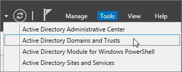

# <a name="prepare-a-non-routable-domain-for-directory-synchronization"></a><span data-ttu-id="1bf9c-103">非路由的域准备进行目录同步</span><span class="sxs-lookup"><span data-stu-id="1bf9c-103">Prepare a non-routable domain for directory synchronization</span></span>
<span data-ttu-id="1bf9c-p101">将内部部署目录同步与 Office 365 时必须具有 Azure Active Directory 中的已验证的域。仅用户主体名称 (UPN) 与内部部署域同步。但是，包含非路由的域，例如.local （如 billa@contoso.local)，任何 UPN 将同步到。 onmicrosoft.com 域 （如 billa@contoso.onmicrosoft.com)。</span><span class="sxs-lookup"><span data-stu-id="1bf9c-p101">When you synchronize your on-premises directory with Office 365 you have to have a verified domain in Azure Active Directory. Only the User Principal Names (UPN) that are associated with the on-premises domain are synchronized. However, any UPN that contains an non-routable domain, for example .local (like billa@contoso.local), will be synchronized to an .onmicrosoft.com domain (like billa@contoso.onmicrosoft.com).</span></span> 

<span data-ttu-id="1bf9c-107">如果您当前使用.local 域用户帐户在 Active Directory 中建议您更改它们以正确同步您的 Office 365 域与使用已验证的域 （如 billa@contoso.com)。</span><span class="sxs-lookup"><span data-stu-id="1bf9c-107">If you currently use a .local domain for your user accounts in Active Directory it's recommended that you change them to use a verified domain (like billa@contoso.com) in order to properly sync with your Office 365 domain.</span></span>
  
## <a name="what-if-i-only-have-a-local-on-premises-domain"></a><span data-ttu-id="1bf9c-108">如果只需.local 内部部署域？</span><span class="sxs-lookup"><span data-stu-id="1bf9c-108">What if I only have a .local on-premises domain?</span></span>

<span data-ttu-id="1bf9c-p102">最近工具可用于将您的 Active Directory 与 Azure Active Directory 同步名为 Azure AD 连接。有关详细信息，请参阅[将您的本地标识与 Azure Active Directory 集成](https://go.microsoft.com/fwlink/p/?LinkId=624168)。</span><span class="sxs-lookup"><span data-stu-id="1bf9c-p102">The most recent tool you can use for synchronizing your Active Directory to Azure Active Directory is named Azure AD Connect. For more information, see [Integrating your on-premises identities with Azure Active Directory](https://go.microsoft.com/fwlink/p/?LinkId=624168).</span></span>
  
<span data-ttu-id="1bf9c-p103">Azure AD 连接同步用户的 UPN 和密码，以便用户可以对这些用户使用在本地使用相同的凭据。但是，Azure AD 连接仅同步到 Office 365 验证的域的用户。这意味着，还验证域的 Azure Active Directory 因为由 Azure Active Directory 管理 Office 365 标识。换句话说，域必须是有效的 Internet 域 （例如，.com、.org、.net、.us 等。）。如果内部 Active Directory 只使用不可路由的域 (例如，.local)，这可能不能与 Office 365 具有的已验证的域匹配。通过更改您的主域您本地 Active Directory 中或通过添加一个或多个 UPN 后缀，可以解决此问题。</span><span class="sxs-lookup"><span data-stu-id="1bf9c-p103">Azure AD Connect synchronizes your users' UPN and password so that users can sign in with the same credentials they use on-premises. However, Azure AD Connect only synchronizes users to domains that are verified by Office 365. This means that the domain also is verified by Azure Active Directory because Office 365 identities are managed by Azure Active Directory. In other words, the domain has to be a valid Internet domain (for example, .com, .org, .net, .us, etc.). If your internal Active Directory only uses a non-routable domain (for example, .local), this can't possibly match the verified domain you have on Office 365. You can fix this issue by either changing your primary domain in your on premises Active Directory, or by adding one or more UPN suffixes.</span></span>
  
### <a name="change-your-primary-domain"></a><span data-ttu-id="1bf9c-117">**更改您的主域**</span><span class="sxs-lookup"><span data-stu-id="1bf9c-117">**Change your primary domain**</span></span>

<span data-ttu-id="1bf9c-p104">更改为已验证在 Office 365 中，例如，contoso.com 域的主要域。每个用户都具有域 contoso.local 然后更新为 contoso.com。有关说明，请参阅[域重命名的工作方式](https://go.microsoft.com/fwlink/p/?LinkId=624174)。但是，这是一个非常所涉及的过程，并且更简单的解决方案是到[添加的 UPN 后缀，并更新其对用户](prepare-a-non-routable-domain-for-directory-synchronization.md#bk_register)，如下节中所示。</span><span class="sxs-lookup"><span data-stu-id="1bf9c-p104">Change your primary domain to a domain you have verified in Office 365, for example, contoso.com. Every user that has the domain contoso.local is then updated to contoso.com. For instructions, see [How Domain Rename Works](https://go.microsoft.com/fwlink/p/?LinkId=624174). This is a very involved process, however, and an easier solution is to [Add UPN suffixes and update your users to them](prepare-a-non-routable-domain-for-directory-synchronization.md#bk_register), as shown in the following section.</span></span>
  
### <a name="add-upn-suffixes-and-update-your-users-to-them"></a><span data-ttu-id="1bf9c-122">**添加的 UPN 后缀和为其更新您的用户**</span><span class="sxs-lookup"><span data-stu-id="1bf9c-122">**Add UPN suffixes and update your users to them**</span></span>

<span data-ttu-id="1bf9c-p105">您可以解决.local 问题您在 Office 365 中通过在 Active Directory 以匹配 （或多个域） 中注册新的 UPN 后缀或后缀的验证。注册新的后缀后，您将更新用户的 Upn，使用户帐户类似 billa@contoso.com.local 替换示例的新域名。</span><span class="sxs-lookup"><span data-stu-id="1bf9c-p105">You can solve the .local problem by registering new UPN suffix or suffixes in Active Directory to match the domain (or domains) you verified in Office 365. After you register the new suffix, you update the user UPNs to replace the .local with the new domain name for example so that a user account looks like billa@contoso.com.</span></span>
  
<span data-ttu-id="1bf9c-125">更新 Upn 用于的已验证的域后，即可将您的本地 Active Directory 与 Office 365 同步。</span><span class="sxs-lookup"><span data-stu-id="1bf9c-125">After you have updated the UPNs to use the verified domain,you are ready to synchronize your on-premises Active Directory with Office 365.</span></span>
  
 <span data-ttu-id="1bf9c-126">**步骤 1： 添加新的 UPN 后缀**</span><span class="sxs-lookup"><span data-stu-id="1bf9c-126">**Step 1: Add the new UPN suffix**</span></span>
  
1. <span data-ttu-id="1bf9c-127">在服务器上的 Active Directory 域服务 (AD DS) 上运行，在服务器管理器中选择**工具** \> **Active Directory 域和信任关系**。</span><span class="sxs-lookup"><span data-stu-id="1bf9c-127">On the server that Active Directory Domain Services (AD DS) runs on, in the Server Manager choose **Tools** \> **Active Directory Domains and Trusts**.</span></span>
    
    <span data-ttu-id="1bf9c-128">**或者，如果您没有 Windows Server 2012**</span><span class="sxs-lookup"><span data-stu-id="1bf9c-128">**Or, if you don't have Windows Server 2012**</span></span>
    
    <span data-ttu-id="1bf9c-129">按**Windows 密钥 + R**以打开**运行**对话框中，并 Domain.msc，然后键入，然后选择**确定**。</span><span class="sxs-lookup"><span data-stu-id="1bf9c-129">Press **Windows key + R** to open the **Run** dialog, and then type in Domain.msc, and then choose **OK**.</span></span>
    
    
  
2. <span data-ttu-id="1bf9c-131">在**Active Directory 域和信任关系**窗口中，右键单击**Active Directory 域和信任关系**，，然后选择**属性**。</span><span class="sxs-lookup"><span data-stu-id="1bf9c-131">On the **Active Directory Domains and Trusts** window, right-click **Active Directory Domains and Trusts**, and then choose **Properties**.</span></span>
    
    
  
3. <span data-ttu-id="1bf9c-133">在**UPN 后缀**选项卡上，在**备用 UPN 后缀**框中，键入新的 UPN 后缀或后缀，并选择**添加** \> **应用**。</span><span class="sxs-lookup"><span data-stu-id="1bf9c-133">On the **UPN Suffixes** tab, in the **Alternative UPN Suffixes** box, type your new UPN suffix or suffixes, and then choose **Add** \> **Apply**.</span></span>
    
    
  
    <span data-ttu-id="1bf9c-135">当您完成时添加后缀，请选择**确定**。</span><span class="sxs-lookup"><span data-stu-id="1bf9c-135">Choose **OK** when you're done adding suffixes.</span></span> 
    
 <span data-ttu-id="1bf9c-136">**步骤 2： 更改现有用户的 UPN 后缀**</span><span class="sxs-lookup"><span data-stu-id="1bf9c-136">**Step 2: Change the UPN suffix for existing users**</span></span>
  
1. <span data-ttu-id="1bf9c-137">在服务器上的 Active Directory 域服务 (AD DS) 上运行，在服务器管理器中选择**工具** \> **Active Directory Active Directory 用户和计算机**。</span><span class="sxs-lookup"><span data-stu-id="1bf9c-137">On the server that Active Directory Domain Services (AD DS) runs on, in the Server Manager choose **Tools** \> **Active Directory Active Directory Users and Computers**.</span></span>
    
    <span data-ttu-id="1bf9c-138">**或者，如果您没有 Windows Server 2012**</span><span class="sxs-lookup"><span data-stu-id="1bf9c-138">**Or, if you don't have Windows Server 2012**</span></span>
    
    <span data-ttu-id="1bf9c-139">按**Windows 密钥 + R**以打开**运行**对话框中，然后键入 Dsa.msc，，然后单击**确定**</span><span class="sxs-lookup"><span data-stu-id="1bf9c-139">Press **Windows key + R** to open the **Run** dialog, and then type in Dsa.msc, and then click **OK**</span></span>
    
2. <span data-ttu-id="1bf9c-140">选择一个用户，右键单击，然后选择**属性**。</span><span class="sxs-lookup"><span data-stu-id="1bf9c-140">Select a user, right-click, and then choose **Properties**.</span></span>
    
3. <span data-ttu-id="1bf9c-141">**帐户**选项卡上，在 UPN 后缀下拉列表，选择新的 UPN 后缀，，然后选择**确定**。</span><span class="sxs-lookup"><span data-stu-id="1bf9c-141">On the **Account** tab, in the UPN suffix drop-down list, choose the new UPN suffix, and then choose **OK**.</span></span>
    
    
  
4. <span data-ttu-id="1bf9c-143">完成这些步骤的每个用户。</span><span class="sxs-lookup"><span data-stu-id="1bf9c-143">Complete these steps for every user.</span></span>
    
    <span data-ttu-id="1bf9c-144">另外，您可以批量更新 UPN 后缀[还可以使用 Windows PowerShell，可以更改所有用户的 UPN 后缀](prepare-a-non-routable-domain-for-directory-synchronization.md#BK_Posh)。</span><span class="sxs-lookup"><span data-stu-id="1bf9c-144">Alternately you can bulk update the UPN suffixes [You can also use Windows PowerShell to change the UPN suffix for all users](prepare-a-non-routable-domain-for-directory-synchronization.md#BK_Posh).</span></span>
    
### <a name="you-can-also-use-windows-powershell-to-change-the-upn-suffix-for-all-users"></a><span data-ttu-id="1bf9c-145">**您还可以使用 Windows PowerShell 更改所有用户的 UPN 后缀**</span><span class="sxs-lookup"><span data-stu-id="1bf9c-145">**You can also use Windows PowerShell to change the UPN suffix for all users**</span></span>

<span data-ttu-id="1bf9c-p106">如果您有大量的用户更新，则更轻松地使用 Windows PowerShell。下面的示例使用[Get-ADUser](https://go.microsoft.com/fwlink/p/?LinkId=624312)和[设置 ADUser](https://go.microsoft.com/fwlink/p/?LinkId=624313) cmdlet 更改为 contoso.com 的所有 contoso.local 后缀。</span><span class="sxs-lookup"><span data-stu-id="1bf9c-p106">If you have a lot of users to update, it is easier to use Windows PowerShell. The following example uses the cmdlets [Get-ADUser](https://go.microsoft.com/fwlink/p/?LinkId=624312) and [Set-ADUser](https://go.microsoft.com/fwlink/p/?LinkId=624313) to change all contoso.local suffixes to contoso.com.</span></span> 

<span data-ttu-id="1bf9c-148">运行下面的 Windows PowerShell 命令，以更新为 contoso.com 的所有 contoso.local 后缀：</span><span class="sxs-lookup"><span data-stu-id="1bf9c-148">Run the following Windows PowerShell commands to update all contoso.local suffixes to contoso.com:</span></span>
    
  ```
  $LocalUsers = Get-ADUser -Filter {UserPrincipalName -like '*contoso.local'} -Properties userPrincipalName -ResultSetSize $null
  ```

  ```
  $LocalUsers | foreach {$newUpn = $_.UserPrincipalName.Replace("contoso.local","contoso.com"); $_ | Set-ADUser -UserPrincipalName $newUpn}
  ```
<span data-ttu-id="1bf9c-149">请参阅[Active Directory Windows PowerShell 模块](https://go.microsoft.com/fwlink/p/?LinkId=624314)，若要了解有关在 Active Directory 中使用 Windows PowerShell 的详细信息。</span><span class="sxs-lookup"><span data-stu-id="1bf9c-149">See [Active Directory Windows PowerShell module](https://go.microsoft.com/fwlink/p/?LinkId=624314) to learn more about using Windows PowerShell in Active Directory.</span></span> 

