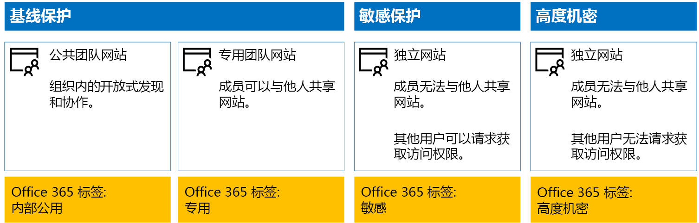
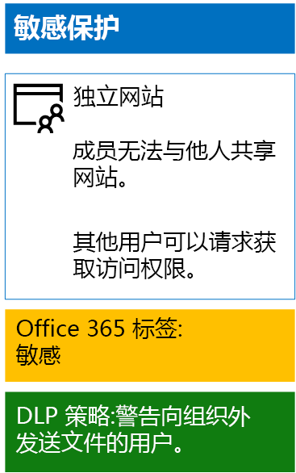
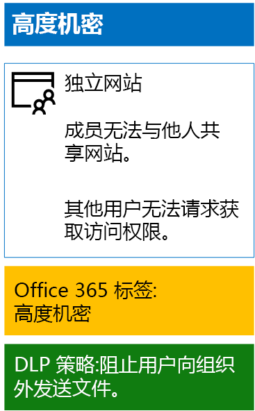

# <a name="protect-sharepoint-online-files-with-office-365-labels-and-dlp"></a><span data-ttu-id="618bd-103">Office 365 标签和 DLP 与 SharePoint Online 文件保护</span><span class="sxs-lookup"><span data-stu-id="618bd-103">Protect SharePoint Online files with Office 365 labels and DLP</span></span>

 <span data-ttu-id="618bd-104">**摘要：**Office 365 标签和数据丢失防护 (DLP) 将策略应用各种级别的信息保护的 SharePoint Online 团队站点的。</span><span class="sxs-lookup"><span data-stu-id="618bd-104">**Summary:** Apply Office 365 labels and data loss prevention (DLP) policies for SharePoint Online team sites with various levels of information protection.</span></span>
  
<span data-ttu-id="618bd-p101">使用本文中的步骤来设计和部署 Office 365 标签和基线，敏感和高度机密 SharePoint Online 团队站点的 DLP 策略。这些三个层次的保护有关的详细信息，请参阅[安全 SharePoint Online 网站和文件](secure-sharepoint-online-sites-and-files.md)。</span><span class="sxs-lookup"><span data-stu-id="618bd-p101">Use the steps in this article to design and deploy Office 365 labels and DLP policies for baseline, sensitive, and highly confidential SharePoint Online team sites. For more information about these three tiers of protection, see [Secure SharePoint Online sites and files](secure-sharepoint-online-sites-and-files.md).</span></span>
  
## <a name="office-365-labels-for-your-sharepoint-online-sites"></a><span data-ttu-id="618bd-107">SharePoint Online 网站的 office 365 标签</span><span class="sxs-lookup"><span data-stu-id="618bd-107">Office 365 labels for your SharePoint Online sites</span></span>

<span data-ttu-id="618bd-108">有三个阶段创建，然后将 Office 365 到 SharePoint Online 团队站点标签。</span><span class="sxs-lookup"><span data-stu-id="618bd-108">There are three phases to creating and then assigning Office 365 labels to SharePoint Online team sites.</span></span>
  
### <a name="phase-1-determine-the-office-365-label-names"></a><span data-ttu-id="618bd-109">第 1 阶段： 确定 Office 365 标签名称</span><span class="sxs-lookup"><span data-stu-id="618bd-109">Phase 1: Determine the Office 365 label names</span></span>

<span data-ttu-id="618bd-p102">在此阶段中，您将确定四个级别的信息保护应用于在线 SharePoint 工作组网站的 Office 365 标签的名称。下表列出了每个级别的建议的名称。</span><span class="sxs-lookup"><span data-stu-id="618bd-p102">In this phase, you determine the names of your Office 365 labels for the four levels of information protection applied to SharePoint Online team sites. The following table lists the recommended names for each level.</span></span>
  
|<span data-ttu-id="618bd-112">**SharePoint Online 团队站点保护级别**</span><span class="sxs-lookup"><span data-stu-id="618bd-112">**SharePoint Online team site protection level**</span></span>|<span data-ttu-id="618bd-113">**标签名称**</span><span class="sxs-lookup"><span data-stu-id="618bd-113">**Label name**</span></span>|
|:-----|:-----|
|<span data-ttu-id="618bd-114">比较基准公共</span><span class="sxs-lookup"><span data-stu-id="618bd-114">Baseline-Public</span></span>  <br/> |<span data-ttu-id="618bd-115">内部公众</span><span class="sxs-lookup"><span data-stu-id="618bd-115">Internal public</span></span>  <br/> |
|<span data-ttu-id="618bd-116">比较基准专用</span><span class="sxs-lookup"><span data-stu-id="618bd-116">Baseline-Private</span></span>  <br/> |<span data-ttu-id="618bd-117">专用</span><span class="sxs-lookup"><span data-stu-id="618bd-117">Private</span></span>  <br/> |
|<span data-ttu-id="618bd-118">敏感</span><span class="sxs-lookup"><span data-stu-id="618bd-118">Sensitive</span></span>  <br/> |<span data-ttu-id="618bd-119">敏感</span><span class="sxs-lookup"><span data-stu-id="618bd-119">Sensitive</span></span>  <br/> |
|<span data-ttu-id="618bd-120">高度机密</span><span class="sxs-lookup"><span data-stu-id="618bd-120">Highly Confidential</span></span>  <br/> |<span data-ttu-id="618bd-121">高度机密</span><span class="sxs-lookup"><span data-stu-id="618bd-121">Highly Confidential</span></span>  <br/> |
   
### <a name="phase-2-create-the-office-365-labels"></a><span data-ttu-id="618bd-122">第 2 阶段： 创建 Office 365 的标签</span><span class="sxs-lookup"><span data-stu-id="618bd-122">Phase 2: Create the Office 365 labels</span></span>

<span data-ttu-id="618bd-123">在此阶段中，创建，然后再发布确定的标签为不同级别的信息保护。</span><span class="sxs-lookup"><span data-stu-id="618bd-123">In this phase, you create and then publish your determined labels for the different levels of information protection.</span></span>
  
<span data-ttu-id="618bd-124">若要创建标签，可以使用 Office 365 管理中心或 Microsoft PowerShell。</span><span class="sxs-lookup"><span data-stu-id="618bd-124">To create the labels, you can use the Office 365 Admin center or Microsoft PowerShell.</span></span>
  
### <a name="create-office-365-labels-with-the-office-365-admin-center"></a><span data-ttu-id="618bd-125">使用 Office 365 管理中心创建 Office 365 标签</span><span class="sxs-lookup"><span data-stu-id="618bd-125">Create Office 365 labels with the Office 365 Admin center</span></span>

1. <span data-ttu-id="618bd-p103">Office 365 门户拥有安全管理员或公司管理员角色的帐户登录。有关帮助信息，请参阅[登录到 Office 365 的位置](https://support.office.com/Article/Where-to-sign-in-to-Office-365-e9eb7d51-5430-4929-91ab-6157c5a050b4)。</span><span class="sxs-lookup"><span data-stu-id="618bd-p103">Sign in to the Office 365 portal with an account that has the Security Administrator or Company Administrator role. For help, see [Where to sign in to Office 365](https://support.office.com/Article/Where-to-sign-in-to-Office-365-e9eb7d51-5430-4929-91ab-6157c5a050b4).</span></span>
    
2. <span data-ttu-id="618bd-128">**Microsoft Office 主页**选项卡中，单击**管理**拼贴。</span><span class="sxs-lookup"><span data-stu-id="618bd-128">From the **Microsoft Office Home** tab, click the **Admin** tile.</span></span>
    
3. <span data-ttu-id="618bd-129">您的浏览器的新**办公室管理中心**标签，请单击**中心管理 > 安全&amp;法规遵从性**。</span><span class="sxs-lookup"><span data-stu-id="618bd-129">From the new **Office Admin center** tab of your browser, click **Admin centers > Security &amp; Compliance**.</span></span>
    
4. <span data-ttu-id="618bd-130">从新**家庭-安全&amp;法规遵从性**选项卡上的浏览器中，单击**分类 > 标签**。</span><span class="sxs-lookup"><span data-stu-id="618bd-130">From the new **Home - Security &amp; Compliance** tab of your browser, click **Classifications > Labels**.</span></span>
    
5. <span data-ttu-id="618bd-131">从**主页 > 标签**窗格中，单击**创建一个标签**。</span><span class="sxs-lookup"><span data-stu-id="618bd-131">From the **Home > Labels** pane, click **Create a label**.</span></span>
    
6. <span data-ttu-id="618bd-132">在**标签名称**窗格中，键入标签的名称，然后单击**下一步**。</span><span class="sxs-lookup"><span data-stu-id="618bd-132">On the **Name your label** pane, type the name of the label, and then click **Next**.</span></span>
    
7. <span data-ttu-id="618bd-133">在**标签设置**窗格中，单击**下一步**。</span><span class="sxs-lookup"><span data-stu-id="618bd-133">On the **Label settings** pane, click **Next**.</span></span>
    
8. <span data-ttu-id="618bd-134">上的**查看设置**窗格中，单击**创建此标签**，然后单击**关闭**。</span><span class="sxs-lookup"><span data-stu-id="618bd-134">On the **Review your settings** pane, click **Create this label**, and then click **Close**.</span></span>
    
9. <span data-ttu-id="618bd-135">其他标签，请重复步骤 5 到 8。</span><span class="sxs-lookup"><span data-stu-id="618bd-135">Repeat steps 5-8 for your additional labels.</span></span>
    
### <a name="create-office-365-labels-with-powershell"></a><span data-ttu-id="618bd-136">使用 PowerShell 创建 Office 365 标签</span><span class="sxs-lookup"><span data-stu-id="618bd-136">Create Office 365 labels with PowerShell</span></span>

1. <span data-ttu-id="618bd-137">[连接到 Office 365 安全&amp;使用远程 PowerShell 的法规遵从性中心](http://go.microsoft.com/fwlink/?LinkID=799771&amp;clcid=0x409)，并指定具有安全管理员或公司管理员角色的帐户的凭据。</span><span class="sxs-lookup"><span data-stu-id="618bd-137">[Connect to the Office 365 Security &amp; Compliance Center using remote PowerShell](http://go.microsoft.com/fwlink/?LinkID=799771&amp;clcid=0x409) and specify the credentials of an account that has the Security Administrator or Company Administrator role.</span></span>
    
2. <span data-ttu-id="618bd-138">填写标签名称的列表，然后在 PowerShell 命令提示符下运行以下命令：</span><span class="sxs-lookup"><span data-stu-id="618bd-138">Fill out the list of label names, and then run these commands at the PowerShell command prompt:</span></span>
    
  ```
  $labelNames=@(<list of label names, each enclosed in quotes and separated by commas>)
ForEach ($element in $labelNames){ New-ComplianceTag -Name $element }
  ```

<span data-ttu-id="618bd-139">接下来，使用以下步骤来发布新的 Office 365 提供标签。</span><span class="sxs-lookup"><span data-stu-id="618bd-139">Next, use these steps to publish the new Office 365 labels.</span></span>
  
1. <span data-ttu-id="618bd-140">从**主页 > 标签**窗格中安全&amp;法规遵从性中心，单击**发布标签**。</span><span class="sxs-lookup"><span data-stu-id="618bd-140">From the **Home > Labels** pane the Security &amp; Compliance Center, click **Publish labels**.</span></span>
    
2. <span data-ttu-id="618bd-141">在**选择要发布的标签**窗格上，单击**发布选择标志**。</span><span class="sxs-lookup"><span data-stu-id="618bd-141">On the **Choose labels to publish** pane, click **Choose labels to publish**.</span></span>
    
3. <span data-ttu-id="618bd-142">在**选择标签**窗格中，单击**添加**，选择所有四个标签。</span><span class="sxs-lookup"><span data-stu-id="618bd-142">On the **Choose labels** pane, click **Add** and select all four labels.</span></span>
    
4. <span data-ttu-id="618bd-143">单击**完成**。</span><span class="sxs-lookup"><span data-stu-id="618bd-143">Click **Done**.</span></span>
    
5. <span data-ttu-id="618bd-144">在**选择要发布的标签**窗格上，单击**下一步**。</span><span class="sxs-lookup"><span data-stu-id="618bd-144">On the **Choose labels to publish** pane, click **Next**.</span></span>
    
6. <span data-ttu-id="618bd-145">在**选择位置**窗格中，单击**下一步**。</span><span class="sxs-lookup"><span data-stu-id="618bd-145">On the **Choose locations** pane, click **Next**.</span></span>
    
7. <span data-ttu-id="618bd-146">在**您的策略名称**窗格中，在**名称**中键入您的标签集的名称，然后单击**下一步**。</span><span class="sxs-lookup"><span data-stu-id="618bd-146">On the **Name your policy** pane, type a name for your set of labels in **Name**, and then click **Next**.</span></span>
    
8. <span data-ttu-id="618bd-147">上的**查看设置**窗格中，单击**发布标签**，然后单击**关闭**。</span><span class="sxs-lookup"><span data-stu-id="618bd-147">On the **Review your settings** pane, click **Publish labels**, and then click **Close**.</span></span>
    
### <a name="phase-3-apply-the-office-365-labels-to-your-sharepoint-online-sites"></a><span data-ttu-id="618bd-148">阶段 3： 将 Office 365 标签应用于您的 SharePoint Online 网站</span><span class="sxs-lookup"><span data-stu-id="618bd-148">Phase 3: Apply the Office 365 labels to your SharePoint Online sites</span></span>

<span data-ttu-id="618bd-149">使用下列步骤将 Office 365 标签应用于您在线 SharePoint 工作组网站的文档文件夹。</span><span class="sxs-lookup"><span data-stu-id="618bd-149">Use these steps to apply the Office 365 labels to the documents folders of your SharePoint Online team sites.</span></span>
  
1. <span data-ttu-id="618bd-150">从浏览器的**Microsoft Office 主页**选项卡上，单击**SharePoint**拼贴。</span><span class="sxs-lookup"><span data-stu-id="618bd-150">From the **Microsoft Office Home** tab of your browser, click the **SharePoint** tile.</span></span>
    
2. <span data-ttu-id="618bd-151">在浏览器中新**SharePoint**选项卡，单击需要分配一个 Office 365 提供标签的站点。</span><span class="sxs-lookup"><span data-stu-id="618bd-151">On the new **SharePoint** tab in your browser, click a site that needs an Office 365 label assigned.</span></span>
    
3. <span data-ttu-id="618bd-152">在新建 SharePoint 网站选项卡浏览器，单击**文档**。</span><span class="sxs-lookup"><span data-stu-id="618bd-152">In the new SharePoint site tab of your browser, click **Documents**.</span></span>
    
4. <span data-ttu-id="618bd-153">单击设置图标，然后单击**库设置**。</span><span class="sxs-lookup"><span data-stu-id="618bd-153">Click the settings icon, and then click **Library settings**.</span></span>
    
5. <span data-ttu-id="618bd-154">在**权限和管理**，请单击**应用于此库中的项目的标签**。</span><span class="sxs-lookup"><span data-stu-id="618bd-154">Under **Permissions and Management**, click **Apply label to items in this library**.</span></span>
    
6. <span data-ttu-id="618bd-155">在**设置应用标签**，选择适当的标签，，然后单击**保存**。</span><span class="sxs-lookup"><span data-stu-id="618bd-155">In **Settings-Apply Label**, select the appropriate label, and then click **Save**.</span></span>
    
7. <span data-ttu-id="618bd-156">关闭 SharePoint Online 网站选项卡。</span><span class="sxs-lookup"><span data-stu-id="618bd-156">Close the tab for the SharePoint Online site.</span></span>
    
8. <span data-ttu-id="618bd-157">重复步骤 3 至 8 将 Office 365 标签分配给其他 SharePoint Online 网站。</span><span class="sxs-lookup"><span data-stu-id="618bd-157">Repeat steps 3-8 to assign Office 365 labels to your additional SharePoint Online sites.</span></span>
    
<span data-ttu-id="618bd-158">下面是生成的配置。</span><span class="sxs-lookup"><span data-stu-id="618bd-158">Here is your resulting configuration.</span></span>
  

  
## <a name="dlp-policies-for-your-sharepoint-online-sites"></a><span data-ttu-id="618bd-160">SharePoint Online 网站的 DLP 策略</span><span class="sxs-lookup"><span data-stu-id="618bd-160">DLP policies for your SharePoint Online sites</span></span>

<span data-ttu-id="618bd-161">使用下列步骤来配置它们共享组织外的 SharePoint Online 敏感工作组网站上的文档时通知用户的 DLP 策略。</span><span class="sxs-lookup"><span data-stu-id="618bd-161">Use these steps to configure a DLP policy that notifies users when they share a document on a SharePoint Online sensitive team site outside the organization.</span></span>
  
1. <span data-ttu-id="618bd-162">从**Microsoft Office 主页**选项卡上的在浏览器中，单击**安全&amp;法规遵从性**平铺。</span><span class="sxs-lookup"><span data-stu-id="618bd-162">From the **Microsoft Office Home** tab in your browser, click the **Security &amp; Compliance** tile.</span></span>
    
2. <span data-ttu-id="618bd-163">对新**安全&amp;法规遵从性**在您的浏览器选项卡上，单击**数据丢失防范 > 策略**。</span><span class="sxs-lookup"><span data-stu-id="618bd-163">On the new **Security &amp; Compliance** tab in your browser, click **Data loss prevention > Policy**.</span></span>
    
3. <span data-ttu-id="618bd-164">在**数据丢失防范**窗格中，单击**+ 创建策略**。</span><span class="sxs-lookup"><span data-stu-id="618bd-164">In the **Data loss prevention** pane, click **+ Create a policy**.</span></span>
    
4. <span data-ttu-id="618bd-165">在**从模板开始创建自定义策略或**窗格中，单击**自定义**，然后单击**下一步**。</span><span class="sxs-lookup"><span data-stu-id="618bd-165">In the **Start with a template or create a custom policy** pane, click **Custom**, and then click **Next**.</span></span>
    
5. <span data-ttu-id="618bd-166">**名称您的策略**中，在**名称**中键入的敏感级 DLP 策略的名称，然后单击**下一步**。</span><span class="sxs-lookup"><span data-stu-id="618bd-166">In the **Name your policy** pane, type the name for the sensitive level DLP policy in **Name**, and then click **Next**.</span></span>
    
6. <span data-ttu-id="618bd-167">在**选择位置**窗格中，**让我来选择特定的位置**，请单击，然后单击**下一步**。</span><span class="sxs-lookup"><span data-stu-id="618bd-167">In the **Choose locations** pane, click **Let me choose specific locations**, and then click **Next**.</span></span>
    
7. <span data-ttu-id="618bd-168">在位置列表中，禁用**Exchange 电子邮件**帐户和**OneDrive 帐户**位置，然后单击**下一步**。</span><span class="sxs-lookup"><span data-stu-id="618bd-168">In the list of locations, disable the **Exchange email** and **OneDrive accounts** locations, and then click **Next**.</span></span>
    
8. <span data-ttu-id="618bd-169">在**自定义类型您想要保护的敏感信息**窗格中，单击**编辑**。</span><span class="sxs-lookup"><span data-stu-id="618bd-169">In the **Customize the types of sensitive info you want to protect** pane, click **Edit**.</span></span>
    
9. <span data-ttu-id="618bd-170">在**选择要保护的内容的类型**窗格中，单击下拉列表框中，**添加**，然后单击**标签**。</span><span class="sxs-lookup"><span data-stu-id="618bd-170">In the **Choose the types of content to protect** pane, click **Add** in the drop-down box, and then click **Labels**.</span></span>
    
10. <span data-ttu-id="618bd-171">在**标签**窗格中，单击**+ 添加**，选择**敏感**标签，单击**添加**，然后单击**完成**。</span><span class="sxs-lookup"><span data-stu-id="618bd-171">In the **Labels** pane, click **+ Add**, select the **Sensitive** label, click **Add**, and then click **Done**.</span></span>
    
11. <span data-ttu-id="618bd-172">在**选择要保护的内容的类型**窗格中，单击**保存**。</span><span class="sxs-lookup"><span data-stu-id="618bd-172">In the **Choose the types of content to protect** pane, click **Save**.</span></span>
    
12. <span data-ttu-id="618bd-173">在**自定义类型您想要保护的敏感信息**窗格中，单击**下一步**。</span><span class="sxs-lookup"><span data-stu-id="618bd-173">In the **Customize the types of sensitive info you want to protect** pane, click **Next**.</span></span>
    
13. <span data-ttu-id="618bd-174">在**您想要我们检测敏感信息办？**窗格中，单击**自定义提示和电子邮件**。</span><span class="sxs-lookup"><span data-stu-id="618bd-174">In the **What do you want to do if we detect sensitive info?** pane, click **Customize the tip and email**.</span></span>
    
14. <span data-ttu-id="618bd-175">在**自定义策略的提示和电子邮件通知**窗格中，单击**自定义策略提示文本**。</span><span class="sxs-lookup"><span data-stu-id="618bd-175">In the **Customize policy tips and email notifications** pane, click **Customize the policy tip text**.</span></span>
    
15. <span data-ttu-id="618bd-176">在文本框中，键入或粘贴以下：</span><span class="sxs-lookup"><span data-stu-id="618bd-176">In the text box, type or paste in the following:</span></span>
    
  - <span data-ttu-id="618bd-p104">若要与组织外部的用户共享，下载该文件，然后将其打开。单击文件然后保护文档，然后使用密码加密和再指定一个强密码。在另一个电子邮件或其他通讯手段发送密码。</span><span class="sxs-lookup"><span data-stu-id="618bd-p104">To share with a user outside the organization, download the file and then open it. Click File, then Protect Document, and then Encrypt with Password, and then specify a strong password. Send the password in a separate email or other means of communication.</span></span>
    
    <span data-ttu-id="618bd-180">或者，键入或粘贴您的策略提示，指导用户如何共享您的组织之外的文件中。</span><span class="sxs-lookup"><span data-stu-id="618bd-180">Alternately, type or paste in your own policy tip that instructs users on how to share a file outside your organization.</span></span>
    
16. <span data-ttu-id="618bd-181">单击“**确定**”。</span><span class="sxs-lookup"><span data-stu-id="618bd-181">Click **OK**.</span></span>
    
17. <span data-ttu-id="618bd-182">在**您想要我们检测敏感信息办？**窗格中，清除**阻止某些人共享，并限制对内容的访问**复选框，然后单击**下一步**。</span><span class="sxs-lookup"><span data-stu-id="618bd-182">In the **What do you want to do if we detect sensitive info?** pane, clear the **Block people from sharing, and restrict access to shared content** check box, and then click **Next**.</span></span>
    
18. <span data-ttu-id="618bd-183">在**所需的策略或测试的事情，首先打开？**窗格中，单击**是，立即启用**，然后单击**下一步**。</span><span class="sxs-lookup"><span data-stu-id="618bd-183">In the **Do you want to turn on the policy or test things out first?** pane, click **Yes, turn it on right away**, and then click **Next**.</span></span>
    
19. <span data-ttu-id="618bd-184">在**查看设置**窗格上，单击**创建**，然后单击**关闭**。</span><span class="sxs-lookup"><span data-stu-id="618bd-184">In the **Review your settings** pane, click **Create**, and then click **Close**.</span></span>
    
<span data-ttu-id="618bd-185">这里是结果敏感 SharePoint Online 的团队站点的配置。</span><span class="sxs-lookup"><span data-stu-id="618bd-185">Here is your resulting configuration for sensitive SharePoint Online team sites.</span></span>
  

  
<span data-ttu-id="618bd-187">接下来，使用下列步骤配置 DLP 策略阻止用户时它们共享组织外的 SharePoint Online 高度机密的工作组网站上的文档。</span><span class="sxs-lookup"><span data-stu-id="618bd-187">Next, use these steps to configure a DLP policy that blocks users when they share a document on a SharePoint Online highly confidential team site outside the organization.</span></span>
  
1. <span data-ttu-id="618bd-188">从**Microsoft Office 主页**选项卡上的在浏览器中，单击**安全&amp;法规遵从性**平铺。</span><span class="sxs-lookup"><span data-stu-id="618bd-188">From the **Microsoft Office Home** tab in your browser, click the **Security &amp; Compliance** tile.</span></span>
    
2. <span data-ttu-id="618bd-189">对新**安全&amp;法规遵从性**在您的浏览器选项卡上，单击**数据丢失防范 > 策略**。</span><span class="sxs-lookup"><span data-stu-id="618bd-189">On the new **Security &amp; Compliance** tab in your browser, click **Data loss prevention > Policy**.</span></span>
    
3. <span data-ttu-id="618bd-190">在**数据丢失防范**窗格中，单击**+ 创建策略**。</span><span class="sxs-lookup"><span data-stu-id="618bd-190">In the **Data loss prevention** pane, click **+ Create a policy**.</span></span>
    
4. <span data-ttu-id="618bd-191">在**从模板开始创建自定义策略或**窗格中，单击**自定义**，然后单击**下一步**。</span><span class="sxs-lookup"><span data-stu-id="618bd-191">In the **Start with a template or create a custom policy** pane, click **Custom**, and then click **Next**.</span></span>
    
5. <span data-ttu-id="618bd-192">在**您的策略名称**窗格中，在**名称**中键入高度敏感级别 DLP 策略的名称，然后单击**下一步**。</span><span class="sxs-lookup"><span data-stu-id="618bd-192">In the **Name your policy** pane, type the name for the highly sensitive level DLP policy in **Name**, and then click **Next**.</span></span>
    
6. <span data-ttu-id="618bd-193">在**选择位置**窗格中，**让我来选择特定的位置**，请单击，然后单击**下一步**。</span><span class="sxs-lookup"><span data-stu-id="618bd-193">In the **Choose locations** pane, click **Let me choose specific locations**, and then click **Next**.</span></span>
    
7. <span data-ttu-id="618bd-194">在位置列表中，禁用**Exchange 电子邮件**帐户和**OneDrive 帐户**位置，然后单击**下一步**。</span><span class="sxs-lookup"><span data-stu-id="618bd-194">In the list of locations, disable the **Exchange email** and **OneDrive accounts** locations, and then click **Next**.</span></span>
    
8. <span data-ttu-id="618bd-195">在**自定义类型您想要保护的敏感信息**窗格中，单击**编辑**。</span><span class="sxs-lookup"><span data-stu-id="618bd-195">In the **Customize the types of sensitive info you want to protect** pane, click **Edit**.</span></span>
    
9. <span data-ttu-id="618bd-196">在**选择要保护的内容的类型**窗格中，单击下拉列表框中，**添加**，然后单击**标签**。</span><span class="sxs-lookup"><span data-stu-id="618bd-196">In the **Choose the types of content to protect** pane, click **Add** in the drop-down box, and then click **Labels**.</span></span>
    
10. <span data-ttu-id="618bd-197">**标签**的窗格中，单击**+ 添加**，选择**高度机密**标签，单击**添加**，然后单击**完成**。</span><span class="sxs-lookup"><span data-stu-id="618bd-197">In the **Labels** pane, click **+ Add**, select the **Highly Confidential** label, click **Add**, and then click **Done**.</span></span>
    
11. <span data-ttu-id="618bd-198">在**选择要保护的内容的类型**窗格中，单击**保存**。</span><span class="sxs-lookup"><span data-stu-id="618bd-198">In the **Choose the types of content to protect** pane, click **Save**.</span></span>
    
12. <span data-ttu-id="618bd-199">在**自定义类型您想要保护的敏感信息**窗格中，单击**下一步**。</span><span class="sxs-lookup"><span data-stu-id="618bd-199">In the **Customize the types of sensitive info you want to protect** pane, click **Next**.</span></span>
    
13. <span data-ttu-id="618bd-200">在**您想要我们检测敏感信息办？**窗格中，单击**自定义提示和电子邮件**。</span><span class="sxs-lookup"><span data-stu-id="618bd-200">In the **What do you want to do if we detect sensitive info?** pane, click **Customize the tip and email**.</span></span>
    
14. <span data-ttu-id="618bd-201">在**自定义策略的提示和电子邮件通知**窗格中，单击**自定义策略提示文本**。</span><span class="sxs-lookup"><span data-stu-id="618bd-201">In the **Customize policy tips and email notifications** pane, click **Customize the policy tip text**.</span></span>
    
15. <span data-ttu-id="618bd-202">在文本框中，键入或粘贴以下：</span><span class="sxs-lookup"><span data-stu-id="618bd-202">In the text box, type or paste in the following:</span></span>
    
  - <span data-ttu-id="618bd-p105">若要与组织外部的用户共享，下载该文件，然后将其打开。单击文件然后保护文档，然后使用密码加密和再指定一个强密码。在另一个电子邮件或其他通讯手段发送密码。</span><span class="sxs-lookup"><span data-stu-id="618bd-p105">To share with a user outside the organization, download the file and then open it. Click File, then Protect Document, and then Encrypt with Password, and then specify a strong password. Send the password in a separate email or other means of communication.</span></span>
    
    <span data-ttu-id="618bd-206">或者，键入或粘贴您的策略提示，指导用户如何共享您的组织之外的文件中。</span><span class="sxs-lookup"><span data-stu-id="618bd-206">Alternately, type or paste in your own policy tip that instructs users on how to share a file outside your organization.</span></span>
    
16. <span data-ttu-id="618bd-207">单击“**确定**”。</span><span class="sxs-lookup"><span data-stu-id="618bd-207">Click **OK**.</span></span>
    
17. <span data-ttu-id="618bd-208">在**您想要我们检测敏感信息办？**窗格中，选择**需要重写的理由**，然后再单击**下一步**。</span><span class="sxs-lookup"><span data-stu-id="618bd-208">In the **What do you want to do if we detect sensitive info?** pane, select **Require a business justification to override**, and then click **Next**.</span></span>
    
18. <span data-ttu-id="618bd-209">在**所需的策略或测试的事情，首先打开？**窗格中，单击**是，立即启用**，然后单击**下一步**。</span><span class="sxs-lookup"><span data-stu-id="618bd-209">In the **Do you want to turn on the policy or test things out first?** pane, click **Yes, turn it on right away**, and then click **Next**.</span></span>
    
19. <span data-ttu-id="618bd-210">在**查看设置**窗格上，单击**创建**，然后单击**关闭**。</span><span class="sxs-lookup"><span data-stu-id="618bd-210">In the **Review your settings** pane, click **Create**, and then click **Close**.</span></span>
    
<span data-ttu-id="618bd-211">这里是您得到高保密性 SharePoint Online 团队站点的配置。</span><span class="sxs-lookup"><span data-stu-id="618bd-211">Here is your resulting configuration for high confidentiality SharePoint Online team sites.</span></span>
  

  
## <a name="next-step"></a><span data-ttu-id="618bd-213">后续步骤</span><span class="sxs-lookup"><span data-stu-id="618bd-213">Next step</span></span>

[<span data-ttu-id="618bd-214">SharePoint Online Azure 的信息保护文件保护</span><span class="sxs-lookup"><span data-stu-id="618bd-214">Protect SharePoint Online files with Azure Information Protection</span></span>](protect-sharepoint-online-files-with-azure-information-protection.md)
    
## <a name="see-also"></a><span data-ttu-id="618bd-215">另请参阅</span><span class="sxs-lookup"><span data-stu-id="618bd-215">See Also</span></span>

[<span data-ttu-id="618bd-216">SharePoint Online 网站和文件保护</span><span class="sxs-lookup"><span data-stu-id="618bd-216">Secure SharePoint Online sites and files</span></span>](secure-sharepoint-online-sites-and-files.md)
  
[<span data-ttu-id="618bd-217">开发/测试环境中的安全 SharePoint Online 网站</span><span class="sxs-lookup"><span data-stu-id="618bd-217">Secure SharePoint Online sites in a dev/test environment</span></span>](secure-sharepoint-online-sites-in-a-dev-test-environment.md)
  
[<span data-ttu-id="618bd-218">为政治运动、 非营利性组织和其他敏捷组织的 Microsoft 安全指南</span><span class="sxs-lookup"><span data-stu-id="618bd-218">Microsoft Security Guidance for Political Campaigns, Nonprofits, and Other Agile Organizations</span></span>](microsoft-security-guidance-for-political-campaigns-nonprofits-and-other-agile-o.md)
  
[<span data-ttu-id="618bd-219">云应用和混合解决方案</span><span class="sxs-lookup"><span data-stu-id="618bd-219">Cloud adoption and hybrid solutions</span></span>](cloud-adoption-and-hybrid-solutions.md)


