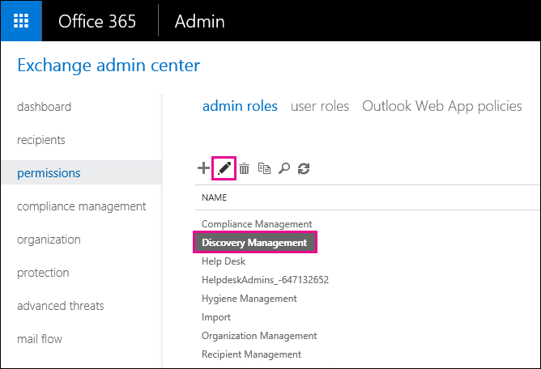
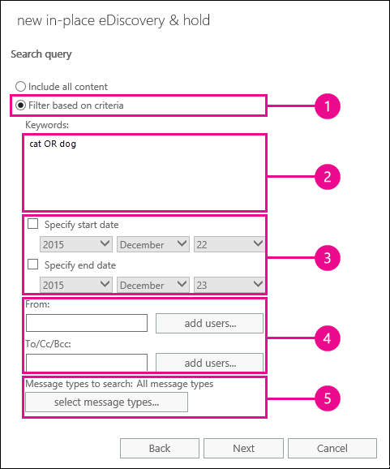

# 恢复用户邮箱中已删除的项目 - 管理员帮助Recover deleted items in a user mailbox - Admin Help

**本文适用于管理员。您是否正在尝试恢复您自己的邮箱中的已删除邮件？****This article is for administrators. Are you trying to recover deleted items in your own mailbox?** 尝试执行下列操作之一：Try one of the following:
- [在 Outlook for Windows 中恢复已删除项目Recover deleted items in Outlook for Windows](https://support.office.com/article/49e81f3c-c8f4-4426-a0b9-c0fd751d48ce)
- [在 Outlook Web App 中恢复已删除项目或电子邮件Recover deleted items or email in Outlook Web App](https://support.office.com/article/c3d8fc15-eeef-4f1c-81df-e27964b7edd4)
- [在 web 上的 Outlook 中还原已删除的电子邮件Restore deleted email messages in Outlook on the web](https://support.office.com/article/a8ca78ac-4721-4066-95dd-571842e9fb11)
- [Outlook.comOutlook.com](https://go.microsoft.com/fwlink/p/?LinkID=623435)
   
用户是否从其 Outlook 邮箱中永久删除了项目？Did a user permanently delete items from their Outlook mailbox? 用户希望它们回退，但无法恢复它们。The user wants them back but can't recover them. 如果清除的项目尚未从用户的邮箱中永久删除，则可以恢复这些清除的项目。You may be able recover the purged items if they haven't been permanently removed from the user's mailbox. 为此，可以使用 Exchange Online 中的就地电子数据展示工具在用户邮箱中搜索已删除的电子邮件和其他项目（如联系人、日历约会和任务）。You do this by using the In-Place eDiscovery tool in Exchange Online to search for deleted email and other items—and such as contacts, calendar appointments, and tasks—in a user's mailbox. 如果找到已删除的项目，则可以将其导出到 PST 文件（也称为 Outlook 数据文件），然后用户可以使用该文件将项目还原回其邮箱。If you find the deleted items, you can export them to a PST file (also called an Outlook Data File), which the user can then use to restore the items back to their mailbox.
  
以下是恢复用户邮箱中已删除项目的步骤。Here are the steps for recovering deleted items in a user's mailbox. 这将花费多长时间？How long will this take? 第一次可能需要20或30分钟才能完成所有步骤，具体取决于尝试恢复的项目数。The first time might take 20 or 30 minutes to complete all the steps, depending on how many items you're trying to recover.
  
> [!NOTE]
> 您必须是 Office 365 中的**Exchange 管理员**或**全局管理员**，或者是 exchange Online 中的 "组织管理" 角色组的成员，才能执行本文中的步骤。You have to be an **Exchange administrator** or **Global administrator** in Office 365 or be a member of the Organization Management role group in Exchange Online to perform the steps in this article. 有关详细信息，请参阅[关于 Office 365 管理员角色](https://support.office.com/article/da585eea-f576-4f55-a1e0-87090b6aaa9d)。For more information, see [About Office 365 admin roles](https://support.office.com/article/da585eea-f576-4f55-a1e0-87090b6aaa9d). 
  
## 步骤1：为自己分配电子数据展示权限Step 1: Assign yourself eDiscovery permissions

第一步是在 Exchange Online 中为自己分配必要的权限，以便您可以使用就地电子数据展示工具搜索用户的邮箱。The first step is to assign yourself the necessary permissions in Exchange Online so you can use the In-Place eDiscovery tool to search a user's mailbox. 您只需执行一次此操作。You only have to do this once. 如果您需要在将来搜索另一个邮箱，可以跳过此步骤。If you have to search another mailbox in the future, you can skip this step.
  
1. 使用您的工作或学校帐户[Where to sign in to Office 365 for business](https://support.office.com/article/e9eb7d51-5430-4929-91ab-6157c5a050b4)。[Where to sign in to Office 365 for business](https://support.office.com/article/e9eb7d51-5430-4929-91ab-6157c5a050b4) with your work or school account. 
    
2. 在左上角的 Office 中选择应用启动器图标，然后单击 "**管理**"。Select the app launcher icon  in the upper-left and click **Admin**.
    
3. 在 Microsoft 365 管理中心的左侧导航中，展开 "**管理中心**"，然后单击 " **Exchange**"。In the left navigation in the Microsoft 365 admin center, expand **Admin centers**, and then click **Exchange**.
    
    
  
4. 在 Exchange 管理中心中，单击 "**权限**"，然后单击 "**管理角色**"。In the Exchange admin center, click **Permissions**, and then click **Admin roles**.
    
5. 在列表视图中，选择 "**发现管理**"，然后单击 "**编辑**"。In the list view, select **Discovery Management**, and then click **Edit**.
    
    
  
6. 在 "**角色组**" 中的 "**成员**" 下](media/8ee52980-254b-440b-99a2-18d068de62d3.gif)，单击 "**添加**.
    
7. 在 "**选择成员**" 中，从名称列表中选择自己，单击 "**添加**"，然后单击 **"确定"**。In **Select Members**, select yourself from the list of names, click **Add**, and then click **OK**.
    
    > [!NOTE]
    > 您还可以添加您所属的组，例如 "组织管理" 或 "TenantAdmins"。You can also add a group that you are a member of, such as Organization Management or TenantAdmins. 如果添加一个组，则会向该组的其他成员分配运行就地电子数据展示工具所需的权限。If you add a group, other members of the group will be assigned the necessary permissions to run the In-Place eDiscovery tool. 
  
8. 在 "**角色组**" 中，单击 "**保存**"。In **Role Group**, click **Save**.
    
9. 注销 Office 365。Sign out of Office 365.
    
    必须先注销，然后才能开始下一步，以便新权限生效。You have to sign out before you start the next step so the new permissions will take effect.
    
> [!CAUTION]
> 发现管理角色组的成员可以访问敏感邮件内容。Members of the Discovery Management role group can access sensitive message content. 这包括搜索组织中的所有邮箱、预览搜索结果（和其他邮箱项目）、将结果复制到发现邮箱，以及将搜索结果导出到 PST 文件。This includes searching all mailboxes in your organization, previewing the search results (and other mailbox items), copying the results to a discovery mailbox, and exporting the search results to a PST file. 
  
[Return to topReturn to top](recover-deleted-items-in-a-mailbox.md)
  
## 步骤2：在用户的邮箱中搜索已删除的项目Step 2: Search the user's mailbox for deleted items

当您运行就地电子数据展示搜索时，搜索中的邮箱中的 "可恢复的项目" 文件夹将自动包含在搜索中。When you run an In-Place eDiscovery search, the Recoverable Items folder in the mailbox that you search is automatically included in the search. "可恢复的项目" 文件夹是指永久删除的项目的存储位置，直到将其从邮箱中清除（永久删除）。The Recoverable Items folder is where permanently deleted items are stored until they're purged (permanently removed) from the mailbox. 因此，如果尚未清除某个项目，则应该能够使用就地电子数据展示工具找到它。So, if an item hasn't been purged, you should be able to find it by using the In-Place eDiscovery tool.
  
1. 使用您的工作或学校帐户[Where to sign in to Office 365 for business](https://support.office.com/article/e9eb7d51-5430-4929-91ab-6157c5a050b4)。[Where to sign in to Office 365 for business](https://support.office.com/article/e9eb7d51-5430-4929-91ab-6157c5a050b4) with your work or school account. 
    
2. 在左上角的 Office 中选择应用启动器图标，然后单击 "**管理**"。Select the app launcher icon  in the upper-left and click **Admin**.
    
3. 在 Microsoft 365 管理中心的左侧导航中，展开 "**管理员**"，然后单击 " **Exchange**"。In the left navigation in the Microsoft 365 admin center, expand **Admin**, and then click **Exchange**.
    
4. 在 Exchange 管理中心中，单击 "**合规性管理**"，单击 "**就地&amp;电子数据展示保留**"，然后单击](media/8ee52980-254b-440b-99a2-18d068de62d3.gif)"**新建**.
    
    
  
5. 在 "**名称和说明**" 页上，键入搜索的名称（如要为其恢复电子邮件的用户的名称）、可选说明，然后单击 "**下一步**"。On the **Name and description** page, type a name for the search (such as the name of the user you're recovering email for), an optional description, and then click **Next**.
    
6. 在 "**邮箱**" 页上，单击 "**指定要搜索的邮箱**"，然后](media/8ee52980-254b-440b-99a2-18d068de62d3.gif)单击 "**添加**.
    
    
  
7. 查找并选择要恢复已删除电子邮件的用户的名称，单击 "**添加**"，然后单击 **"确定"**。Find and select the name of the user that you're recovering the deleted email for, click **Add**, and then click **OK**.
    
8. 单击“**下一步**”。Click **Next**.
    
    将显示 "**搜索查询**" 页。The **Search query** page is displayed. 你可以在此处定义搜索条件，以帮助你查找用户邮箱中缺少的项目。This is where you define the search criteria that will help you find the missing items in user's mailbox. 
    
9. 在“搜索查询”\*\*\*\* 页上，填写下列字段：On the **Search query** page, complete the following fields: 
    
  - **包含所有内容**选择此选项可将用户邮箱中的所有内容包含在搜索结果中。**Include all content** Select this option to include all content in the user's mailbox in the search results. 如果您选择此选项，则无法指定其他搜索条件。If you select this option, you can't specify additional search criteria. 
    
  - **基于条件进行筛选**选择此选项以指定搜索条件，包括关键词、开始和结束日期、发件人和收件人地址以及邮件类型。**Filter based on criteria** Select this option to specify the search criteria, including keywords, start and end dates, sender and recipient addresses, and message types. 
    
    
  
|**Field****Field**|**使用以下各 .。。****Use this to...**|
|:-----|:-----|
|             |指定关键字、日期范围、收件人和邮件类型。Specify keywords, date range, recipients, and message types.    |
|             |搜索带关键字或短语的邮件，并使用逻辑运算符（如**and**或**or**）。Search for messages with keywords or phrases, and use logical operators such as **AND** or **OR**.    |
|             |搜索在某个日期范围内发送或接收的邮件。Search for messages sent or received within a date range.    |
|             |搜索从特定人员接收或发送的邮件。Search for messages received from or sent to specific people.    |
|             |搜索所有邮件类型或选择特定的邮件类型。Search for all message types or select specific ones.    |
   
   > [!TIP]
   >  以下是有关如何构建搜索查询以查找缺失项目的一些提示。Here are a few tips about how to build a search query to find missing items. 尝试从用户处获取尽可能多的信息，以帮助您创建搜索查询，以便您可以找到要查找的内容。Try to get as much information from the user to help you create a search query so you can find what you're looking for. 如果您不确定如何查找缺失的邮件，请考虑使用 "**包括所有内容**" 选项。If you are not sure how to find a missing message, consider using the **Include all content** option. 搜索结果将包含用户的 "可恢复的项目" 文件夹中的所有项目，包括包含已被用户清除的项目的隐藏文件夹（称为 "清除文件夹"）。The search results will include all items in the user's Recoverable Items folder, including the hidden folder (called the Purges folder) that contain items that have been purged by the user. 然后，您可以转到步骤3，将结果复制到发现邮箱，并查看隐藏文件夹中的邮件。Then you can go to Step 3, copy the results to a discovery mailbox, and look at the message in the hidden folder. 如果您知道用户最初何时发送或接收丢失的邮件，请使用 "**指定开始日期**" 和 "**指定结束日期**" 选项提供日期范围。If you know approximately when the missing message was originally sent or received by the user, use the **Specify start date** and **Specify end date** options to provide a date range. 这将返回该日期范围内用户发送或接收的所有邮件。This will return all messages sent or received by the user within that date range. 指定日期范围是缩小搜索结果范围的一种非常好的方法。Specifying a date range is a really good way to narrow the search results. 如果您知道缺少的电子邮件的发件人，请使用 "**发**件人" 框指定此发件人。If you know who sent the missing email, use the **From** box to specify this sender. 如果要将搜索结果缩小为不同类型的邮箱项目，请单击 "**选择邮件类型**"，单击 **"选择要搜索的邮件类型**"，然后选择要搜索的特定邮件类型。If you want to narrow the search results to different types of mailbox items, click **Select message types**, click **Select the message types to search**, and then choose a specific message type to search for. 例如，可以仅搜索日历项目或联系人。For example, you can search only for calendar items or contacts. 以下是您可以搜索的不同邮件类型的屏幕截图。默认值为搜索所有邮件类型。Here's a screenshot of the different message types you can search for; the default is to search for all message types. 
  
   完成**搜索查询**页后，单击 "**下一步**"。Click **Next** when you've completed the **Search query** page. 
    
10. 在 "**就地保留设置**" 页上，单击 "**完成**" 以启动搜索。On the **In-Place Hold settings** page, click **Finish** to start the search. 若要恢复已删除的电子邮件，没有理由将用户的邮箱置于保留状态。To recover deleted email, there's no reason to place the user's mailbox on hold. 
    
    启动搜索后，Exchange 将根据您指定的条件显示搜索将返回的总大小和项目数的估计值。After you start the search, Exchange will display an estimate of the total size and number of items that will be returned by the search based on the criteria you specified.
    
11. 选择刚刚创建的搜索，然后单击\*\*\*\*刷新" 以更新详细信息窗格中显示的信息。Select the search you just created and click **Refresh** to update the information displayed in the details pane. "**估计成功**状态" 指示搜索已完成。The status of **Estimate Succeeded** indicates that the search has finished. Exchange 还显示根据您在步骤9中指定的搜索条件，搜索找到的项目总数（及其大小）的估计值。Exchange also displays an estimate of the total number of items (and their size) found by the search based on the search criteria you specified in step 9. 
    
12. 在 "详细信息" 窗格中，单击 "**预览搜索结果**" 以查看找到的项目。In the details pane, click **Preview search results** to view the items that were found. 这可能会帮助您识别您要查找的项目。This might help you identify the item(s) that you're looking for. 如果找到要尝试恢复的项目，请转到步骤4，将搜索结果导出到 PST 文件。If you find the item(s) you're trying to recover, go to step 4 to export the search results to a PST file. 
    
    
  
13. 如果找不到您要查找的内容，可以通过选择搜索，单击 "**编辑**"，然后单击 "**搜索查询**" 来修改搜索条件。If you don't find what you're looking for, you can revise your search criteria by selecting the search, clicking **Edit**, and then clicking **Search query**. 更改搜索条件，然后重新运行搜索。Change the search criteria and then rerun the search.
    
[Return to topReturn to top](recover-deleted-items-in-a-mailbox.md)
  
## Optional步骤3：将搜索结果复制到发现邮箱(Optional) Step 3: Copy the search results to a discovery mailbox

如果无法通过预览搜索结果找到项目，或者如果您想要查看用户的 "可恢复的项目" 文件夹中的项目，则可以将搜索结果复制到特殊邮箱（称为发现邮箱），然后在 Outlook 网页 t 中打开该邮箱。o 查看实际项目。If you can't find an items by previewing the search results or if you want to see which items are in the user's Recoverable Items folder, then you can copy the search results to a special mailbox (called a discovery mailbox) and then open that mailbox in Outlook on the web to view the actual items. 复制搜索结果的最佳原因是，您可以查看用户的 "可恢复的项目" 文件夹中的项目。The best reason to copy the search results is so you can view the items in the user's Recoverable Items folder. 您尝试恢复的项目很可能位于 "清除" 子文件夹中。More than likely, the item you're trying to recover is located in the Purges subfolder. 
  
1. 在 Exchange 管理中心中，转到 "**合规性管理** \>就地**电子数据&amp;展示保留**"。In the Exchange admin center, go to **Compliance management** \> **In-Place eDiscovery &amp; Hold**.
    
2. 在搜索列表中，选择您在步骤2中创建的搜索。In the list of searches, select the search that you created in Step 2.
    
3. 单击\*\*\*\*搜索"，然后从下拉列表中单击 "**复制搜索结果**"。Click **Search**, and then click **Copy search results** from the drop-down list. 
    
    
  
4. 在 "**复制搜索结果**" 页上，单击 "**浏览**"。On the **Copy Search Results** page, click **Browse**.
    
    
  
5. 在 "**显示名称**" 下，单击 "**发现搜索邮箱**"，然后单击 **"确定"**。Under **Display Name**, click **Discovery Search Mailbox**, and then click **OK**.
    
    
  
    > [!NOTE]
    > 发现搜索邮箱是在 Office 365 组织中自动创建的默认发现邮箱。The Discovery Search Mailbox is a default discovery mailbox that is automatically created in your Office 365 organization. 
  
6. 返回到 "**复制搜索结果**" 页上，单击 "**复制**" 以开始将搜索结果复制到发现搜索邮箱的过程。Back on the **Copy Search Results** page, click **Copy** to start the process to copy the search results to the Discovery Search Mailbox. 
    
    
  
7. 单击\*\*\*\*刷新" 以更新有关显示在详细信息窗格中的复制状态的信息。Click **Refresh** to update the information about the copying status that is displayed in the details pane. 
    
8. 复制完成后，单击 "**打开**" 以打开 "发现搜索" 邮箱查看搜索结果。When the copying is complete, click **Open** to open the Discovery Search Mailbox to view the search results. 
    
    
  
    复制到发现搜索邮箱的搜索结果放置在与就地电子数据展示搜索同名的文件夹中。The search results copied to the Discovery Search Mailbox are placed in a folder that has the same name as the In-Place eDiscovery search. 您可以单击一个文件夹以显示该文件夹中的项目。You can click a folder to display the items in that folder.
    
    
  
    运行搜索时，也会搜索用户的 "可恢复的项目" 文件夹。When you run a search, the user's Recoverable Items folder is also searched. 这意味着，如果 "可恢复的项目" 文件夹中的项目满足搜索条件，则这些项目将包含在搜索结果中。That means if items in the Recoverable Items folder meet the search criteria, they are included in the search results. "删除" 文件夹中的项目是指用户永久删除的项目（通过从 "已删除邮件" 文件夹中删除项目，或通过选择它并按**Shift + Delete**。Items in the Deletions folder are items that the user permanently deleted (by deleting an item from the Deleted Items folder or by selecting it and pressing **Shift+Delete**. 用户可以使用 Outlook 或 web 上的 Outlook 中的 "恢复已删除邮件" 工具恢复删除文件夹中的项目。A user can use the Recover Deleted Items tool in Outlook or Outlook on the web to recover items in the Deletions folder. "清除" 文件夹中的项目是用户使用 "恢复已删除项目" 工具清除的项目，或者是应用于邮箱的策略自动清除的项目。Items in the Purges folder are items that the user purged by using the Recover Deleted Items tool or items they were automatically purged by a policy applied to the mailbox. 在这两种情况下，只有管理员才能恢复 "清除" 文件夹中的项目。In either case, only an admin can recover items in the Purges folder. 
    
    > [!TIP]
    > 如果用户无法使用 "可恢复的项目" 工具找到已删除的项目，但该项目仍是可恢复的（意味着它尚未从邮箱中永久删除），则它很可能位于 "清除" 文件夹中。If a user can't find a deleted item using the Recoverable Items tool, but that item is still recoverable (meaning that it hasn't been permanently removed from the mailbox), it's more than likely located in the Purges folder. 因此，请务必在 "清除" 文件夹中查找要为用户尝试恢复的已删除项目。So, be sure to look in the Purges folder for the deleted item you're trying to recover for a user. 
  
[Return to topReturn to top](recover-deleted-items-in-a-mailbox.md)
  
## 步骤4：将搜索结果导出到 PST 文件Step 4: Export the search results to a PST file

在您找到要为用户尝试恢复的项目后，下一步是将在步骤2中运行的搜索的结果导出到 PST 文件。After you find the item you're trying to recover for a user, the next step is to export the results from the search you ran in Step 2 to a PST file. 用户将在下一步中使用此 PST 文件，将已删除的项目还原到其邮箱。The user will use this PST file in the next step to restore the deleted item to their mailbox.
  
1. 在 Exchange 管理中心中，转到 "**合规性管理** \>就地**电子数据&amp;展示保留**"。In the Exchange admin center, go to **Compliance management** \> **In-Place eDiscovery &amp; Hold**.
    
2. 在搜索列表中，选择您在步骤2中创建的搜索。In the list of searches, select the search that you created in Step 2.
    
3. 单击 "**导出到 PST 文件**"。Click **Export to a PST file**.
    
    
  
4. 如果系统提示您安装电子数据展示导出工具，请单击 "**运行**"。If you're prompted to install the eDiscovery Export Tool, click **Run**.
    
5. 在 "电子数据展示 PST 导出" 工具中，单击 "**浏览**" 以指定要下载 PST 文件的位置。In the eDiscovery PST Export Tool, click **Browse** to specify the location where you want to download the PST file. 
    
    
  
    您可以忽略选项以启用重复数据删除并包括不可搜索项目。You can ignore the options to enable deduplication and include unsearchable items.
    
6. 单击 "**开始**" 将 PST 文件下载到您的计算机。Click **Start** to download the PST file to your computer. 
    
    **电子数据展示 PST 导出工具**显示有关导出过程的状态信息。The **eDiscovery PST Export Tool** displays status information about the export process. 导出完成后，可以在文件的下载位置访问该文件。When the export is complete, you can access the file in the location where it was downloaded. 
    
[Return to topReturn to top](recover-deleted-items-in-a-mailbox.md)
  
## 步骤5：将已恢复的项目还原到用户的邮箱Step 5: Restore the recovered items to the user's mailbox

最后一步是使用在步骤4中导出的 PST 文件将已恢复的项目还原到用户的邮箱中。The final step is to use the PST file that was exported in step 4 to restore the recovered items to the user's mailbox. 将 PST 文件发送给用户后，用户将执行此步骤的其余部分，以打开 PST 文件，然后将恢复的项目移至其邮箱中的其他文件夹。After you send the PST file to the user, the remainder of this step is performed by the user to open the PST file and then move the recovered items to another folder in their mailbox. 对于分步说明，您还可以向用户发送指向本主题的链接：[打开和关闭 Outlook 数据文件（.pst）](https://support.office.com/article/381b776d-7511-45a0-953a-0935c79d24f2)。For step-by-step instructions, you can also send the user a link to this topic: [Open and close Outlook Data Files (.pst)](https://support.office.com/article/381b776d-7511-45a0-953a-0935c79d24f2). 或者，您可以使用下面的 "PST 文件" 部分向用户发送一个指向 "[还原已删除邮件](recover-deleted-items-in-a-mailbox.md#restoredeleteditems)" 的链接，并要求他们执行这些步骤。Or you can send the user a link to the [Restore deleted items to a mailbox using a PST file](recover-deleted-items-in-a-mailbox.md#restoredeleteditems) section below and ask them to perform these steps. 
  
 **将 PST 文件发送给用户****Send the PST file to the user**
  
需要执行的最后一步是将在步骤4中导出的 PST 文件发送给用户。The final step that you need to perform is sending the PST file that was exported in step 4 to the user. 有几种方法可以实现此目的：There are a few ways to do this:
  
- 将 PST 文件附加到电子邮件。Attach the PST file to an email message. 如果将 Outlook 配置为阻止 PST 文件，则必须压缩该文件，然后将其附加到邮件中。If Outlook is configured to block PST files, then you will have to zip the file and then attach it to the message. 操作步骤如下：Here's how:
    
1. 在 Windows 资源管理器或文件资源管理器中，浏览到 PST 文件。In Windows Explorer or File Explorer, browse to the PST file.
    
2. 右键单击该文件，然后选择 "**发送到** \> **压缩（zipped）文件夹**"。Right-click the file, and then select **Send to** \> **Compressed (zipped) folder**. Windows 将创建一个新的 zip 文件，并为其提供与 PST 文件相同的名称。Windows creates a new zip file and gives it an identical name as the PST file.
    
3. 将压缩的 PST 文件附加到电子邮件，并将其发送给用户，然后可以通过单击该文件来对其进行解压缩。Attach the compressed PST file to an email message and send it to the user, who can then decompress the file just by clicking it.
    
- 将 PST 文件复制到用户可访问和检索的共享文件夹。Copy the PST file to a shared folder that the user can access and retrieve it.
    
下一节中的步骤由用户执行，以将已删除的项目还原到其邮箱。The steps in the next section are performed by the user to restore the deleted items to their mailbox.
  
 
**使用 PST 文件将已删除邮件还原到邮箱****Restore deleted items to a mailbox using a PST file**
  
您必须使用 Outlook 桌面应用程序使用 PST 文件还原已删除的项目。You have to use the Outlook desktop app to restore a deleted item by using a PST file. 您不能使用 Outlook Web App 或 Web 上的 Outlook 打开 PST 文件。You can't use Outlook Web App or Outlook on the web to open a PST file.
  
1. 在 Outlook 2013 或 Outlook 2016 中，单击 "**文件**" 选项卡。In Outlook 2013 or Outlook 2016, click the **File** tab. 
    
2. 单击 **" &amp;打开导出**"，然后单击 "**打开 Outlook 数据文件**"。Click **Open &amp; Export**, and then click **Open Outlook Data File**.
    
3. 浏览到您保存管理员发送的 PST 文件的位置。Browse to the location where you saved the PST file that your administrator sent.
    
4. 选择该 PST，然后单击 "**打开**"。Select the PST and then click **Open**.
    
    PST 文件显示在 Outlook 的左侧导航栏中。The PST file appears in the left-nav bar in Outlook.
    
    
  
5. 单击箭头以展开 PST 文件以及它下面的文件夹，找到要恢复的项目。Click the arrows to expand the PST file and the folders under it to locate the item you want to recover.
    
    
  
    > [!TIP]
    > 在 "清除" 文件夹中查找要恢复的项目。Look in the Purges folder for the item you want to recover. 这是清除的项目移至的隐藏文件夹。This is a hidden folder that purged items are moved to. 您的管理员恢复的项目很可能在此文件夹中。It's likely the item that your administrator recovered is in this folder. 
  
6. 右键单击要恢复的项目，然后单击 "**移动** \> **其他文件夹**"。Right-click the item you want to recover and then click **Move** \> **Other Folder**.
    
    
  
7. 若要将项目移到收件箱中，请单击 **"收件箱**"，然后单击 **"确定"**。To move the item to your inbox, click **Inbox**, and then click **OK**.
    
    **提示：** 若要恢复其他类型的项目，请执行下列操作之一：**Tip:** To recover other types of items, do one of the following: 
    
  - 若要恢复日历项目，请右键单击该项目，然后单击 "**移动** \> **其他文件夹** \> **日历**"。To recover a calendar item, right-click it, and then click **Move** \> **Other Folder** \> **Calendar**.
    
  - 若要恢复某个联系人，请右键单击该联系人，然后单击 "**移动** \> **其他文件夹** \> **联系人**"。To recover a contact, right-click it, and then click **Move** \> **Other Folder** \> **Contacts**.
    
  - 若要恢复某个任务，请右键单击该任务，然后单击 "**移动** \> **其他文件夹** \> **任务**"。To recover a task, right-click it, and then click **Move** \> **Other Folder** \> **Tasks**.
    

  
   > [!NOTE]
   > 日历项目、联系人和任务直接位于 "清除" 文件夹中，而不是在 "日历"、"联系人" 或 "任务" 子文件夹中。Calendar items, contacts, and tasks are located directly in the Purges folder, and not in a Calendar, Contacts, or Tasks subfolder. 不过，您可以按**类型**进行排序，以将相似类型的项目分组。However, you can sort by **Type** to group similar types of items. 
    
8. 完成恢复已删除项目后，右键单击左侧导航栏中的 PST 文件，然后选择 **"关闭" "pst 文件的名称"**。When you're finished recovering deleted items, right-click the PST file in the left-nav bar and select **Close "name of PST file"**.
    
[Return to topReturn to top](recover-deleted-items-in-a-mailbox.md)
  
## 详细信息More information

- 如果项目的已删除项目保留期尚未过期，则用户可能会恢复永久删除的项目。It might be possible for a user to recover a permanently deleted item if the deleted item retention period for the item hasn't expired. 作为管理员，您可能已指定 "可恢复的项目" 文件夹中的项目可用于恢复的时间。As an admin you may have specified how long items in the Recoverable Items folder are available for recovery. 例如，可能存在一个策略，用于删除用户的 "已删除邮件" 文件夹中的30天内的任何内容，以及允许用户将 "可恢复的项目" 文件夹中的项目恢复到另一个14天的其他策略。For example, there might be a policy that deletes anything that's been in a user's Deleted Items folder for 30 days, and another policy that lets users recover items in the Recoverable Items folder for up to another 14 days. 但是，在此14天之后，您可能仍可以使用本主题中的过程恢复用户邮箱中的项目。However, after this 14 days, you may still be able to recover an item in a user's mailbox by using the procedures in this topic.
    
- 如果项目尚未清除且已删除项目的保留期尚未过期，则用户可以恢复已删除项目。Users can recover a deleted item if it hasn't been purged and if the deleted item retention period for that item hasn't expired. 若要帮助用户恢复邮箱中的已删除邮件，请将其指向下列主题之一：To help users recover deleted items in their mailbox, point them to one of the following topics:
    
  - [在 Outlook for Windows 中恢复已删除项目Recover deleted items in Outlook for Windows](https://support.office.com/article/49e81f3c-c8f4-4426-a0b9-c0fd751d48ce)
    
  - [在 Outlook 2010 中恢复已删除邮件Recover deleted items in Outlook 2010](https://support.office.com/article/cd9dfe12-8e8c-4a21-bbbf-4bd103a3f1fe)
    
  - [在 Outlook Web App 中恢复已删除项目或电子邮件Recover deleted items or email in Outlook Web App](https://support.office.com/article/c3d8fc15-eeef-4f1c-81df-e27964b7edd4)
    
  - [在 web 上的 Outlook 中还原已删除的电子邮件Restore deleted email messages in Outlook on the web](https://support.office.com/article/a8ca78ac-4721-4066-95dd-571842e9fb11)
    
  - [在 Outlook 中恢复已删除的联系人Recover a deleted contact in Outlook](https://support.office.com/article/51c83288-6888-4dcd-8c99-4932daabf643)
    
  - [在 Outlook.com 中还原已删除的电子邮件Restore deleted email messages in Outlook.com](https://go.microsoft.com/fwlink/p/?LinkID=623435)
    
[Return to topReturn to top](recover-deleted-items-in-a-mailbox.md)
  

