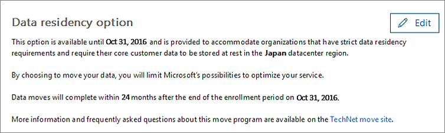
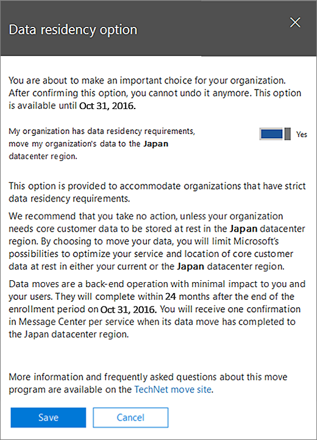

# 如何请求移动数据How to request your data move

> [!NOTE]
> 此页面上的信息仅适用于在其 geo 中的新数据中心启动前拥有现有 Office 365 租户的客户。The information on this page only applies to customers who had existing Office 365 tenants before the new datacenters in their geo launched. 
  
现有的 Office 365 客户需要在其所在国家/地区的最后期限前提交请求, 以便将参与 Office 365 服务的客户数据移到其新地理位置。Existing Office 365 customers will need to submit a request before the deadline for their country in order to have the customer data of their participating Office 365 services moved to their new geo. 
  
在每个地理位置的最后期限后, 我们无法接受要移动的请求。We are unable to accept requests to be moved after the deadline in each geo. 
  
## 何时可以请求移动？When can I request a move?

|**中付费地址的客户****Customers with billing address in**|**请求时间段开始****Request period begins**|**请求截止日期****Request deadline**|
|:-----|:-----|:-----|
|日本Japan    |2016年8月1日August 1, 2016    |2016年10月31日October 31, 2016    |
|澳大利亚、新西兰、斐济Australia, New Zealand, Fiji    |2016年8月1日August 1, 2016    |2016年10月31日October 31, 2016    |
|印度India    |2016年8月1日August 1, 2016    |2016年10月31日October 31, 2016    |
|加拿大Canada    |2016年8月1日August 1, 2016    |2016年10月31日October 31, 2016    |
|United Kingdom    |2017年3月15日March 15, 2017    |2017年9月15日September 15, 2017    |
|韩国South Korea    |5月1日, 2017May 1, 2017    |2017年10月31日October 31, 2017    |
|法国France    |2018年3月14日March 14, 2018    |2018年9月15日September 15, 2018    |
|阿拉伯联合酋长国United Arab Emirates    |相同Planned    |相同Planned    |
|南非South Africa    |相同Planned    |相同Planned    |
   
## 如何请求移动How to request a move

符合条件的客户将在其[Office 365 管理中心](https://aka.ms/365admin)中看到一个页面, 这将允许他们请求将其核心客户数据移动到其新的数据中心区域。Eligible customers will see a page in their [Office 365 Admin Center](https://aka.ms/365admin), which will allow them to request to have their core customer data moved to their new datacenter region.  
  
若要访问 Office 365 管理中心中的页面, 请在左侧的导航窗格中, 展开 "**设置**", 然后单击 "**组织配置文件**"。To access the page in the Office 365 admin center, in the navigation pane on the left, expand **Settings**, and then click **Organization Profile**.
  

  
在 "**组织配置文件**" 页上, 向下滚动到 "**数据常驻选项**" 部分。On the **Organization Profile** page, scroll down to the **Data Residency Option** section. 
  

  
**如果应用了以下情况之一, 则可能不会看到此部分**:**You may not see this section if one of the following apply**:
- 你的租户不符合移动计划。Your tenant is not eligible for the move program. 
- 您的所有数据都已位于 "新建地理位置 (请参阅" 页面的 "数据位置" 部分)。All of your data is already located in the new geo (see Data Location section of the page). 
  
> [!IMPORTANT]
> **你将为你的组织做出重要选择。确认下面的选项后, 将无法撤消。支持也无法撤消此决定。****You are about to make an important choice for your organization. After confirming the option below, you cannot undo it. Support is unable to reverse this decision as well.**
  
如果您的组织具有数据驻留要求, 而您需要请求移动, 请单击该部分右上部的 "**编辑**"。If your organization has data residency requirements, and you need to request a move, click **Edit** on the top right of the section. 屏幕右侧将显示一个新分区, 说明移动程序的详细信息。A new section will appear on the right side of your screen explaining the details of the move program. 选择显示 "是" 的文本旁边的切换按钮 **, 我的组织具有数据驻留要求**。Select the toggle button next to the text that says **Yes, my organization has data residency requirements**. 然后，单击“保存”\*\*\*\*。Then, click **Save**.
  

  
您应该会看到 "**数据驻留选项**" 部分中的文本发生更改, 以指示**您的组织已请求移动其核心客户数据。**You should see the text on the **Data Residency Option** section change to indicate **Your organization has requested to move its core customer data.** 您的邮件中心中也会有一条确认消息。You'll also have a confirmation message in your message center. 这将确认您是否已成功请求移动。This confirms that you have successfully requested a move. 

  
## 请求移动后会发生什么？What happens after requesting a move?

在请求移动后, 我们将计划在运营限制允许的情况下尽快移动你。After requesting a move, we will plan to move you as quickly as our operational constraints allow for. 由于许多约束的不可预知的性质, 我们无法共享特定的移动日期或时间范围。Due to the unpredictable nature of many of the constraints, we cannot share a specific date or timeframe for the moves. 在移动完成后, 你将看到一条通知。You will see a notification after the move has completed.
  
在您的国家/地区的请求期限内, 可能需要花费最长24个月的时间才能完成移动。Moves may take up to 24 months from the request deadline for your country to complete.
  
请求移动后, 不能更改所选内容, 因为我们在发出请求后开始处理移动。After requesting a move, it is not possible to change your selection as we begin to process the moves once you have made the request.
  
## Microsoft TeamsMicrosoft Teams

microsoft 团队尚不支持将 rest 中的客户内容从区域迁移到国家/地区数据中心, 在这些数据中心中, 可以使用 microsoft 团队的数据派驻服务。Microsoft Teams does not yet support migration of customer content at rest from in-region to in-country data centers where data residency for Microsoft Teams is available.  因此, 在 Microsoft 团队支持数据驻留的新区域中, 只有新客户的所有数据都存储在国家/地区。Therefore, only new customers will have all of their data stored within country in the new regions where Microsoft Teams supports data residency.  详细了解 Office 365 数据驻留在你的公司位置, 你的[数据位于何处？](https://products.office.com/where-is-your-data-located)Learn more about Office 365 data residency for your company location at [Where is your data located?](https://products.office.com/where-is-your-data-located)   

## 请求移动前的可选操作Optional actions before you request a move

根据需要执行以下步骤。Perform the following steps as appropriate.
  
### 如果使用基于 IP 的防火墙, 请为新 IP 地址添加允许规则If you use an IP-based firewall, add allow rules for the new IP addresses

我们建议使用防火墙而不是 IP 地址的 DNS 筛选。We recommend using DNS filtering for firewalls instead of IP addresses. 不需要任何新的 DNS 条目。There are no new DNS entries required.
  
如果使用基于 IP 的防火墙进行 Internet 连接, 则必须为目标数据中心地理位置的新 ip 地址添加允许规则。If you use an IP-based firewall for Internet connectivity, you must add allow rules for the new IP addresses for the destination datacenter geo. 新的数据中心信息的 IP 地址除了新服务器外, 还会连续添加到[Office 365 url 和 IP 地址范围](https://go.microsoft.com/fwlink/p/?LinkId=229631)。IP addresses for new datacenter geos in addition to new servers are continuously added to [Office 365 URLs and IP Address Ranges](https://go.microsoft.com/fwlink/p/?LinkId=229631).
  
有关如何添加允许规则 (也称为 "白名单") 的信息, 请参阅防火墙文档。Consult your firewall documentation for information about how to add allow rules (also known as whitelisting.)
  
添加 IP 地址后, 您可能需要测试与新数据中心地理位置的连接。After adding IP addresses, you may want to test connectivity to the new datacenter geo. 为此, 我们建议您在新的数据中心 geo 推出后立即创建一个[新的免费试用版](https://go.microsoft.com/fwlink/?LinkId=522463)租户。To do this, we recommend creating a [new free 30-day trial](https://go.microsoft.com/fwlink/?LinkId=522463) tenant as soon as the new datacenter geo is available. 
  
### 使用新租户进行测试Test using a new tenant

如果您想要在移动之前测试连接, 可以在新的数据中心 geo 可用后设置一个[新的免费30天试用租户](https://go.microsoft.com/fwlink/?LinkId=522463), 并使用它来体验新的数据中心地理位置承载的 Office 365。If you'd like to test connectivity prior to the move, you can set up a [new free 30-day trial tenant](https://go.microsoft.com/fwlink/?LinkId=522463) after the new datacenter geo is available, and use it to experience Office 365 hosted in the new datacenter geo. 
  
试用租户无法与现有租户结合使用:The trial tenant can't be combined with your existing tenant:
  
- 用户必须使用单独的试用帐户进行测试。Users must use a separate trial account for their testing.
    
- 没有办法在租户之间移动数据。There is no way to move data between tenants.
    
### 通知用户在移动设备上更新过期的 Exchange 设置Notify users to update out-of-date Exchange settings on mobile devices

如果用户具有将 Exchange Server 设置为 " **m.outlook.com** " 或 " **podxxxxx.outlook.com**" 的移动设备, 则建议他们切换到**outlook.office365.com**, 按照设置要[同步的移动设备中的说明进行操作。帐户](https://support.office.com/article/c9139caf-01ab-41a0-827c-3c06ee569ed3)。If users have a mobile device with the Exchange Server set to **m.outlook.com** or **podxxxxx.outlook.com**, we recommend that they switch to **outlook.office365.com**, following the instructions in [Set up a mobile device to synchronize with your account](https://support.office.com/article/c9139caf-01ab-41a0-827c-3c06ee569ed3).

## 相关主题Related topics

[将核心数据移动到新的 Office 365 数据中心信息Moving core data to new Office 365 datacenter geos](moving-data-to-new-datacenter-geos.md)

[数据移动常规常见问题Data move general FAQ](data-move-faq.md)

[适用于 Microsoft Dynamics CRM Online 的新数据中心信息New datacenter geos for Microsoft Dynamics CRM Online](https://go.microsoft.com/fwlink/p/?Linkid=615924)
  
[按区域的 Azure 服务Azure services by region](https://azure.microsoft.com/en-us/regions/)
  

