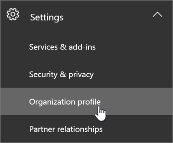

# 如何请求数据移动

> [!NOTE]
> 此页面上的信息仅适用于在其 geo 中的新数据中心启动前拥有现有 Office 365 租户的客户。 
  
现有 Office 365 客户有资格在 rest 上为整个组织的核心客户数据请求提前迁移。  
  
## 何时可以请求移动？

|**中付费地址的客户**|**请求时间段开始**|**请求截止日期**|
|:-----|:-----|:-----|
|日本    |2016年8月1日    |2016年10月31日    |
|澳大利亚、新西兰、斐济    |2016年8月1日    |2016年10月31日    |
|印度    |2016年8月1日    |2016年10月31日    |
|加拿大    |2016年8月1日    |2016年10月31日    |
|英国    |2017年3月15日    |2017年9月15日    |
|韩国    |5月1日，2017    |2017年10月31日    |
|法国    |2018年3月14日    |2018年9月15日    |
|阿拉伯联合酋长国    |2019 年 7 月 15 日    |2020年1月31日    |
|南非    |2019年7月25日    |2020年1月31日    |
   
## 如何请求移动

符合条件的客户将在其[管理中心](https://aka.ms/365admin)中看到一个页面，这将允许他们请求将其核心客户数据移动到其新的数据中心区域。  
  
若要访问 Microsoft 365 管理中心中的页面，请在左侧的导航窗格中，展开 "**设置**"，然后单击 "**组织配置文件**"。
  

  
在 "**组织配置文件**" 页上，向下滚动到 "**数据常驻选项**" 部分。 
  

  
**如果应用了以下情况之一，则可能不会看到此部分**：
- 你的租户不符合 Office 365 移动程序的条件。  资格由租户注册国家/地区决定。
- Rest 上的所有核心客户数据都已位于新地理位置（请参阅页面的 "数据位置" 部分）。 
  
如果您的组织具有数据驻留要求，并且您需要请求提前迁移，请单击部分右上方的 "**选择**"。 屏幕右侧将显示一个新分区，说明 Office 365 移动程序的详细信息。 选择 "**我想要迁移的我的组织的核心客户数据**" 的文本旁边的切换按钮。 然后，单击“保存”****。
  

  
您应该会看到 "**数据驻留**" 部分的文本更改，以指示**您的组织已请求移动其核心客户数据。** 您的邮件中心中也会有一条确认消息。 这将确认您是否已成功请求移动。 

  
## 请求移动后会发生什么？

在请求移动后，我们将计划在运营限制允许时尽快移动你。 由于许多约束的不可预知的性质，我们无法共享特定的移动日期或时间范围。 在移动完成后，你将看到一条通知。
  
在您的国家/地区的请求期限内，可能需要花费最长24个月的时间才能完成移动。
  
## Microsoft Teams

Microsoft 团队聊天和频道消息数据的迁移支持将添加到 Office 365 本地迁移计划中。  我们计划在2020年1月为所有符合条件的客户（包括以前选择参加 Exchange Online 和 SharePoint Online/OneDrive for Business 迁移的客户）打开程序注册。  我们将在 Microsoft 365 管理中心公开自愿加入控制，并将消息中心中的通知发送给所有符合条件的客户。   

## 请求移动前的可选操作

根据需要执行以下步骤。
  
### 如果使用基于 IP 的防火墙，请为新 IP 地址添加允许规则

我们建议使用防火墙而不是 IP 地址的 DNS 筛选。 不需要任何新的 DNS 条目。
  
如果使用基于 IP 的防火墙进行 Internet 连接，则必须为目标数据中心地理位置的新 IP 地址添加允许规则。 新的数据中心信息的 IP 地址除了新服务器外，还会连续添加到[Office 365 url 和 IP 地址范围](https://go.microsoft.com/fwlink/p/?LinkId=229631)。
  
有关如何添加允许规则（也称为 "白名单"）的信息，请参阅防火墙文档。
  
添加 IP 地址后，您可能需要测试与新数据中心地理位置的连接。 为此，我们建议您在新的数据中心 geo 推出后立即创建一个[新的免费试用版](https://go.microsoft.com/fwlink/?LinkId=522463)租户。 
  
### 使用新租户进行测试

如果您想要在移动之前测试连接，可以在新的数据中心 geo 可用后设置一个[新的免费30天试用租户](https://go.microsoft.com/fwlink/?LinkId=522463)，并使用它来体验新的数据中心地理位置承载的 Office 365。 
  
试用租户无法与现有租户结合使用：
  
- 用户必须使用单独的试用帐户进行测试。
    
- 没有办法在租户之间移动数据。
    
### 通知用户在移动设备上更新过期的 Exchange 设置

如果用户具有将 Exchange Server 设置为 " **m.outlook.com** " 或 " **podxxxxx.outlook.com**" 的移动设备，则建议他们切换到**outlook.office365.com**，按照[设置移动设备以与您的帐户同步](https://support.office.com/article/c9139caf-01ab-41a0-827c-3c06ee569ed3)的说明进行操作。

## 相关主题

[将核心数据移动到新的 Office 365 数据中心信息](moving-data-to-new-datacenter-geos.md)

[数据移动常见问题解答](data-move-faq.md)

[适用于 Microsoft Dynamics CRM Online 的新数据中心信息](https://go.microsoft.com/fwlink/p/?Linkid=615924)
  
[按区域的 Azure 服务](https://azure.microsoft.com/regions/)
  

