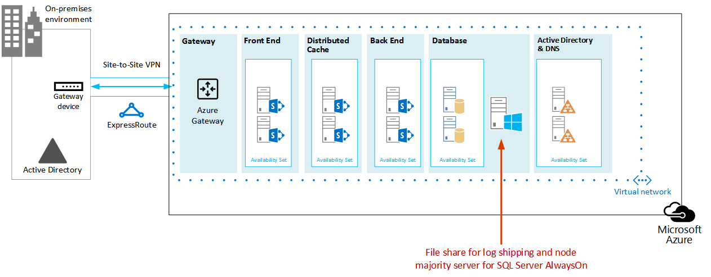

# <a name="sharepoint-server-2013-disaster-recovery-in-microsoft-azure"></a>Microsoft Azure 中的 SharePoint Server 2013 灾难恢复

 使用 Azure，可以为本地 SharePoint 服务器场创建灾难恢复环境。 本文介绍如何设计和实施此解决方案。

 **观看 SharePoint Server 2013 灾难恢复概述视频**
> [!VIDEO https://www.microsoft.com/videoplayer/embed/1b73ec8f-29bd-44eb-aa3a-f7932784bfd9?autoplay=false]
  
 When disaster strikes your SharePoint on-premises environment, your top priority is to get the system running again quickly. Disaster recovery with SharePoint is quicker and easier when you have a backup environment already running in Microsoft Azure. This video explains the main concepts of a SharePoint warm failover environment and complements the full details available in this article.
  
将本文与以下解决方案模型结合使用： **Microsoft Azure 中的 SharePoint 灾难恢复** 。
  
[](https://go.microsoft.com/fwlink/p/?LinkId=392555)
  
 [PDF](https://go.microsoft.com/fwlink/p/?LinkId=392555) |  [Visio](https://go.microsoft.com/fwlink/p/?LinkId=392554)
  
## <a name="use-azure-infrastructure-services-for-disaster-recovery"></a>使用 Azure 基础结构服务进行灾难恢复

Many organizations do not have a disaster recovery environment for SharePoint, which can be expensive to build and maintain on-premises. Azure Infrastructure Services provides compelling options for disaster recovery environments that are more flexible and less expensive than the on-premises alternatives.
  
使用 Azure 基础结构服务的优点如下：
  
- **Fewer costly resources** Maintain and pay for fewer resources than on-premises disaster recovery environments. The number of resources depends on which disaster-recovery environment you choose: cold standby, warm standby, or hot standby.
    
- **Better resource flexibility** In the event of a disaster, easily scale out your recovery SharePoint farm to meet load requirements. Scale in when you no longer need the resources.
    
- **数据中心承诺更低** 使用 Azure 基础结构服务，而不是在其他地区投资建设辅助数据中心。
    
There are less-complex options for organizations just getting started with disaster recovery and advanced options for organizations with high-resilience requirements. The definitions for cold, warm, and hot standby environments are a little different when the environment is hosted on a cloud platform. The following table describes these environments for building a SharePoint recovery farm in Azure.
  
**表：恢复环境**

|**恢复环境的类型**|**说明**|
|:-----|:-----|
|热备用  <br/> |设置并更新一个完全大小的服务器场，且以备用状态运行。  <br/> |
|温备用  <br/> |已构建服务器场，虚拟机正在运行并且已更新。  <br/> 恢复包括附加内容数据库、设置服务应用程序和爬网内容。  <br/> 服务器场可以是生产服务器场的较小版本，它可以向外扩展以便为整个用户群提供服务。  <br/> |
|冷备用  <br/> |服务器场已完全构建，但虚拟机已停止。  <br/> 维护环境包括偶尔启动虚拟机，以及修补、更新和验证环境。  <br/> 启动完整环境发生灾难时。  <br/> |
   
It's important to evaluate your organization's Recovery Time Objectives (RTOs) and Recovery Point Objectives (RPOs). These requirements determine which environment is the most appropriate investment for your organization.
  
The guidance in this article describes how to implement a warm standby environment. You can also adapt it to a cold standby environment, although you need to follow additional procedures to support this kind of environment. This article does not describe how to implement a hot standby environment.
  
有关灾难恢复解决方案的详细信息，请参阅 [High availability and disaster recovery concepts in SharePoint 2013](https://go.microsoft.com/fwlink/p/?LinkID=393114)和[Choose a disaster recovery strategy for SharePoint 2013](https://go.microsoft.com/fwlink/p/?linkid=203228)。
  
## <a name="solution-description"></a>解决方案描述

温备用灾难恢复解决方案需要以下环境：
  
- 内部部署 SharePoint 生产服务器场
    
- Azure 中的恢复 SharePoint 服务器场
    
- 两个环境之间的站点到站点 VPN 连接
    
下图说明了这三个元素。
  
**图：Azure 中温备用解决方案的元素**


  
SQL Server 日志传送与分布式文件系统复制 (DFSR) 用于将数据库备份和事务日志复制到 Azure 中的恢复场： 
  
- DFSR transfers logs from the production environment to the recovery environment. In a WAN scenario, DFSR is more efficient than shipping the logs directly to the secondary server in Azure.
    
- 日志将重播到 Azure 恢复环境中的 SQL Server。
    
- 你不会在恢复环境中附加日志传送的 SharePoint 内容数据库，除非执行恢复操作。
    
执行下列步骤，恢复服务器场：
  
1. 停止日志传送。
    
2. 停止接受到主服务器场通信。
    
3. 重播最后的事务日志。
    
4. 将内容数据库附加到服务器场。
    
5. 从复制的服务数据库中还原服务应用程序。
    
6. 将域名系统 (DNS) 记录更新为指向恢复场。
    
7. 启动完全爬网。
    
We recommend that you rehearse these steps regularly and document them to help ensure that your live recovery runs smoothly. Attaching content databases and restoring service applications can take some time and typically involves some manual configuration.
  
执行恢复后，此解决方案将提供下表中列出的项目。
  
**表：解决方案恢复目标**

|**项**|**说明**|
|:-----|:-----|
|网站和内容  <br/> |网站和内容在恢复环境中可用。  <br/> |
|新的搜索实例  <br/> |In this warm standby solution, search is not restored from search databases. Search components in the recovery farm are configured as similarly as possible to the production farm. After the sites and content are restored, a full crawl is started to rebuild the search index. You do not need to wait for the crawl to complete to make the sites and content available.  <br/> |
|服务  <br/> | Services that store data in databases are restored from the log-shipped databases. Services that do not store data in databases are simply started. <br/>  Not all services with databases need to be restored. The following services do not need to be restored from databases and can simply be started after failover: <br/>  Usage and Health Data Collection <br/>  State service <br/>  Word Automation <br/>  任何其他不使用数据库的服务 <br/> |
   
You can work with Microsoft Consulting Services (MCS) or a partner to address more-complex recovery objectives. These are summarized in the following table.
  
**表：可以由 MCS 或合作伙伴解决的其他项目**

|**项**|**说明**|
|:-----|:-----|
|正在同步的自定义场解决方案  <br/> |Ideally, the recovery farm configuration is identical to the production farm. You can work with a consultant or partner to evaluate whether custom farm solutions are replicated and whether the process is in place for keeping the two environments synchronized.  <br/> |
|到内部部署数据源的连接  <br/> |将连接复制到后端数据系统可能并不实用，例如备份域控制器 (BDC) 连接和搜索内容源。  <br/> |
|搜索还原方案  <br/> |Because enterprise search deployments tend to be fairly unique and complex, restoring search from databases requires a greater investment. You can work with a consultant or partner to identify and implement search restore scenarios that your organization might require.  <br/> |
   
本文中提供的指南假定已设计和部署内部部署服务器场。
  
## <a name="detailed-architecture"></a>详细体系结构

理想情况下，Azure 中的恢复服务器场配置与内部部署服务器场相同，其中包括以下内容：
  
- 服务器角色的表示形式相同
    
- 自定义配置相同
    
- 搜索组件的配置相同
    
The environment in Azure can be a smaller version of the production farm. If you plan to scale out the recovery farm after failover, it's important that each type of server role be initially represented.
  
Some configurations might not be practical to replicate in the failover environment. Be sure to test the failover procedures and environment to help ensure that the failover farm provides the expected service level.
  
This solution doesn't prescribe a specific topology for a SharePoint farm. The focus of this solution is to use Azure for the failover farm and to implement log shipping and DFSR between the two environments.
  
### <a name="warm-standby-environments"></a>温备用环境

In a warm standby environment, all virtual machines in the Azure environment are running. The environment is ready for a failover exercise or event.
  
下图说明了从内部部署 SharePoint 服务器场到基于 Azure 的 SharePoint 服务器场（配置为温备用环境）的灾难恢复解决方案。
  
**图：生产场和温备用状态恢复场的拓扑和主要元素**


  
在此图中：
  
- 两个环境并排显示：内部部署 SharePoint 服务器场和 Azure 中的温备用服务器场。
    
- 每个环境包含一个文件共享。
    
- Each farm includes four tiers. To achieve high availability, each tier includes two servers or virtual machines that are configured identically for a specific role, such as front-end services, distributed cache, back-end services, and databases. It isn't important in this illustration to call out specific components. The two farms are configured identically.
    
- The fourth tier is the database tier. Log shipping is used to copy logs from the secondary database server in the on-premises environment to the file share in the same environment.
    
- DFSR 将本地环境中的文件共享复制到 Azure 环境中的文件共享
    
- 日志传送将日志从 Azure 环境中的文件共享中继到恢复环境中 SQL Server AlwaysOn 可用性组的主副本。
    
### <a name="cold-standby-environments"></a>冷备用环境

In a cold standby environment, most of the SharePoint farm virtual machines can be shut down. (We recommend occasionally starting the virtual machines, such as every two weeks or once a month, so that each virtual machine can sync with the domain.) The following virtual machines in the Azure recovery environment must remain running to help ensure continuous operations of log shipping and DFSR:
  
- 文件共享
    
- 主数据库服务器
    
- 至少一个运行 Windows Server Active Directory 域服务和 DNS 的虚拟机
    
The following figure shows an Azure failover environment in which the file share virtual machine and the primary SharePoint database virtual machine are running. All other SharePoint virtual machines are stopped. The virtual machine that is running Windows Server Active Directory and DNS is not shown.
  
**图：包含运行的虚拟机的冷备用恢复场**


  
故障转移到冷备用环境之后，所有虚拟机都将启动，必须配置实现数据库服务器高可用性的方法，例如 SQL Server AlwaysOn 可用性组。
  
如果实施了多个存储组（数据库分布在多个 SQL Server 高可用性集之间），则每个存储组的主数据库都必须处于运行状态以接受与其存储组关联的日志。
  
### <a name="skills-and-experience"></a>技能和经验

Multiple technologies are used in this disaster recovery solution. To help ensure that these technologies interact as expected, each component in the on-premises and Azure environment must be installed and configured correctly. We recommend that the person or team who sets up this solution have a strong working knowledge of and hands-on skills with the technologies described in the following articles:
  
- [分布式文件系统 (DFS) 复制服务](https://go.microsoft.com/fwlink/p/?LinkId=392698)
    
- [Windows Server 故障转移群集 (WSFC) 与 SQL Server](https://go.microsoft.com/fwlink/p/?LinkId=392701)
    
- [AlwaysOn 可用性组 (SQL Server)](https://go.microsoft.com/fwlink/p/?LinkId=392725)
    
- [SQL Server 数据库的备份和还原](https://go.microsoft.com/fwlink/p/?LinkId=392728)
    
- [SharePoint Server 2013 安装和服务器场部署](https://go.microsoft.com/fwlink/p/?LinkId=393119)
    
- [Microsoft Azure](https://go.microsoft.com/fwlink/p/?LinkId=392729)
    
Finally, we recommend scripting skills that you can use to automate tasks associated with these technologies. It's possible to use the available user interfaces to complete all the tasks described in this solution. However, a manual approach can be time consuming and error prone and delivers inconsistent results.
  
In addition to Windows PowerShell, there are also Windows PowerShell libraries for SQL Server, SharePoint Server, and Azure. Don't forget T-SQL, which can also help reduce the time to configure and maintain your disaster-recovery environment.
  
## <a name="disaster-recovery-roadmap"></a>灾难恢复路线图


  
此路线图假定你已经在生产中部署了 SharePoint Server 2013 服务器场。
  
**表：灾难恢复路线图**

|**阶段**|**说明**|
|:-----|:-----|
|阶段 1  <br/> |设计灾难恢复环境。  <br/> |
|阶段 2  <br/> |创建 Azure 虚拟网络和 VPN 连接。  <br/> |
|阶段 3  <br/> |将 Windows Active Directory 和域名服务部署到 Azure 虚拟网络。  <br/> |
|阶段 4  <br/> |将 SharePoint 恢复场部署到 Azure 中。  <br/> |
|阶段 5  <br/> |设置场之间的 DFSR。  <br/> |
|阶段 6  <br/> |设置到恢复场的日志传送。  <br/> |
|阶段 7  <br/> | Validate failover and recovery solutions. This includes the following procedures and technologies: <br/>  停止日志传送。 <br/>  将备份还原。 <br/>  对内容爬网。 <br/>  恢复服务。 <br/>  管理 DNS 记录。 <br/> |
   
## <a name="phase-1-design-the-disaster-recovery-environment"></a>阶段 1：设计灾难恢复环境

使用 [SharePoint 2013 的 Microsoft Azure 体系结构](microsoft-azure-architectures-for-sharepoint-2013.md)中的指导设计灾难恢复环境，包括 SharePoint 恢复场。 您可以使用 Azure Visio 文件[中的 SharePoint 灾难恢复解决方案](https://go.microsoft.com/fwlink/p/?LinkId=392554)中的图形来启动设计过程。 我们建议你先设计整个环境，然后开始在 Azure 环境中执行任何工作。
  
除了 [SharePoint 2013 的 Microsoft Azure 体系结构](microsoft-azure-architectures-for-sharepoint-2013.md)中提供的虚拟网络、VPN 连接、Active Directory 和 SharePoint 服务器场设计指导外，请务必将文件共享角色添加到 Azure 环境。
  
To support log shipping in a disaster-recovery solution, a file share virtual machine is added to the subnet where the database roles reside. The file share also serves as the third node of a Node Majority for the SQL Server AlwaysOn availability group. This is the recommended configuration for a standard SharePoint farm that uses SQL Server AlwaysOn availability groups. 
  
> [!NOTE]
> It is important to review the prerequisites for a database to participate in a SQL Server AlwaysOn availability group. For more information, see [Prerequisites, Restrictions, and Recommendations for AlwaysOn Availability Groups](https://go.microsoft.com/fwlink/p/?LinkId=510870). 
  
**图：用于灾难恢复解决方案的文件服务器的放置**


  
In this diagram, a file share virtual machine is added to the same subnet in Azure that contains the database server roles. Do not add the file share virtual machine to an availability set with other server roles, such as the SQL Server roles.
  
If you are concerned about the high availability of the logs, consider taking a different approach by using [SQL Server backup and restore with Azure Blob Storage Service](https://go.microsoft.com/fwlink/p/?LinkId=393113). This is a new feature in Azure that saves logs directly to a blob storage URL. This solution does not include guidance about using this feature.
  
When you design the recovery farm, keep in mind that a successful disaster recovery environment accurately reflects the production farm that you want to recover. The size of the recovery farm is not the most important thing in the recovery farm's design, deployment, and testing. Farm scale varies from organization to organization based on business requirements. It might be possible to use a scaled-down farm for a short outage or until performance and capacity demands require you to scale the farm.
  
Configure the recovery farm as identically as possible to the production farm so that it meets your service level agreement (SLA) requirements and provides the functionality that you need to support your business. When you design the disaster recovery environment, also look at your change management process for your production environment. We recommend that you extend the change management process to the recovery environment by updating the recovery environment at the same interval as the production environment. As part of the change management process, we recommend maintaining a detailed inventory of your farm configuration, applications, and users. 
  
## <a name="phase-2-create-the-azure-virtual-network-and-vpn-connection"></a>阶段 2：创建 Azure 虚拟网络和 VPN 连接

[Connect an on-premises network to a Microsoft Azure virtual network](connect-an-on-premises-network-to-a-microsoft-azure-virtual-network.md) shows you how to plan and deploy the virtual network in Azure and how to create the VPN connection. Follow the guidance in the topic to complete the following procedures:
  
- 规划虚拟网络的专用 IP 地址空间。
    
- 规划虚拟网络的路由基础结构更改。
    
- 规划发送到本地 VPN 设备以及从本地 VPN 设备发出的流量的防火墙规则。
    
- 在 Azure 中创建跨部署虚拟网络。
    
- 配置本地网络和虚拟网络之间的路由。
    
## <a name="phase-3-deploy-active-directory-and-domain-name-services-to-the-azure-virtual-network"></a>阶段 3：将 Active Directory 和域名服务部署到 Azure 虚拟网络

此阶段包括将 Windows Server Active Directory 和 DNS 部署到混合方案中的 虚拟网络，如 [SharePoint 2013 的 Microsoft Azure 体系结构](microsoft-azure-architectures-for-sharepoint-2013.md)中所述以及下图中所示。
  
**图：混合 Active Directory 域配置**


  
In the illustration, two virtual machines are deployed to the same subnet. These virtual machines are each hosting two roles: Active Directory and DNS.
  
Before deploying Active Directory in Azure, read [Guidelines for Deploying Windows Server Active Directory on Azure Virtual Machines](https://go.microsoft.com/fwlink/p/?linkid=392681). These guidelines help you determine whether you need a different architecture or different configuration settings for your solution.
  
有关在 Azure 中设置域控制器的详细指导，请参阅[在 Azure 虚拟网络中安装副本 Active Directory 域控制器](https://go.microsoft.com/fwlink/p/?LinkId=392687)。
  
Before this phase, you didn't deploy virtual machines to the Virtual Network. The virtual machines for hosting Active Directory and DNS are likely not the largest virtual machines you need for the solution. Before you deploy these virtual machines, first create the largest virtual machine that you plan to use in your Virtual Network. This helps ensure that your solution lands on a tag in Azure that allows the largest size you need. You do not need to configure this virtual machine at this time. Simply create it, and set it aside. If you do not do this, you might run into a limitation when you try to create larger virtual machines later, which was an issue at the time this article was written. 
  
## <a name="phase-4-deploy-the-sharepoint-recovery-farm-in-azure"></a>阶段 4：在 Azure 中部署 SharePoint 恢复场

Deploy the SharePoint farm in your Virtual Network according to your design plans. It might be helpful to review [Planning for SharePoint 2013 on Azure Infrastructure Services](https://go.microsoft.com/fwlink/p/?LinkId=400984) before you deploy SharePoint roles in Azure.
  
考虑在构建概念证明环境时了解到的以下做法：
  
- 通过使用 Azure 门户或 PowerShell 创建虚拟机。
    
- Azure and Hyper-V do not support dynamic memory. Be sure this is factored into your performance and capacity plans.
    
- Restart virtual machines through the Azure interface, not from the virtual machine logon itself. Using the Azure interface works better and is more predictable.
    
- If you want to shut down a virtual machine to save costs, use the Azure interface. If you shut down from the virtual machine logon, charges continue to accrue.
    
- 使用虚拟机的命名约定。
    
- 注意虚拟机部署在哪个数据中心位置。
    
- SharePoint 角色不支持 Azure 中的自动缩放功能。
    
- 请勿在将要还原的服务器场中配置项目，例如网站集。 
    
## <a name="phase-5-set-up-dfsr-between-the-farms"></a>阶段 5：设置场之间的 DFSR

To set up file replication by using DFSR, use the DNS Management snap-in. However, before the DFSR setup, log on to your on-premises file server and Azure file server and enable the service in Windows.
  
从服务器管理器仪表板中，完成以下步骤：
  
- 配置本地服务器。
    
- 启动"添加角色和功能向导"。
    
- 打开"文件和存储服务"节点。
    
- 选择"DFS 命名空间"和"DFS 复制"。
    
- 单击"下一步"完成向导步骤。
    
下表提供了指向 DFSR 参考文章和博客文章的链接。
  
**表：DFSR 的参考文章**

|**标题**|**说明**|
|:-----|:-----|
|[复制](https://go.microsoft.com/fwlink/p/?LinkId=392732) <br/> |DFS 管理 TechNet 主题，包含复制链接  <br/> |
|[DFS 复制：生存指南](https://go.microsoft.com/fwlink/p/?LinkId=392737) <br/> |Wiki，包含 DFS 信息的链接  <br/> |
|[DFS 复制：常见问题](https://go.microsoft.com/fwlink/p/?LinkId=392738) <br/> |DFS 复制 TechNet 主题  <br/> |
|[Jose Barreto 的博客](https://go.microsoft.com/fwlink/p/?LinkId=392739) <br/> |由 Microsoft 文件服务器团队首席项目经理撰写的博客  <br/> |
|[Microsoft 存储团队 - 文件柜博客](https://go.microsoft.com/fwlink/p/?LinkId=392740) <br/> |关于 Windows Server 中的文件服务和存储功能的博客  <br/> |
   
## <a name="phase-6-set-up-log-shipping-to-the-recovery-farm"></a>阶段 6：设置到恢复场的日志传送

Log shipping is the critical component for setting up disaster recovery in this environment. You can use log shipping to automatically send transaction log files for databases from a primary database server instance to a secondary database server instance. To set up log shipping, see [Configure log shipping in SharePoint 2013](https://docs.microsoft.com/sharepoint/administration/configure-log-shipping). 
  
> [!IMPORTANT]
> Log shipping support in SharePoint Server is limited to certain databases. For more information, see [Supported high availability and disaster recovery options for SharePoint databases (SharePoint 2013)](https://go.microsoft.com/fwlink/p/?LinkId=393121). 
  
## <a name="phase-7-validate-failover-and-recovery"></a>阶段 7：验证故障转移和恢复

The goal of this final phase is to verify that the disaster recovery solution works as planned. To do this, create a failover event that shuts down the production farm and starts up the recovery farm as a replacement. You can start a failover scenario manually or by using scripts.
  
The first step is to stop incoming user requests for farm services or content. You can do this by disabling DNS entries or by shutting down the front-end web servers. After the farm is "down," you can fail over to the recovery farm.
  
### <a name="stop-log-shipping"></a>停止日志传送

You must stop log shipping before farm recovery. Stop log shipping on the secondary server in Azure first, and then stop it on the primary server on-premises. Use the following script to stop log shipping on the secondary server first and then on the primary server. The database names in the script might be different, depending on your environment.
  
```
-- This script removes log shipping from the server.
-- Commands must be executed on the secondary server first and then on the primary server.

SET NOCOUNT ON
DECLARE  @PriDB nvarchar(max)
,@SecDB nvarchar(250)
,@PriSrv nvarchar(250)
,@SecSrv nvarchar(250)

Set @PriDB= ''
SET @PriDB = UPPER(@PriDB)
SET @PriDB = REPLACE(@PriDB, ' ', '')
SET @PriDB = '''' + REPLACE(@PriDB, ',', ''', ''') + ''''

Set @SecDB = @PriDB

Exec ( 'Select  ''exec master..sp_delete_log_shipping_secondary_database '' + '''''''' + prm.primary_database +  ''''''''   
from msdb.dbo.log_shipping_monitor_primary prm INNER JOIN msdb.dbo.log_shipping_primary_secondaries sec  ON  prm.primary_database=sec.secondary_database
where prm.primary_database in ( ' + @PriDB + ' )')

Exec ( 'Select  ''exec master..sp_delete_log_shipping_primary_secondary '' + '''''''' + prm.Primary_Database + '''''', '''''' + sec.Secondary_Server + '''''', '''''' + sec.Secondary_database + ''''''''   
from msdb.dbo.log_shipping_monitor_primary prm INNER JOIN msdb.dbo.log_shipping_primary_secondaries sec  ON  prm.primary_database=sec.secondary_database
where prm.primary_database in ( ' + @PriDB + ' )')

Exec ( 'Select  ''exec master..sp_delete_log_shipping_primary_database '' + '''''''' + prm.primary_database +  ''''''''   
from msdb.dbo.log_shipping_monitor_primary prm INNER JOIN msdb.dbo.log_shipping_primary_secondaries sec  ON  prm.primary_database=sec.secondary_database
where prm.primary_database in ( ' + @PriDB + ' )')

Exec ( 'Select  ''exec master..sp_delete_log_shipping_secondary_primary '' + '''''''' + prm.primary_server + '''''', '''''' + prm.primary_database +  ''''''''   
from msdb.dbo.log_shipping_monitor_primary prm INNER JOIN msdb.dbo.log_shipping_primary_secondaries sec  ON  prm.primary_database=sec.secondary_database
where prm.primary_database in ( ' + @PriDB + ' )')

```

### <a name="restore-the-backups"></a>将备份还原

Backups must be restored in the order in which they were created. Before you can restore a particular transaction log backup, you must first restore the following previous backups without rolling back uncommitted transactions (that is, by using  `WITH NORECOVERY`):
  
- The full database backup and the last differential backup - Restore these backups, if any exist, taken before the particular transaction log backup. Before the most recent full or differential database backup was created, the database was using the full recovery model or bulk-logged recovery model.
    
- All transaction log backups - Restore any transaction log backups taken after the full database backup or the differential backup (if you restore one) and before the particular transaction log backup. Log backups must be applied in the sequence in which they were created, without any gaps in the log chain.
    
To recover the content database on the secondary server so that the sites render, remove all database connections before recovery. To restore the database, run the following SQL statement.
  
```
restore database WSS_Content with recovery

```

> [!IMPORTANT]
> When you use T-SQL explicitly, specify either **WITH NORECOVERY** or **WITH RECOVERY** in every RESTORE statement to eliminate ambiguity—this is very important when writing scripts. After the full and differential backups are restored, the transaction logs can be restored in SQL Server Management Studio. Also, because log shipping is already stopped, the content database is in a standby state, so you must change the state to full access.
  
In SQL Server Management Studio, right-click the **WSS_Content** database, point to **Tasks** > **Restore**, and then click **Transaction Log** (if you have not restored the full backup, this is not available). For more information, see[Restore a Transaction Log Backup (SQL Server)](https://go.microsoft.com/fwlink/p/?LinkId=392778).
  
### <a name="crawl-the-content-source"></a>对内容源进行爬网

You must start a full crawl for each content source to restore the Search Service. Note that you lose some analytics information from the on-premises farm, such as search recommendations. Before you start the full crawls, use the Windows PowerShell cmdlet **Restore-SPEnterpriseSearchServiceApplication** and specify the log-shipped and replicated Search Administration database, **Search_Service__DB_<GUID>**. This cmdlet gives the search configuration, schema, managed properties, rules, and sources and creates a default set of the other components.
  
要启动完全爬网，请完成以下步骤：
  
1. 在 SharePoint 2013 管理中心中，转到"应用程序管理">"服务应用程序">"管理服务应用程序"，然后单击你要爬网的 Search Service 应用程序。
    
2. 在"搜索管理"页上，单击"内容源"，指向你需要的内容源，单击箭头，然后单击"启动完整爬网"。
    
### <a name="recover-farm-services"></a>恢复服务器场服务

下表显示如何恢复已对数据库进行日志传送的服务、具有数据库但不建议使用日志传送进行还原的服务，以及没有数据库的服务。
  
> [!IMPORTANT]
> 将内部部署 SharePoint 数据库还原到 Azure 环境中将不会恢复任何尚未手动安装在 Azure 中的 SharePoint 服务。 
  
**表：服务应用程序数据库引用**

|**从已进行日志传送的数据库还原这些服务**|**这些服务具有数据库，但我们建议你直接启动这些服务，无需还原其数据库**|**这些服务不在数据库中存储任何数据；请在故障转移后启动这些服务**|
|:-----|:-----|:-----|
| 机器翻译服务 <br/>  Managed Metadata Service <br/>  Secure Store Service <br/>  User Profile. (Only the Profile and Social Tagging databases are supported. The Synchronization database is not supported.) <br/>  Microsoft SharePoint Foundation Subscription Settings Service <br/> | Usage and Health Data Collection <br/>  State service <br/>  Word Automation <br/> | Excel Services <br/>  PerformancePoint Services <br/>  PowerPoint 转换 <br/>  Visio Graphics Service <br/>  工作管理 <br/> |
   
以下示例演示如何从数据库中还原 Managed Metadata Service。
  
This uses the existing Managed_Metadata_DB database. This database is log shipped, but there is no active service application on the secondary farm, so it needs to be connected after the service application is in place.
  
首先，使用  `New-SPMetadataServiceApplication`，并使用已还原数据库的名称指定  `DatabaseName` 开关。
  
接下来，在辅助服务器上配置新的 Managed Metadata Service 应用程序，如下所示：
  
- 名称：Managed Metadata Service
    
- 数据库服务器：传送的事务日志中的数据库名称
    
- 数据库名称：Managed_Metadata_DB
    
- 应用程序池：SharePoint 服务应用程序 
    
### <a name="manage-dns-records"></a>管理 DNS 记录

您必须手动创建 DNS 记录以指向您的 SharePoint 服务器场。
  
In most cases where you have multiple front-end web servers, it makes sense to take advantage of the Network Load Balancing feature in Windows Server 2012 or a hardware load balancer to distribute requests among the web-front-end servers in your farm. Network load balancing can also help reduce risk by distributing requests to the other servers if one of your web-front-end servers fails. 
  
Typically, when you set up network load balancing, your cluster is assigned a single IP address. You then create a DNS host record in the DNS provider for your network that points to the cluster. (For this project, we put a DNS server in Azure for resiliency in case of an on-premises datacenter failure.) For instance, you can create a DNS record, in DNS Manager in Active Directory, for example, called  `https://sharepoint.contoso.com`, that points to the IP address for your load-balanced cluster.
  
对于 SharePoint 服务器场的外部访问，可以在外部 DNS 服务器上创建一个主机记录，该服务器具有客户端在您的内部网（例如，）上使用的、 `https://sharepoint.contoso.com` 指向防火墙中的外部 IP 地址的相同 URL。 （使用此示例的最佳做法是设置拆分 DNS，以使内部 DNS 服务器对 `contoso.com` SharePoint 场群集的授权和路由请求，而不是将 DNS 请求路由到外部 DNS 服务器。）然后，可以将外部 IP 地址映射到本地群集的内部 IP 地址，以便客户端找到他们要查找的资源。
  
接下来，将介绍几种不同的灾难恢复应用场景：
  
 **Example scenario: The on-premises SharePoint farm is unavailable because of hardware failure in the on-premises SharePoint farm.** In this case, after you have completed the steps for failover to the Azure SharePoint farm, you can configure network load balancing on the recovery SharePoint farm's web-front-end servers, the same way you did with the on-premises farm. You can then redirect the host record in your internal DNS provider to point to the recovery farm's cluster IP address. Note that it can take some time before cached DNS records on clients are refreshed and point to the recovery farm.
  
 **Example scenario: The on-premises datacenter is lost completely.** This scenario might occur due to a natural disaster, such as a fire or flood. In this case, for an enterprise, you would likely have a secondary datacenter hosted in another region as well as your Azure subnet that has its own directory services and DNS. As in the previous disaster scenario, you can redirect your internal and external DNS records to point to the Azure SharePoint farm. Again, take note that DNS-record propagation can take some time.
  
如果您使用以主机命名的网站集（如在以[主机命名的网站集体系结构和部署（SharePoint 2013）](https://docs.microsoft.com/SharePoint/administration/host-named-site-collection-architecture-and-deployment)中的建议），则您的 SharePoint 服务器场中的同一个 web 应用程序可能会有多个网站集，其中包含唯一 DNS 名称（例如， `https://sales.contoso.com` 和 `https://marketing.contoso.com` ）。 在这种情况下，你可以为每个网站集创建指向群集 IP 地址的 DNS 记录。 请求到达 SharePoint Web 前端服务器之后，它们会将每个请求路由到相应的网站集。
  
## <a name="microsoft-proof-of-concept-environment"></a>Microsoft 概念证明环境

We designed and tested a proof-of-concept environment for this solution. The design goal for our test environment was to deploy and recover a SharePoint farm that we might find in a customer environment. We made several assumptions, but we knew that the farm needed to provide all of the out-of-the-box functionality without any customizations. The topology was designed for high availability by using best practice guidance from the field and product group.
  
下表列出了我们为内部部署测试环境创建和配置的 Hyper-V 虚拟机。
  
**表：用于内部部署测试的虚拟机**

|**服务器名称。**|**角色**|**配置**|
|:-----|:-----|:-----|
|DC1  <br/> |具有 Active Directory 的域控制器。  <br/> |两个处理器  <br/> 从 512 MB 到 4 GB RAM  <br/> 1 x 127-GB 硬盘  <br/> |
|RRAS  <br/> |配置为路由和远程访问服务 (RRAS) 角色的服务器。  <br/> |两个处理器  <br/> 2-8 GB 的 RAM  <br/> 1 x 127-GB 硬盘  <br/> |
|FS1  <br/> |具有备份共享和 DFSR 终结点的文件服务器。  <br/> |四个处理器  <br/> 2-12 GB 的 RAM  <br/> 1 x 127-GB 硬盘  <br/> 1 x 1-TB 硬盘 (SAN)  <br/> 1 x 750-GB 硬盘  <br/> |
|SP-WFE1、SP-WFE2  <br/> |前端 Web 服务器。  <br/> |四个处理器  <br/> 16 GB RAM  <br/> |
|SP-APP1、SP-APP2、SP-APP3  <br/> |应用程序服务器。  <br/> |四个处理器  <br/> 2-16 GB 的 RAM  <br/> |
|SP-SQL-HA1、SP-SQL-HA2  <br/> |Database servers, configured with SQL Server 2012 AlwaysOn availability groups to provide high availability. This configuration uses SP-SQL-HA1 and SP-SQL-HA2 as the primary and secondary replicas.  <br/> |四个处理器  <br/> 2-16 GB 的 RAM  <br/> |
   
下表介绍了我们为内部部署测试环境的前端 Web 服务器和应用程序服务器而创建和配置的 Hyper-V 虚拟机的驱动器配置。
  
**表：用于内部部署测试的前端 Web 服务器和应用程序服务器的虚拟机驱动器要求**

|**驱动器号**|**尺寸**|**目录名称**|**路径**|
|:-----|:-----|:-----|:-----|
|C  <br/> |80  <br/> |系统驱动器  <br/> |<DriveLetter>:\\Program Files\\Microsoft SQL Server\\  <br/> |
|E  <br/> |80  <br/> |日志驱动器 (40 GB)  <br/> |<DriveLetter>:\\Program Files\\Microsoft SQL Server\\MSSQL10_50.MSSQLSERVER\\MSSQL\\DATA  <br/> |
|F  <br/> |80  <br/> |页面 (36 GB)  <br/> |<DriveLetter>:\\Program Files\\Microsoft SQL Server\\MSSQL\\DATA  <br/> |
   
The following table describes drive configurations for the Hyper-V virtual machines created and configured to serve as the on-premises database servers. On the **Database Engine Configuration** page, access the **Data Directories** tab to set and confirm the settings shown in the following table.
  
**表：用于内部部署测试的数据库服务器的虚拟机驱动器要求**

|**驱动器号**|**尺寸**|**目录名称**|**路径**|
|:-----|:-----|:-----|:-----|
|C  <br/> |80  <br/> |数据根目录  <br/> |<DriveLetter>:\\Program Files\\Microsoft SQL Server\\  <br/> |
|E  <br/> |500  <br/> |用户数据库目录  <br/> |<DriveLetter>:\\Program Files\\Microsoft SQL Server\\MSSQL10_50.MSSQLSERVER\\MSSQL\\DATA  <br/> |
|F  <br/> |500  <br/> |用户数据库日志目录  <br/> |<DriveLetter>:\\Program Files\\Microsoft SQL Server\\MSSQL10_50.MSSQLSERVER\\MSSQL\\DATA  <br/> |
|G  <br/> |500  <br/> |临时数据库目录  <br/> |<DriveLetter>:\\Program Files\\Microsoft SQL Server\\MSSQL10_50.MSSQLSERVER\\MSSQL\\DATA  <br/> |
|H  <br/> |500  <br/> |临时数据库日志目录  <br/> |<DriveLetter>:\\Program Files\\Microsoft SQL Server\\MSSQL10_50.MSSQLSERVER\\MSSQL\\DATA  <br/> |
   
### <a name="setting-up-the-test-environment"></a>设置测试环境

During the different deployment phases, the test team typically worked on the on-premises architecture first and then on the corresponding Azure environment. This reflects the general real-world cases where in-house production farms are already running. What is even more important is that you should know the current production workload, capacity, and typical performance. In addition to building a disaster recovery model that can meet business requirements, you should size the recovery farm servers to deliver a minimum level of service. In a cold or warm standby environment, a recovery farm is typically smaller than a production farm. After the recovery farm is stable and in production, the farm can be scaled up and out to meet workload requirements.
  
我们分三个阶段来部署测试环境：
  
- 设置混合基础结构
    
- 设置服务器
    
- 部署 SharePoint 服务器场
    
#### <a name="set-up-the-hybrid-infrastructure"></a>设置混合基础结构

This phase involved setting up a domain environment for the on-premises farm and for the recovery farm in Azure. In addition to the normal tasks associated with configuring Active Directory, the test team implemented a routing solution and a VPN connection between the two environments.
  
#### <a name="provision-the-servers"></a>设置服务器

In addition to the farm servers, it was necessary to provision servers for the domain controllers and configure a server to handle RRAS as well as the site-to-site VPN. Two file servers were provisioned for the DFSR service, and several client computers were provisioned for testers.
  
#### <a name="deploy-the-sharepoint-farms"></a>部署 SharePoint 服务器场

The SharePoint farms were deployed in two stages in order to simplify environment stabilization and troubleshooting, if required. During the first stage, each farm was deployed on the minimum number of servers for each tier of the topology to support the required functionality.
  
We created the database servers with SQL Server installed before creating the SharePoint 2013 servers. Because this was a new deployment, we created the availability groups before deploying SharePoint. We created three groups based on MCS best practice guidance. 
  
> [!NOTE]
> Create placeholder databases so that you can create availability groups before the SharePoint installation. For more information, see [Configure SQL Server 2012 AlwaysOn Availability Groups for SharePoint 2013](https://go.microsoft.com/fwlink/p/?LinkId=517626)
  
我们创建了服务器场并按以下顺序加入其他服务器：
  
- 设置 SP-SQL-HA1 和 SP-SQL-HA2。
    
- 为服务器场配置 AlwaysOn 并创建三个可用性组。 
    
- 将 SP-APP1 设置为承载管理中心。
    
- 将 SP-WFE1 和 SP-WFE2 设置为承载分布式缓存。 
    
在命令行运行 _psconfig.exe_ 时，我们使用了 **skipRegisterAsDistributedCachehost** 参数。 有关详细信息，请参阅[在 SharePoint 中规划源和分布式缓存服务 (SharePoint Server 2013)](https://docs.microsoft.com/sharepoint/administration/plan-for-feeds-and-the-distributed-cache-service)。 
  
在恢复环境中重复以下步骤：
  
- 设置 AZ-SQL-HA1 和 AZ-SQL-HA2。
    
- 为服务器场配置 AlwaysOn 并创建三个可用性组。
    
- 将 AZ-APP1 设置为承载管理中心。
    
- 将 AZ-WFE1 和 AZ-WFE2 设置为承载分布式缓存。
    
After we configured the distributed cache and added test users and test content, we started stage two of the deployment. This required scaling out the tiers and configuring the farm servers to support the high-availability topology described in the farm architecture.
  
下表介绍了我们为恢复场设置的虚拟机、子网和可用性集。
  
**表：恢复场基础结构**

|**服务器名称。**|**角色**|**配置**|**子网**|**可用性集**|
|:-----|:-----|:-----|:-----|:-----|
|spDRAD  <br/> |具有 Active Directory 的域控制器  <br/> |两个处理器  <br/> 从 512 MB 到 4 GB RAM  <br/> 1 x 127-GB 硬盘  <br/> |sp-ADservers  <br/> ||
|AZ-SP-FS  <br/> |具有备份共享和 DFSR 终结点的文件服务器  <br/> | A5 配置： <br/>  两个处理器 <br/>  14 GB RAM <br/>  1 x 127-GB 硬盘 <br/>  1 x 135-GB 硬盘 <br/>  1 x 127-GB 硬盘 <br/>  1 x 150-GB 硬盘 <br/> |sp-databaseservers  <br/> |DATA_SET  <br/> |
|AZ-WFE1、AZ -WFE2  <br/> |前端 Web 服务器  <br/> | A5 配置： <br/>  两个处理器 <br/>  14 GB RAM <br/>  1 x 127-GB 硬盘 <br/> |sp-webservers  <br/> |WFE_SET  <br/> |
|AZ -APP1、AZ -APP2、AZ -APP3  <br/> |应用程序服务器  <br/> | A5 配置： <br/>  两个处理器 <br/>  14 GB RAM <br/>  1 x 127-GB 硬盘 <br/> |sp-applicationservers  <br/> |APP_SET  <br/> |
|AZ -SQL-HA1、AZ -SQL-HA2  <br/> |数据库服务器以及 AlwaysOn 可用性组的主副本和辅助副本  <br/> | A5 配置： <br/>  两个处理器 <br/>  14 GB RAM <br/> |sp-databaseservers  <br/> |DATA_SET  <br/> |
   
### <a name="operations"></a>操作

测试团队将服务器场环境稳定下来并完成功能测试之后，即开始配置内部部署恢复环境所需的下列操作任务：
  
- 配置完整备份和差异备份。
    
- 在负责在内部部署环境和 Azure 环境之间传输事务日志的文件服务器上配置 DFSR。
    
- 在主数据库服务器上配置日志传送。
    
- Stabilize, validate, and troubleshoot log shipping, as required. This included identifying and documenting any behavior that might cause issues, such as network latency, which would cause log shipping or DFSR file synchronization failures.
    
### <a name="databases"></a>数据库

我们的故障转移测试涉及以下数据库： 
  
- WSS_Content
    
- ManagedMetadata
    
- 配置文件数据库
    
- 同步数据库
    
- 社交数据库
    
- 内容类型集线器（用于专用内容类型联合集线器的数据库）
    
## <a name="troubleshooting-tips"></a>疑难解答提示

本节介绍在测试过程中遇到的问题及其解决方案。 
  
### <a name="using-the-term-store-management-tool-caused-the-error-the-managed-metadata-store-or-connection-is-currently-not-available"></a>使用术语库管理工具导致了错误："托管元数据存储或连接当前不可用。"

确保 Web 应用程序使用的应用程序池帐户具有读取术语库的权限。
  
### <a name="custom-term-sets-are-not-available-in-the-site-collection"></a>自定义术语集在网站集中不可用

Check for a missing service application association between your content site collection and your content type hub. In addition, under the **Managed Metadata - <site collection name> Connection** properties screen, make sure this option is enabled: **This service application is the default storage location for column specific term sets.**
  
### <a name="the-get-adforest-windows-powershell-command-generates-the-error-the-term-get-adforest-is-not-recognized-as-the-name-of-a-cmdlet-function-script-file-or-operable-program"></a>Get-ADForest Windows PowerShell 命令会生成错误："术语'Get-ADForest'未识别为 cmdlet、函数、脚本文件或可运行程序的名称。"

When setting up user profiles, you need the Active Directory forest name. In the Add Roles and Features Wizard, ensure that you have enabled the Active Directory Module for Windows PowerShell (under the **Remote Server Administration Tools>Role Administration Tools>AD DS and AD LDS Tools** section). In addition, run the following commands before using **Get-ADForest** to help ensure that your software dependencies are loaded.
  
```
Import-module servermanager
Import-module activedirectory

```

### <a name="availability-group-creation-fails-at-starting-the-alwayson_health-xevent-session-on-server-name"></a>在"<服务器名称>"上启动"AlwaysOn_health"XEvent 会话时可用性组创建失败

确保故障转移群集中的两个节点已启动，没有暂停或停止。 
  
### <a name="sql-server-log-shipping-job-fails-with-access-denied-error-trying-to-connect-to-the-file-share"></a>SQL Server 日志传送作业失败，并显示尝试连接到文件共享时出现访问拒绝错误

确保你的 SQL Server Agent 在网络凭据而不是默认凭据下运行。
  
### <a name="sql-server-log-shipping-job-indicates-success-but-no-files-are-copied"></a>SQL Server 日志传送作业指示成功，但未复制任何文件

This happens because the default backup preference for an availability group is **Prefer Secondary**. Ensure that you run the log shipping job from the secondary server for the availability group instead of the primary; otherwise, the job will fail silently. 
  
### <a name="managed-metadata-service-or-other-sharepoint-service-fails-to-start-automatically-after-installation"></a>Managed Metadata Service（或其他 SharePoint 服务）在安装后无法自动启动

服务可能需要几分钟才能启动，具体取决于你的 SharePoint Server 的性能和当前负载。 手动单击服务的" **启动**"按钮，留出足够的时间让服务器启动，并时常刷新一下服务器上的服务屏幕以监视其状态。 如果服务仍处于停止状态，启用 SharePoint 诊断日志记录，再次尝试启动服务，然后检查日志中是否包含错误。 有关详细信息，请参阅[在 SharePoint 2013 中配置诊断日志记录](https://docs.microsoft.com/sharepoint/administration/configure-diagnostic-logging)
  
### <a name="after-changing-dns-to-the-azure-failover-environment-client-browsers-continue-to-use-the-old-ip-address-for-the-sharepoint-site"></a>将 DNS 更改为 Azure 故障转移环境之后，客户端浏览器继续使用 SharePoint 网站的旧 IP 地址

Your DNS change might not be visible to all clients immediately. On a test client, perform the following command from an elevated command prompt and attempt to access the site again.
  
```
Ipconfig /flushdns
```

## <a name="additional-resources"></a>其他资源

[SharePoint 数据库受支持的高可用性和灾难恢复选项](https://docs.microsoft.com/sharepoint/administration/supported-high-availability-and-disaster-recovery-options-for-sharepoint-databas)
  
[为 SharePoint 2013 配置 SQL Server 2012 AlwaysOn 可用性组](https://go.microsoft.com/fwlink/p/?LinkId=393122)
  
## <a name="see-also"></a>另请参阅

[云应用和混合解决方案](cloud-adoption-and-hybrid-solutions.yml)


