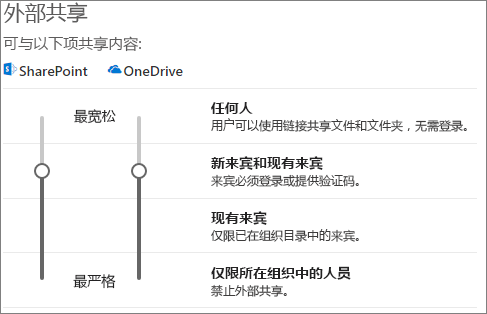
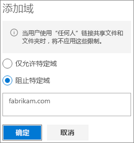

# 与来宾共享时限制文件意外公开

与来宾共享文件和文件夹时，可通过多种方法来降低意外共享机密信息的机率。 可从本文中的选项中进行选择，以最好地满足贵组织的需求。

## 对“任何人”链接使用最佳做法

如果贵组织中的人员需要进行匿名共享，但你担心未经身份验证的来宾修改内容，请阅读[匿名共享的最佳做法](best-practices-anonymous-sharing.md)，获取有关如何处理贵组织中的匿名共享的指南。

## 关闭“任何人”链接

建议对相应内容保持启用“任何人”链接**，因为它是最简单的共享方法，可帮助降低用户查找超出 IT 部门控制范围的其他解决方案的风险。 可以将“任何人”** 链接转发给其他人，但是文件访问权只可用于拥有该链接的人。

如果你始终希望来宾在访问 SharePoint、组或团队中的内容时进行身份验证，则可关闭“任何人”** 共享。 这将防止用户匿名共享内容。

如果禁用“任何人”** 链接，用户仍然可以使用“特定人员”** 链接与来宾轻松共享。 在这种情况下，需要对所有来宾进行身份验证，然后才能访问共享内容。

根据你的需要，可以针对特定网站或整个组织禁用“任何人”** 链接。

关闭组织的“任何人”** 链接
1. 在 SharePoint 管理中心的左侧导航栏中，单击“共享”****。
2. 将 SharePoint 外部共享设置设为“新来宾和现有来宾”****。 
   
3. 单击“保存”****。

关闭站点的“任何人”** 链接
1. 在 SharePoint 管理中心的左侧导航栏中，展开“站点”****，然后单击“活动站点”****。
2. 选择刚才创建的团队站点。
3. 在功能区中，单击“共享”****。
4. 确保将共享设置为“新来宾和现有来宾”****。 
   
5. 如果进行了任何更改，请单击“保存”****。

## 域筛选

可使用域的允许或拒绝列表来确定用户可从哪些域中邀请来宾。

使用允许列表，可以指定贵组织用户可从中邀请来宾的域的列表。 其他域的来宾邀请被阻止。 如果贵组织仅从特定域的列表中与来宾进行协作，则可以使用此功能阻止与其他域共享。

使用拒绝列表，可以指定贵组织用户无法从中邀请来宾的域的列表。 列出的域的来宾邀请被阻止。 如果你有竞争对手（例如你想要阻止其成为贵组织中的来宾），此功能可能非常有用。

允许列表和拒绝列表仅影响与经过身份验证的来宾的共享。 如果你尚未禁用用户，用户仍可使用“任何人”** 链接与被禁止域中的来宾共享。 若要使用域允许和拒绝列表获得最佳结果，请考虑按上面所述禁用“任何人”** 链接。

为来宾共享设置域允许或拒绝列表
1. 在 SharePoint 管理中心的左侧导航栏中，单击“共享”****。
2. 在“用于外部共享的高级设置”**** 下，选中“限制外部共享(按域)”**** 复选框。
3. 单击“添加域”****。
4. 选择是否要阻止域，键入域，然后单击“确定”****。 
   
5. 单击“保存”****。

如果想要在高于 SharePoint 和 OneDrive 的级别限制按域共享，则可以在 Azure Active Directory 中[允许或阻止来自特定组织的 B2B 用户的邀请](https://docs.microsoft.com/azure/active-directory/b2b/allow-deny-list)。 （必须配置 [SharePoint 和 OneDrive 与 Azure AD B2B Preview 的集成](https://docs.microsoft.com/sharepoint/sharepoint-azureb2b-integration-preview)，这些设置才会影响 SharePoint 和 OneDrive。）

## 将文件、文件夹和站点的来宾共享限制到指定的安全组

可以将文件、文件夹和站点的来宾共享限制到特定的安全组成员。 如果你希望启用来宾共享，但有批准工作流或请求流程，则此功能非常有用。

将来宾共享限制到安全组的成员
1. 在 SharePoint 管理中心的左侧导航栏中，单击“共享”****。
2. 在“其他设置”**** 下， 按照“将外部共享的范围限制到特定安全组”**** 链接操作。
3. 在“可进行组织外共享的人员”**** 下，选中复选框之一或全部选中：a. “仅让所选安全组中的用户与已验证的外部用户共享”**** 以指定可与已经过身份验证的用户共享的安全组。 “仅让所选安全组中的用户使用匿名链接与已验证的外部用户共享”**** 以指定可使用“任何人”链接与已经过身份验证的用户共享的安全组。
4. 单击“确定”****。

请注意，这会影响文件、文件夹和站点，但不会影响 Office 365 组或团队。 当成员将来宾邀请到 Microsoft Teams 中的私有 Office 365 组或私人团队中时，该邀请会发送给组或团队所有者进行审批。

## 另请参阅

[创建安全的来宾共享环境](create-a-secure-guest-sharing-environment.md)

[有关与匿名用户共享文件和文件夹的最佳做法](best-practices-anonymous-sharing.md)