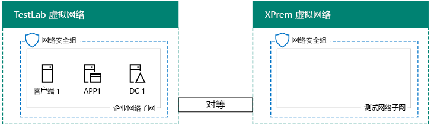

# <a name="simulated-cross-premises-virtual-network-in-azure"></a>Azure 中的模拟跨界虚拟网络

 **摘要：**在 Microsoft Azure 创建模拟的跨部署虚拟网络，作为开发/测试环境。
  
本文逐步介绍了如何使用两个 Azure 虚拟网络来创建 Microsoft Azure 模拟混合云环境。下面是生成的配置。   
  

  
此配置模拟 Azure IaaS 混合云生产环境，具体包括：
  
- 	Azure 虚拟网络中托管的模拟简化本地网络（TestLab 虚拟网络）。
    
- 	Azure 中托管的模拟跨界虚拟网络 (XPrem)。
    
- 	两个虚拟网络之间的 VNet 对等关系。
    
- 	XPrem 虚拟网络中辅助域控制器。
    
这是你执行以下操作的常见基础入手配置：  
  
- 	在模拟 Azure IaaS 混合云环境中开发和测试应用程序。
    
- 	创建计算机的测试配置（一些位于 TestLab 虚拟网络中，一些位于 XPrem 虚拟网络中），以模拟基于混合云的 IT 工作负荷。
    
设置此开发/测试环境包含三个主要阶段：
  
1. 	配置 TestLab 虚拟网络。
    
2. 创建跨界虚拟网络。
    
3. 配置 DC2。
    
> [!NOTE]
> 此配置需要付费的 Azure 订阅。 
  

  
> [!TIP]
> 单击[此处](http://aka.ms/catlgstack)为可视化映射到一个 Microsoft 云测试实验室指南堆栈中的所有项目。
  
## <a name="phase-1-configure-the-testlab-virtual-network"></a>第 1 阶段：配置 TestLab 虚拟网络

在[基本配置开发/测试环境](base-configuration-dev-test-environment.md)中使用说明 Azure 命名测试实验室的虚拟网络中配置 DC1，APP1 和客户端 1 计算机。
  
这是你的当前配置。 
  

  
## <a name="phase-2-create-the-xprem-virtual-network"></a>第 2 阶段：创建 XPrem 虚拟网络

在此阶段，你需要创建和配置新的 XPrem 虚拟网络，然后通过 VNet 对等关系将其连接到 TestLab 虚拟网络。
  
首先，在本地计算机上启动 Azure PowerShell 提示符。
  
> [!NOTE]
> 下面的命令设置使用 Azure PowerShell 的最新版本。请参阅[开始使用 Azure PowerShell cmdlet](https://docs.microsoft.com/en-us/powershell/azureps-cmdlets-docs/)。 
  
使用以下命令登录 Azure 帐户。
  
```
Login-AzureRMAccount
```

> [!TIP]
> 单击[此处](https://gallery.technet.microsoft.com/PowerShell-commands-for-7844edd0)以获取包含所有这篇文章中的 PowerShell 命令的文本文件。
  
使用以下命令获得订阅名称。
  
```
Get-AzureRMSubscription | Sort Name | Select Name
```

设置 Azure 订购。引号，包括的所有内容替换\<和 > 字符，替换为正确的名称。
  
```
$subscrName="<subscription name>"
Get-AzureRmSubscription -SubscriptionName $subscrName | Select-AzureRmSubscription
```

接下来，创建 XPrem 虚拟网络，然后使用这些命令通过网络安全组保护此虚拟网络。
  
```
$rgName="<name of the resource group that you used for your TestLab virtual network>"
$locName=(Get-AzureRmResourceGroup -Name $rgName).Location
$Testnet=New-AzureRMVirtualNetworkSubnetConfig -Name "Testnet" -AddressPrefix 192.168.0.0/24
New-AzureRMVirtualNetwork -Name "XPrem" -ResourceGroupName $rgName -Location $locName -AddressPrefix 192.168.0.0/16 -Subnet $Testnet -DNSServer 10.0.0.4
$rule1=New-AzureRMNetworkSecurityRuleConfig -Name "RDPTraffic" -Description "Allow RDP to all VMs on the subnet" -Access Allow -Protocol Tcp -Direction Inbound -Priority 100 -SourceAddressPrefix Internet -SourcePortRange * -DestinationAddressPrefix * -DestinationPortRange 3389
New-AzureRMNetworkSecurityGroup -Name "Testnet" -ResourceGroupName $rgName -Location $locName -SecurityRules $rule1
$vnet=Get-AzureRMVirtualNetwork -ResourceGroupName $rgName -Name XPrem
$nsg=Get-AzureRMNetworkSecurityGroup -Name "Testnet" -ResourceGroupName $rgName
Set-AzureRMVirtualNetworkSubnetConfig -VirtualNetwork $vnet -Name "Testnet" -AddressPrefix 192.168.0.0/24 -NetworkSecurityGroup $nsg
```

接下来，使用下面这些命令在 TestLab 和 XPrem VNet 之间创建 VNet 对等关系。
  
```
$rgName="<name of the resource group that you used for your TestLab virtual network>"
$vnet1=Get-AzureRmVirtualNetwork -ResourceGroupName $rgName -Name TestLab
$vnet2=Get-AzureRmVirtualNetwork -ResourceGroupName $rgName -Name XPrem
Add-AzureRmVirtualNetworkPeering -Name TestLab2XPrem -VirtualNetwork $vnet1 -RemoteVirtualNetworkId $vnet2.Id
Add-AzureRmVirtualNetworkPeering -Name XPrem2TestLab -VirtualNetwork $vnet2 -RemoteVirtualNetworkId $vnet1.Id
```

这是你的当前配置。 
  

  
## <a name="phase-3-configure-dc2"></a>第 3 阶段：配置 DC2

在此阶段，你需要在 XPrem 虚拟网络中创建 DC2 虚拟机，然后将其配置为副本域控制器。
  
首先，创建 DC2 虚拟机。在本地计算机上的 Azure PowerShell 命令提示符处，运行下面这些命令。
  
```
$rgName="<your resource group name>"
$locName=(Get-AzureRmResourceGroup -Name $rgName).Location
$vnet=Get-AzureRMVirtualNetwork -Name XPrem -ResourceGroupName $rgName
$pip=New-AzureRMPublicIpAddress -Name DC2-PIP -ResourceGroupName $rgName -Location $locName -AllocationMethod Dynamic
$nic=New-AzureRMNetworkInterface -Name DC2-NIC -ResourceGroupName $rgName -Location $locName -SubnetId $vnet.Subnets[0].Id -PublicIpAddressId $pip.Id -PrivateIpAddress 192.168.0.4
$vm=New-AzureRMVMConfig -VMName DC2 -VMSize Standard_A1
$cred=Get-Credential -Message "Type the name and password of the local administrator account for DC2."
$vm=Set-AzureRMVMOperatingSystem -VM $vm -Windows -ComputerName DC2 -Credential $cred -ProvisionVMAgent -EnableAutoUpdate
$vm=Set-AzureRMVMSourceImage -VM $vm -PublisherName MicrosoftWindowsServer -Offer WindowsServer -Skus 2016-Datacenter -Version "latest"
$vm=Add-AzureRMVMNetworkInterface -VM $vm -Id $nic.Id
$vm=Set-AzureRmVMOSDisk -VM $vm -Name "DC2-OS" -DiskSizeInGB 128 -CreateOption FromImage -StorageAccountType "StandardLRS"
$diskConfig=New-AzureRmDiskConfig -AccountType "StandardLRS" -Location $locName -CreateOption Empty -DiskSizeGB 20
$dataDisk1=New-AzureRmDisk -DiskName "DC2-DataDisk1" -Disk $diskConfig -ResourceGroupName $rgName
$vm=Add-AzureRmVMDataDisk -VM $vm -Name "DC2-DataDisk1" -CreateOption Attach -ManagedDiskId $dataDisk1.Id -Lun 1
New-AzureRMVM -ResourceGroupName $rgName -Location $locName -VM $vm
```

接下来，连接到新的虚拟机 DC2 从[Azure 门户](https://portal.azure.com)使用其本地管理员帐户名和密码。
  
接下来，将 Windows 防火墙规则配置为允许通信以进行基本的连接测试。在 DC 2 上的管理员级别 Windows PowerShell 命令提示符处，运行下面这些命令。  
  
```
Set-NetFirewallRule -DisplayName "File and Printer Sharing (Echo Request - ICMPv4-In)" -enabled True
ping dc1.corp.contoso.com
```

ping 命令应获得从 IP 地址 10.0.0.4 发出的四个成功响应。这是跨 VNet 对等关系的通信测试。  
  
接下来，在 DC2 Windows PowerShell 命令提示符下添加为新卷驱动器号 f： 使用此命令的额外数据磁盘。
  
```
Get-Disk | Where PartitionStyle -eq "RAW" | Initialize-Disk -PartitionStyle MBR -PassThru | New-Partition -AssignDriveLetter -UseMaximumSize | Format-Volume -FileSystem NTFS -NewFileSystemLabel "WSAD Data"
```

接下来，将 DC2 配置为 corp.contoso.com 域的副本域控制器。在 DC2 上的 Windows PowerShell 命令提示符处，运行下面这些命令。
  
```
Install-WindowsFeature AD-Domain-Services -IncludeManagementTools
Install-ADDSDomainController -Credential (Get-Credential CORP\\User1) -DomainName "corp.contoso.com" -InstallDns:$true -DatabasePath "F:\\NTDS" -LogPath "F:\\Logs" -SysvolPath "F:\\SYSVOL"
```

请注意，则会提示您提供这两个公司\\User1 密码和目录服务还原模式 (DSRM) 密码，并重新启动 DC2。 
  
至此，XPrem 虚拟网络已拥有自己的 DNS 服务器 (DC2)。你必须将 XPrem 虚拟网络配置为使用此 DNS 服务器。在本地计算机上的 Azure PowerShell 命令提示符处，运行下面这些命令。
  
```
$vnet=Get-AzureRmVirtualNetwork -ResourceGroupName $rgName -name "XPrem"
$vnet.DhcpOptions.DnsServers="192.168.0.4" 
Set-AzureRmVirtualNetwork -VirtualNetwork $vnet
Restart-AzureRmVM -ResourceGroupName $rgName -Name "DC2"
```

从 Azure 的门户，在您的本地计算机上，连接到 dc1，将其与公司\\User1 凭据。要配置 CORP 域，以使计算机和用户使用其本地域控制器进行身份验证，请在 DC1 上从管理员级别的 Windows PowerShell 命令提示符运行这些命令。
  
```
New-ADReplicationSite -Name "TestLab" 
New-ADReplicationSite -Name "XPrem"
New-ADReplicationSubnet -Name "10.0.0.0/8" -Site "TestLab"
New-ADReplicationSubnet -Name "192.168.0.0/16" -Site "XPrem"
```

这是你的当前配置。 
  

  
此时，你的模拟 Azure 混合云环境就可供测试了。
  
## <a name="next-step"></a>后续步骤

使用此开发/测试环境中模拟了[Azure 中承载 SharePoint 服务器 2016 intranet 服务器场](https://technet.microsoft.com/library/mt806351%28v=office.16%29.aspx)。
  
## <a name="see-also"></a>另请参阅

[基础配置开发/测试环境](base-configuration-dev-test-environment.md)
  
[Office 365 开发/测试环境](office-365-dev-test-environment.md)
  
[用于 Office 365 开发/测试环境的 DirSync](dirsync-for-your-office-365-dev-test-environment.md)
  
[Office 365 开发/测试环境的云应用程序安全性](cloud-app-security-for-your-office-365-dev-test-environment.md)
  
[为您的 Office 365 开发/测试环境高级威胁防护](advanced-threat-protection-for-your-office-365-dev-test-environment.md)
  
[云应用和混合解决方案](cloud-adoption-and-hybrid-solutions.md)


