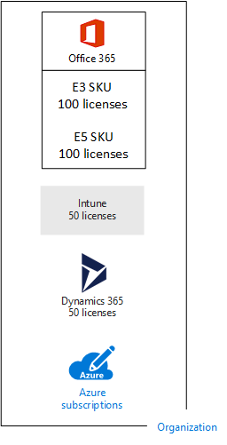
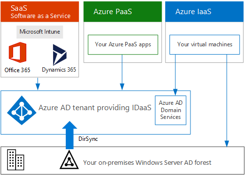

# 预订、 许可证、 帐户和微软的云服务的租户

 **摘要：**了解 Microsoft 的云服务跨组织、 订阅、 许可、 用户帐户与承租人的关系。
  
Microsoft 提供的跨其云服务使用一致的标识和计费的层次结构组织、 订阅、 许可证和用户帐户：
  
- Microsoft Office 365
    
    [业务计划和价格](https://products.office.com/business/compare-office-365-for-business-plans)的详细信息，请参阅。
    
- Microsoft Azure
    
    有关详细信息，请参阅[Azure 定价](https://azure.microsoft.com/pricing/)。
    
- Microsoft Intune 和企业移动 + 安全 (EMS)
    
    有关详细信息，请参阅[Intune 定价](https://www.microsoft.com/cloud-platform/microsoft-intune-pricing)。
    
- Microsoft Dynamics 365
    
    有关详细信息，请参阅[Dynamics 365 定价](https://dynamics.microsoft.com/)。
    
## 层次结构的元素

以下是层次结构的元素：
  
### 组织

组织表示使用 Microsoft 云服务的业务实体，通常由公用域名系统 (DNS) 域名标识，例如 contoso.com。组织是订阅的容器。
  
### 订阅

订阅是与微软的协议使用一种或更多 Microsoft 云平台或服务，其费用计入基于每个用户的许可证费用或基于云的资源消耗。Microsoft 的软件即服务 (SaaS)-基于的云服务 （Office 365、 Intune/EMS 和 Dynamics 365） 收取每个用户的许可证费用。微软平台即服务 (PaaS) 和基础结构即服务 (IaaS) 云服务 (Azure) 费用基于云的资源消耗。
  
你也可以使用试用版订阅，此订阅会在一定时间后或使用费用后过期。你可以将试用版订阅转换为付费订阅。
  
组织可以有多个订阅 Microsoft 的云服务。图 1 显示了一个示例。
  
**图 1： 的组织的多个订阅示例**

  
图 1 显示了一个组织，其中包含多个 Office 365 订阅、一个 Intune 订阅、一个 Dynamics 365 订阅以及多个 Azure 订阅。
  
### 许可证

对于微软 SaaS 云产品，许可证允许特定的用户帐户以使用云服务提供。负责每月的固定的费用作为订阅的一部分。管理员将许可证分配给订阅中的单个用户帐户。对于图 2 中的示例，Contoso 公司具有 Office 365 企业 E5 订阅与 100 份许可证，它允许将最多 100 个单个的用户帐户以使用企业 E5 功能和服务。
  
**图 2： 许可证内组织的基于 SaaS 的订购**

  
对于基于 Azure PaaS 的云服务，软件许可证是服务定价的一部分。  
  
对于基于 Azure IaaS 的虚拟机，使用在虚拟机映像上安装的软件或应用程序可能需要其他许可证。某些虚拟机映像安装了授权版软件，并且成本包括在服务器的每分钟费率中。例如，SQL Server 2014 和 SQL Server 2016 的虚拟机映像。  
  
某些虚拟机映像安装了试用版应用程序，在试用期过后需要其他软件应用程序许可证。例如，SharePoint Server 2016 试用版虚拟机映像包括预安装的试用版 SharePoint Server 2016。若要在试用版过期后继续使用 SharePoint Server 2016，你必须从 Microsoft 购买 SharePoint Server 2016 许可证和客户端许可证。这些费用与 Azure 订阅是分开的，而运行虚拟机的每分钟费率仍然适用。
  
### 用户帐户

微软的云服务的所有用户帐户都存储在 Azure 活动目录 (AD) 租户，其中包含用户帐户和组。Azure AD 租户可以与现有 Windows 服务器 AD 客户使用 Azure AD 连接，Windows 基于服务器的服务进行同步。这被称为目录同步目录 （同步）。
  
图 3 显示了某个组织使用包含组织帐户的常见 Azure AD 租户进行多个订阅的示例。
  
**图 3： 多个订阅的组织使用相同的 Azure AD 租户**

  
### 租户

对于 SaaS 云服务，租户是承载提供云服务的服务器的区域位置。例如，Contoso 公司选择欧洲地区为其巴黎总部的 15,000 名工作人员托管其 Office 365、EMS 和 Dynamics 365 租户。
  
Azure PaaS 服务和在 Azure IaaS 中托管的基于虚拟机的工作负荷可以在世界范围内的任何 Azure 数据中心拥有租户。在创建 Azure PaaS 应用或服务或 IaaS 工作负荷的元素时，应指定 Azure 数据中心（称为位置）。
  
Azure AD 租户是包含帐户和组的 Azure AD 的特定实例。Office 365、Dynamics 365 或 Intune/EMS 的付费或试用版订阅包括免费的 Azure AD 租户。此 Azure AD 租户不包括其他 Azure 服务，且与 Azure 试用版或付费订阅不同。
  
### 层次结构的摘要

以下是快速回顾：
  
- 组织可进行多个订阅
    
  - 订阅可具有多个许可证
    
  - 许可证可分配给各个用户帐户
    
  - 用户帐户存储在 Azure AD 租户中
    
此处为一个有关组织、订阅、许可证和用户帐户关系的示例。
  
- 该组织由其公共域名识别。
    
  - 具有用户许可证的 Office 365 企业版 E3 订阅。
    
    具有用户许可证的 Office 365 企业版 E5 订阅。
    
    具有用户许可证的 EMS 订阅。
    
    具有用户许可证的 Dynamics 365 订阅。
    
    多个 Azure 订阅。
    
  - 常见 Azure AD 租户中的组织的用户帐户。
    
多个 Microsoft 云服务订阅可使用同一 Azure AD 租户作为通用标识提供程序。包含本地 Windows Server AD 的同步帐户的中心 Azure AD 租户可为组织提供基于云的标识即服务 (IDaaS)。如图 4 中所示。
  
**图 4： 同步的本地帐户和 IDaaS 的组织**

  
图 4 显示了如何将常见的 Azure AD 租户用于 Microsoft 的 SaaS 云产品、Azure PaaS 应用以及 Azure IaaS 中使用 Azure AD 域服务的虚拟机。Azure AD Connect 将本地 Windows Server AD 林与 Azure AD 租户同步。
  
关于身份集成在微软的云服务的详细信息，请参阅[Microsoft 云对于企业架构师的身份](https://aka.ms/cloudarchidentity)。
  
## 合并多个 Microsoft 云服务的订阅

下表介绍了如果已经订阅一种类型的云服务（标签在第一列下），而要添加其他云服务的订阅（跨列），如何合并多个 Microsoft 服务。
  
||**Office 365**|**Azure**|**Intune/EMS**|**Dynamics 365**|
|:-----|:-----|:-----|:-----|:-----|
|**Office 365**   |NA    |从 Azure 门户向你的组织添加 Azure 订阅。    |从 Office 365 门户向你的组织添加 Intune/EMS 订阅。    |从 Office 365 门户向你的组织添加 Dynamics 365 订阅。    |
|**Azure**   |向你的组织添加 Office 365 订阅。     |NA    |向你的组织添加 Intune/EMS 订阅。    |向你的组织添加 Dynamics 365 订阅。    |
|**Intune/EMS**   |向你的组织添加 Office 365 订阅。     |从 Azure 门户向你的组织添加 Azure 订阅。    |NA    |向你的组织添加 Dynamics 365 订阅。    |
|**Dynamics 365**   |向你的组织添加 Office 365 订阅。     |从 Azure 门户向你的组织添加 Azure 订阅。    |向你的组织添加 Intune/EMS 订阅。    |NA    |
   
向你的组织添加 Microsoft SaaS 服务订阅的简便方法是通过 Office 365 Admin 中心来添加：
  
1. 登录到 Office 365 门户网站 ([https://portal.office.com](https://portal.office.com)) 与全局管理员帐户，然后再单击**管理**。
    
2. 从**管理中心**主页上的左导航，**帐单**，单击，然后单击**采购服务**。
    
3. 在**购买服务**页中，购买新的订阅。
    
Office 365 管理中心将 Office 365 订阅的组织和 Azure AD 租户分配到基于 SaaS 的云产品的新订阅。
  
使用与你的 Office 365 订阅相同的组织和 Azure AD 租户添加 Azure 订阅：
  
1. 登录到 Azure 门户网站 ([https://portal.azure.com](https://portal.azure.com)) 与您的 Office 365 提供全局管理员帐户。
    
2. 在左侧的导航中，**订阅**，请单击，然后单击**添加**。
    
3. 在**添加订阅**页中，选择某项服务并完成协议和付款信息。
    
如果单独购买 Azure 和 Office 365 订阅要访问 Office 365 Azure AD 租户从 Azure 订阅，请参阅[将 Office 365 租户订阅了 Azure](https://channel9.msdn.com/Series/Microsoft-Azure-Tutorials/Associate-an-Office-365-tenant-with-an-Azure-subscription)中的说明进行操作。
  
## 另请参阅

[Microsoft 云 IT 体系结构资源](microsoft-cloud-it-architecture-resources.md)
  
[云应用测试实验室指南 (TLGs)](cloud-adoption-test-lab-guides-tlgs.md)
  
[SharePoint、Exchange、Skype for Business 和 Lync 的体系结构模型](architectural-models-for-sharepoint-exchange-skype-for-business-and-lync.md)
  
[混合解决方案](hybrid-solutions.md)
  
[Contoso Corporation 的订阅、许可证和用户帐户](subscriptions-licenses-and-user-accounts-for-the-contoso-corporation.md)

