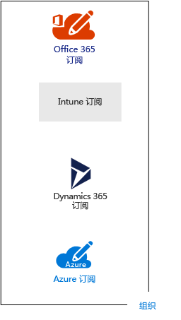
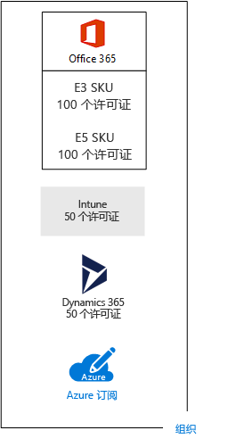
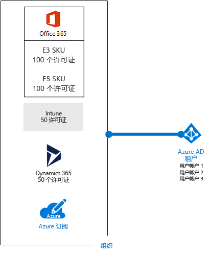
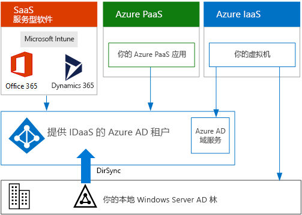

# 针对 Microsoft 云产品/服务的订阅、许可证、帐户和租户Subscriptions, licenses, accounts, and tenants for Microsoft's cloud offerings

 **摘要：** 了解 Microsoft 云产品/服务中组织、订阅、许可证、用户帐户和租户的关系。**Summary:** Understand the relationships of organizations, subscriptions, licenses, user accounts, and tenants across Microsoft's cloud offerings.
  
为确保跨其云产品/服务使用一致的身份和帐单，Microsoft 提供了组织、订阅、许可证和用户帐户的层次结构。Microsoft provides a hierarchy of organizations, subscriptions, licenses, and user accounts for consistent use of identities and billing across its cloud offerings:
  
- Microsoft Office 365Microsoft Office 365
- Microsoft AzureMicrosoft Azure
- Microsoft Intune 和企业移动性 + 安全性 (EMS)Microsoft Intune and the Enterprise Mobility + Security (EMS)
- Microsoft Dynamics 365Microsoft Dynamics 365

[Microsoft 365](https://docs.microsoft.com/microsoft-365/) 将 Office 365、EMS 和 Windows 10 企业版合并为一个订阅和一组集成服务。[Microsoft 365](https://docs.microsoft.com/microsoft-365/) combines Office 365, EMS, and Windows 10 Enterprise into a single subscription and set of integrated services.

## 层次结构的元素Elements of the hierarchy

以下是层次结构的元素：Here are the elements of the hierarchy:
  
### 组织Organization

组织表示使用 Microsoft 云产品/服务的业务实体，通常由一个或多个公共域名系统 (DNS) 域名（如 contoso.com）标识。组织是订阅的容器。An organization represents a business entity that is using Microsoft cloud offerings, typically identified by one or more public Domain Name System (DNS) domain names, such as contoso.com. The organization is a container for subscriptions.
  
### 订阅Subscriptions

订阅是与 Microsoft 就使用一个或多个 Microsoft 云平台或服务签订的协议，其费用基于每个用户许可证费用或云资源使用累计。A subscription is an agreement with Microsoft to use one or more Microsoft cloud platforms or services, for which charges accrue based on either a per-user license fee or on cloud-based resource consumption. 

- Microsoft 基于软件即服务 (SaaS) 的云服务（Office 365、Intune/EMS 和 Dynamics 365）按用户收取许可证费用。Microsoft's Software as a Service (SaaS)-based cloud offerings (Office 365, Intune/EMS, and Dynamics 365) charge per-user license fees. 
- Microsoft 的平台即服务 (PaaS) 和基础设施即服务 (IaaS) 云服务 (Azure) 根据云资源使用量收取费用。Microsoft's Platform as a Service (PaaS) and Infrastructure as a Service (IaaS) cloud offerings (Azure) charge based on cloud resource consumption.
 
你也可以使用试用版订阅，此订阅会在一定时间后或使用费用后过期。你可以将试用版订阅转换为付费订阅。You can also use a trial subscription, but the subscription expires after a specific amount of time or consumption charges. You can convert a trial subscription to a paid subscription.
  
组织可订阅多个 Micrososft 云服务。Organizations can have multiple subscriptions for Microsoft's cloud offerings. 图 1 显示了一个组织，其具有多个 Office 365 订阅、一个 Intune 订阅、一个 Dynamics 365 订阅以及多个 Azure 订阅。Figure 1 shows a single organization that has multiple Office 365 subscriptions, an Intune subscription, a Dynamics 365 subscription, and multiple Azure subscriptions.

**图 1：组织的多个订阅示例****Figure 1: Example of multiple subscriptions for an organization**

  
### 许可证Licenses

对于 Microsoft 的 SaaS 云服务，许可证允许特定用户帐户使用云产品的服务。For Microsoft's SaaS cloud offerings, a license allows a specific user account to use the services of the cloud offering. 作为订阅的一部分，你可以每月支付固定的费用。You are charged a fixed monthly fee as part of your subscription. 管理员将许可证分配给订阅中的各个用户帐户。Administrators assign licenses to individual user accounts in the subscription. 对于图 2 中的示例，Contoso 公司订阅了具有 100 个许可证的 Office 365 企业版 E5，允许最多 100 个单个用户帐户使用 Office 365 企业版 E5 的功能和服务。For the example in Figure 2, the Contoso Corporation has an Office 365 Enterprise E5 subscription with 100 licenses, which allows to up to 100 individual user accounts to use Office 365 Enterprise E5 features and services.
  
**图 2：组织基于 SaaS 的订阅内的许可证****Figure 2: Licenses within the SaaS-based subscriptions for an organization**

  
对于基于 Azure PaaS 的云服务，软件许可证是服务定价的一部分。For Azure PaaS-based cloud services, software licenses are built into the service pricing.
  
对于基于 Azure IaaS 的虚拟机，使用在虚拟机映像上安装的软件或应用程序可能需要其他许可证。某些虚拟机映像安装了授权版软件，并且成本包括在服务器的每分钟费率中。例如，SQL Server 2014 和 SQL Server 2016 的虚拟机映像。For Azure IaaS-based virtual machines, additional licenses to use the software or application installed on a virtual machine image might be required. Some virtual machine images have licensed versions of software installed and the cost is included in the per-minute rate for the server. Examples are the virtual machine images for SQL Server 2014 and SQL Server 2016. 
  
某些虚拟机映像安装了试用版应用程序，在试用期过后需要其他软件应用程序许可证。例如，SharePoint Server 2016 试用版虚拟机映像包括预安装的试用版 SharePoint Server 2016。若要在试用版过期后继续使用 SharePoint Server 2016，你必须从 Microsoft 购买 SharePoint Server 2016 许可证和客户端许可证。这些费用与 Azure 订阅是分开的，而运行虚拟机的每分钟费率仍然适用。Some virtual machine images have trial versions of applications installed and need additional software application licenses for use beyond the trial period. For example, the SharePoint Server 2016 Trial virtual machine image includes a trial version of SharePoint Server 2016 pre-installed. To continue using SharePoint Server 2016 after the trial expiration date, you must purchase a SharePoint Server 2016 license and client licenses from Microsoft. These charges are separate from the Azure subscription and the per-minute rate to run the virtual machine still applies.
  
### 用户帐户User accounts

所有 Microsoft 云服务的用户帐户均存储在 Active Directory (Azure AD) 租户中，其中包含用户帐户和组。User accounts for all of Microsoft's cloud offerings are stored in an Azure Active Directory (Azure AD) tenant, which contains user accounts and groups. 通过使用基于 Windows 服务器的服务 Azure AD Connect，Azure AD 租户可与你现有的 Active Directory 域服务 (AD DS) 帐户同步。An Azure AD tenant can be synchronized with your existing Active Directory Domain Services (AD DS) accounts using Azure AD Connect, a Windows server-based service. 这叫做目录同步。This is known as directory synchronization.
  
图 3 显示了某个组织使用包含组织帐户的常见 Azure AD 租户进行多个订阅的示例。Figure 3 shows an example of multiple subscriptions of an organization using a common Azure AD tenant that contains the organization's accounts.
  
**图 3：组织使用同一 Azure AD 租户进行的多个订阅****Figure 3: Multiple subscriptions of an organization that use the same Azure AD tenant**

  
### 租户Tenants

对于 SaaS 云服务，租户是承载提供云服务的服务器的区域位置。例如，Contoso 公司选择欧洲地区为其巴黎总部的 15,000 名工作人员托管其 Office 365、EMS 和 Dynamics 365 租户。For SaaS cloud offerings, the tenant is the regional location that houses the servers providing cloud services. For example, the Contoso Corporation chose the European region to host its Office 365, EMS, and Dynamics 365 tenants for the 15,000 workers in their Paris headquarters.
  
Azure PaaS 服务和在 Azure IaaS 中托管的基于虚拟机的工作负荷可以在世界范围内的任何 Azure 数据中心拥有租户。在创建 Azure PaaS 应用或服务或 IaaS 工作负荷的元素时，应指定 Azure 数据中心（称为位置）。Azure PaaS services and virtual machine-based workloads hosted in Azure IaaS can have tenancy in any Azure datacenter across the world. You specify the Azure datacenter, known as the location, when you create the Azure PaaS app or service or element of an IaaS workload.
  
Azure AD 租户是包含帐户和组的 Azure AD 的特定实例。Office 365、Dynamics 365 或 Intune/EMS 的付费或试用版订阅包括免费的 Azure AD 租户。此 Azure AD 租户不包括其他 Azure 服务，且与 Azure 试用版或付费订阅不同。An Azure AD tenant is a specific instance of Azure AD containing accounts and groups. Paid or trial subscriptions of Office 365, Dynamics 365, or Intune/EMS include a free Azure AD tenant. This Azure AD tenant does not include other Azure services and is not the same as an Azure trial or paid subscription.
  
### 层次结构的摘要Summary of the hierarchy

以下是快速回顾：Here is a quick recap:
  
- 组织可进行多个订阅An organization can have multiple subscriptions
    
  - 订阅可具有多个许可证A subscription can have multiple licenses
    
  - 许可证可分配给各个用户帐户Licenses can be assigned to individual user accounts
    
  - 用户帐户存储在 Azure AD 租户中User accounts are stored in an Azure AD tenant
    
此处为一个有关组织、订阅、许可证和用户帐户关系的示例。Here is an example of the relationship of organizations, subscriptions, licenses, and user accounts:
  
- 该组织由其公共域名识别。An organization identified by its public domain name.
    
  - 具有用户许可证的 Office 365 企业版 E3 订阅。An Office 365 Enterprise E3 subscription with user licenses.
    
    具有用户许可证的 Office 365 企业版 E5 订阅。An Office 365 Enterprise E5 subscription with user licenses.
    
    具有用户许可证的 EMS 订阅。An EMS subscription with user licenses.
    
    具有用户许可证的 Dynamics 365 订阅。A Dynamics 365 subscription with user licenses.
    
    多个 Azure 订阅。Multiple Azure subscriptions.
    
  - 常见 Azure AD 租户中的组织的用户帐户。The organization's user accounts in a common Azure AD tenant.
    
多个 Microsoft 云服务订阅可使用同一 Azure AD 租户作为通用标识提供程序。Multiple Microsoft cloud offering subscriptions can use the same Azure AD tenant that acts as a common identity provider. 包含本地 AD DS 的同步帐户的中心 Azure AD 租户可为组织提供基于云的标识即服务 (IDaaS)。A central Azure AD tenant that contains the synchronized accounts of your on-premises AD DS provides cloud-based Identity as a Service (IDaaS) for your organization. 
  
**图 4：适用于组织的同步本地帐户和 IDaaS****Figure 4: Synchronized on-premises accounts and IDaaS for an organization**

  
图 4 显示了如何将常见的 Azure AD 租户用于 Microsoft 的 SaaS 云产品、Azure PaaS 应用以及 Azure IaaS 中使用 Azure AD 域服务的虚拟机。Azure AD Connect 将本地 AD DS 林与 Azure AD 租户同步。Figure 4 shows how a common Azure AD tenant is used by Microsoft's SaaS cloud offerings, Azure PaaS apps, and virtual machines in Azure IaaS that use Azure AD Domain Services. Azure AD Connect synchronizes the on-premises AD DS forest with the Azure AD tenant.
  
## 合并多个 Microsoft 云服务的订阅Combining subscriptions for multiple Microsoft cloud offerings

下表介绍了如果已经订阅一种类型的云服务（标签在第一列下），而要添加其他云服务的订阅（跨列），如何合并多个 Microsoft 服务。The following table describes how you can combine multiple Microsoft cloud offerings based on already having a subscription for one type of cloud offering (the labels going down the first column) and adding a subscription for a different cloud offering (going across the columns).
  
||**Office 365****Office 365**|**Azure****Azure**|**Intune/EMS****Intune/EMS**|**Dynamics 365****Dynamics 365**|
|:-----|:-----|:-----|:-----|:-----|
|**Office 365****Office 365**   |NANA    |从 Azure 门户向你的组织添加 Azure 订阅。You add an Azure subscription to your organization from the Azure portal.    |从 Microsoft 365 管理中心向你的组织添加 Intune/EMS 订阅。You add an Intune/EMS subscription to your organization from the Microsoft 365 admin center.    |从 Microsoft 365 管理中心向你的组织添加 Dynamics 365 订阅。You add a Dynamics 365 subscription to your organization from the Microsoft 365 admin center.    |
|**Azure****Azure**   |向你的组织添加 Office 365 订阅。You add an Office 365 subscription to your organization.    |NANA    |向你的组织添加 Intune/EMS 订阅。You add an Intune/EMS subscription to your organization.    |向你的组织添加 Dynamics 365 订阅。You add a Dynamics 365 subscription to your organization.    |
|**Intune/EMS****Intune/EMS**   |向你的组织添加 Office 365 订阅。You add an Office 365 subscription to your organization.    |从 Azure 门户向你的组织添加 Azure 订阅。You add an Azure subscription to your organization from the Azure portal.    |NANA    |向你的组织添加 Dynamics 365 订阅。You add a Dynamics 365 subscription to your organization.    |
|**Dynamics 365****Dynamics 365**   |向你的组织添加 Office 365 订阅。You add an Office 365 subscription to your organization.    |从 Azure 门户向你的组织添加 Azure 订阅。You add an Azure subscription to your organization from the Azure portal.    |向你的组织添加 Intune/EMS 订阅。You add an Intune/EMS subscription to your organization.    |NANA    |
   
为组织添加基于 Microsoft SaaS 的服务订阅的简便方法是通过管理中心来完成：An easy way to add subscriptions to your organization for Microsoft SaaS-based services is through the admin center:
  
1. 使用全局管理员帐户登录 Microsoft 365 管理中心 ([https://admin.microsoft.com](https://admin.microsoft.com))。Sign in to the Microsoft 365 admin center ([https://admin.microsoft.com](https://admin.microsoft.com)) with your global administrator account.
    
2. 从“管理中心”\*\*\*\* 主页的左侧导航栏，依次单击“帐单”\*\*\*\* 和“购买服务”\*\*\*\*。From the left navigation of the **Admin center** home page, click **Billing**, and then **Purchase services**.
    
3. 在“购买服务”\*\*\*\* 页上，购买你的新订阅。On the **Purchase services** page, purchase your new subscriptions.
    
管理中心将 Office 365 订阅的组织和 Azure AD 租户分配到基于 SaaS 的云产品的新订阅。The admin center assigns the organization and Azure AD tenant of your Office 365 subscription to the new subscriptions for SaaS-based cloud offerings.
  
使用与你的 Office 365 订阅相同的组织和 Azure AD 租户添加 Azure 订阅：To add an Azure subscription with the same organization and Azure AD tenant as your Office 365 subscription:
  
1. 使用 Office 365 全局管理员帐户登录到 Azure 门户 ([https://portal.azure.com](https://portal.azure.com))。Sign in to the Azure portal ([https://portal.azure.com](https://portal.azure.com)) with your Office 365 global administrator account.
    
2. 在左侧导航栏中，单击“订阅”\*\*\*\*，然后单击“添加”\*\*\*\*。In the left navigation, click **Subscriptions**, and then click **Add**.
    
3. 在“添加订阅”\*\*\*\* 页上，选择一项服务并完成付款信息和协议。On the **Add subscription** page, select an offer and complete the payment information and agreement.
    
如果分别购买 Azure 和 Office 365 订阅并且希望从 Azure 订阅访问 Office 365 Azure AD 租户，请参阅[将现有 Azure 订阅添加到 Azure Active Directory 租户](https://docs.microsoft.com/azure/active-directory/fundamentals/active-directory-how-subscriptions-associated-directory)中的说明。If you purchased Azure and Office 365 subscriptions separately and want to access the Office 365 Azure AD tenant from your Azure subscription, see the instructions in [Add an existing Azure subscription to your Azure Active Directory tenant](https://docs.microsoft.com/azure/active-directory/fundamentals/active-directory-how-subscriptions-associated-directory).
 
## 另请参阅See also

[Microsoft 云 IT 体系结构资源Microsoft Cloud IT architecture resources](microsoft-cloud-it-architecture-resources.md)
  
[SharePoint、Exchange、Skype for Business 和 Lync 的体系结构模型Architectural models for SharePoint, Exchange, Skype for Business, and Lync](architectural-models-for-sharepoint-exchange-skype-for-business-and-lync.md)
  
[混合解决方案Hybrid solutions](hybrid-solutions.md)

## 后续步骤Next step

[评估 Office 365 网络连接Assessing Office 365 network connectivity](assessing-network-connectivity.md)
  
