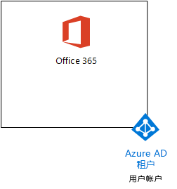
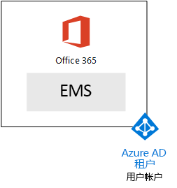
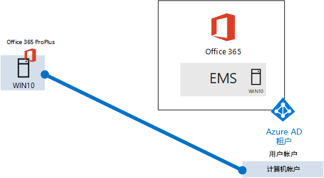

# <a name="the-microsoft-365-enterprise-devtest-environment"></a><span data-ttu-id="4f81d-103">Microsoft 365 企业开发/测试环境</span><span class="sxs-lookup"><span data-stu-id="4f81d-103">The Microsoft 365 Enterprise dev/test environment</span></span>

 <span data-ttu-id="4f81d-104">**摘要：**此测试实验室指南用于创建一个包括 Office 365 E5、 企业移动性 + 安全 (EMS) E5 和计算机运行 Windows 10 企业的开发/测试环境。</span><span class="sxs-lookup"><span data-stu-id="4f81d-104">**Summary:** Use this Test Lab Guide to create a dev/test environment that includes Office 365 E5, Enterprise Mobility + Security (EMS) E5, and a computer running Windows 10 Enterprise.</span></span>
  
<span data-ttu-id="4f81d-105">这篇文章为您提供了创建要测试的功能和功能的[Microsoft 365 企业](https://www.microsoft.com/microsoft-365/enterprise)简化的环境的分步说明。</span><span class="sxs-lookup"><span data-stu-id="4f81d-105">This article provides you with step-by-step instructions to create a simplified environment to test the features and functionality of [Microsoft 365 Enterprise](https://www.microsoft.com/microsoft-365/enterprise).</span></span>
  
## <a name="phase-1-create-your-office-365-e5-subscription"></a><span data-ttu-id="4f81d-106">阶段 1： 创建 Office 365 E5 订阅</span><span class="sxs-lookup"><span data-stu-id="4f81d-106">Phase 1: Create your Office 365 E5 subscription</span></span>

<span data-ttu-id="4f81d-107">按照在第 2 阶段和第 3 阶段的[Office 365 的开发/测试环境](office-365-dev-test-environment.md)来创建 Office 365 轻量级开发/测试环境中，如图 1 所示的步骤。</span><span class="sxs-lookup"><span data-stu-id="4f81d-107">Follow the steps in Phase 2 and Phase 3 of [Office 365 dev/test environment](office-365-dev-test-environment.md) to create a lightweight Office 365 dev/test environment, as shown in Figure 1.</span></span>
  
<span data-ttu-id="4f81d-108">**图 1: Office 365 E5 订阅其 Azure 活动目录 (AD) 租户和用户帐户**</span><span class="sxs-lookup"><span data-stu-id="4f81d-108">**Figure 1: Your Office 365 E5 subscription with its Azure Active Directory (AD) tenant and user accounts**</span></span>


  
## <a name="phase-2-add-ems"></a><span data-ttu-id="4f81d-110">阶段 2： 添加 EMS</span><span class="sxs-lookup"><span data-stu-id="4f81d-110">Phase 2: Add EMS</span></span>

<span data-ttu-id="4f81d-111">在此阶段中，EMS E5 试用订阅注册，并将其添加到 Office 365 E5 试用为同一个组织。</span><span class="sxs-lookup"><span data-stu-id="4f81d-111">In this phase, you sign up for the EMS E5 trial subscription and add it to the same organization as your Office 365 E5 trial subscription.</span></span>
  
<span data-ttu-id="4f81d-112">首先，添加 EMS E5 试用订阅并将 EMS 许可证分配给全局管理员帐户。</span><span class="sxs-lookup"><span data-stu-id="4f81d-112">First, add the EMS E5 trial subscription and assign an EMS license to your global administrator account.</span></span>
  
1. <span data-ttu-id="4f81d-p101">与 Internet 浏览器的专用实例，登录到 Office 365 门户使用您的全局管理员帐户凭据。有关帮助信息，请参阅[登录到 Office 365 的位置](https://support.office.com/Article/Where-to-sign-in-to-Office-365-e9eb7d51-5430-4929-91ab-6157c5a050b4)。</span><span class="sxs-lookup"><span data-stu-id="4f81d-p101">With a private instance of an Internet browser, sign in to the Office 365 portal with your global administrator account credentials. For help, see [Where to sign in to Office 365](https://support.office.com/Article/Where-to-sign-in-to-Office-365-e9eb7d51-5430-4929-91ab-6157c5a050b4).</span></span>
    
2. <span data-ttu-id="4f81d-115">单击“管理”磁贴。</span><span class="sxs-lookup"><span data-stu-id="4f81d-115">Click the **Admin** tile.</span></span>
    
3. <span data-ttu-id="4f81d-116">在浏览器的“Office 管理中心”选项卡的左侧导航中，单击“帐单”>“购买服务”。</span><span class="sxs-lookup"><span data-stu-id="4f81d-116">On the **Office Admin center** tab in your browser, in the left navigation, click **Billing > Purchase services**.</span></span>
    
4. <span data-ttu-id="4f81d-p102">**购买服务**页上找到**企业移动 + 安全 E5**项。将鼠标指针悬停在其上，单击**启动免费试用版**。</span><span class="sxs-lookup"><span data-stu-id="4f81d-p102">On the **Purchase services** page, find the **Enterprise Mobility + Security E5** item. Hover your mouse pointer over it and click **Start free trial**.</span></span>
    
5. <span data-ttu-id="4f81d-119">在“确认订单”页中，单击“立即试用”。</span><span class="sxs-lookup"><span data-stu-id="4f81d-119">On the **Confirm your order** page, click **Try now**.</span></span>
    
6. <span data-ttu-id="4f81d-120">在“订单签收”页中，单击“继续”。</span><span class="sxs-lookup"><span data-stu-id="4f81d-120">On the **Order receipt** page, click **Continue**.</span></span>
    
7. <span data-ttu-id="4f81d-121">在浏览器的“Office 365 管理中心”选项卡的左侧导航中，单击“用户”>“活动用户”。</span><span class="sxs-lookup"><span data-stu-id="4f81d-121">On the **Office 365 Admin center** tab in your browser, in the left navigation, click **Users > Active users**.</span></span>
    
8. <span data-ttu-id="4f81d-122">单击您的全局管理员帐户，然后单击**编辑****产品**许可证。</span><span class="sxs-lookup"><span data-stu-id="4f81d-122">Click your global administrator account, and then click **Edit** for **Product licenses**.</span></span>
    
9. <span data-ttu-id="4f81d-123">**产品许可证**的窗格中，在打开产品许可证**的企业移动性 + 安全 E5**到**上**，单击**保存**，然后两次单击**关闭**。</span><span class="sxs-lookup"><span data-stu-id="4f81d-123">On the **Product licenses** pane, turn the product license for **Enterprise Mobility + Security E5** to **On**, click **Save,** and then click **Close** twice.</span></span>
    
> [!NOTE]
> <span data-ttu-id="4f81d-p103">企业移动性 + 安全性 E5 的试订阅期为 90 天。对于永久性开发/测试环境，请使用少量许可证新建付费订阅。</span><span class="sxs-lookup"><span data-stu-id="4f81d-p103">The Enterprise Mobility + Security E5 trial subscription is 90 days. For a permanent dev/test environment, create a new paid subscription with a small number of licenses.</span></span> 
  
 <span data-ttu-id="4f81d-126">***如果您完成了第 3 阶段***[Office 365 的开发/测试环境](office-365-dev-test-environment.md)，重复步骤 8 和 9 的前一过程的所有其他帐户 （用户 2、 用户 3、 用户 4 和用户 5）。</span><span class="sxs-lookup"><span data-stu-id="4f81d-126">***If you completed Phase 3 of the*** [Office 365 dev/test environment](office-365-dev-test-environment.md), repeat steps 8 and 9 of the previous procedure for all of your other accounts (User 2, User 3, User 4, and User 5).</span></span>
  
<span data-ttu-id="4f81d-127">现在已开发/测试环境：</span><span class="sxs-lookup"><span data-stu-id="4f81d-127">Your dev/test environment now has:</span></span>
  
- <span data-ttu-id="4f81d-128">与你的用户帐户列表共享同一个组织和相同 Azure AD 租户的 Office 365 E5 企业版和 EMS 试用订阅。</span><span class="sxs-lookup"><span data-stu-id="4f81d-128">Office 365 E5 Enterprise and EMS trial subscriptions sharing the same organization and the same Azure AD tenant with your list of user accounts.</span></span>
- <span data-ttu-id="4f81d-129">所有适当的用户帐户 （只是全局管理员或所有五个用户帐户） 都可以使用 Office 365 E5 和 EMS E5。</span><span class="sxs-lookup"><span data-stu-id="4f81d-129">All your appropriate user accounts (either just the global administrator or all five user accounts) are enabled to use Office 365 E5 and EMS E5.</span></span>
    
<span data-ttu-id="4f81d-130">图 2 显示您生成的配置，它增加了 EMS。</span><span class="sxs-lookup"><span data-stu-id="4f81d-130">Figure 2 shows your resulting configuration, which adds EMS.</span></span>
  
<span data-ttu-id="4f81d-131">**图 2： 添加 EMS 试用订阅**</span><span class="sxs-lookup"><span data-stu-id="4f81d-131">**Figure 2: Adding the EMS trial subscription**</span></span>


  
## <a name="phase-3-create-a-windows-10-enterprise-computer"></a><span data-ttu-id="4f81d-133">阶段 3： 创建 Windows 10 企业计算机</span><span class="sxs-lookup"><span data-stu-id="4f81d-133">Phase 3: Create a Windows 10 Enterprise computer</span></span>

<span data-ttu-id="4f81d-134">在此阶段中，您将创建独立的计算机运行 Windows 10 企业。</span><span class="sxs-lookup"><span data-stu-id="4f81d-134">In this phase, you create a standalone computer running Windows 10 Enterprise.</span></span>
  
### <a name="physical-computer"></a><span data-ttu-id="4f81d-135">物理计算机</span><span class="sxs-lookup"><span data-stu-id="4f81d-135">Physical computer</span></span>

<span data-ttu-id="4f81d-p104">获取个人计算机并在其上安装 Windows 10 企业。您可以下载 Windows 10 企业试用版在[这里](https://www.microsoft.com/evalcenter/evaluate-windows-10-enterprise)。</span><span class="sxs-lookup"><span data-stu-id="4f81d-p104">Obtain a personal computer and install Windows 10 Enterprise on it. You can download the Windows 10 Enterprise trial [here](https://www.microsoft.com/evalcenter/evaluate-windows-10-enterprise).</span></span>
  
### <a name="virtual-machine"></a><span data-ttu-id="4f81d-138">虚拟机</span><span class="sxs-lookup"><span data-stu-id="4f81d-138">Virtual machine</span></span>

<span data-ttu-id="4f81d-p105">创建一个使用您所选的虚拟机管理程序的虚拟机并在其上安装 Windows 10 企业。您可以下载 Windows 10 企业试用版在[这里](https://www.microsoft.com/evalcenter/evaluate-windows-10-enterprise)。</span><span class="sxs-lookup"><span data-stu-id="4f81d-p105">Create a virtual machine using the hypervisor of your choice and install Windows 10 Enterprise on it. You can download the Windows 10 Enterprise trial [here](https://www.microsoft.com/evalcenter/evaluate-windows-10-enterprise).</span></span>
  
### <a name="virtual-machine-in-azure"></a><span data-ttu-id="4f81d-141">在 Azure 中的虚拟机</span><span class="sxs-lookup"><span data-stu-id="4f81d-141">Virtual machine in Azure</span></span>

<span data-ttu-id="4f81d-142">在 Microsoft Azure 使用 Azure 的插图创建 Windows 10 虚拟机。</span><span class="sxs-lookup"><span data-stu-id="4f81d-142">Create a Windows 10 virtual machine in Microsoft Azure using the Azure gallery image.</span></span>
  
> [!NOTE]
> <span data-ttu-id="4f81d-p106">下面的命令设置使用 Azure PowerShell te 最新版本。请参阅[开始使用 Azure PowerShell cmdlet](https://docs.microsoft.com/powershell/azureps-cmdlets-docs/)。这些命令集生成 Windows 10 企业虚拟机命名为 WIN10，其所需的基础结构，包括某一资源组、 存储帐户和虚拟网络的所有。如果您已熟悉 Azure 的基础结构服务，请调整这些说明来满足您当前部署的基础结构。</span><span class="sxs-lookup"><span data-stu-id="4f81d-p106">The following command sets use te latest version of Azure PowerShell. See [Get started with Azure PowerShell cmdlets](https://docs.microsoft.com/powershell/azureps-cmdlets-docs/). These command sets build a Windows 10 Enterprise virtual machine named WIN10 and all of its required infrastructure, including a resource group, a storage account, and a virtual network. If you are already familiar with Azure infrastructure services, please adapt these instructions to suit your currently deployed infrastructure.</span></span> 
  
<span data-ttu-id="4f81d-147">首先，启动 Microsoft PowerShell 提示。</span><span class="sxs-lookup"><span data-stu-id="4f81d-147">First, start a Microsoft PowerShell prompt.</span></span>
  
<span data-ttu-id="4f81d-148">使用以下命令登录 Azure 帐户。</span><span class="sxs-lookup"><span data-stu-id="4f81d-148">Sign in to your Azure account with the following command.</span></span>
  
```
Login-AzureRMAccount
```

<span data-ttu-id="4f81d-149">使用以下命令获得订阅名称。</span><span class="sxs-lookup"><span data-stu-id="4f81d-149">Get your subscription name using the following command.</span></span>
  
```
Get-AzureRMSubscription | Sort Name | Select Name
```

<span data-ttu-id="4f81d-p107">设置 Azure 订购。引号，包括的所有内容替换\<和 > 字符，用正确的名称。</span><span class="sxs-lookup"><span data-stu-id="4f81d-p107">Set your Azure subscription. Replace everything within the quotes, including the \< and > characters, with the correct name.</span></span>
  
```
$subscr="<subscription name>"
Get-AzureRmSubscription -SubscriptionName $subscr | Select-AzureRmSubscription
```

<span data-ttu-id="4f81d-p108">接下来，创建一个新的资源组。要确定一个唯一的资源组名称，请使用此命令列出你现有的资源组。</span><span class="sxs-lookup"><span data-stu-id="4f81d-p108">Next, create a new resource group. To determine a unique resource group name, use this command to list your existing resource groups.</span></span>
  
```
Get-AzureRMResourceGroup | Sort ResourceGroupName | Select ResourceGroupName
```

<span data-ttu-id="4f81d-p109">使用这些命令创建新的资源组。引号，包括的所有内容替换\<和 > 字符，替换为正确的名称。</span><span class="sxs-lookup"><span data-stu-id="4f81d-p109">Create your new resource group with these commands. Replace everything within the quotes, including the \< and > characters, with the correct names.</span></span>
  
```
$rgName="<resource group name>"
$locName="<location name, such as West US>"
New-AzureRMResourceGroup -Name $rgName -Location $locName
```

<span data-ttu-id="4f81d-p110">接下来，创建一个新的虚拟网络和 WIN10 虚拟机使用这些命令。出现提示时，为 WIN10 提供的用户名和密码的本地管理员帐户和存储在一个安全的位置。</span><span class="sxs-lookup"><span data-stu-id="4f81d-p110">Next, you create a new virtual network and the WIN10 virtual machine with these commands. When prompted, provide the name and password of the local administrator account for WIN10 and store these in a secure location.</span></span>
  
```
$corpnetSubnet=New-AzureRMVirtualNetworkSubnetConfig -Name Corpnet -AddressPrefix 10.0.0.0/24
New-AzureRMVirtualNetwork -Name "M365Ent-TestLab" -ResourceGroupName $rgName -Location $locName -AddressPrefix 10.0.0.0/8 -Subnet $corpnetSubnet
$rule1=New-AzureRMNetworkSecurityRuleConfig -Name "RDPTraffic" -Description "Allow RDP to all VMs on the subnet" -Access Allow -Protocol Tcp -Direction Inbound -Priority 100 -SourceAddressPrefix Internet -SourcePortRange * -DestinationAddressPrefix * -DestinationPortRange 3389
New-AzureRMNetworkSecurityGroup -Name Corpnet -ResourceGroupName $rgName -Location $locName -SecurityRules $rule1
$vnet=Get-AzureRMVirtualNetwork -ResourceGroupName $rgName -Name "M365Ent-TestLab"
$nsg=Get-AzureRMNetworkSecurityGroup -Name Corpnet -ResourceGroupName $rgName
Set-AzureRMVirtualNetworkSubnetConfig -VirtualNetwork $vnet -Name Corpnet -AddressPrefix "10.0.0.0/24" -NetworkSecurityGroup $nsg
$pip=New-AzureRMPublicIpAddress -Name WIN10-PIP -ResourceGroupName $rgName -Location $locName -AllocationMethod Dynamic
$nic=New-AzureRMNetworkInterface -Name WIN10-NIC -ResourceGroupName $rgName -Location $locName -SubnetId $vnet.Subnets[0].Id -PublicIpAddressId $pip.Id
$vm=New-AzureRMVMConfig -VMName WIN10 -VMSize Standard_D1_V2
$cred=Get-Credential -Message "Type the name and password of the local administrator account for WIN10."
$vm=Set-AzureRMVMOperatingSystem -VM $vm -Windows -ComputerName WIN10 -Credential $cred -ProvisionVMAgent -EnableAutoUpdate
$vm=Set-AzureRMVMSourceImage -VM $vm -PublisherName MicrosoftWindowsDesktop -Offer Windows-10 -Skus RS3-Pro -Version "latest"
$vm=Add-AzureRMVMNetworkInterface -VM $vm -Id $nic.Id
$vm=Set-AzureRmVMOSDisk -VM $vm -Name WIN10-TestLab-OSDisk -DiskSizeInGB 128 -CreateOption FromImage -StorageAccountType "StandardLRS"
New-AzureRMVM -ResourceGroupName $rgName -Location $locName -VM $vm
```

## <a name="phase-4-join-your-windows-10-computer-to-azure-ad"></a><span data-ttu-id="4f81d-158">阶段 4: Windows 10 将计算机加入到 Azure 的广告</span><span class="sxs-lookup"><span data-stu-id="4f81d-158">Phase 4: Join your Windows 10 computer to Azure AD</span></span>

<span data-ttu-id="4f81d-159">创建物理或虚拟机，它与 Windows 10 企业后，使用本地管理员帐户登录。</span><span class="sxs-lookup"><span data-stu-id="4f81d-159">After the physical or virtual machine with Windows 10 Enterprise is created, sign in with a local administrator account.</span></span>
  
> [!NOTE]
> <span data-ttu-id="4f81d-p111">在 Azure 中的虚拟机，将连接到使用[这些说明](https://docs.microsoft.com/azure/virtual-machines/windows/connect-logon)。使用本地管理员帐户的凭据登录。</span><span class="sxs-lookup"><span data-stu-id="4f81d-p111">For a virtual machine in Azure, connect to it using [these instructions](https://docs.microsoft.com/azure/virtual-machines/windows/connect-logon). Sign in with the credentials of the local administrator account.</span></span> 
  
<span data-ttu-id="4f81d-162">接下来，将 WIN10 计算机加入到 Office 365 和 EMS 订阅的 Azure AD 租户。</span><span class="sxs-lookup"><span data-stu-id="4f81d-162">Next, join the WIN10 computer to the Azure AD tenant of your Office 365 and EMS subscriptions.</span></span>
  
1. <span data-ttu-id="4f81d-163">在 WIN10 计算机的桌面，请单击**开始 > 设置 > 帐户 > 访问工作或学校 > 连接**。</span><span class="sxs-lookup"><span data-stu-id="4f81d-163">At the desktop of the WIN10 computer, click **Start > Settings > Accounts > Access work or school > Connect**.</span></span>
    
2. <span data-ttu-id="4f81d-164">在**工作或学校的科目设置**对话框中，单击**加入到 Azure Active Directory 该设备**。</span><span class="sxs-lookup"><span data-stu-id="4f81d-164">In the **Set up a work or school account** dialog box, click **Join this device to Azure Active Directory**.</span></span>
    
3. <span data-ttu-id="4f81d-165">在**工作或学校帐户**，键入您的 Office 365 订购的全局管理员帐户名，然后单击**下一步**。</span><span class="sxs-lookup"><span data-stu-id="4f81d-165">In **Work or school account**, type the global administrator account name of your Office 365 subscription, and then click **Next**.</span></span>
    
4. <span data-ttu-id="4f81d-166">在**输入密码**框中，键入您的全局管理员帐户的密码，然后单击**登录**。</span><span class="sxs-lookup"><span data-stu-id="4f81d-166">In **Enter password**, type the password for your global administrator account, and then click **Sign in**.</span></span>
    
5. <span data-ttu-id="4f81d-167">出现提示时，以确保这是您的组织，**加入**，请单击，然后单击**完成**。</span><span class="sxs-lookup"><span data-stu-id="4f81d-167">When prompted to make sure this is your organization, click **Join**, and then click **Done**.</span></span>
    
6. <span data-ttu-id="4f81d-168">关闭设置窗口。</span><span class="sxs-lookup"><span data-stu-id="4f81d-168">Close the settings window.</span></span>
    
<span data-ttu-id="4f81d-169">接下来，在 WIN10 计算机上安装 Office 2016。</span><span class="sxs-lookup"><span data-stu-id="4f81d-169">Next, install Office 2016 on the WIN10 computer.</span></span>
  
1. <span data-ttu-id="4f81d-p112">打开 Microsoft 边浏览器并登录到您的全局管理员帐户凭据与 Office 365 门户。有关帮助信息，请参阅[登录到 Office 365 的位置](https://support.office.com/Article/Where-to-sign-in-to-Office-365-e9eb7d51-5430-4929-91ab-6157c5a050b4)。</span><span class="sxs-lookup"><span data-stu-id="4f81d-p112">Open the Microsoft Edge browser and sign in to the Office 365 portal with your global administrator account credentials. For help, see [Where to sign in to Office 365](https://support.office.com/Article/Where-to-sign-in-to-Office-365-e9eb7d51-5430-4929-91ab-6157c5a050b4).</span></span>
    
2. <span data-ttu-id="4f81d-172">在**Microsoft Office 主页**选项卡上，单击**安装 Office 2016**。</span><span class="sxs-lookup"><span data-stu-id="4f81d-172">On the **Microsoft Office Home** tab, click **Install Office 2016**.</span></span>
    
3. <span data-ttu-id="4f81d-173">当收到提示时要执行的操作，单击**运行**，然后单击**是****用户帐户**控制。</span><span class="sxs-lookup"><span data-stu-id="4f81d-173">When prompted with what to do, click **Run**, and then click **Yes** for **User Account Control**.</span></span>
    
4. <span data-ttu-id="4f81d-p113">等待 Office 来完成安装。当您看到**就可以了 ！**，两次单击**关闭**。</span><span class="sxs-lookup"><span data-stu-id="4f81d-p113">Wait for Office to complete its installation. When you see **You're all set!**, click **Close** twice.</span></span>
    
<span data-ttu-id="4f81d-176">图 3 显示您生成的环境，其中包括 WIN10 计算机已加入的 Office 365 和 EMS 订阅 Azure AD 租户。</span><span class="sxs-lookup"><span data-stu-id="4f81d-176">Figure 3 shows your resulting environment, which includes the WIN10 computer that has joined the Azure AD tenant of your Office 365 and EMS subscriptions.</span></span>
  
<span data-ttu-id="4f81d-177">**图 3： 将 WIN10 的计算机帐户添加到 Azure AD 租户**</span><span class="sxs-lookup"><span data-stu-id="4f81d-177">**Figure 3: Adding the WIN10 computer account to the Azure AD tenant**</span></span>


  
<span data-ttu-id="4f81d-179">现在您可以尝试使用[Microsoft 365 企业](https://www.microsoft.com/microsoft-365/enterprise)的其他功能。</span><span class="sxs-lookup"><span data-stu-id="4f81d-179">You are now ready to experiment with additional features of [Microsoft 365 Enterprise](https://www.microsoft.com/microsoft-365/enterprise).</span></span>
  
## <a name="next-steps"></a><span data-ttu-id="4f81d-180">后续步骤</span><span class="sxs-lookup"><span data-stu-id="4f81d-180">Next steps</span></span>

<span data-ttu-id="4f81d-181">使用这些附加的文章浏览 Microsoft 365 企业的功能：</span><span class="sxs-lookup"><span data-stu-id="4f81d-181">Use these additional articles to explore features of Microsoft 365 Enterprise:</span></span>
  
- [<span data-ttu-id="4f81d-182">添加移动应用程序 (MAM) 管理策略</span><span class="sxs-lookup"><span data-stu-id="4f81d-182">Add mobile application management (MAM) policies</span></span>](https://technet.microsoft.com/library/mt764059.aspx)
    
- [<span data-ttu-id="4f81d-183">IOS 和 Android 设备注册</span><span class="sxs-lookup"><span data-stu-id="4f81d-183">Enroll iOS and Android devices</span></span>](https://technet.microsoft.com/library/mt743077.aspx)
    
- [<span data-ttu-id="4f81d-184">配置和测试高级安全管理</span><span class="sxs-lookup"><span data-stu-id="4f81d-184">Configure and test Advanced Security Management</span></span>](https://technet.microsoft.com/library/mt757250.aspx)
    
- [<span data-ttu-id="4f81d-185">配置和测试高级威胁防护</span><span class="sxs-lookup"><span data-stu-id="4f81d-185">Configure and test Advanced Threat Protection</span></span>](https://technet.microsoft.com/library/mt490479.aspx)
    
## <a name="see-also"></a><span data-ttu-id="4f81d-186">另请参阅</span><span class="sxs-lookup"><span data-stu-id="4f81d-186">See Also</span></span>

- [<span data-ttu-id="4f81d-187">Microsoft 365 企业文档</span><span class="sxs-lookup"><span data-stu-id="4f81d-187">Microsoft 365 Enterprise documentation</span></span>](https://docs.microsoft.com/microsoft-365-enterprise/)

 - [<span data-ttu-id="4f81d-188">部署 Microsoft 365 企业</span><span class="sxs-lookup"><span data-stu-id="4f81d-188">Deploy Microsoft 365 Enterprise</span></span>](https://docs.microsoft.com/microsoft-365/enterprise/deploy-microsoft-365-enterprise)

- [<span data-ttu-id="4f81d-189">一个 Microsoft 云开发/测试环境</span><span class="sxs-lookup"><span data-stu-id="4f81d-189">The One Microsoft Cloud dev/test environment</span></span>](the-one-microsoft-cloud-dev-test-environment.md)
