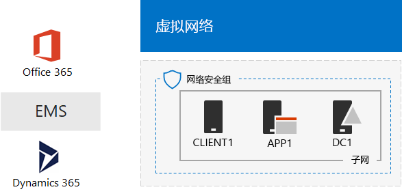
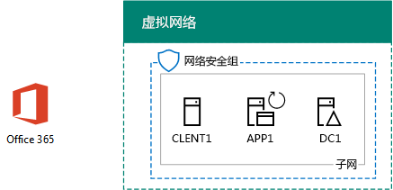
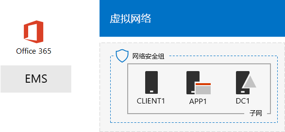

# 一个 Microsoft 云开发/测试环境

 **摘要：**此测试实验室指南用于创建包含所有微软云产品的开发/测试环境。
  
使用本文中的说明进行操作，您在 Microsoft Azure 的基础结构服务中创建模拟的内联网并将 Microsoft Office 365、 Microsoft 企业移动 + 安全 (EMS) 和 Microsoft Dynamics 365 订阅。其结果是在一个单一的开发测试环境中同时使用所有 Microsoft 的云服务简化的组织。 
  

  
您可以使用对生成的配置：
  
- 体验微软云服务，例如提供通过 Azure 活动目录 (AD) 的公共标识基础结构集成。
    
- 对包含多个 Microsoft 云服务的端到端方案进行评估。
    
- 创建演示、 概念验证或使用多个云 Microsoft 产品开发/测试配置。
    
- 构建您的 Microsoft 云技能的职业发展。
    
## 阶段 1： 创建模拟的内联网，并添加 Office 365

请按[您 Office 365 的开发/测试环境的目录同步](dirsync-for-your-office-365-dev-test-environment.md)。
  
图 1 显示您生成的配置，其中包括 Office 365 和模拟的内联网，从内部 Windows 服务器活动目录 (AD) 林在 Azure 的基础设施服务和目录同步运行。
  
**图 1： 使用 Office 365 的 Azure 中模拟的 intranet**

  
> [!NOTE]
> Azure 试用期为 30 天。Office 365 企业 E5 试用版订购是 30 天，可以轻松地扩展为另一个 30 天。为永久的开发测试环境，创建一个新支付 Azure 订阅和新付款的 Office 365 企业 E5 订购数目较少的许可证。 
  
## 阶段 2： 添加 EMS

在此阶段，注册 EMS 试用订阅，并将其作为 Office 365 试用订阅添加到同一组织。
  
1. 使用浏览器在台式计算机或从客户端 1，登录到 Office 365 门户[https://portal.office.com](https://portal.office.com)您的全局管理员帐户的凭据。
    
2. 单击“管理”磁贴。
    
3. 在浏览器的“Office 管理中心”选项卡的左侧导航中，单击“帐单”>“购买服务”。
    
4. **购买服务**页上找到**企业移动 + 安全 E5**项。将鼠标指针悬停在其上，单击**启动免费试用版**。
    
5. 在“确认订单”页中，单击“立即试用”。
    
6. 在“订单签收”页中，单击“继续”。
    
> [!NOTE]
> 企业移动性 + 安全性 E5 的试订阅期为 90 天。对于永久性开发/测试环境，请使用少量许可证新建付费订阅。 
  
下一步，使企业移动性 + 为所有用户帐户的安全 E5 许可证。
  
1. 在浏览器的“Office 365 管理中心”选项卡的左侧导航中，单击“用户”>“活动用户”。
    
2. 单击您的全局管理员帐户，然后单击**编辑****产品**许可证。
    
3. **产品许可证**的窗格中，在打开产品许可证**的企业移动性 + 安全 E5**到**上**，单击**保存**，然后两次单击**关闭**。
    
4. 对于所有其他帐户 (用户 1、用户 2、用户 3、用户 4 和用户 5)，请执行步骤 2 和 3。
    
现在已开发/测试环境：
  
- 在 Azure 的基础结构服务中运行模拟内联网。
    
- 与你的用户帐户列表共享同一个组织和相同 Azure AD 租户的 Office 365 E5 企业版和 EMS 试用订阅。
    
- 启用所有用户帐户以使用 Office 365 E5 企业版和 EMS。
    
图 2 显示您生成的配置，它增加了 EMS。
  
**图 2： 模拟的 intranet 与 Office 365 和 EMS Azure 中**

  
## 阶段 3： 添加 Dynamics 365

在此阶段，您 Dynamics 365 试用订阅注册，即可将其添加到为您的 Office 365 和 EMS 试用订阅的同一组织。
  
1. 您的桌面计算机上使用浏览器或客户端 1，从登录到 Office 365 门户[https://portal.office.com](https://portal.office.com)您的全局管理员帐户的凭据。
    
2. 单击“管理”磁贴。
    
3. **办公室管理中心**选项卡上，左边的导航，请单击**计费 > 购买服务**。
    
4. **购买服务**页上找到**Dynamics 365 计划 1 企业版**项目。将鼠标指针悬停在其上，单击**启动免费试用版**。
    
5. 在“确认订单”页中，单击“立即试用”。
    
6. 在“订单签收”页中，单击“继续”。
    
> [!NOTE]
> Dynamics 365 计划 1 企业版订阅试用期是 30 天。可以轻松地将该订阅的试用期再延长 30 天。对于永久性开发/测试环境，请使用少量许可证创建新的付费订阅。 
  
使用下列步骤将 Dynamics 365 许可证分配给全局管理员用户 2，用户 3 帐户，使它们成为系统管理员。
  
1. 在**Office 管理员中心**选项卡，单击**用户 > 活动用户**。
    
2. 在活动的用户的列表中，单击您的全局管理员帐户，然后单击**编辑****产品**许可证。
    
3. 在**产品许可证**窗格中**Dynamics 365 计划 1 企业版**对**上**打开产品许可证、 单击**保存**，然后两次单击**关闭**。
    
4. 为用户 2 和用户 3 的帐户执行步骤 2 和步骤 3。
    
5. 关闭**Office 管理员中心**选项卡。
    
使用以下步骤将用户 2 和用户 3 的帐户配置为 Dynamics 365 系统管理员。
  
1. 在浏览器中，在左边的导航中， **Office 管理中心**选项卡上**管理居中对齐**，请单击，然后单击**Dynamics 365**。
    
    可能需要等到 Dynamics 365 完成预配后，菜单中才会显示 Dynamics 365。
    
2. Dynamics 365 选项卡上，单击**所有这些**，然后单击**完成安装。**
    
    等待设置完成。
    
    安装完成后，它会显示基于样本数据跟踪订阅的一部分销售活动仪表板。花一些时间查看**欢迎您的试用版**视频。关闭完成后视频窗口。
    
3. 在顶部的工具栏上，单击**销售**旁的下箭头，单击**设置**，然后单击**安全**。
    
4. 在**安全**页中，单击**用户**。
    
5. 在用户列表中，单击**用户 2**。
    
6. 在工具栏上，单击**管理角色**。
    
7. **管理角色**，单击**系统管理员**，然后单击**确定**。
    
8. 在顶部的工具栏中单击**安全**。
    
9. 为用户 3 帐户重复步骤 5 到 8。
    
10. 关闭**用户： 用户 3**选项卡。
    
> [!NOTE]
> 已为 Office 365 全局管理员帐户自动分配了 Dynamics 365 系统管理员角色。 
  
现在已开发/测试环境：
  
- 在 Azure 的基础结构服务中运行模拟内联网。
    
- Office 365 E5 企业，EMS 和 Dynamics 365 试用订阅，您的用户帐户列表与共享相同的组织和相同的 Azure AD 租户。
    
- 启用所有用户帐户以使用 Office 365 E5 企业版和 EMS。
    
- 您的全球企业管理员、 用户 2 和 3 用户帐户都允许使用 Dynamics 365，Dynamics 365 系统管理员。
    
图 3 显示了生成的配置。
  
**图 3： 使用 Office 365、 EMS 和 Dynamics 365 Azure 中模拟的 intranet**

  
## 后续步骤

现在，您可以尝试使用一个 Microsoft 云开发/测试环境。这里有一些建议为指导经验：
  
- [在 EMS 为 Office 365 提供应用程序配置移动应用程序 (MAM) 管理策略](https://technet.microsoft.com/library/mt764059.aspx)
    
- [在 Office 365 集成与 Dynamics 365 联系人说明 Exchange 联机](https://technet.microsoft.com/library/mt798313.aspx)
    
- [在 Azure 的基础结构服务来承载基于服务器的工作负载中创建模拟的跨内部网络](https://technet.microsoft.com/library/mt745150.aspx)
    
## 另请参阅

[云应用测试实验室指南 (TLGs)](cloud-adoption-test-lab-guides-tlgs.md)
  
[Microsoft 云 IT 体系结构资源](microsoft-cloud-it-architecture-resources.md)
  
[混合解决方案](hybrid-solutions.md)
  
[安全解决方案](security-solutions.md)

