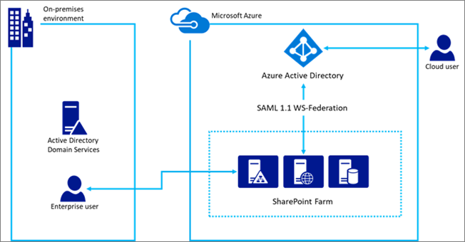

# <a name="using-azure-ad-for-sharepoint-server-authentication"></a>SharePoint 服务器身份验证使用 Azure 的广告

 **摘要：**了解如何使用 Azure Active Directory 您 SharePoint 服务器 2016年用户进行身份验证。
  
> [!NOTE]
> 本文基于 Kirk Evans，Microsoft 主体项目经理的工作。 

<blockquote>
<p>这篇文章是指与 Azure 活动目录图表进行交互的代码样本。您可以下载代码示例[这里](https://github.com/kaevans/spsaml11/tree/master/scripts)。</p>
</blockquote>

SharePoint 服务器 2016年提供使用基于声明的身份验证，使其更容易地管理您的用户通过与不同的标识提供程序信任，但其他人管理对进行身份验证的用户进行身份验证的能力。例如，而不是管理用户身份验证通过 Active Directory 域服务 (AD DS)，可以使用户能够使用 Azure 活动目录 (AD Azure) 进行身份验证。这样，仅云用户与他们的用户名中的 onmicrosoft.com 后缀的身份验证，用户与内部部署目录，同步和邀请的来宾用户从其他目录。它还使您能够利用 Azure 的广告功能，例如多因素身份验证和高级报告功能。

> [!IMPORTANT]
> 也可以与 SharePoint Server 2013; 使用本文中介绍的解决方案但是，记住 SharePoint Server 2013 已接近主流支持期结束。有关详细信息，请参阅[Microsoft 生命周期策略](https://support.microsoft.com/en-us/lifecycle/search?alpha=SharePoint%20Server%202013)和[更新产品维修策略的 SharePoint 2013](https://technet.microsoft.com/library/684173bb-e90a-4eb7-b268-b8d7458bc802(v=office.16).aspx)。

这篇文章解释了如何使用 Azure 的广告来对用户进行身份验证而不是您在部署 AD DS。在此配置中，Azure 广告成为 SharePoint 服务器 2016 年受信任的身份提供程序。此配置将是分开由本身的 SharePoint 服务器 2016年安装 AD DS 身份验证的用户身份验证方法。要从本文获益，您应该熟悉 WS 联合身份验证。有关详细信息，请参阅[了解 WS 联合身份验证](https://go.microsoft.com/fwlink/p/?linkid=188052)。



以前，这种配置需要如 Azure 访问控制服务 (ACS) 云或环境中的联合身份验证服务来转换标记从 SAML 2.0 SAML 1.1 到该主机 Active Directory 联合身份验证服务 (AD FS)。不再需要这种转换后 Azure 广告现在可支持颁发 SAML 1.1 标记。上图显示对 SharePoint 2016 用户在此配置中，证明不会再为中介，以执行这项转换要求身份验证的方式。

> [!NOTE]
> 这种配置工作是否在 Azure 的虚拟机或内部承载 SharePoint 服务器场。它不需要打开其他防火墙端口而不是确保用户可以从浏览器访问 Azure Active Directory。

关于 SharePoint 2016 辅助功能的信息，请参阅[SharePoint 服务器 2016年中的可访问性准则](https://go.microsoft.com/fwlink/p/?LinkId=393123)。

## <a name="configuration-overview"></a>配置概述

请执行以下常规步骤，将您的环境设置为作为 SharePoint 服务器 2016年身份标识提供程序使用 Azure 的广告。

1. 创建一个新 Azure 的广告目录，或者使用您现有的目录。
2. 请确保您想要使用 Azure AD 安全的 web 应用程序的区域被配置为使用 SSL。
3. 在 Azure AD 中创建新的企业级应用程序。
4. 在 SharePoint 服务器 2016年配置新的受信任的身份提供程序。
5. 设置 web 应用程序的权限。
6. 在 Azure AD 中添加 SAML 1.1 令牌颁发策略。
7. 验证新的提供程序。

以下各节介绍如何执行这些任务。

## <a name="step-1-create-a-new-azure-ad-directory-or-use-your-existing-directory"></a>步骤 1： 创建一个新 Azure 的广告目录，或者使用您现有的目录

在 Azure 门户网站 ([https://portal.azure.com](https://portal.azure.com))，创建一个新目录。提供组织名称、 初始域名称和国家 / 地区。

 

 如果已经有类似用于 Microsoft Office 365 或 Microsoft Azure 订阅目录，您可以改为使用该目录。您必须在目录中注册应用程序的权限。

## <a name="step-2-ensure-the-zone-for-the-web-application-that-you-want-to-secure-with-azure-ad-is-configured-to-use-ssl"></a>第 2 步： 确认您想要使用 Azure AD 安全的 web 应用程序的区域被配置为使用 SSL

撰写本文时使用参考体系结构中[运行高可用性在 Azure 中的 SharePoint 服务器 2016年场](https://docs.microsoft.com/en-us/azure/architecture/reference-architectures/sharepoint)。使用[本文](https://docs.microsoft.com/en-us/azure/architecture/reference-architectures/sharepoint)中介绍的解决方案部署的文章的伴随脚本可创建不使用 SSL 的网站。  

使用 SAML 需要将应用程序配置为使用 SSL。如果 SharePoint web 应用程序未配置为使用 SSL，请使用以下步骤创建新的自签名的证书配置 SSL 的 web 应用程序。此配置仅适用于实验室环境并不适合生产。生产环境应该使用一个签名的证书。

1. 转到**管理中心** > **应用程序管理** > **管理 Web 应用程序**，然后选择需要进行扩展，以使用 SSL 的 web 应用程序。选择 web 应用程序并单击**扩展功能区**按钮。扩展的 web 应用程序使用相同的 URL，但端口 443 上使用 SSL。</br></br>
2. 在 IIS 管理器 中，双击"服务器证书"。
3. 在**操作**窗格中，单击**创建自签名证书**。在指定友好名称的证书框中，键入证书的友好名称，然后单击**确定**。
4. 从**编辑站点绑定**对话框中，确保主机名相同的友好名称，如下图中所示。</br></br>

每个 SharePoint 服务器场中的 web 前端服务器将需要在 IIS 中配置网站绑定的证书。


## <a name="step-3-create-a-new-enterprise-application-in-azure-ad"></a>步骤 3： 创建新的企业级应用程序在 Azure 的广告

1. 在 Azure 门户网站 ([https://portal.azure.com](https://portal.azure.com))，打开 Azure 的广告目录。单击**企业应用程序**，然后单击**新的应用程序**。选择**非库应用程序**。提供一个名称，如*SharePoint SAML 集成*并单击**添加**。</br></br>
2. 单击导航窗格中配置应用程序，一个登录链接。为**基于 SAML 的登录方式进行登录**以显示应用程序的 SAML 配置属性更改**单一登录模式**下拉列表。配置具有以下属性：</br>
    - 标识符：`urn:sharepoint:portal.contoso.local`
    - 答复的 URL:`https://portal.contoso.local/_trust/default.aspx`
    - 登录 URL:`https://portal.contoso.local/_trust/default.aspx`
    - 用户标识符：`user.userprincipalname`</br>
    - 注： 请记住，若要通过将*portal.contoso.local*替换为要保护的 SharePoint 网站的 URL 更改 Url。</br>
3. 设置表 （类似于下面的表 1），其中包含以下行：</br> 
    - 领域
    - SAML 签名证书文件的完整路径
    - SAML 单一登录服务 URL 中 （替换*/wsfed* */saml2* ）
    - 应用程序对象的 id。 </br>
将*标识符*值复制到*领域*属性到表中 (请参阅表 1 下面)。
4. 保存所做的更改。
5. 单击**配置 （应用程序名称）**链接来访问配置登录页。</br></br> 
    -  单击要作为扩展名为.cer 的文件下载 SAML 签名证书的**SAML 签名证书的原始**链接。复制并粘贴到您的表下载的文件的完整路径。
    - 复制和粘贴的 SAML 单一登录服务 URL 链接到您，用*/wsfed*替换 URL 的*/saml2*部分。</br>
6.  导航到应用程序的**属性**窗格中。复制并粘贴到您在第 3 步中设置的表的对象 ID 值。</br></br>
7. 使用值捕获，请确保您在第 3 步中设置的表类似于下面的表 1。


| 表 1： 值捕获  |  |
|---------|---------|
|领域 | `urn:sharepoint:portal.contoso.local` |
|SAML 签名证书文件的完整路径 | `C:/temp/SharePoint SAML Integration.cer`  |
|SAML 单一登录服务 URL （替换 /wsfed /saml2） | `https://login.microsoftonline.com/b1726649-b616-460d-8d20-defab80d476c/wsfed` |
|应用程序对象 ID | `a812f48b-d1e4-4c8e-93be-e4808c8ca3ac` |

> [!IMPORTANT]
> 在 URL 中的*/saml2*值替换为*/wsfed*。*/Saml2*终结点将处理 SAML 2.0 令牌。*/Wsfed*终结点使处理 SAML 1.1 标记，并且需要为 SharePoint 2016 SAML 联盟。

## <a name="step-4-configure-a-new-trusted-identity-provider-in-sharepoint-server-2016"></a>步骤 4： 配置新的受信任的身份提供方在 SharePoint 服务器 2016

登录到 SharePoint 服务器 2016年服务器并打开 SharePoint 2016 管理外壳。在 $realm、 $wsfedurl 和 $filepath 从表 1 的值填充并运行下面的命令来配置新的受信任的身份提供程序。

> [!TIP]
> 如果使用 PowerShell 新手或想要了解有关 PowerShell 的工作原理的详细信息，请参阅[SharePoint PowerShell](https://docs.microsoft.com/en-us/powershell/sharepoint/overview?view=sharepoint-ps)。 

```
$realm = "<Realm from Table 1>"
$wsfedurl="<SAML single sign-on service URL from Table 1>"
$filepath="<Full path to SAML signing certificate file from Table 1>"
$cert = New-Object System.Security.Cryptography.X509Certificates.X509Certificate2($filepath)
New-SPTrustedRootAuthority -Name "AzureAD" -Certificate $cert
$map = New-SPClaimTypeMapping -IncomingClaimType "http://schemas.xmlsoap.org/ws/2005/05/identity/claims/name" -IncomingClaimTypeDisplayName "name" -LocalClaimType "http://schemas.xmlsoap.org/ws/2005/05/identity/claims/upn"
$map2 = New-SPClaimTypeMapping -IncomingClaimType "http://schemas.xmlsoap.org/ws/2005/05/identity/claims/givenname" -IncomingClaimTypeDisplayName "GivenName" -SameAsIncoming
$map3 = New-SPClaimTypeMapping -IncomingClaimType "http://schemas.xmlsoap.org/ws/2005/05/identity/claims/surname" -IncomingClaimTypeDisplayName "SurName" -SameAsIncoming
$ap = New-SPTrustedIdentityTokenIssuer -Name "AzureAD" -Description "SharePoint secured by Azure AD" -realm $realm -ImportTrustCertificate $cert -ClaimsMappings $map,$map2,$map3 -SignInUrl $wsfedurl -IdentifierClaim "http://schemas.xmlsoap.org/ws/2005/05/identity/claims/name"
```

接下来，请按照以下步骤来启用应用程序信任的身份提供程序：
1. 在管理中心，导航到**管理 Web 应用程序**并选择您想要使用 Azure AD 安全 web 应用程序。 
2. 在功能区中，单击**身份验证提供程序**，并选择您想要使用的区域。
3. 选择**受信任的身份提供程序**并选择名为*AzureAD*的识别提供只需注册。  
4. 登录页的 URL 设置，请选择**自定义登录页**和提供的值"/_trust/"。 
5. 单击"确定"。


## <a name="step-5-set-the-permissions"></a>步骤 5： 设置权限

将登录到 Azure 的 AD 和访问 SharePoint 用户必须被授予访问应用程序。 

1. 在 Azure 门户中，打开 Azure 的广告目录。单击**企业应用程序**，然后单击**所有应用程序**。单击以前创建的应用程序 （SharePoint SAML 集成）。
2. 单击**用户和组**。 
3. 单击**添加用户**添加用户或组有权登录到 SharePoint 使用 Azure 的广告。
4. 选择用户或组，然后单击**指派**。
 
用户已被授予权限的 Azure 的广告，但还必须授予在 SharePoint 中的权限。使用以下步骤设置访问 web 应用程序的权限。

1. 在管理中心中，单击"应用程序管理"。
2. 在"应用程序管理"页上的"Web 应用程序"部分，单击"管理 Web 应用程序"。
3. 单击适当的 Web 应用程序，然后单击"用户策略"。
4. 在 Web 应用程序的策略，单击**添加用户**。</br></br>
5. 在"添加用户"对话框中，单击"区域"中的适当区域，然后单击"下一步"。
6. 在**Web 应用程序的策略**对话框中的在**选择用户**部分，单击**浏览**图标。
7. 在**查找**文本框中，键入用户的登录名称在您的目录中，单击**搜索**。 </br>例如： *demouser@blueskyabove.onmicrosoft.com*。
8. AzureAD 在标题下的列表视图中，选择名称属性，单击**添加**，然后单击**确定**以关闭对话框。
9. 在权限中，单击**完全控制**。</br></br>
10. 单击"完成"，然后单击"确定"。

## <a name="step-6-add-a-saml-11-token-issuance-policy-in-azure-ad"></a>步骤 6： 在 Azure AD 中添加 SAML 1.1 令牌颁发策略

在门户中创建 AD Azure 应用程序时，它默认使用 SAML 2.0。SharePoint 服务器 2016年要求 SAML 1.1 标记格式。下面的脚本将删除默认 SAML 2.0 策略，并对问题 SAML 1.1 标记中添加新的策略。这段代码要求下载附带的[示例演示与 Azure 活动目录图表进行交互](https://github.com/kaevans/spsaml11/tree/master/scripts)。 


```
Import-Module <file path of Initialize.ps1> 
$objectid = "<Application Object ID from Table 1>"
$saml2policyid = Get-PoliciesAssignedToServicePrincipal -servicePrincipalId $objectid | ?{$_.displayName -EQ "TokenIssuancePolicy"} | select objectId
Remove-PolicyFromServicePrincipal -policyId $saml2policyid -servicePrincipalId $objectid
$policy = Add-TokenIssuancePolicy -DisplayName SPSAML11 -SigningAlgorithm "http://www.w3.org/2001/04/xmldsig-more#rsa-sha256" -TokenResponseSigningPolicy TokenOnly -SamlTokenVersion "1.1"
Set-PolicyToServicePrincipal -policyId $policy.objectId -servicePrincipalId $objectid
```
> 需要注意的是一定要运行`Import-Module`在此示例中所示的命令。这将加载的依赖模块包含所示的命令。您可能需要打开提升的命令提示符成功执行这些命令。

这些示例 PowerShell 命令是如何对图形 API 执行查询的示例。使用 Azure AD 的令牌颁发策略的详细信息，请参阅[图形 API 参考的操作策略](https://msdn.microsoft.com/en-us/library/azure/ad/graph/api/policy-operations#create-a-policy)。

## <a name="step-7-verify-the-new-provider"></a>第 7 步： 验证新的提供程序

打开您在前面的步骤中配置的 web 应用程序的 url 的浏览器。您将被重定向，以登录到 Azure 的广告。


询问您是否要保持登录状态。


最后，您可以访问网站从 Azure Active Directory 租户的用户的身份登录。


## <a name="managing-certificates"></a>管理证书
请务必了解上面的步骤 4 中的信任的身份提供程序配置的签名证书已到期日期和必须续订。有关续订证书，请参阅文章[管理联盟单一登录 Azure Active Directory 中的证书](https://docs.microsoft.com/en-us/azure/active-directory/active-directory-sso-certs)的信息。一旦已经在 Azure AD 续订该证书，下载到本地文件，并使用下面的脚本来配置续订签名证书与受信任的身份提供方。 

```
$filepath="<Full path to renewed SAML signing certificate file>"
$cert= New-Object System.Security.Cryptography.X509Certificates.X509Certificate2($filePath)
New-SPTrustedRootAuthority -Name "AzureAD" -Certificate $cert
Get-SPTrustedIdentityTokenIssuer "AzureAD" | Set-SPTrustedIdentityTokenIssuer -ImportTrustCertificate $cert
```

## <a name="fixing-people-picker"></a>修复人员选取器
用户现在可以登录到 SharePoint 2016 使用标识从 Azure 的广告，但仍有改进的用户体验的机会。例如，搜索用户人员选取器中显示多个搜索结果。还有 3 声明类型中声明映射创建的每个搜索结果。若要选择用户使用人员选取器，必须准确地键入他们的用户名并选择**名称**声明的结果。


没有验证您搜索的这会导致拼写错误的值或用户意外地选择错误声称如**姓**分配类型声明。这可以防止用户成功访问资源。

为了帮助这种情况下，提供了开源的解决方案称为 SharePoint 2016 年提供的自定义声明提供程序的[AzureCP](https://yvand.github.io/AzureCP/) 。它将使用 Azure 广告图解决用户输入并执行验证。了解更多信息，请访问[AzureCP](https://yvand.github.io/AzureCP/)。 

## <a name="additional-resources"></a>其他资源

[了解 WS-Federation](https://go.microsoft.com/fwlink/p/?linkid=188052)
  
[云应用和混合解决方案](cloud-adoption-and-hybrid-solutions.md)
  
## <a name="join-the-discussion"></a>加入讨论

|**联系我们**|**说明**|
|:-----|:-----|
|**你需要什么样的解决方案？** <br/> |我们正在创建跨越多个 Microsoft 云平台和服务的云采用内容。请告诉我们你对云采用内容的想法，或者发送电子邮件至 [cloudadopt@microsoft.com](mailto:cloudadopt@microsoft.com?Subject=[Cloud%20Adoption%20Content%20Feedback]:%20) 请求获取特定内容。<br/> |
|**参加解决方案讨论** <br/> |如果热衷于基于云的解决方案，请考虑加入云采用咨询委员会 (CAAB)，以便与充满活力的更大规模社区保持联络，其中包括 Microsoft 内容开发人员、行业专家和全球各地的客户。若要加入，请将自己添加为 Microsoft 技术社区的[云采用咨询委员会 (CAAB) 空间](https://aka.ms/caab)成员，并向我们 ([CAAB@microsoft.com](mailto:caab@microsoft.com?Subject=I%20just%20joined%20the%20Cloud%20Adoption%20Advisory%20Board!)) 发送电子邮件。任何人都可以阅读 [CAAB 博客](https://blogs.technet.com/b/solutions_advisory_board/)上与社区相关的内容。不过，CAAB 成员可获邀参加私人网络研讨会，了解新云采用资源和解决方案。<br/> |
|**获取您在此处看到的图片** <br/> |若要获取本文中图片的可编辑副本，请告诉我们，我们非常乐意发送副本。请通过电子邮件方式将请求（包括图片的 URL 和标题）发送到 [cloudadopt@microsoft.com](mailto:cloudadopt@microsoft.com?subject=[Art%20Request]:%20)。<br/> |
   

