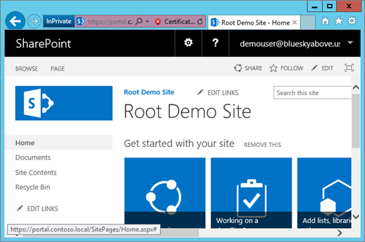

# <a name="using-azure-ad-for-sharepoint-server-authentication"></a>使用 Azure AD 进行 SharePoint Server 身份验证

 **摘要:** 了解如何使用 Azure Active Directory 对 SharePoint Server 2016 用户进行身份验证。 

<blockquote>
<p>本文引用与 Azure Active Directory 图形交互的代码示例。 你可以在[此处](https://github.com/kaevans/spsaml11/tree/master/scripts)下载代码示例。</p>
</blockquote>

SharePoint Server 2016 提供了使用基于声明的身份验证对用户进行身份验证的能力, 通过使用您信任但其他人管理的不同标识提供程序对用户进行身份验证, 可以轻松地管理用户。 例如, 您可以使用户能够使用 Azure Active Directory (Azure AD) 进行身份验证, 而不是通过 Active Directory 域服务 (AD DS) 管理用户身份验证。 这将为仅限云的用户使用其用户名中的 onmicrosoft.com 后缀、与本地目录同步的用户和其他目录中的受邀来宾用户启用身份验证。 它还使您能够利用 Azure AD 功能, 如多因素身份验证和高级报告功能。

> [!IMPORTANT]
> 本文中所述的解决方案也可用于 SharePoint Server 2013;但请记住, SharePoint Server 2013 即将结束主流支持。 有关详细信息, 请参阅适用[于 SharePoint 2013 的](https://technet.microsoft.com/library/684173bb-e90a-4eb7-b268-b8d7458bc802(v=office.16).aspx) [Microsoft 生命周期策略](https://support.microsoft.com/en-us/lifecycle/search?alpha=SharePoint%20Server%202013)和更新的产品服务策略。

本文介绍如何使用 Azure AD (而不是本地 AD DS) 对用户进行身份验证。 在此配置中, Azure AD 成为 SharePoint Server 2016 的受信任标识提供程序。 此配置将添加独立于 SharePoint Server 2016 安装本身所使用的 AD DS 身份验证的用户身份验证方法。 要从本文中受益，您应该熟悉 WS-Federation。 有关详细信息，请参阅[了解 WS-Federation](https://go.microsoft.com/fwlink/p/?linkid=188052)。 有关使用 Azure Active Directory 集成 SharePoint 本地的详细信息, 请参阅[专用教程](https://docs.microsoft.com/azure/active-directory/saas-apps/sharepoint-on-premises-tutorial)。


之前, 此配置需要在云或承载 Active Directory 联合身份验证服务 (AD FS) 的环境中使用联合身份验证服务 (如 Azure 访问控制服务 (AD FS), 以将令牌从 SAML 2.0 转换为 SAML 1.1。 此转换不再是必需的, 因为 Azure AD 现在启用了 "颁发 SAML 1.1 令牌"。 上图显示了此配置中的 SharePoint 2016 用户对身份验证的工作原理, 演示了如何对中间项执行此转换不再要求。

> [!NOTE]
> 此配置适用于 SharePoint 服务器场是在 Azure 虚拟机中托管, 还是在本地托管。 它不需要打开其他防火墙端口, 而是确保用户可以从其浏览器访问 Azure Active Directory。

有关 SharePoint 2016 辅助功能的信息, 请参阅[Sharepoint Server 2016 中的辅助功能准则](https://go.microsoft.com/fwlink/p/?LinkId=393123)。

## <a name="configuration-overview"></a>配置概述

按照以下常规步骤, 将您的环境设置为使用 Azure AD 作为 SharePoint Server 2016 标识提供程序。

1. 创建新的 Azure AD 目录或使用现有目录。
2. 确保要使用 Azure AD 进行保护的 web 应用程序的区域配置为使用 SSL。
3. 在 Azure AD 中创建新的企业应用程序。
4. 在 SharePoint Server 2016 中配置新的受信任标识提供程序。
5. 设置 web 应用程序的权限。
6. 在 Azure AD 中添加 SAML 1.1 令牌颁发策略。
7. 验证新的提供程序。

以下各节介绍如何执行这些任务。

## <a name="step-1-create-a-new-azure-ad-directory-or-use-your-existing-directory"></a>步骤 1: 创建新的 Azure AD 目录或使用现有目录

在 Azure 门户 ([https://portal.azure.com](https://portal.azure.com)) 中, 创建一个新目录。 提供组织名称、初始域名以及国家或地区。

 

 如果您已有一个目录 (如用于 Microsoft Office 365 的目录) 或 Microsoft Azure 订阅, 则可以改为使用该目录。 您必须具有在目录中注册应用程序的权限。

## <a name="step-2-ensure-the-zone-for-the-web-application-that-you-want-to-secure-with-azure-ad-is-configured-to-use-ssl"></a>步骤 2: 确保要使用 Azure AD 保护的 web 应用程序的区域配置为使用 SSL

本文是使用在[Azure 中运行高可用性 SharePoint Server 2016 场](https://docs.microsoft.com/en-us/azure/architecture/reference-architectures/sharepoint)中的参考体系结构编写的。 本文附带的脚本 (用于部署[本文](https://docs.microsoft.com/en-us/azure/architecture/reference-architectures/sharepoint)中所述的解决方案) 创建了不使用 SSL 的网站。  

使用 SAML 要求将应用程序配置为使用 SSL。 如果您的 SharePoint web 应用程序未配置为使用 SSL, 请使用以下步骤创建新的自签名证书, 以配置用于 SSL 的 web 应用程序。 此配置仅适用于实验室环境, 不用于生产。 生产环境应使用已签名的证书。

1. 转到 "**管理中心** > **应用程序管理** > "**管理 web 应用程序**, 并选择需要扩展的 web 应用程序以使用 SSL。 选择 web 应用程序, 然后单击 "**扩展功能区**" 按钮。 扩展 web 应用程序以使用相同的 URL, 但使用带端口443的 SSL。<br/><br/>
2. 在 IIS 管理器 中，双击"服务器证书"。
3. 在"操作"窗格中，单击"创建自签名证书"。 在 "指定证书的友好名称" 框中键入证书的友好名称, 然后单击 **"确定"**。
4. 从 "**编辑网站绑定**" 对话框中, 确保主机名与友好名称相同, 如下图中所示。<br/><br/>

SharePoint 场中的每台 web 前端服务器都需要在 IIS 中为网站绑定配置证书。


## <a name="step-3-create-a-new-enterprise-application-in-azure-ad"></a>步骤 3: 在 Azure AD 中创建新的企业应用程序

1. 在 Azure 门户 ([https://portal.azure.com](https://portal.azure.com)) 中, 打开 azure AD 目录。 单击 "**企业应用程序**", 然后单击 "**新建应用程序**"。 选择 "**非库应用程序**"。 提供一个名称, 如*SHAREPOINT SAML 集成*, 然后单击 "**添加**"。<br/><br/>
2. 单击导航窗格中的 "单一登录" 链接以配置应用程序。 将**单点登录模式**下拉列表更改为**基于 saml 的登录**, 以显示应用程序的 SAML 配置属性。 使用以下属性进行配置:<br/>
    - 标识号`urn:sharepoint:portal.contoso.local`
    - 回复 URL:`https://portal.contoso.local/_trust/default.aspx`
    - 登录 URL:`https://portal.contoso.local/_trust/default.aspx`
    - 用户标识符:`user.userprincipalname`<br/>
    - 注意: 请记住通过将*门户*替换为要保护的 SharePoint 网站的 url 来更改 url。<br/>
3. 设置表 (类似于下面的表 1), 其中包含以下行:<br/> 
    - Realm
    - SAML 签名证书文件的完整路径
    - SAML 单一登录服务 URL (将 */saml2*替换为 */wsfed*)
    - Application 对象 ID。 <br/>
将 "*标识符*" 值复制到 "*领域*" 属性中的表中 (请参阅下面的表1。)
4. 保存所做的更改。
5. 单击 "**配置 (应用名称)** " 链接以访问 "配置" 登录页。<br/><br/> 
    -  单击**Saml 签名证书-Raw**链接以将 Saml 签名证书下载为扩展名为 .cer 的文件。 将下载的文件的完整路径复制并粘贴到您的表中。
    - 将 SAML 单一登录服务 URL 链接复制并粘贴到中, 将 URL 的 */saml2*部分替换为 */wsfed*。<br/>
6.  导航到应用程序的 "**属性**" 窗格。 将 "对象 ID" 值复制并粘贴到您在步骤3中设置的表中。<br/><br/>
7. 使用您捕获的值, 确保您在步骤3中设置的表类似于下面的表1。


| 表 1: 捕获的值  |  |
|---------|---------|
|Realm | `urn:sharepoint:portal.contoso.local` |
|SAML 签名证书文件的完整路径 | `C:/temp/SharePoint SAML Integration.cer`  |
|SAML 单一登录服务 URL (将/saml2 替换为/wsfed) | `https://login.microsoftonline.com/b1726649-b616-460d-8d20-defab80d476c/wsfed` |
|Application 对象 ID | `a812f48b-d1e4-4c8e-93be-e4808c8ca3ac` |

> [!IMPORTANT]
> 将 URL 中的 */saml2*值替换为 */wsfed*。 */Saml2*终结点将处理 SAML 2.0 令牌。 */Wsfed*终结点启用对 saml 1.1 令牌的处理, 这是 SHAREPOINT 2016 SAML 联合所必需的。

## <a name="step-4-configure-a-new-trusted-identity-provider-in-sharepoint-server-2016"></a>步骤 4: 在 SharePoint Server 2016 中配置新的受信任标识提供程序

登录到 SharePoint Server 2016 服务器并打开 SharePoint 2016 命令行管理程序。 在表1中填写 $realm、$wsfedurl 和 $filepath 的值, 然后运行以下命令来配置新的受信任标识提供程序。

> [!TIP]
> 如果你不熟悉使用 PowerShell, 或者想详细了解 PowerShell 的工作方式, 请参阅[SharePoint PowerShell](https://docs.microsoft.com/en-us/powershell/sharepoint/overview?view=sharepoint-ps)。 

```
$realm = "<Realm from Table 1>"
$wsfedurl="<SAML single sign-on service URL from Table 1>"
$filepath="<Full path to SAML signing certificate file from Table 1>"
$cert = New-Object System.Security.Cryptography.X509Certificates.X509Certificate2($filepath)
New-SPTrustedRootAuthority -Name "AzureAD" -Certificate $cert
$map = New-SPClaimTypeMapping -IncomingClaimType "http://schemas.xmlsoap.org/ws/2005/05/identity/claims/name" -IncomingClaimTypeDisplayName "name" -LocalClaimType "http://schemas.xmlsoap.org/ws/2005/05/identity/claims/upn"
$map2 = New-SPClaimTypeMapping -IncomingClaimType "http://schemas.xmlsoap.org/ws/2005/05/identity/claims/givenname" -IncomingClaimTypeDisplayName "GivenName" -SameAsIncoming
$map3 = New-SPClaimTypeMapping -IncomingClaimType "http://schemas.xmlsoap.org/ws/2005/05/identity/claims/surname" -IncomingClaimTypeDisplayName "SurName" -SameAsIncoming
$ap = New-SPTrustedIdentityTokenIssuer -Name "AzureAD" -Description "SharePoint secured by Azure AD" -realm $realm -ImportTrustCertificate $cert -ClaimsMappings $map,$map2,$map3 -SignInUrl $wsfedurl -IdentifierClaim "http://schemas.xmlsoap.org/ws/2005/05/identity/claims/name"
```

接下来, 按照以下步骤为您的应用程序启用受信任的标识提供程序:
1. 在管理中心中, 导航到 "**管理 Web 应用程序**", 然后选择要使用 Azure AD 进行保护的 Web 应用程序。 
2. 在功能区中, 单击 "**身份验证提供程序**", 然后选择要使用的区域。
3. 选择 "**受信任的身份提供程序**", 然后选择刚刚注册的名为*AzureAD*的标识提供程序。  
4. 在 "登录页 URL" 设置中, 选择 "**自定义登录页**" 并提供值 "/_trust/"。 
5. 单击“确定”****。


> [!IMPORTANT]
> 务必遵循所有步骤, 包括将自定义登录页设置为 "/_trust/", 如图所示。 除非遵循所有步骤, 否则配置将无法正常运行。

## <a name="step-5-set-the-permissions"></a>步骤 5: 设置权限

必须向要登录到 Azure AD 和 access SharePoint 的用户授予对应用程序的访问权限。 

1. 在 Azure 门户中, 打开 Azure AD 目录。 单击 "**企业应用程序**", 然后单击 "**所有应用程序**"。 单击先前创建的应用程序 (SharePoint SAML 集成)。
2. 单击 "**用户和组**"。 
3. 单击 "**添加用户**" 以添加将有权使用 Azure AD 登录到 SharePoint 的用户或组。
4. 选择用户或组, 然后单击 "**分配**"。
 
用户已在 Azure AD 中授予权限, 但还必须在 SharePoint 中授予权限。 执行下列步骤，设置访问 Web 应用程序的权限。

1. 在管理中心中，单击“应用程序管理”****。
2. 在"应用程序管理"页上的"Web 应用程序"部分，单击"管理 Web 应用程序"。
3. 单击适当的 Web 应用程序，然后单击"用户策略"。
4. 在 "Web 应用程序的策略" 中, 单击 "**添加用户**"。<br/><br/>
5. 在"添加用户" 对话框中，单击"区域"中的适当区域，然后单击"下一步"。
6. 在 " **Web 应用程序的策略**" 对话框的 "**选择用户**" 部分, 单击 "**浏览**" 图标。
7. 在 "**查找**" textbox 中, 在目录中键入用户的登录名, 然后单击 "**搜索**"。 <br/>示例: *demouser@blueskyabove.onmicrosoft.com*。
8. 在列表视图中的 "AzureAD" 标题下, 选择 "名称" 属性并单击 "**添加**", 然后单击 **"确定"** 以关闭对话框。
9. 在 "权限" 中, 单击 "**完全控制**"。<br/><br/>
10. 单击"完成"，然后单击"确定"。

## <a name="step-6-add-a-saml-11-token-issuance-policy-in-azure-ad"></a>步骤 6: 在 Azure AD 中添加 SAML 1.1 令牌颁发策略

在门户中创建 Azure AD 应用程序时, 它将默认使用 SAML 2.0。 SharePoint Server 2016 需要 SAML 1.1 令牌格式。 下面的脚本将删除默认的 SAML 2.0 策略, 并添加新策略以颁发 SAML 1.1 令牌。 

> 此代码要求下载[演示与 Azure Active Directory Graph 交互](https://github.com/kaevans/spsaml11/tree/master/scripts)的附带示例。 如果将脚本作为 ZIP 文件从 GitHub 下载到 Windows 桌面, 请确保取消阻止`MSGraphTokenLifetimePolicy.psm1`脚本模块文件和`Initialize.ps1`脚本文件 (右键单击 "属性", 选择 "取消阻止", 然后单击 "确定")。 


下载示例脚本后, 请使用以下代码创建一个新的 PowerShell 脚本, 将占位符替换为本地计算机上下载`Initialize.ps1`的文件路径。 将应用程序对象 ID 占位符替换为您在表1中输入的 application 对象 ID。 创建后, 执行 PowerShell 脚本。 

```
function AssignSaml11PolicyToAppPrincipal
{
    Param(
        [Parameter(Mandatory=$true)]
        [string]$pathToInitializeScriptFile, 
        [Parameter(Mandatory=$true)]
        [string]$appObjectid
    )

    $folder = Split-Path $pathToInitializeScriptFile
    Push-Location $folder

    #Loads the dependent ADAL module used to acquire tokens
    Import-Module $pathToInitializeScriptFile 

    #Gets the existing token issuance policy
    $existingTokenIssuancePolicy = Get-PoliciesAssignedToServicePrincipal -servicePrincipalId $appObjectid | ?{$_.type -EQ "TokenIssuancePolicy"} 
    Write-Host "The following TokenIssuancePolicy policies are assigned to the service principal." -ForegroundColor Green
    Write-Host $existingTokenIssuancePolicy -ForegroundColor White
    $policyId = $existingTokenIssuancePolicy.objectId

    #Removes existing token issuance policy
    Write-Host "Only a single policy can be assigned to the service principal. Removing the existing policy with ID $policyId" -ForegroundColor Green
    Remove-PolicyFromServicePrincipal -policyId $policyId -servicePrincipalId $appObjectid

    #Creates a new token issuance policy and assigns to the service principal
    Write-Host "Adding the new SAML 1.1 TokenIssuancePolicy" -ForegroundColor Green
    $policy = Add-TokenIssuancePolicy -DisplayName SPSAML11 -SigningAlgorithm "http://www.w3.org/2001/04/xmldsig-more#rsa-sha256" -TokenResponseSigningPolicy TokenOnly -SamlTokenVersion "1.1"
    Write-Host "Assigning the new SAML 1.1 TokenIssuancePolicy $policy.objectId to the service principal $appObjectid" -ForegroundColor Green
    Set-PolicyToServicePrincipal -policyId $policy.objectId -servicePrincipalId $appObjectid
    Pop-Location
}

#Only edit the following two variables
$pathToInitializeScriptFile = "<file path of Initialize.ps1>"
$appObjectid = "<Application Object ID from Table 1>"

AssignSaml11PolicyToAppPrincipal $pathToInitializeScriptFile $appObjectid
```
> [!IMPORTANT]
> PowerShell 脚本未签名, 可能会提示您设置执行策略。 有关执行策略的详细信息, 请参阅[关于执行策略](http://go.microsoft.com/fwlink/?LinkID=135170)。 此外, 您可能需要打开提升的命令提示符, 才能成功执行示例脚本中包含的命令。

这些示例 PowerShell 命令是有关如何对 Graph API 执行查询的示例。 有关 Azure AD 令牌颁发策略的更多详细信息, 请参阅[针对策略的操作的 GRAPH API 参考](https://msdn.microsoft.com/en-us/library/azure/ad/graph/api/policy-operations#create-a-policy)。

## <a name="step-7-verify-the-new-provider"></a>步骤 7: 验证新提供程序

打开浏览器, 使其指向您在前面步骤中配置的 web 应用程序的 URL。 你将重定向到 "注册到 Azure AD"。


系统会询问您是否要保持登录。


最后, 您可以从 Azure Active Directory 租户访问以用户身份登录的网站。



## <a name="managing-certificates"></a>管理证书
请务必了解, 在上面的步骤4中为受信任的标识提供程序配置的签名证书具有过期日期, 必须续订。 有关证书续订的信息, 请参阅[在 Azure Active Directory 中管理联合单一登录的证书一](https://docs.microsoft.com/en-us/azure/active-directory/active-directory-sso-certs)文。 在 Azure AD 中续订证书后, 下载到本地文件, 并使用以下脚本配置已续订签名证书的受信任标识提供程序。 

```
$filepath="<Full path to renewed SAML signing certificate file>"
$cert= New-Object System.Security.Cryptography.X509Certificates.X509Certificate2($filePath)
New-SPTrustedRootAuthority -Name "AzureAD" -Certificate $cert
Get-SPTrustedIdentityTokenIssuer "AzureAD" | Set-SPTrustedIdentityTokenIssuer -ImportTrustCertificate $cert
```
## <a name="configuring-one-trusted-identity-provider-for-multiple-web-applications"></a>为多个 web 应用程序配置一个受信任的标识提供程序
配置适用于单个 web 应用程序, 但如果打算对多个 web 应用程序使用相同的受信任标识提供程序, 则需要其他配置。 例如, 假定我们已将 web 应用程序扩展为使用 URL `https://portal.contoso.local` , 现在想要对用户`https://sales.contoso.local`进行身份验证。 为此, 我们需要更新标识提供程序以接受 WReply 参数, 并更新 Azure AD 中的应用程序注册, 以添加回复 URL。

1. 在 Azure 门户中, 打开 Azure AD 目录。 单击 "**应用程序注册**", 然后单击 "**查看所有应用程序**"。 单击先前创建的应用程序 (SharePoint SAML 集成)。
2. 单击 "**设置**"。
3. 在 "设置" 边栏选项卡中, 单击 "**答复 url**"。 
4. 添加附加到 URL 的其他 web 应用程序`/_trust/default.aspx`的 url (例如`https://sales.contoso.local/_trust/default.aspx`), 然后单击 "**保存**"。 
5. 在 SharePoint 服务器上, 使用之前使用的受信任的标识令牌颁发者的名称打开**sharepoint 2016 命令行管理**程序, 并执行以下命令。

```
$t = Get-SPTrustedIdentityTokenIssuer "AzureAD"
$t.UseWReplyParameter=$true
$t.Update()
```
6. 在管理中心中, 转到 web 应用程序并启用现有的受信任标识提供程序。 请记住, 还要将登录页面 URL 配置为自定义登录页`/_trust/`。
7. 在管理中心中, 单击 "web 应用程序", 然后选择 "**用户策略**"。 按照本文前面所述, 添加具有适当权限的用户。

## <a name="fixing-people-picker"></a>修复人员选取器
用户现在可以使用 Azure AD 中的标识登录到 SharePoint 2016, 但仍有机会改进用户体验。 例如, 搜索用户会在人员选取器中提供多个搜索结果。 在声明映射中创建的三个声明类型中的每一个都有一个搜索结果。 若要使用人员选取器选择用户, 您必须完全键入其用户名, 然后选择**名称**声明结果。


您搜索的值没有验证, 这可能会导致拼写错误或用户意外选择了错误的声明类型来分配, 例如,**姓**声明。 这可能会阻止用户成功访问资源。

为帮助此方案, 存在一个名为[AzureCP](https://yvand.github.io/AzureCP/)的开放源代码解决方案, 该解决方案为 SharePoint 2016 提供了自定义声明提供程序。 它将使用 Azure AD Graph 解析用户输入和执行验证的内容。 有关详细信息, 请参阅[AzureCP](https://yvand.github.io/AzureCP/)。 

## <a name="additional-resources"></a>其他资源

[了解 WS-Federation](https://go.microsoft.com/fwlink/p/?linkid=188052)
  
[云应用和混合解决方案](cloud-adoption-and-hybrid-solutions.md)
  
## <a name="join-the-discussion"></a>加入讨论

|**联系我们**|**说明**|
|:-----|:-----|
|**您需要什么样的解决方案？** <br/> |我们正在为跨多个 Microsoft 产品和服务的解决方案创建内容。请告诉我们您对我们的跨服务器解决方案的想法，或者发送电子邮件到 [MODAcontent@microsoft.com](mailto:cloudadopt@microsoft.com?Subject=[Cloud%20Adoption%20Content%20Feedback]:%20) 寻求具体的解决方案。<br/> |
|**参加解决方案讨论** <br/> |如果热衷于基于云的解决方案，请考虑加入云采用咨询委员会 (CAAB)，以便与充满活力的更大规模社区保持联络，其中包括 Microsoft 内容开发人员、行业专家和全球各地的客户。若要加入，请将自己添加为 Microsoft 技术社区的[云采用咨询委员会 (CAAB) 空间](https://aka.ms/caab)成员，并向我们 ([CAAB@microsoft.com](mailto:caab@microsoft.com?Subject=I%20just%20joined%20the%20Cloud%20Adoption%20Advisory%20Board!)) 发送电子邮件。任何人都可以阅读 [CAAB 博客](https://blogs.technet.com/b/solutions_advisory_board/)上与社区相关的内容。不过，CAAB 成员可获邀参加私人网络研讨会，了解新云采用资源和解决方案。<br/> |
|**获取您在此处看到的图片** <br/> |若要获取本文中图片的可编辑副本，请告诉我们，我们非常乐意发送副本。请通过电子邮件方式将请求（包括图片的 URL 和标题）发送到 [cloudadopt@microsoft.com](mailto:cloudadopt@microsoft.com?subject=[Art%20Request]:%20)。<br/> |
   

