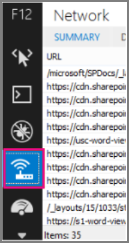

# <a name="using-content-delivery-networks-with-sharepoint-online"></a><span data-ttu-id="60618-103">与 SharePoint Online 中使用内容交付网络</span><span class="sxs-lookup"><span data-stu-id="60618-103">Using content delivery networks with SharePoint Online</span></span>

 <span data-ttu-id="60618-104">**摘要：** 本文介绍内容交付网络 (Cdn) 以及如何使用它们来提高 SharePoint Online 的性能。</span><span class="sxs-lookup"><span data-stu-id="60618-104">**Summary:** This article describes Content Delivery Networks (CDNs) and how you can use them to increase SharePoint Online performance.</span></span> 
  
<span data-ttu-id="60618-p101">在当今的 web 开发社区、 有许多常见库 （例如 JavaScript 和 CSS 文件） 可能包括在 SharePoint 解决方案中。许多种由 Microsoft 在其 ASP CDN 上承载。这意味着您可以从这些分布式服务器引用这些库，并允许 internet 的内置 DNS 路由系统以查找用户的最接近服务器。本文中的示例演示如何从 SharePoint Online 与 ASP CDN 服务器下载受欢迎的库 jQuery 之间的时间差异是非常重要。用户还可能已经缓存在本地计算机上，以便它们没有要下载文件的 CDN 版本。这可以是如果有用户从承载您的 SharePoint Online 网站的数据中心分布式世界各地和远很重要。</span><span class="sxs-lookup"><span data-stu-id="60618-p101">In today's web development communities, there are many common libraries (such as JavaScript and CSS files) that you may include in your SharePoint solution. Many of these are hosted by Microsoft on their ASP CDN. This means you can reference these libraries from these distributed servers and allow the internet's built-in DNS routing systems to find the closest server to your user. The examples in this article demonstrate how the time difference between downloading the popular library jQuery from the SharePoint Online server versus the ASP CDN is quite significant. The user also may already have the CDN version cached on the local computer so that they do not have to download the file. This can be important if you have users distributed all over the world and far away from the datacenter that hosts your SharePoint Online site.</span></span>
  
<span data-ttu-id="60618-p102">为 SharePoint Online 创建页面时，您的用户和 SharePoint Online 实例的位置之间的物理距离可能会影响延迟。对于网站承载在一个大洲，而世界另一端的用户需要访问其内容的全球性组织来说，这一点尤其重要。CDN 有助于缓解这种情况，因为它在更靠近最终用户的不同位置承载某些流行的 Web 资产。</span><span class="sxs-lookup"><span data-stu-id="60618-p102">When creating pages for SharePoint Online, latency can be affected by the physical distance between your users and the location of the SharePoint Online instance. This is particularly important for organizations that have a global presence where a site may be hosted on one continent while users on the other side of the world are accessing its content. CDNs help mitigate this situation by hosting certain popular web assets in different locations closer to the end users.</span></span>
  
<span data-ttu-id="60618-p103">由于 CDN 是承载相同文件的服务器的全球网络，存储在 CDN 上的文件的 Internet URL 将由客户端计算机解析，以便由距离用户最近的服务器提供该文件。执行此操作大大降低了网络往返引起的延迟。</span><span class="sxs-lookup"><span data-stu-id="60618-p103">Since a CDN is a worldwide network of servers that host the same files, Internet URLs for files stored on the CDNs are interpreted by the client machine so that the server that is closest to the user serves the file. Doing this significantly reduces delays caused by network round trips.</span></span>
  
## <a name="the-challenge-of-hosting-sharepoint-online-sites-for-a-global-audience"></a><span data-ttu-id="60618-116">为全球受众承载 SharePoint Online 网站的挑战</span><span class="sxs-lookup"><span data-stu-id="60618-116">The challenge of hosting SharePoint Online sites for a global audience</span></span>

<span data-ttu-id="60618-p104">SharePoint Online 网站承载在与您注册 Office 365 时选择的位置（由用户指定）相对的数据中心。例如，如果您的网站位于美国的服务器上，但您有用户从东亚地区访问网站，延迟问题可能由数据必须通过光缆传输的距离引起。</span><span class="sxs-lookup"><span data-stu-id="60618-p104">SharePoint Online sites are hosted at datacenters relative to the location (specified by the user) selected when you signed up with Office 365. For example, if your site is on servers in the United States and you have users accessing the site from East Asia, latency issues might arise due to the distance the data has to travel over fiber optic cable.</span></span>
  
<span data-ttu-id="60618-p105">Microsoft 的 Cdn 的全球网络上已承载多个静态文件使用的默认 SharePoint 用户界面。这将提高段时间内的性能。但是，如果您使用任何受欢迎的 JavaScript 和 CSS 资产 （如;JQuery、 Modernizr、 引导或 ASP.NET Ajax） 您可以通过使用免费提供的 Cdn 提高这些文件的加载时间。</span><span class="sxs-lookup"><span data-stu-id="60618-p105">Many static files used by the default SharePoint user interface are already hosted on Microsoft's worldwide network of CDNs. This will improve performance over time. However, if you use any popular JavaScript and CSS assets (for example; JQuery, Modernizr, Bootstrap, or ASP.NET Ajax) you can improve the loading times of these files by using freely available CDNs.</span></span>
  
## <a name="advantages-of-using-cdns-to-improve-download-speed"></a><span data-ttu-id="60618-122">使用 CDN 改进下载速度的优点</span><span class="sxs-lookup"><span data-stu-id="60618-122">Advantages of using CDNs to improve download speed</span></span>

<span data-ttu-id="60618-p106">使用 Cdn 可以提高各种原因的页面加载时间。一个原因是，可能比到 SharePoint Online 实例之间的距离短 CDN 和用户之间的距离。这些网络高度分布式，旨在还具有非常高可用性和响应时间。另一个原因是，如果您使用的 CSS 文件的常用库、 与 CDN 一起使用，用户可能已经缓存的库和它们甚至不需要根本下载。</span><span class="sxs-lookup"><span data-stu-id="60618-p106">Using CDNs can improve page load times for a variety of reasons. One reason is that the distance between the CDN and the user may be shorter than the distance to the SharePoint Online instance. These networks are highly distributed and are also designed to have very high availability and response times. Another reason is that if you are using a popular library of CSS files, in conjunction with a CDN, the user may already have the library cached and they won't even need to download it at all.</span></span>
  
<span data-ttu-id="60618-p107">以下屏幕快照说明如何使用 Cdn 的优点。以下屏幕截图是从 Internet Explorer 11 开发人员工具的**网络**选项卡。以下屏幕截图显示欢迎库 jQuery 延迟。要显示此屏幕中，在 Internet Explorer 中，按**f12 键**，然后选择**网络**选项卡，其中包含 Wi-fi 图标表示。</span><span class="sxs-lookup"><span data-stu-id="60618-p107">The following screen shots illustrate the advantages of using CDNs. These screen shots are from the **Network** tab in the Internet Explorer 11 developer tools. These screen shots show the latency on the popular library jQuery. To bring up this screen, in Internet Explorer, press **F12** and select the **Network** tab which is symbolized with a Wi-Fi icon.</span></span> 
  

  
<span data-ttu-id="60618-p108">此屏幕截图显示了上载到母版页样式库上的 SharePoint Online 网站本身的库。上载库所花的时间为 1.51 秒。</span><span class="sxs-lookup"><span data-stu-id="60618-p108">This screen shot shows the library uploaded to the master page gallery on the SharePoint Online site itself. The time it took to upload the library is 1.51 seconds.</span></span>
  

  
<span data-ttu-id="60618-p109">第二个的屏幕截图显示了由 Microsoft 提供的相同文件 CDN。该时间延迟是围绕 496 毫秒。这是一大改进，并显示整个秒生产关闭下载页面内容的总时间。</span><span class="sxs-lookup"><span data-stu-id="60618-p109">The second screen shot shows the same file delivered by Microsoft's CDN. This time the latency is around 496 milliseconds. This is a large improvement and shows that a whole second is shaved off the total time to download the page content.</span></span>
  

  
## <a name="using-cdns-with-sharepoint-server-2013"></a><span data-ttu-id="60618-139">将 CDN 与 SharePoint Server 2013 结合使用</span><span class="sxs-lookup"><span data-stu-id="60618-139">Using CDNs with SharePoint Server 2013</span></span>

<span data-ttu-id="60618-p110">使用 Cdn 仅在 SharePoint Online 的上下文中有意义，应避免使用 SharePoint Server 2013 中使用。这是因为周围地理位置的优点的所有不保留 true 如果服务器是位于的本地或地理位置仍然关闭。此外，如果没有网络连接到服务器承载位置，然后网站可以使用未连接到 Internet 并因此无法检索 CDN 文件。否则，您应使用 CDN，如果没有一个可用且您的网站需要稳定的库和文件。</span><span class="sxs-lookup"><span data-stu-id="60618-p110">Using CDNs only makes sense in a SharePoint Online context and should be avoided with SharePoint Server 2013. This is because all of the advantages around geographic location do not hold true if the server is located on-premises or geographically close anyway. Additionally, if there is a network connection to the servers where it's hosted, then the site may be used without an Internet connection and therefore cannot retrieve the CDN files. Otherwise, you should use a CDN if there is one available and stable for the library and files you need for your site.</span></span>
  
## <a name="popular-cdns-and-how-to-use-them"></a><span data-ttu-id="60618-144">常用的 CDN 及其使用方法</span><span class="sxs-lookup"><span data-stu-id="60618-144">Popular CDNs and how to use them</span></span>

<span data-ttu-id="60618-145">Microsoft 的 Ajax CDN 提供最常用的库，包括 jQuery （以及所有其其他库） 的 ASP.NET Ajax、 引导、 Knockout.js 及更多。</span><span class="sxs-lookup"><span data-stu-id="60618-145">Microsoft's Ajax CDN offers most of the popular libraries including jQuery (and all of its other libraries), ASP.NET Ajax, Bootstrap, Knockout.js, and many more.</span></span>
  
<span data-ttu-id="60618-p111">若要将这些脚本包含在您的项目中，只需将对这些公开可用的库的任何引用替换为对 CDN 地址的引用，而不是将其包含在项目本身。例如，使用以下代码可链接到 jQuery：</span><span class="sxs-lookup"><span data-stu-id="60618-p111">To include these scripts in your project, simply replace any references to these publicly available libraries with references to the CDN address instead of including it in your project itself. For example, use the following code to link to jQuery:</span></span>
  
```
<script src=http://ajax.aspnetcdn.com/ajax/jquery-2.1.1.js> </script>
```

<span data-ttu-id="60618-148">有关 Cdn 的详细信息，请参阅[内容交付网络](content-delivery-networks.md)。</span><span class="sxs-lookup"><span data-stu-id="60618-148">For more information about CDNs, see [Content delivery networks](content-delivery-networks.md).</span></span>
  
## <a name="more-topics-about-using-cdns-with-sharepoint"></a><span data-ttu-id="60618-149">有关与 SharePoint 结合使用 Cdn 的其他主题</span><span class="sxs-lookup"><span data-stu-id="60618-149">More topics about using CDNs with SharePoint</span></span>

[<span data-ttu-id="60618-150">Office 365 CDN 中的托管客户端 web 部件</span><span class="sxs-lookup"><span data-stu-id="60618-150">Hosting client-side web part from Office 365 CDN</span></span>](https://dev.office.com/sharepoint/docs/spfx/web-parts/get-started/hosting-webpart-from-office-365-cdn)
  

