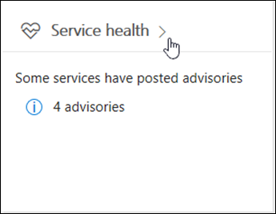

# 如何检查 Office 365 服务运行状况How to check Office 365 service health

您可以在 Office 365 中查看 Office 365、 Yammer、 Microsoft Dynamics CRM 和 Microsoft Intune 云服务的运行状况 * * 服务运行状况 * * 在管理中心页面。如果遇到被云服务的问题，您可以检查服务运行状况，以确定是否正在解析的已知的问题之前呼叫支持或花时间进行故障排除。You can view the health of Office 365, Yammer, Microsoft Dynamics CRM, and Microsoft Intune cloud services on the Office 365 ** Service health ** page in the admin center. If you are experiencing problems with a cloud service, you can check the service health to determine whether this is a known issue with a resolution in progress before you call support or spend time troubleshooting. 
  
### 如何检查服务运行状况How to check service health

1. 转到[https://portal.office.com/adminportal/home](https://portal.office.com/adminportal/home#/homepage)和管理帐户登录。Go to [https://portal.office.com/adminportal/home](https://portal.office.com/adminportal/home#/homepage) and sign in with an admin account. 
    
    > [!NOTE]
    > 已分配的全局管理员或服务管理员角色的人员可以查看服务运行状况。若要允许 Exchange、 SharePoint 和 Skype 对于业务管理员查看服务运行状况，它们必须指定服务管理员角色。People who are assigned the global admin or service administrator role can view service health. To allow Exchange, SharePoint, and Skype for Business admins to view service health, they must also be assigned the Service admin role. 
  
2. 若要打开在管理中心的服务运行状况，转到**运行状况** \> **服务运行状况**或单击卡片主页仪表板的服务运行状况。仪表板卡片指示是否存在活动服务问题和详细的服务运行状况页面的链接。To open service health, in the admin center, go to **Health** \> **Service health**, or click the Service health card on the Home dashboard. The dashboard card indicates whether there is an active service issue and links to the detailed service health page.
    
    
  
3. 每个云服务的运行状况状态图标以表格形式显示，以指示可能的状态。The health state of each cloud service is shown in a table format with an icon to indicate possible states.
    
> [!TIP]
> 您可以使用移动设备上的[Office 365 管理应用程序](https://go.microsoft.com/fwlink/p/?linkid=627216)以查看服务运行状况，即了解最新的推送通知的好方法。You can also use the [Office 365 Admin app](https://go.microsoft.com/fwlink/p/?linkid=627216) on your mobile device to view Service health, which is a great way to stay current with push notifications. 
  
### 查看已发布的服务运行状况的详细信息View details of posted service health

在默认视图中，将显示所有服务和及其当前运行状况状态。若要筛选视图服务当前遇到一个事件，请从左侧的灰色栏中选择**事件**。选择**通报**会显示当前具有安全公告发布的服务。从**的所有服务**视图中，单击显示的服务状态将打开 advisory 或事件的摘要视图。In the default view, all services and their current health state are displayed. To filter your view to services currently experiencing an incident, select **Incidents** from the shaded bar on the left. Selecting **Advisories** will show only services that currently have an advisory posted. From the **All services** view, clicking the displayed service state will open a summary view of the advisory or incident. 
  

  
Advisory 或摘要事件提供以下信息：The advisory or incident summary provides the following information: 
  

  
1. 问题的问题标识符和摘要语句。An issue identifier and summary statement of the problem.
    
2. 当前状态。请参阅有关的每个可能的状态说明本文中的状态 definitions。The current status. See status definitions in this article for an explanation of each potential status.
    
3. 此问题可以如何影响用户的说明。A description of how this issue can affect users.
    
4. 问题已启动的时间和服务运行状况消息已更新的最后一次。整个的问题持续时间中，我们将发布常用消息让您知道我们发出中将解决方案应用的进度。The time that the issue was started and the last time that the service health message was updated. Throughout the duration of an issue we post frequent messages to let you know the progress that we're making in applying a solution.
    
5. 选择**显示详细信息**链接以查看有关此问题，包括所有发布的消息时我们从事解决方案的历史记录的详细信息。Select the **Show details** link to see more details about the issue, including the history of all messages posted while we work on a solution. 
    
### 翻译服务运行状况详细信息Translate service health details

由于实时发布服务运行状况说明，它们不自动转换到您的语言，仅为英文服务事件的详细信息。若要翻译的说明，请按照下列步骤：Because service health explanations are posted in real-time, they are not automatically translated to your language and the details of a service event are in English only. To translate the explanation, follow these steps:
  
1. 转到[translator （英文）](https://www.bing.com/translator/)。Go to [Translator](https://www.bing.com/translator/).
    
2. 在**服务运行状况**页上，选择事件或 advisory。在**显示详细信息**复制有关问题的文本。On the **Service health** page, select an incident or advisory. Under **Show details**, copy the text about the issue.
    
3. 在 translator （英文），将文本粘贴，然后选择**翻译**。In Translator, paste the text and choose **Translate**.
    
### 定义Definitions

大部分时间服务将按正常，带有任何进一步的信息。时服务时遇到问题，问题将识别为 advisory 或事件并显示当前状态。Most of the time services will appear as healthy with no further information. When a service is having a problem, the issue is identified as either an advisory or an incident and shows a current status.
  
> [!TIP]
> 计划的维护事件不会显示在服务运行状况。您可以通过保持最新**消息中心**跟踪计划内的维护事件。筛选邮件归类为更改的计划以找出时将发生更改，其生效，以及如何准备它。有关详细信息，请参阅[Office 365 中的邮件中心](https://support.office.com/article/38fb3333-bfcc-4340-a37b-deda509c2093)。Planned maintenance events aren't shown in service health. You can track planned maintenance events by staying up to date with the **Message center**. Filter to messages categorized as Plan for change to find out when the change is going to happen, its effect, and how to prepare for it. See [Message center in Office 365](https://support.office.com/article/38fb3333-bfcc-4340-a37b-deda509c2093) for more details. 
  
### 事件和建议Incidents and advisories

|||
|:-----|:-----|
||如果服务显示 advisory，我们将了解问题影响某些用户，但仍然可用服务。在 advisory，通常的问题解决方法，该问题可能间歇性或限制的作用域和用户的影响。If a service has an advisory shown, we are aware of a problem that is affecting some users, but the service is still available. In an advisory, there is often a workaround to the problem and the problem may be intermittent or is limited in scope and user impact.    |
||如果服务显示一个活动事件，这是一个关键问题和服务或该服务的一项主要功能不可用。例如，用户可能无法发送和接收电子邮件或无法登录事件将具有对用户的显著影响。当正在进行中有一个事件时，我们将提供有关调查、 缓解措施，并确认服务运行状况仪表板中的解决方案的更新。If a service has an active incident shown, it's a critical issue and the service or a major function of the service is unavailable. For example, users may be unable to send and receive email or unable to sign-in. Incidents will have noticeable impact to users. When there is an incident in progress, we will provide updates regarding the investigation, mitigation efforts, and confirmation of resolution in the Service health dashboard.    |
   
### 状态定义Status definitions

| |
|**状态****Status**|**定义****Definition**|
|:-----|:-----|
|调查 （英文)Investigating    |我们知道的潜在问题，并将收集有关了什么事和的影响范围的详细信息。We're aware of a potential issue and are gathering more information about what's going on and the scope of impact.    |
|服务降级Service degradation    |我们已确认存在可能会影响使用服务或功能的问题。如果服务执行速度比往常很慢，您可能会看到此状态、 有间歇性中断或如果工作不一项功能，例如。We've confirmed that there is an issue that may affect use of a service or feature. You might see this status if a service is performing more slowly than usual, there are intermittent interruptions, or if a feature isn't working, for example.    |
|服务中断Service interruption    |如果我们确定问题影响用户以访问服务的功能，您将看到此状态。在这种情况下，问题很重要，并且可以一致重现。You'll see this status if we determine that an issue affects the ability for users to access the service. In this case, the issue is significant and can be reproduced consistently.    |
|还原服务Restoring service    |已发现的问题原因，我们知道哪些要执行的更正操作和正在将服务后引入正常运行状态。The cause of the issue has been identified, we know what corrective action to take, and are in the process of bringing the service back to a healthy state.    |
|扩展的恢复Extended recovery    |此状态指示纠正措施正在还原到大多数用户的服务，但需要花一些时间到达的所有受影响的系统。如果我们已进行临时修复以减少影响我们等待应用永久修复，则还可以看到此状态。This status indicates that corrective action is in progress to restore service to most users but will take some time to reach all the affected systems. You might also see this status if we've made a temporary fix to reduce impact while we wait to apply a permanent fix.    |
|挂起的调查Investigation suspended    |如果我们的潜在问题的详细的调查结果从客户的其他信息，以便我们能够进一步调查的请求，您将看到此状态。如果我们需要您操作，我们会让您知道我们需要哪些数据或日志。If our detailed investigation of a potential issue results in a request for additional information from customers to allow us to investigate further, you'll see this status. If we need you to act, we'll let you know what data or logs we need.    |
|还原的服务Service restored    |我们已确认纠正措施已解析的底层问题和服务已还原到正常运行状态。若要找出出现的问题，请查看问题详细信息。We've confirmed that corrective action has resolved the underlying problem and the service has been restored to a healthy state. To find out what went wrong, view the issue details.    |
   
## “历史记录”History

服务运行状况允许您查看当前运行状况状态以及过去 30 天内查看任何服务通报和事件的历史记录。若要查看过去的所有服务运行状况，选择**服务运行状况**页上的**查看历史记录**。Service health lets you look at current health status and view the history of any service advisories and incidents in the past 30 days. To view the past health of all services, select **View history** on the **Service health** page. 
  

  
将显示所有服务运行状况发布的消息中的选定时间段列表，如下所示：A list of all service health messages posted in the selected timeframe is displayed, as shown below:
  

  
最近 7 天或 30 天内，您可以查看运行状况历史记录。选择要查看有关该问题的更多详细信息任何行。You may view the health history for either the last 7 days or last 30 days. Select any row to view more details about that issue.
  
有关我们承诺正常运行时间的详细信息，请参阅[从 Office 365 的透明操作](https://go.microsoft.com/fwlink/?linkid=848695)。For more information about our commitment to uptime, see [Transparent operations from Office 365](https://go.microsoft.com/fwlink/?linkid=848695).
  
## 提供反馈Leave feedback

我们的目标是确保我们向您提供有关后续问题的信息及时、 准确和有用。告诉我们如何我们执行的操作中，选择星评级。您给我们分数从 1 到 5 星形后，您可以在任何特定的详细信息移交反馈。我们将使用您的反馈来调整我们的服务运行状况系统。Our goal is to make sure that the information we provide to you about an ongoing issue is timely, accurate, and useful. To tell us how we're doing, select a star rating. After you give us a score from 1 to 5 stars, you can give feedback on any specific details. We'll use your feedback to fine-tune our service health system.
  

  
## 另请参阅See also

[Office 365 管理中心中的活动报告Activity Reports in the Office 365 admin center](https://support.office.com/article/0d6dfb17-8582-4172-a9a9-aed798150263)

