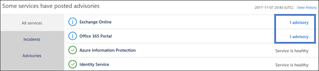

# 如何查看 Office 365 服务运行状况How to check Office 365 service health

您可以在[Microsoft 365 管理中心](https://admin.microsoft.com)的 "office 365**服务运行状况**" 页上查看 office 365、Yammer、microsoft Dynamics CRM 和 microsoft Intune 云服务的运行状况。You can view the health of Office 365, Yammer, Microsoft Dynamics CRM, and Microsoft Intune cloud services on the Office 365 **Service health** page in the [Microsoft 365 admin center](https://admin.microsoft.com). If you are experiencing problems with a cloud service, you can check the service health to determine whether this is a known issue with a resolution in progress before you call support or spend time troubleshooting.If you are experiencing problems with a cloud service, you can check the service health to determine whether this is a known issue with a resolution in progress before you call support or spend time troubleshooting. 

如果无法登录到服务门户, 则可以使用 "[服务状态" 页](https://status.office365.com)来检查阻止你登录租户的已知问题。If you are unable to sign in to the service portal, you can use the [service status page](https://status.office365.com) to check for known issues preventing you from logging into your tenant.
  
### 如何查看服务运行状况How to check service health

1. 转到 [https://portal.office.com/adminportal/home](https://portal.office.com/adminportal/home#/homepage) 并使用管理员帐户登录。Go to [https://portal.office.com/adminportal/home](https://portal.office.com/adminportal/home#/homepage) and sign in with an admin account. 
    
    > [!NOTE]
    > 分配为全局管理员或服务管理员角色的人员可以查看服务运行状况。若要允许 Exchange、SharePoint 和 Skype for Business 管理员查看服务运行状况，必须向他们分配服务管理员角色。People who are assigned the global admin or service administrator role can view service health. To allow Exchange, SharePoint, and Skype for Business admins to view service health, they must also be assigned the Service admin role.
  
2. 若要打开服务运行状况, 请在管理中心中, 转到**运行状况** > **服务运行状况**, 或单击**主页仪表板**上的**服务运行状况卡片**。To open service health, in the admin center, go to **Health** > **Service health**, or click the **Service health card** on the **Home dashboard**. 仪表板卡片指示是否存在未解决的服务问题，并提供指向服务运行状况详细信息页的链接。The dashboard card indicates whether there is an active service issue and links to the detailed service health page.
    
    
  
3. 每个云服务的运行状态均以表格格式显示，其中包含指示可能状态的图标。The health state of each cloud service is shown in a table format with an icon to indicate possible states.
    
> [!TIP]
> 你也可以在移动设备上使用 [Office 365 Admin 应用](https://go.microsoft.com/fwlink/p/?linkid=627216)查看服务运行状况，这是一种通过推送通知随时获取最新消息的好方法。You can also use the [Office 365 Admin app](https://go.microsoft.com/fwlink/p/?linkid=627216) on your mobile device to view Service health, which is a great way to stay current with push notifications. 
  
### 查看已发布服务的运行状况详细信息View details of posted service health

默认视图中显示所有服务及其当前的运行状况状态。In the default view, all services and their current health state are displayed. 若要将视图筛选为当前遇到事件的服务, 请从左侧的阴影条中选择 "**事件**"。To filter your view to services currently experiencing an incident, select **Incidents** from the shaded bar on the left. 选择 "**建议**" 将仅显示当前已发布建议的服务。Selecting **Advisories** will show only services that currently have an advisory posted. 从 "**所有服务**" 视图中, 单击显示的服务状态将打开公告或事件的摘要视图。From the **All services** view, clicking the displayed service state will open a summary view of the advisory or incident. 
  

  
公告或事件摘要提供以下信息：The advisory or incident summary provides the following information: 
  

  
1. 该问题的问题标识符和摘要语句。An issue identifier and summary statement of the problem.
    
2. 当前状态。请参阅本文中的状态定义，获取每种潜在状态的说明。The current status. See status definitions in this article for an explanation of each potential status.
    
3. 关于此问题如何影响用户的说明。A description of how this issue can affect users.
    
4. 该问题发生的时间以及上一次更新服务运行状况消息的时间。出现问题期间，我们会经常发布消息，说明我们在应用解决方案时取得的进展。The time that the issue was started and the last time that the service health message was updated. Throughout the duration of an issue we post frequent messages to let you know the progress that we're making in applying a solution.
    
5. 选择" **显示详细信息**"链接来查看有关该问题的更多详细信息，包括我们在开发解决方案时发布的所有消息的历史记录。Select the **Show details** link to see more details about the issue, including the history of all messages posted while we work on a solution. 
    
### 翻译服务运行状况详细信息Translate service health details

服务运行状况说明是实时发布的，因此这些说明不会自动翻译成你的语言，并且服务事件的详细信息仅以英语形式提供。若要翻译这些说明，请遵循以下步骤：Because service health explanations are posted in real-time, they are not automatically translated to your language and the details of a service event are in English only. To translate the explanation, follow these steps:
  
1. 转到[翻译工具](https://www.bing.com/translator/)。Go to [Translator](https://www.bing.com/translator/).
    
2. 在" **服务运行状况**"页上，选择一个事件或公告。在" **显示详细信息**"下，复制关于该问题的文本。On the **Service health** page, select an incident or advisory. Under **Show details**, copy the text about the issue.
    
3. 在"翻译工具"中，粘贴文本，然后选择" **翻译**"。In Translator, paste the text and choose **Translate**.
    
### 定义Definitions

在大多数情况下，服务正常运行且没有进一步的信息。服务出现问题时，该问题会标识为公告或事件，并显示当前状态。Most of the time services will appear as healthy with no further information. When a service is having a problem, the issue is identified as either an advisory or an incident and shows a current status.
  
> [!TIP]
> 服务运行状况中不会显示计划内维护事件。可以通过" **消息中心**"随时了解最新消息，从而跟踪计划内维护事件。筛选出分类为"更改计划"的消息，了解发生更改的时间、其影响以及如何做好相应准备。请参阅 [Office 365 中的消息中心](https://support.office.com/article/38fb3333-bfcc-4340-a37b-deda509c2093)获取更多详细信息。Planned maintenance events aren't shown in service health. You can track planned maintenance events by staying up to date with the **Message center**. Filter to messages categorized as Plan for change to find out when the change is going to happen, its effect, and how to prepare for it. See [Message center in Office 365](https://support.office.com/article/38fb3333-bfcc-4340-a37b-deda509c2093) for more details. 
  
### 事件和公告Incidents and advisories

|||
|:-----|:-----|
||如果服务显示公告，这意味着某问题正在影响一些用户，但该服务仍然可用。公告中通常存在针对该问题的变通方法，并且该问题可能是间歇性的，或其作用范围和对用户的影响有限。If a service has an advisory shown, we are aware of a problem that is affecting some users, but the service is still available. In an advisory, there is often a workaround to the problem and the problem may be intermittent or is limited in scope and user impact.    |
||如果服务显示遇到活动事件，则说明遇到关键问题，且服务或其主要功能目前不可用。例如，用户可能无法发送和接收电子邮件，或无法登录。事件会对用户产生显著影响。对于正在进行的事件，我们会在服务运行状况仪表板中提供有关调查、缓解措施和解决方法确认的更新。If a service has an active incident shown, it's a critical issue and the service or a major function of the service is unavailable. For example, users may be unable to send and receive email or unable to sign-in. Incidents will have noticeable impact to users. When there is an incident in progress, we will provide updates regarding the investigation, mitigation efforts, and confirmation of resolution in the Service health dashboard.    |
   
### 状态定义Status definitions

|**状态****Status**|**定义****Definition**|
|:-----|:-----|
|**正在调查****Investigating** | 我们已发现存在潜在问题，我们正在收集有关情况和影响范围的详细信息。We're aware of a potential issue and are gathering more information about what's going on and the scope of impact. |
|**服务降级****Service degradation** | 我们已确认存在可能影响服务或功能使用的问题。例如，如果服务的执行速度比平常慢、存在间歇性中断或某功能运行不正常，则可能看到此状态。We've confirmed that there is an issue that may affect use of a service or feature. You might see this status if a service is performing more slowly than usual, there are intermittent interruptions, or if a feature isn't working, for example. |
|**服务中断****Service interruption** | 如果我们确定某问题影响用户访问服务的能力，则你将看到此状态。在本例中，问题十分重大且可持续重现。You'll see this status if we determine that an issue affects the ability for users to access the service. In this case, the issue is significant and can be reproduced consistently. |
|**正在还原服务****Restoring service** | 我们已确定问题成因，知晓需要采取的纠正措施，并正在将服务恢复到正常状态。The cause of the issue has been identified, we know what corrective action to take, and are in the process of bringing the service back to a healthy state. |
|**延期恢复****Extended recovery** | 此状态表示正在执行纠正措施，为大多数用户恢复服务，但恢复所有受影响的系统仍需一些时间。如果我们为了减轻影响，而在实施永久解决措施前实施临时措施，你也可能看到此状态。This status indicates that corrective action is in progress to restore service to most users but will take some time to reach all the affected systems. You might also see this status if we've made a temporary fix to reduce impact while we wait to apply a permanent fix. |
|**调查暂停****Investigation suspended** | 如果对潜在问题的详细调查需要请求客户提供其他信息，以便进行进一步的调查，则你将看到此状态。如果我们需要你的参与，我们会告知你所需的数据或日志。If our detailed investigation of a potential issue results in a request for additional information from customers to allow us to investigate further, you'll see this status. If we need you to act, we'll let you know what data or logs we need. |
|**已还原服务****Service restored** | 我们确认纠正措施已解决基础问题，且服务已还原到正常状态。若要了解出了什么问题，请查看问题详细信息。We've confirmed that corrective action has resolved the underlying problem and the service has been restored to a healthy state. To find out what went wrong, view the issue details. |
|**已发布事件后报告****Post-incident report published** | 我们已发布了一个针对特定问题的公告事件报告, 其中包括根本原因信息和后续步骤, 以确保不会发生类似的问题。We’ve published a Post Incident Report for a specific issue that includes root cause information and next steps to ensure a similar issue doesn’t reoccur. |
   
## 历史记录History

服务运行状况允许你查看当前运行状况状态, 并查看在过去30天内受影响的租户的任何服务通知和事件的历史记录。Service health lets you look at current health status and view the history of any service advisories and incidents that have impacted your tenant in the past 30 days. 若要查看所有服务以往的运行状况，请在" **服务运行状况**"页上选择" **查看历史记录**"。To view the past health of all services, select **View history** on the **Service health** page. 
  

  
显示在选定时间范围内发布的所有服务运行状况消息的列表，如下所示：A list of all service health messages posted in the selected timeframe is displayed, as shown below:
  

  
您可以查看最近7天或最近30天的运行状况历史记录。You may view the health history for either the last 7 days or last 30 days. 选择任意行以查看有关该问题的更多详细信息。Select any row to view more details about that issue.
  
有关我们对运行时间的承诺的详细信息, 请参阅[Office 365 中的透明操作](https://go.microsoft.com/fwlink/?linkid=848695)。For more information about our commitment to uptime, see [Transparent operations from Office 365](https://go.microsoft.com/fwlink/?linkid=848695).
  
## 提供反馈Leave feedback

我们的目标是确保向你及时、准确地提供仍在持续的问题的有用信息。若要告知我们采取的操作是否切实有效，请选择一个星级评分。给我们评出 1 - 5 星的分数后，你可以提供有关任何特定详细信息的反馈。我们将使用你的反馈微调服务运行状况系统。Our goal is to make sure that the information we provide to you about an ongoing issue is timely, accurate, and useful. To tell us how we're doing, select a star rating. After you give us a score from 1 to 5 stars, you can give feedback on any specific details. We'll use your feedback to fine-tune our service health system.
  
## 另请参阅See also

[Microsoft 365 管理中心中的活动报告Activity Reports in the Microsoft 365 admin center](https://support.office.com/article/0d6dfb17-8582-4172-a9a9-aed798150263)